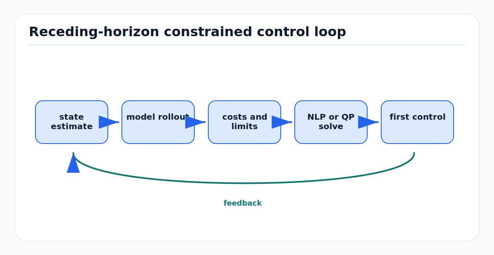

# Constrained Optimization, MPC, and iLQR: First Principles

Control and planning become engineering systems when objectives meet
constraints. Model predictive control (MPC) repeatedly solves a constrained
finite-horizon optimal control problem. Iterative LQR (iLQR) solves a local
quadratic approximation of a nonlinear trajectory optimization problem. Both
are ways to turn vehicle models, limits, and costs into executable commands.

<!-- kb-figure:start -->


*Figure: how MPC and iLQR repeatedly convert state estimates, constraints, and costs into the next applied control.*
<!-- kb-figure:end -->

## Related docs

- [Vehicle Dynamics and Control Fundamentals](vehicle-dynamics-and-control.md)
- [Frenet Trajectory Math](frenet-trajectory-math.md)
- [Planning Taxonomy and Trajectory Generation](../robotics/planning-taxonomy-and-trajectory-generation.md)
- [Nonlinear Least Squares from First Principles](../optimization/nonlinear-least-squares-first-principles.md)
- [Gauss-Newton, Levenberg-Marquardt, and Dogleg](../optimization/gauss-newton-levenberg-marquardt-dogleg.md)
- [Jacobians, Autodiff, and Manifold Linearization](../optimization/jacobians-autodiff-manifold-linearization.md)
- [World Models: First Principles](../machine-learning/world-models-first-principles.md)
- [MDP, POMDP, Belief Space, and RL](mdp-pomdp-belief-space-rl-first-principles.md)

## Why it matters for AV, perception, SLAM, and mapping

AV planning and control are not just path fitting. The vehicle must respect:

- steering angle and steering-rate limits
- acceleration, braking, jerk, and comfort limits
- tire friction and curvature-speed coupling
- collision, route, drivable-area, and keepout constraints
- actuator delay and compute deadlines
- uncertainty from localization, tracking, mapping, and prediction

MPC is valuable because it handles multi-variable constraints directly and
replans after each state update. iLQR is valuable because it efficiently exploits
local dynamics and second-order cost structure for smooth nonlinear systems.
Both fail if model assumptions, constraints, timing, or warm starts are wrong.

## Core definitions

### Optimization problem

A constrained optimization problem has the form:

```text
minimize_x   f(x)
subject to   g_i(x) <= 0
             h_j(x) = 0
```

`f` is the objective, `g_i` are inequality constraints, and `h_j` are equality
constraints.

### Optimal control problem

For discrete time dynamics:

```text
x_{k+1} = f_k(x_k, u_k)
```

a finite-horizon optimal control problem is:

```text
minimize_{x_0:N, u_0:N-1}
    l_N(x_N) + sum_{k=0}^{N-1} l_k(x_k, u_k)

subject to
    x_0 = x_current
    x_{k+1} = f_k(x_k, u_k)
    c_k(x_k, u_k) <= 0
```

For an AV, `x_k` may include pose, velocity, yaw rate, steering angle, actuator
state, delay buffer, or predicted object state. `u_k` may include steering rate,
acceleration, wheel torque, or brake pressure request.

### MPC

MPC solves the finite-horizon problem at each control cycle, applies the first
control, then repeats:

```text
observe state
solve horizon problem
apply u_0
shift horizon
repeat
```

The horizon gives foresight. Receding horizon feedback corrects model mismatch.

### iLQR

iLQR solves an unconstrained or softly constrained nonlinear optimal control
problem by repeatedly:

1. rolling out a nominal trajectory
2. linearizing dynamics around that trajectory
3. quadratizing costs
4. solving a local LQR problem by dynamic programming
5. line-searching a new trajectory

It is closely related to differential dynamic programming (DDP). iLQR uses
first-order dynamics derivatives and second-order cost terms; full DDP also uses
second derivatives of dynamics.

## First-principles math

### KKT conditions

For:

```text
min f(x)
s.t. g(x) <= 0
     h(x) = 0
```

the Lagrangian is:

```text
L(x, lambda, nu) = f(x) + lambda^T g(x) + nu^T h(x)
```

At a local optimum under constraint qualifications:

```text
grad_x L = 0
h(x) = 0
g(x) <= 0
lambda >= 0
lambda_i g_i(x) = 0
```

Complementarity means an inequality constraint either is inactive with
`lambda_i = 0`, or active with `g_i(x) = 0`.

### Convexity

A convex problem has convex objective, convex inequality constraints, and affine
equality constraints. Local optima are global. Many MPC problems become convex
QP problems after linearizing dynamics and using quadratic costs:

```text
min 0.5 z^T H z + q^T z
s.t. A z = b
     G z <= w
```

Nonlinear vehicle models, collision constraints, and nonconvex drivable regions
usually make AV planning nonconvex, so initialization and fallback logic matter.

### Linear quadratic regulator

For linear dynamics:

```text
x_{k+1} = A_k x_k + B_k u_k
```

and quadratic cost:

```text
l_k = 0.5 x_k^T Q_k x_k + 0.5 u_k^T R_k u_k
l_N = 0.5 x_N^T Q_N x_N
```

the optimal feedback has the form:

```text
u_k = K_k x_k
```

Dynamic programming computes value functions backward:

```text
V_k(x) = 0.5 x^T P_k x
```

This is the local subproblem solved inside iLQR.

### iLQR backward pass

Around nominal trajectory `(x_bar_k, u_bar_k)`, define perturbations:

```text
delta x_k = x_k - x_bar_k
delta u_k = u_k - u_bar_k
```

Linearized dynamics:

```text
delta x_{k+1} = A_k delta x_k + B_k delta u_k
```

Quadratic expansion of the Q-function gives blocks:

```text
Q_x, Q_u, Q_xx, Q_ux, Q_uu
```

The local control law is:

```text
delta u_k = k_k + K_k delta x_k
```

where:

```text
k_k = - Q_uu^-1 Q_u
K_k = - Q_uu^-1 Q_ux
```

The forward pass applies:

```text
u_k_new = u_bar_k + alpha k_k + K_k (x_k_new - x_bar_k)
```

with line search parameter `alpha`.

### Direct transcription MPC

Direct transcription optimizes all states and controls together:

```text
z = [x_0, u_0, x_1, u_1, ..., x_N]
```

Dynamics become equality constraints:

```text
x_{k+1} - f_k(x_k, u_k) = 0
```

This creates a sparse NLP or QP with banded structure. Tools such as CasADi are
useful because they provide symbolic expressions, automatic differentiation,
sparsity, and interfaces for nonlinear programming and optimal control.

### Soft constraints

A hard inequality:

```text
g(x) <= 0
```

can be softened with slack:

```text
g(x) <= s
s >= 0
cost += rho_1 s + rho_2 s^2
```

This prevents solver infeasibility from becoming command dropout, but slacks
must be monitored. A comfort slack and a collision slack are not morally
equivalent.

## Algorithmic patterns

| Pattern | Model | Constraint handling | AV fit |
|---|---|---|---|
| Linear MPC QP | linearized or LTI | hard linear constraints | fast tracking, low-level control |
| Nonlinear MPC | nonlinear dynamics | NLP constraints | dynamic vehicles, tight maneuvers |
| Sequential convex programming | repeated convex approximations | convexified constraints | trajectory optimization |
| iLQR | nonlinear dynamics | usually soft penalties or box variants | smooth controls, warm-started planning |
| DDP | nonlinear dynamics | local second-order method | aggressive dynamics, research systems |
| MPPI / CEM | sampled rollouts | penalties and rejection | rough models, learned costs |
| Safety-filter QP | local control-affine model | hard safety constraint | last-line command correction |

## AV, perception, SLAM, mapping, and planning relevance

### Trajectory tracking

Tracking MPC minimizes deviations from a reference trajectory:

```text
cost = sum_k
    ||position_error_k||_Q^2
  + ||heading_error_k||_Q^2
  + ||speed_error_k||_Q^2
  + ||u_k||_R^2
  + ||Delta u_k||_S^2
```

Constraints enforce steering, acceleration, jerk, and curvature limits. Delay
can be handled by predicting state to actuation time or augmenting the state
with a command buffer.

### Motion planning

Optimization-based planning can include collision and route constraints:

```text
signed_distance_to_obstacle(x_k) >= margin
inside_drivable_region(x_k) = true
```

These constraints are nonconvex in real scenes. Production systems often combine
search or lattice initialization with local optimization and independent
trajectory validation.

### Uncertainty-aware control

Perception and localization uncertainty can enter MPC through:

- inflated obstacle margins
- chance constraints
- risk-weighted occupancy costs
- robust tubes around nominal trajectories
- speed caps under localization degradation

A common Gaussian chance constraint approximation is:

```text
a^T x <= b
P(a^T x <= b) >= 1 - alpha

=> a^T mu + Phi^-1(1 - alpha) sqrt(a^T Sigma a) <= b
```

This is only valid under the assumed distribution and linearized constraint.

### World-model planning

With learned dynamics:

```text
s_{k+1} = f_theta(s_k, u_k)
```

MPC can optimize in latent space or over decoded occupancy. The controller must
guard against model exploitation: the optimizer may find actions that look good
under the learned model but are unsafe in reality.

## Implementation notes

- Define the real-time contract first: control rate, horizon length, maximum
  solver time, fallback command, and stale-solution policy.
- Scale states, controls, residuals, and constraints. Bad scaling can dominate
  solver behavior.
- Warm start from the shifted previous solution, but reset when the mode or
  reference changes sharply.
- Log solver status, iteration count, objective, max constraint violation,
  slacks, solve time, and applied command.
- Keep hard safety constraints separate from comfort penalties. Penalizing
  collision is not the same as forbidding collision.
- Use automatic differentiation or carefully tested analytic derivatives.
  Derivative bugs often look like tuning problems.
- Validate with synthetic scenarios: straight tracking, step curvature,
  braking-to-stop, actuator saturation, obstacle margins, delay, and infeasible
  requests.
- Treat solver overruns as control faults. Late optimal commands are still late.

## Failure modes and diagnostics

| Symptom | Likely cause | Diagnostic |
|---|---|---|
| Oscillation around path | delay or poor model linearization | step response and latency replay |
| Solver frequently infeasible | hard constraints conflict | inspect constraint residuals and active set |
| Vehicle cuts corners | horizon too short or curvature constraints weak | compare predicted and actual curvature |
| Planner finds unsafe shortcut | collision cost is soft or nonconvex | independent trajectory validation |
| iLQR diverges | poor initialization or non-PD `Q_uu` | regularization and line search traces |
| Commands chatter | control-rate penalty too small | inspect `Delta u` and actuator response |
| Comfort slacks always active | reference is infeasible | check upstream speed/path generation |
| Good simulation, bad vehicle | actuator, delay, tire, or payload mismatch | identify model parameters from logs |
| Learned MPC exploits model | model error not penalized | uncertainty penalties and real-world rollouts |

## Sources

- Stephen Boyd and Lieven Vandenberghe, "Convex Optimization": https://www.seas.ucla.edu/~vandenbe/cvxbook.html
- James B. Rawlings, David Q. Mayne, and Moritz M. Diehl, "Model Predictive Control: Theory, Computation, and Design": https://sites.engineering.ucsb.edu/~jbraw/mpc/
- CasADi documentation: https://web.casadi.org/docs/
- CasADi blog, "Optimal control problems in a nutshell": https://web.casadi.org/blog/ocp/
- Yuval Tassa, Nicolas Mansard, and Emo Todorov, "Control-Limited Differential Dynamic Programming": https://homes.cs.washington.edu/~todorov/papers/TassaICRA14.pdf
- Emanuel Todorov and Weiwei Li, "A Generalized Iterative LQG Method for Locally-Optimal Feedback Control of Constrained Nonlinear Stochastic Systems": https://homes.cs.washington.edu/~todorov/papers/TodorovACC05.pdf
