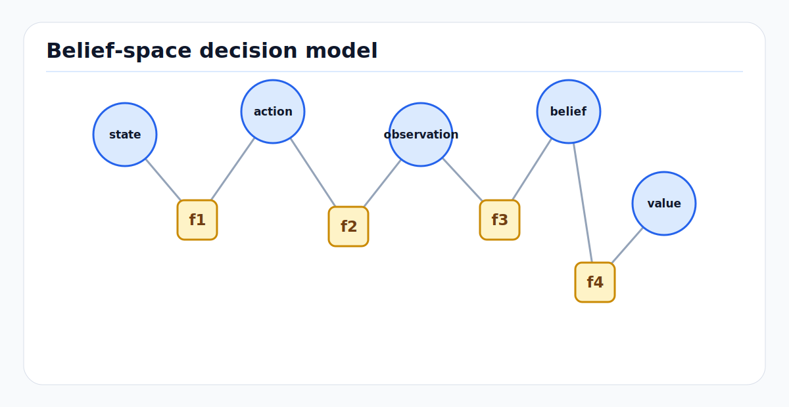

# MDP, POMDP, Belief Space, and RL: First Principles

Markov decision processes formalize sequential decision-making under
uncertainty. Partially observable MDPs add the reality that robots do not see
the true state directly. Belief-space planning treats a probability distribution
over states as the planner state. Reinforcement learning estimates policies,
values, or models from interaction data.

<!-- kb-figure:start -->


*Figure: how an agent updates hidden-state belief from observations before choosing actions under uncertainty.*
<!-- kb-figure:end -->

## Related docs

- [Planning Taxonomy and Trajectory Generation](../robotics/planning-taxonomy-and-trajectory-generation.md)
- [Vehicle Dynamics and Control Fundamentals](vehicle-dynamics-and-control.md)
- [Constrained Optimization, MPC, and iLQR](constrained-optimization-mpc-ilqr-first-principles.md)
- [Bayesian Filtering and Error-State Kalman Filters](../state-estimation/bayesian-filtering-and-eskf.md)
- [Particle Filters and Hypothesis Management](../state-estimation/particle-filters-and-hypothesis-management.md)
- [World Models: First Principles](../machine-learning/world-models-first-principles.md)
- [World Model Evaluation and Planning Objectives](../machine-learning/world-model-evaluation-and-planning-objectives-first-principles.md)
- [Theoretical Foundations](../systems-engineering/theoretical-foundations.md)

## Why it matters for AV, perception, SLAM, mapping, world models, and planning

Driving and robotics are sequential decisions:

```text
observe -> update belief -> choose action -> world changes -> repeat
```

An AV never observes the full true state. Occlusions, sensor noise, map changes,
hidden intent, and unobserved friction mean planning is fundamentally partially
observable. MDPs, POMDPs, and RL provide a shared vocabulary for:

- state, action, transition, observation, and reward models
- value functions and Bellman equations
- belief updates under noisy sensing
- exploration versus exploitation
- model-based planning with learned world models
- policy learning and offline evaluation

Sutton and Barto describe RL as learning to maximize reward through interaction
with an uncertain environment. Kaelbling, Littman, and Cassandra give the
classic POMDP framing for acting under partial observability. Robotics surveys
emphasize that noisy sensing, imperfect control, and changing environments make
POMDPs natural for robot decision problems.

## Core definitions

### MDP

A Markov decision process is:

```text
MDP = (S, A, T, R, gamma)
```

where:

- `S` is the state space.
- `A` is the action space.
- `T(s' | s, a)` is the transition model.
- `R(s, a, s')` is reward.
- `gamma` is the discount factor.

The Markov property is:

```text
p(s_{t+1} | s_0:t, a_0:t) = p(s_{t+1} | s_t, a_t)
```

This does not mean the world is simple. It means the chosen state contains all
history needed for predicting the next state.

### Policy

A policy maps state to actions:

```text
pi(a | s)
```

For deterministic policies:

```text
a = pi(s)
```

### Return

Discounted return is:

```text
G_t = sum_{k=0}^{infinity} gamma^k R_{t+k+1}
```

The objective is to maximize expected return.

### Value functions

State value:

```text
V^pi(s) = E_pi[G_t | s_t = s]
```

Action value:

```text
Q^pi(s, a) = E_pi[G_t | s_t = s, a_t = a]
```

Optimal value:

```text
V*(s) = max_pi V^pi(s)
Q*(s, a) = max_pi Q^pi(s, a)
```

## Bellman equations

### Policy evaluation

```text
V^pi(s) =
    sum_a pi(a | s) sum_{s'} T(s' | s, a)
        [R(s, a, s') + gamma V^pi(s')]
```

### Bellman optimality

```text
V*(s) =
    max_a sum_{s'} T(s' | s, a)
        [R(s, a, s') + gamma V*(s')]
```

and:

```text
Q*(s, a) =
    sum_{s'} T(s' | s, a)
        [R(s, a, s') + gamma max_{a'} Q*(s', a')]
```

Dynamic programming solves these equations when the model is known and the state
space is manageable.

## POMDPs and belief space

### POMDP

A partially observable MDP is:

```text
POMDP = (S, A, T, R, Omega, O, gamma)
```

where:

- `Omega` is the observation space.
- `O(o | s', a)` is the observation model.

The agent sees observations, not state:

```text
o_t ~ O(o_t | s_t, a_{t-1})
```

### Belief

The belief is a probability distribution over states:

```text
b_t(s) = P(s_t = s | o_1:t, a_0:t-1)
```

The belief is a sufficient statistic for the history in a POMDP. The belief
update is:

```text
b'(s') = eta O(o' | s', a) sum_s T(s' | s, a) b(s)
```

where `eta` normalizes the distribution.

This is the same predict-update pattern as Bayesian filtering.

### Belief-space MDP

A POMDP can be transformed into a continuous-state MDP over beliefs:

```text
state = b
action = a
transition = tau(b, a, o)
reward = E_{s ~ b, s' ~ T}[R(s, a, s')]
```

Belief-space planning chooses actions that trade task reward and information
gathering.

## RL algorithmic patterns

| Pattern | Core update | Use | Main caveat |
|---|---|---|---|
| Dynamic programming | Bellman backups with known model | small exact MDPs | needs model and tractable state |
| Monte Carlo | learn from sampled returns | episodic tasks | high variance |
| TD learning | bootstrap from next value | online prediction | bias from bootstrapping |
| Q-learning | off-policy Bellman optimality | discrete action control | instability with function approximation |
| SARSA | on-policy TD control | policy-aware learning | learns behavior-policy value |
| Actor-critic | policy plus value baseline | continuous control | sensitive objectives and exploration |
| Model-based RL | learn `T` and plan | sample efficiency, world models | model exploitation |
| Offline RL | learn from logs | AV log reuse | distribution shift and counterfactual risk |
| Imitation learning | learn from expert actions | driving policy priors | covariate shift |
| Belief-space planning | plan over distributions | occlusion and sensing tasks | belief dimension and model quality |

## AV, perception, SLAM, mapping, and planning relevance

### Driving as a POMDP

In driving:

```text
state: ego, agents, map, traffic rules, surfaces, hidden intents
action: trajectory, acceleration, steering, route/maneuver choice
observation: sensors, detections, tracks, map updates, V2X, operator commands
reward/cost: safety, progress, comfort, legality, mission success
```

Hidden variables include pedestrian intent, vehicle yielding behavior, friction,
occluded objects, localization error, and temporary map changes. A pure MDP over
latest detections is usually an approximation.

### Belief state in autonomy stacks

Real stacks approximate belief using:

- Kalman filter state and covariance
- particle sets and multi-hypothesis tracks
- occupancy probabilities
- predicted trajectory distributions
- BEV latent features over time
- learned recurrent world-model state

The key question is whether this approximate belief preserves the information
needed for safe decisions.

### Planning under occlusion

A POMDP naturally represents actions that reveal information. Creeping forward
at an occluded intersection can have value even before it makes route progress:

```text
action value = task reward + information value - risk
```

This is hard to capture in a planner that treats perception as a fixed input.

### World models and model-based RL

A learned world model estimates:

```text
p(s_{t+1}, r_t, continue_t | s_t, a_t)
```

Planning or policy learning can happen in imagined rollouts. This is powerful
when the model is accurate enough and dangerous when the optimizer exploits
model errors.

### Offline RL for AV logs

AVs have large logs but limited safe exploration. Offline RL tries to learn from
fixed datasets:

```text
D = {(s_t, a_t, r_t, s_{t+1})}
```

The core problem is action distribution shift. The learned policy may choose
actions rarely or never seen in the data, making value estimates unreliable.

## Implementation notes

- State the Markov assumption explicitly. If hidden history matters, add state,
  memory, or belief.
- Keep reward and safety constraints separate when possible. A large negative
  reward is not the same as a verified safety constraint.
- For AV policies, evaluate closed-loop behavior. One-step prediction metrics do
  not prove sequential safety.
- Use conservative offline RL or behavior constraints when learning from logs.
  Out-of-distribution actions need explicit handling.
- For POMDP approximations, log belief quality: calibration, entropy, particle
  diversity, covariance consistency, and scenario-sliced failures.
- Validate learned world models with interventions, not only passive
  prediction. Planning changes the state distribution.
- Treat simulator and learned model errors as part of the decision problem.
  Domain randomization and uncertainty penalties are partial mitigations, not
  guarantees.

## Failure modes and diagnostics

| Symptom | Likely cause | Diagnostic |
|---|---|---|
| Policy works open-loop but fails closed-loop | covariate shift | rollout evaluation with perturbations |
| Value estimates too optimistic | OOD actions in offline RL | action support and conservative value checks |
| Planner ignores information gathering | MDP approximation omits observation value | occlusion scenarios and belief entropy traces |
| Learned policy violates hard rules | reward did not encode constraints reliably | rule monitor and constraint-based shield |
| Belief collapses to one wrong mode | filter or model underrepresents ambiguity | multi-hypothesis replay and calibration |
| World model rollouts look plausible but unsafe | wrong task-relevant dynamics | closed-loop counterfactual tests |
| High reward from unrealistic action | model exploitation | uncertainty penalty and real dynamics validation |
| POMDP solver too slow | belief/state/action explosion | use hierarchy, macro-actions, or local POMDPs |

## Sources

- Richard S. Sutton and Andrew G. Barto, "Reinforcement Learning: An Introduction," Second Edition, MIT Press: https://mitpress.mit.edu/9780262039246/reinforcement-learning/
- Sutton and Barto open-access draft: https://web.stanford.edu/class/psych209/Readings/SuttonBartoIPRLBook2ndEd.pdf
- Leslie Pack Kaelbling, Michael L. Littman, and Anthony R. Cassandra, "Planning and Acting in Partially Observable Stochastic Domains": https://people.smp.uq.edu.au/YoniNazarathy/Control4406_2014/resources/KaelblingLittmanCassandra1998.pdf
- Mikko Lauri, David Hsu, and Joni Pajarinen, "Partially Observable Markov Decision Processes in Robotics: A Survey": https://arxiv.org/abs/2209.10342
- Dimitri P. Bertsekas, "Dynamic Programming and Optimal Control": https://www.mit.edu/~dimitrib/dpbook.html
