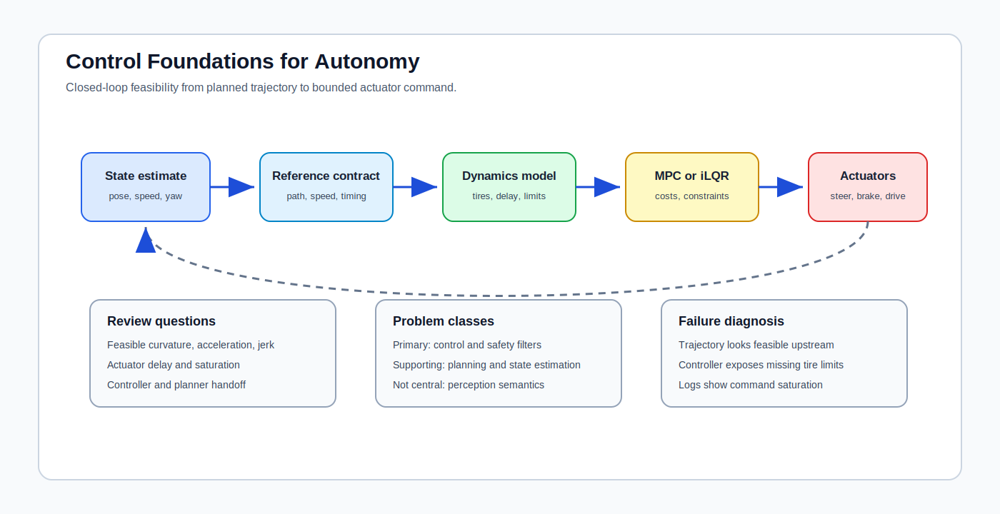

# Control Foundations for Autonomy

<!-- kb-visual:start -->

*Visual: section-level autonomy-role diagram showing control foundations, autonomy problem classes, stack interfaces, reading paths, and failure diagnosis.*
<!-- kb-visual:end -->

## Why This Foundation Exists

Control turns autonomy intent into commands that a physical vehicle can track. It is the layer where geometry, planning, optimization, state estimation, and actuator hardware meet hard feasibility constraints: tire friction, curvature, acceleration, latency, saturation, stability margin, and safety filters.

This foundation exists so reviews can separate a plausible trajectory from a commandable trajectory. A plan is not operationally valid until its dynamics model, timing assumptions, tracking objective, actuator interface, and constraint handling are explicit enough for the controller to execute and diagnose.

## What This Field Studies From First Principles

Control studies closed-loop systems: how state, reference, feedback, dynamics, objectives, constraints, and actuator commands interact over time. In this section, the emphasis is vehicle dynamics, trajectory tracking, Frenet trajectory math, MPC, iLQR, constrained optimization, and belief-space decision models when they affect command generation.

The first-principles questions are practical: what state is being regulated, what model predicts the next state, what objective is minimized, what constraints are binding, what uncertainty is tolerated, and what happens when the reference is infeasible.

## Autonomy Problem Map

Controls sits closest to actuation but depends on the rest of the stack. It consumes state estimates, trajectories, speed targets, constraints, and safety envelopes. It produces steering, throttle, brake, and other command streams with timing, saturation, and fallback semantics.

The main autonomy links are trajectory tracking, safety-critical planning, planner-controller contracts, actuator limits, dynamics model fidelity, and closed-loop validation. It also provides failure evidence for upstream planning: if tracking error is systematic, the planner may be asking for dynamics the vehicle cannot deliver.

## Core Mental Model

Think in loops, not curves. A controller compares the current state and a reference, predicts how commands move the vehicle, solves or evaluates a local objective, applies the first command, observes the new state, and repeats.

The useful review model is: `state estimate -> reference contract -> dynamics model -> constrained objective -> command -> actuator response -> measured error`. Most production failures hide in one of the arrows: stale state, underspecified reference, missing tire limits, poorly scaled objectives, delayed actuation, or a planner that assumes open-loop feasibility.

## What This Foundation Lets You Review

- Is the trajectory feasible under curvature, acceleration, jerk, friction, actuator delay, and saturation limits?
- Does the dynamics model match the speed range, tire regime, load transfer, and surface assumptions used in validation?
- Do MPC or iLQR objectives encode the right tradeoffs between tracking, comfort, constraint margin, and terminal behavior?
- Is the controller/planner handoff explicit about timing, frames, reference density, and fallback behavior?
- Can safety filters intervene without creating command discontinuities or hiding an upstream planning fault?

## Problem-Class Coverage

| Problem Class | Role Of This Foundation | Representative Applied Pages |
|---|---|---|
| Perception and scene understanding | not central - perception supplies scene constraints, but control only consumes the resulting state and envelopes. | [Safety-Critical Planning with CBFs](../../30-autonomy-stack/planning/safety-critical-planning-cbf.md) - review whether perception-derived hazards become enforceable control constraints. |
| Localization, SLAM, and state estimation | supporting - tracking quality depends on state freshness, covariance, velocity, yaw, and frame consistency. | [Trajectory Tracking Control](../../30-autonomy-stack/planning/trajectory-tracking-control.md) - debug tracking error caused by state latency or frame mismatch. |
| Mapping and spatial memory | supporting - maps define road geometry and boundaries that constrain command feasibility. | [Frenet Planner Augmentation](../../30-autonomy-stack/planning/frenet-planner-augmentation.md) - review whether Frenet paths remain dynamically trackable after map-relative sampling. |
| Prediction and world modeling | supporting - predicted interactions can tighten constraints and terminal costs, but the controller does not own prediction. | [Safety-Critical Planning with CBFs](../../30-autonomy-stack/planning/safety-critical-planning-cbf.md) - debug whether predicted unsafe sets are represented as usable control barriers. |
| Planning and decision making | supporting - planning chooses behavior and reference candidates while control judges and tracks feasible commands. | [Frenet Planner Augmentation](../../30-autonomy-stack/planning/frenet-planner-augmentation.md) - review planner-controller assumptions about curvature and speed profiles. |
| Control and actuation | primary - this foundation owns closed-loop tracking, dynamics models, constraints, receding-horizon commands, and actuator limits. | [Trajectory Tracking Control](../../30-autonomy-stack/planning/trajectory-tracking-control.md) - debug objective terms, command timing, and saturation behavior. |
| Safety, validation, and assurance | primary - safety filters, constraint margins, stability checks, and infeasibility handling are controller responsibilities. | [Safety-Critical Planning with CBFs](../../30-autonomy-stack/planning/safety-critical-planning-cbf.md) - review whether safety certificates survive actuation limits and discrete control timing. |
| Runtime systems and operations | supporting - runtime provides timing, health, and actuator telemetry needed to diagnose controller behavior. | [Trajectory Tracking Control](../../30-autonomy-stack/planning/trajectory-tracking-control.md) - debug production logs where command output diverges from measured vehicle response. |

## Reading Paths By Task

For trajectory feasibility, read [Frenet Trajectory Math](frenet-trajectory-math.md), then [Vehicle Dynamics and Control](vehicle-dynamics-and-control.md), then [Constrained Optimization, MPC, and iLQR](constrained-optimization-mpc-ilqr-first-principles.md).

For controller optimization, start with [Constrained Optimization, MPC, and iLQR](constrained-optimization-mpc-ilqr-first-principles.md), then use the optimization section for residual scaling, trust regions, and solver behavior.

For decision uncertainty that reaches control, read [MDPs, POMDPs, Belief Space, and RL](mdp-pomdp-belief-space-rl-first-principles.md) after the dynamics and MPC notes.

## Dependency Map

Controls depends on state estimation for pose, velocity, covariance, and timing. It depends on robotics and planning for the route, behavior, trajectory, and maneuver contract. It depends on optimization for solver mechanics and on numerical linear algebra when local solves or linearizations fail.

Downstream, controls feeds runtime safety monitors, actuator health checks, closed-loop validation, and incident analysis. A good dependency review asks whether each upstream contract is precise enough to produce bounded command error under real vehicle dynamics.

## Interfaces, Artifacts, and Failure Modes

Core artifacts include reference trajectories, state vectors, control horizons, constraints, cost weights, dynamics models, actuator command traces, tracking error logs, feasibility flags, and safety-filter interventions.

Diagnostic case: A feasible-looking trajectory fails at the vehicle because curvature, acceleration, actuator delay, and tire limits were not represented in the controller contract.

Common failure modes include open-loop trajectory validation, objectives that hide constraint violations, stale or frame-shifted state estimates, actuator saturation, unmodeled delay, inconsistent speed profiles, and safety filters that fight nominal control.

## Boundaries With Neighboring Foundations

- Owns: closed-loop tracking, MPC, iLQR, constraints, stability, vehicle dynamics, receding-horizon command generation, actuator limits, and safety filters.
- Hands off to: robotics and planning for behavior choice, and optimization for residual and Jacobian convergence.
- Does not own: behavior planning or generic optimization.

## Pages In This Section

- [Constrained Optimization, MPC, and iLQR](constrained-optimization-mpc-ilqr-first-principles.md)
- [Frenet Trajectory Math](frenet-trajectory-math.md)
- [MDPs, POMDPs, Belief Space, and RL](mdp-pomdp-belief-space-rl-first-principles.md)
- [Vehicle Dynamics and Control](vehicle-dynamics-and-control.md)

## Core Sources

This overview synthesizes the section pages listed above; no additional external sources were used.

