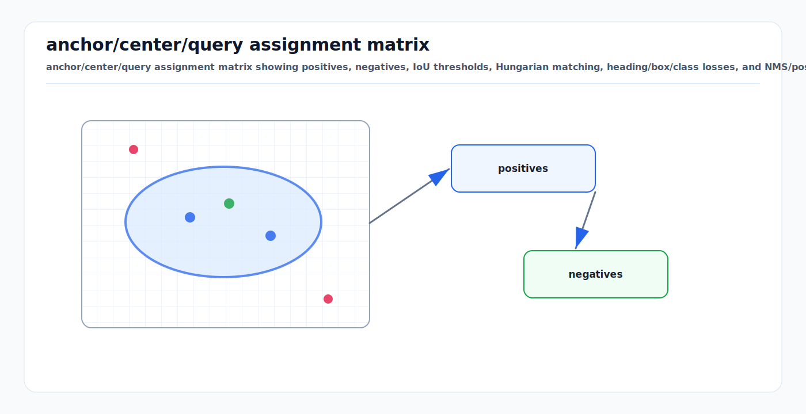

# 3D Object Detection Losses and Assignment: First Principles

<!-- kb-visual:start -->


*Visual: anchor/center/query assignment matrix showing positives, negatives, IoU thresholds, Hungarian matching, heading/box/class losses, and NMS/postprocessing.*
<!-- kb-visual:end -->

3D object detection training is an accounting problem before it is a neural
network problem. The model emits many candidate boxes, centers, anchors, or
queries. The trainer must decide which predictions are responsible for which
ground-truth objects, which predictions are negatives, and which predictions are
ignored. The losses only mean what the assignment rule makes them mean.

---

## Related Docs

- [PointPillars: First Principles](pointpillars.md)
- [Data Association and Gating](../state-estimation/data-association-and-gating.md)
- [Detection Theory: ROC, PR, and Operating Points](../probability-statistics/detection-theory-roc-pr-operating-points.md)
- [Multi-Task Losses and Objectives](../machine-learning/multi-task-losses-and-objectives-first-principles.md)

---

## Why It Matters

| Decision | Training effect | Deployment risk if wrong |
|---|---|---|
| Positive assignment | Defines which boxes learn geometry. | Missed rare classes or unstable localization. |
| Negative assignment | Defines background examples. | Many false positives or class collapse. |
| Ignore region | Removes ambiguous supervision. | Penalizes valid near-miss boxes or noisy labels. |
| Matching cost | Couples class, position, size, heading, and IoU. | Good boxes may be trained as negatives. |
| Postprocessing | Converts dense candidates into final detections. | Duplicate boxes, suppressed small objects, unsafe thresholds. |

---

## First Principle

Let predictions be `p_i` and ground-truth boxes be `g_j`. Training chooses an
assignment matrix:

```text
A_ij = 1 if prediction i is responsible for object j
A_ij = 0 otherwise
```

Then the loss is a sum over the assigned structure:

```text
L = L_cls + lambda_box L_box + lambda_head L_heading + lambda_aux L_aux
```

The important point is that classification and regression are not independent.
A positive assignment activates box and heading regression. A negative
assignment usually contributes only to classification or objectness. An ignored
prediction should not push either way.

---

## Assignment Families

### Anchor Assignment

Anchor detectors tile predefined boxes over space, size, class, and heading.
For each anchor, compute overlap with ground truth in BEV or 3D:

```text
IoU(i, j) = volume(anchor_i intersection box_j) /
            volume(anchor_i union box_j)
```

Typical rules:

```text
positive if max_j IoU(i, j) >= tau_pos
negative if max_j IoU(i, j) <  tau_neg
ignore   otherwise
```

Many implementations also force at least one positive anchor per ground-truth
object by assigning the best anchor even if its IoU is below `tau_pos`. This
prevents small or unusual objects from disappearing from the regression loss.

### Center and Heatmap Assignment

Center-based detectors predict object centers on a BEV grid or image plane. A
ground-truth center writes a Gaussian or disk-shaped target into the heatmap:

```text
y_xyc = exp(-distance((x, y), center_c)^2 / (2 sigma_c^2))
```

The positive region is controlled by object size, grid resolution, and the
desired minimum overlap after decoding. Regression heads then predict center
offset, height, dimensions, yaw, and sometimes velocity at positive cells.

### Query and Hungarian Assignment

Set-prediction detectors produce a fixed set of object queries. A bipartite
matching solver chooses a one-to-one assignment between predictions and ground
truth:

```text
cost_ij = lambda_cls C_cls(i, j)
        + lambda_l1  ||b_i - b_j||_1
        + lambda_iou (1 - IoU(i, j))
```

The Hungarian result makes duplicate predictions expensive during training
because only one query can own each object. Unmatched queries are trained as
no-object/background.

---

## Loss Components

### Classification

Dense detectors face extreme class imbalance: most anchors or cells are
background. Common choices are:

```text
cross entropy:  -log p(class)
focal loss:     -alpha (1 - p_t)^gamma log(p_t)
```

Focal loss downweights easy negatives so rare positives and hard examples still
shape the gradient. Class weights handle dataset imbalance; they do not fix bad
assignment.

### Box Regression

Boxes are usually encoded relative to an anchor, cell, or query reference:

```text
dx = (x_gt - x_ref) / scale_x
dy = (y_gt - y_ref) / scale_y
dz = (z_gt - z_ref) / scale_z
dw = log(w_gt / w_ref)
dl = log(l_gt / l_ref)
dh = log(h_gt / h_ref)
```

The regression loss is often Smooth L1, L1, or an IoU-family loss. Smooth L1 is
stable for noisy labels; IoU-style losses better match final localization
quality but can be harder when boxes barely overlap.

### Heading

Yaw is periodic, so direct subtraction fails near the wraparound. Common
encodings include:

```text
sin(yaw_pred - yaw_gt)
heading bin classification + residual regression
sin/cos vector with normalization
```

For vehicles, a separate direction classification head is often used to resolve
the 180-degree ambiguity created by symmetric BEV boxes.

### Quality and Auxiliary Terms

Modern detectors often add quality prediction, centerness, velocity, corner
loss, objectness, or IoU prediction. These terms are useful only if their target
definition is consistent with assignment and postprocessing.

---

## Postprocessing

Training assignment is not the final detector. At inference, decoded boxes pass
through score thresholds and non-maximum suppression:

```text
1. decode candidates into metric boxes
2. discard low-score boxes
3. sort by score
4. suppress lower-score boxes whose IoU with a kept box exceeds tau_nms
5. export class, score, box, heading, and covariance/quality if available
```

NMS is an operating-point choice. A threshold that works for cars may suppress
nearby cones, baggage carts, or pedestrians. Per-class NMS, rotated BEV IoU,
class-agnostic NMS, and learned duplicate removal all encode different safety
tradeoffs.

---

## Implementation Notes

- Log positive, negative, and ignored counts per class and range band.
- Inspect assignment before training by drawing anchors or centers around
  ground-truth boxes.
- Match the assignment IoU convention to the box convention: center, size,
  yaw, coordinate frame, and ground-plane assumptions.
- Keep label noise out of hard negatives. Ambiguous boxes should be ignored,
  not used as proof of background.
- Tune loss weights after checking normalized gradient sizes, not only final
  metrics.
- Evaluate with both average precision and operational counts: false positives
  per frame, duplicate rate, missed-object distance, and yaw error.

---

## Failure Modes

| Symptom | Likely cause | Diagnostic |
|---|---|---|
| Loss decreases but AP stays low. | Assignment target does not match metric. | Compare positive IoU distribution with evaluation IoU. |
| Rare class never learns. | Too few positives or focal/class weights mis-set. | Count positives per class after augmentation. |
| Duplicate boxes survive. | Query matching, NMS, or quality score mismatch. | Plot duplicates before and after NMS. |
| Boxes have good centers but bad yaw. | Heading wrap or direction ambiguity. | Histogram yaw residuals near +/-pi. |
| Far objects vanish. | Anchors/cells too coarse or IoU threshold too high. | Positive count by range and object size. |
| Training is unstable after augmentation. | Box transforms not applied consistently. | Replay one augmented sample and verify all box fields. |

---

## Sources

- Lang et al., "PointPillars: Fast Encoders for Object Detection from Point Clouds": https://arxiv.org/abs/1812.05784
- Yan, Mao, and Li, "SECOND: Sparsely Embedded Convolutional Detection": https://www.mdpi.com/1424-8220/18/10/3337
- Yin, Zhou, and Krahenbuhl, "Center-based 3D Object Detection and Tracking": https://arxiv.org/abs/2006.11275
- Carion et al., "End-to-End Object Detection with Transformers": https://arxiv.org/abs/2005.12872
- Lin et al., "Focal Loss for Dense Object Detection": https://arxiv.org/abs/1708.02002
- OpenPCDet repository and configs: https://github.com/open-mmlab/OpenPCDet
