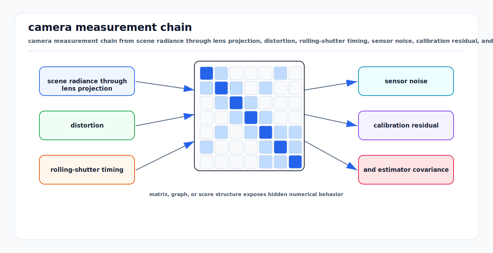

# Camera Imaging, Noise, and Calibration

<!-- kb-visual:start -->


*Visual: camera measurement chain from scene radiance through lens projection, distortion, rolling-shutter timing, sensor noise, calibration residual, and estimator covariance.*
<!-- kb-visual:end -->

Cameras measure irradiance projected through optics onto a pixel array. The
output image is shaped by perspective geometry, lens distortion, exposure,
sensor noise, rolling shutter, ISP processing, and calibration. For autonomy,
the important fact is that image pixels are not only appearance data. They are
geometric bearings with photometric uncertainty and time semantics.

---

## 1. Measurement Model

For a 3D point expressed in the camera optical frame:

```
P_c = [X, Y, Z]^T
x = X / Z
y = Y / Z

u = f_x * x + c_x
v = f_y * y + c_y
```

The intrinsic matrix is:

```
K = [ f_x   0   c_x ]
    [  0   f_y  c_y ]
    [  0    0    1  ]
```

The full projection from map to image is:

```
P_c = T_camera_base * T_base_map * P_map
pixel = distort(project(K, P_c))
```

### Sensor Model Impact

| Task | Why the model matters |
|---|---|
| Perception | Detection, segmentation, lane marking, and sign recognition depend on exposure, blur, HDR behavior, and lens distortion. |
| SLAM | Visual odometry and bundle adjustment use pixels as bearing measurements. Incorrect intrinsics or rolling shutter create biased residuals. |
| Mapping | Camera colorization, semantic map labels, and visual landmarks require calibrated projection and synchronized timestamps. |
| Validation | Metrics should be stratified by illumination, exposure, range/depth, motion blur, lens region, and weather/contamination. |

---

## 2. Pinhole, Fisheye, and Distortion

### Pinhole with Radial-Tangential Distortion

OpenCV's common model uses normalized coordinates and radial/tangential
distortion:

```
r2 = x^2 + y^2

x_dist = x * (1 + k1*r2 + k2*r2^2 + k3*r2^3)
       + 2*p1*x*y + p2*(r2 + 2*x^2)

y_dist = y * (1 + k1*r2 + k2*r2^2 + k3*r2^3)
       + p1*(r2 + 2*y^2) + 2*p2*x*y

u = f_x * x_dist + c_x
v = f_y * y_dist + c_y
```

Higher-order rational models add numerator/denominator terms for wide lenses.

### Fisheye Models

Fisheye and surround-view cameras should not be forced into a narrow-FOV
pinhole model. Common fisheye models map ray angle `theta` to radius:

```
r = f * theta                    equidistant
r = 2*f*sin(theta/2)             equisolid
r = f*tan(theta)                 rectilinear pinhole
r = 2*f*tan(theta/2)             stereographic
```

Practical implications:

- Use the camera model expected by the downstream stack.
- Do not undistort fisheye images into a pinhole image if the resulting
  interpolation and FOV loss harm perception.
- For BEV projection, model the ray for each pixel rather than relying on a
  single approximate homography outside flat-ground assumptions.

---

## 3. Rolling Shutter and Exposure Timing

A global-shutter camera exposes all rows at the same time. A rolling-shutter
camera exposes rows at different times:

```
t_row(v) = t_frame_start + v * line_delay
```

The projection should use the pose at the row timestamp:

```
P_c(v) = T_camera_map(t_row(v)) * P_map
pixel = project(P_c(v))
```

Rolling shutter causes:

- curved poles and lane markings during yaw
- object shape distortion during relative motion
- biased visual odometry if modeled as global shutter
- LiDAR-camera projection residuals that vary by image row

Mitigation:

- Prefer global shutter for geometry-critical cameras.
- Hardware-trigger exposures and log exposure start time, not driver receive
  time.
- Estimate line delay if using rolling-shutter visual-inertial odometry.
- Validate calibration in dynamic turns, not only static checkerboard captures.

---

## 4. Photometric Noise

A raw pixel value is affected by photon shot noise, dark current, read noise,
fixed-pattern noise, quantization, and ISP transformations.

A simple raw linear sensor model:

```
e = Poisson(qe * photons) + dark_current * t_exp + read_noise
DN = gain * e + black_level + quantization_noise

Var(DN) ~= gain^2 * (qe * photons + dark_current*t_exp + sigma_read^2)
          + sigma_quant^2
```

Key noise types:

| Noise | Behavior | Operational effect |
|---|---|---|
| Shot noise | variance grows with signal | low-light lane and object edges become noisy |
| Read noise | roughly signal-independent | dominates dark regions |
| Dark current | grows with exposure and temperature | hot pixels and thermal drift |
| PRNU | pixel response non-uniformity | flat-field shading and texture artifacts |
| DSNU | dark signal non-uniformity | spatial bias in dark images |
| Quantization | ADC and compression | banding and lost gradients |

Do not tune a perception model only on ISP-processed images if deployment uses
different gain, gamma, denoising, sharpening, compression, or HDR merge policy.

---

## 5. Exposure, HDR, and Motion Blur

Exposure controls the photon budget:

```
signal proportional_to radiance * aperture_area * exposure_time * sensor_gain
```

Increasing exposure reduces shot-noise relative error but increases motion
blur:

```
blur_pixels ~= image_velocity_pixels_per_sec * exposure_time
```

HDR cameras extend dynamic range by multiple exposures, conversion gains, or
local tone mapping. HDR helps scenes containing dark shadows and bright
headlights, sun glare, reflective aircraft, or apron floodlights. It can also
create fusion hazards:

- moving objects may appear differently in short and long exposure captures
- tone mapping changes photometric constancy assumptions
- LED signs and beacons can flicker or alias with exposure timing
- saturation hides texture and damages feature tracks

For SLAM, prefer access to linear raw or well-characterized grayscale images.
For perception, include exposure metadata as an input or validation dimension
when possible.

---

## 6. Calibration

### Intrinsic Calibration

Intrinsic calibration estimates:

```
K, distortion coefficients, image size, camera model
```

Target-based calibration fits 3D or planar target points to observed image
corners:

```
minimize sum_i || u_i_observed - project(K, distortion, T_camera_target, P_i) ||^2
```

Good datasets:

- cover the whole image, including corners
- include multiple distances and tilts
- avoid motion blur and bad corner detection
- use the final lens, focus, aperture, window, and housing

### Extrinsic Calibration

Extrinsics connect camera optical frame to the vehicle and other sensors:

```
P_camera = T_camera_lidar * P_lidar
P_camera = T_camera_base  * P_base
```

Extrinsic validation should include:

- LiDAR edge projection on image edges
- camera-to-camera overlap consistency
- AprilTag/checkerboard residuals at multiple depths
- dynamic replay to expose time offset and rolling shutter

### Temporal Calibration

Timestamp errors create spatial residuals:

```
pixel_error ~= optical_flow_pixels_per_sec * time_offset
position_error ~= vehicle_speed * time_offset
```

Log:

- hardware trigger time
- exposure start and exposure duration
- sensor timestamp and host receive timestamp
- frame drops and sequence gaps

---

## 7. Depth from Multiview

Stereo and multiview depth depend on calibration and baseline.

For rectified stereo:

```
Z = f * B / d
```

where `B` is baseline and `d` is disparity. Depth uncertainty grows quadratically
with depth:

```
sigma_Z ~= (Z^2 / (f * B)) * sigma_disparity
```

Implications:

- Wider baseline improves far-depth precision but worsens close-range overlap
  and occlusion.
- Small calibration yaw errors create large depth bias at long range.
- Rolling shutter and unsynchronized stereo cameras break epipolar geometry.
- Low texture, glare, repetitive markings, wet pavement, and smoke/fog reduce
  match confidence.

For monocular depth networks, calibration still matters: focal length and
principal point define the ray geometry, and dataset-specific camera models can
become hidden biases.

---

## 8. Noise Models for Estimation

### Feature Reprojection Factors

A typical visual factor uses pixel residual:

```
r_i = u_i_meas - project(T_camera_world, P_world_i)
r_i ~ N(0, Sigma_pixel)
```

Starting values:

```
corner feature sigma: 0.3 to 1.0 px in sharp, high-SNR images
learned/keypoint detector sigma: 1.0 to 3.0 px unless calibrated
rolling shutter or blur: inflate by optical-flow * timing uncertainty
fisheye edge pixels: use model-specific covariance, often larger near edge
```

Use robust losses for dynamic objects, wrong feature matches, lens dirt, and
specular reflections.

### Photometric Factors

Direct methods assume brightness constancy:

```
r = I_j(project(T_j_i, depth_i, u_i)) - I_i(u_i)
```

This fails under auto-exposure, tone mapping, shadows, flicker, and non-Lambertian
surfaces. If direct visual odometry is used, log exposure/gain and model an
affine brightness transform:

```
I_j ~= a * I_i + b
```

---

## 9. Failure Modes

| Failure mode | Cause | Mitigation |
|---|---|---|
| Curved reprojection residuals | wrong distortion model or fisheye treated as pinhole | use correct model and corner coverage |
| Depth scale bias | bad focal length, baseline, or monocular scale prior | calibration QA and metric sensor fusion |
| Row-dependent projection error | rolling shutter or time offset | global shutter, line-delay model, hardware sync |
| Lost lane markings at night | low SNR, glare, wet pavement | HDR validation, exposure control, thermal/radar/LiDAR fusion |
| Feature outliers | dynamic objects, reflections, repetitive markings | semantic masks, robust loss, track gating |
| Calibration drift | lens focus, mount movement, thermal stress | residual monitors and service recalibration |
| ISP domain shift | firmware update, compression, tone mapping | version image pipeline and regression-test raw/ISP outputs |

---

## 10. Airside and Mapping Relevance

Airside cameras must handle bright apron lights, shadowed undercarriages,
reflective aircraft skin, LED signs, painted markings, rain, spray, and low
sun. These conditions stress exposure and photometric assumptions more than
nominal daytime road datasets.

For map building, camera data is valuable for:

- lane, stand, and service-road markings
- sign and light state interpretation
- semantic labels on LiDAR geometry
- visual place recognition where geometry is weak

But camera-derived map features should store calibration, exposure, timestamp,
and weather provenance. A semantic marking created from a saturated or blurred
image should not have the same validation weight as one observed repeatedly
under good exposure and geometric alignment.

---

## 11. Sources

- OpenCV Camera Calibration tutorial. https://docs.opencv.org/4.x/dc/dbb/tutorial_py_calibration.html
- OpenCV Camera Calibration and 3D Reconstruction module. https://docs.opencv.org/4.x/d9/d0c/group__calib3d.html
- EMVA Standard 1288, image sensor characterization. https://www.emva.org/standards-technology/emva-1288/
- EMVA Standard 1288 Release document. https://www.emva.org/wp-content/uploads/EMVA_standard_1288_releaseA1_03.pdf
- Hartley and Zisserman, "Multiple View Geometry in Computer Vision." Cambridge University Press, 2004.
- Li and Mourikis, "Vision-aided inertial navigation with rolling-shutter cameras." IJRR, 2014. https://journals.sagepub.com/doi/abs/10.1177/0278364914538326
- Hedborg et al., "Rolling Shutter Bundle Adjustment." CVPR, 2012. https://openaccess.thecvf.com/content_cvpr_2012/html/Hedborg_Rolling_Shutter_Bundle_2012_CVPR_paper.html
- Albl et al., "Geometric Models of Rolling-Shutter Cameras." https://arxiv.org/abs/cs/0503076
- Kalibr camera-IMU calibration toolbox. https://github.com/ethz-asl/kalibr
