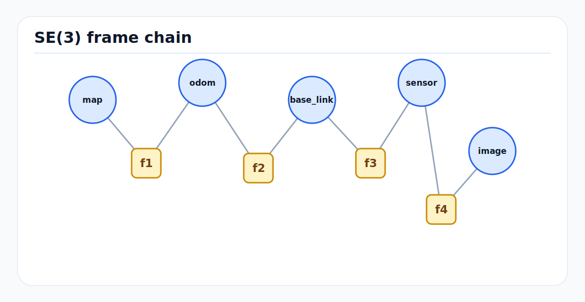

# Coordinate Frames, Projections, and SE(3) for Autonomous Systems

Coordinate conventions are not bookkeeping. They define what every position,
velocity, covariance, detection, map feature, and control command means. A
stack can have strong perception and planning models and still fail if one
frame is left-handed, one timestamp is late, or one map origin is silently
changed.

This page is the reusable foundation for 3D transforms, geodetic projections,
ROS/Autoware frame semantics, and SE(3) notation across road AV, indoor AMR,
outdoor industrial, and airport airside deployments.

---

<!-- kb-figure:start -->


*Figure: how autonomy stacks compose map, odometry, vehicle, sensor, and image frames through SE(3) transforms.*
<!-- kb-figure:end -->

## 1. AV, Indoor, Outdoor, and Airside Relevance

| Domain | Why frames matter | Typical failure to prevent |
|---|---|---|
| Road AV | Cameras, LiDAR, radar, GNSS/INS, HD maps, predictions, and controls must agree on `map`, `odom`, `base_link`, and sensor frames. | Lane-level localization is correct in UTM but detections are projected through an inverted camera extrinsic. |
| Indoor robots | GNSS is absent, so local map frames, dock frames, shelf frames, and fiducial frames carry all spatial authority. | A warehouse map is re-zeroed without updating route, costmap, and charging-dock frames. |
| Outdoor industrial | GNSS, local site survey control, dust/rain sensors, and large map tiles meet at local tangent planes. | A UTM zone, datum, or float precision mistake creates meter-scale drift across a yard or mine. |
| Airside autonomy | RTK/INS, surveyed AMDB/AMXM geometry, LiDAR maps, aircraft stands, jet-blast zones, and ground-control procedures must share a frame chain. | `map -> odom` jumps are sent to controllers instead of staying in localization, causing a lateral command discontinuity near an aircraft. |

---

## 2. Core Frame Vocabulary

### 2.1 Coordinate Frame Contract

A frame definition must answer four questions:

1. **Origin:** Where is `(0, 0, 0)`?
2. **Axis directions:** Which way do `x`, `y`, and `z` point?
3. **Units and handedness:** Meters? Radians? Right-handed?
4. **Authority:** Which component is allowed to publish or modify the transform?

ROS REP-103 standardizes SI units and right-handed frames. For vehicle body
frames, the common convention is:

```
x = forward
y = left
z = up
```

Camera optical frames are different:

```
z = forward along optical axis
x = right in image
y = down in image
```

This optical convention is a common source of projection bugs. Never assume a
camera frame is the same as `base_link` with a rotation applied informally.
Publish the full calibrated transform.

### 2.2 Mobile Robot Frame Stack

ROS REP-105 defines a widely used mobile robot frame hierarchy:

```
earth -> map -> odom -> base_link -> sensor_frame
```

| Frame | Meaning | Continuity |
|---|---|---|
| `earth` | Global Earth-fixed reference, usually ECEF or a geodetic anchor. | Globally stable. |
| `map` | Local world frame used by maps and global localization. | May jump when localization corrects drift. |
| `odom` | Locally smooth odometry frame. | Continuous, but drifts over time. |
| `base_link` | Vehicle body reference, often near rear axle, center of gravity, or geometric center. | Moves with the vehicle. |
| Sensor frames | Camera, LiDAR, radar, IMU, GNSS antenna, wheel odometry frames. | Fixed relative to `base_link` unless online calibration updates them. |

For controllers, the key distinction is:

```
map: globally accurate but allowed to jump
odom: locally smooth but allowed to drift
```

Planning can work in `map`, but low-level control should consume a smooth pose
or trajectory interface so localization corrections do not appear as physical
vehicle motion.

### 2.3 ENU, NED, ECEF, and Geodetic Coordinates

Autonomy stacks commonly move between these representations:

| Representation | Axes / values | Use |
|---|---|---|
| WGS84 geodetic | latitude, longitude, ellipsoidal height | GNSS receivers, survey data, aviation and map metadata. |
| ECEF | Earth-centered, Earth-fixed Cartesian meters | Global frame composition without local projection zones. |
| ENU | East, north, up local tangent plane | ROS-friendly local Cartesian frame for ground robots. |
| NED | North, east, down local tangent plane | Common in aerospace and some INS outputs. |
| UTM/MGRS | Projected grid meters by zone | HD maps, road-scale and site-scale mapping. |
| Local Cartesian | Tangent-plane meters around a chosen origin | Airports, warehouses, campuses, yards, and closed sites. |

The ENU/NED distinction must be explicit at every INS, flight, or aviation
integration boundary. A NED attitude or velocity fed into an ENU estimator
often looks plausible until turns, slopes, or vertical motion expose the sign
error.

---

## 3. SE(3) Transform Fundamentals

### 3.1 Homogeneous Transform Notation

Use a transform `T_A_B` to mean "pose of frame B expressed in frame A" or
"transform points from B coordinates into A coordinates."

```
p_A = T_A_B * p_B
```

A rigid 3D transform in SE(3) is:

```
T_A_B = [ R_A_B  t_A_B ]
        [ 0 0 0    1   ]
```

where:

- `R_A_B` is a 3x3 rotation matrix in SO(3)
- `t_A_B` is the origin of frame B expressed in frame A
- `p_B` is written as homogeneous coordinates `[x, y, z, 1]^T`

### 3.2 Composition and Inversion

Transform composition follows the frame chain:

```
T_A_C = T_A_B * T_B_C
p_A   = T_A_B * T_B_C * p_C
```

The inverse transform is:

```
T_B_A = inv(T_A_B)
R_B_A = R_A_B^T
t_B_A = -R_A_B^T * t_A_B
```

Most calibration bugs are direction bugs. A file named
`camera_to_lidar.yaml` is ambiguous unless it states whether it stores
`T_camera_lidar` or `T_lidar_camera` and gives a projection sanity test.

### 3.3 Lie Algebra, Small Errors, and Covariance

SE(3) poses live on a manifold, not in Euclidean vector space. Small pose
errors are represented in the tangent space `se(3)` as a 6-vector:

```
xi = [omega_x, omega_y, omega_z, v_x, v_y, v_z]
T  = Exp(xi)
xi = Log(T)
```

This matters for optimization and filtering:

- A pose residual should usually be computed with `Log(T_measured^-1 * T_estimated)`.
- Orientation uncertainty should be represented in a local tangent space, not by directly subtracting quaternions.
- Covariances attached to poses must define both the frame and the ordering of the 6-vector.

For uncertainty propagation through transform composition, the SE(3) adjoint is
the standard tool:

```
xi_A = Ad_T_A_B * xi_B
Sigma_A = Ad_T_A_B * Sigma_B * Ad_T_A_B^T
```

If a LiDAR detection covariance is reported in the sensor frame and later fused
in `map`, this covariance rotation is not optional.

---

## 4. Projection and Sensor Geometry

### 4.1 Camera Projection

The pinhole camera projection from a 3D map point to pixels is:

```
p_camera = T_camera_map * p_map
[u, v, 1]^T ~ K * [x/z, y/z, 1]^T
```

where `K` is the camera intrinsic matrix. In a full chain:

```
T_camera_map = T_camera_base * T_base_odom * T_odom_map
```

Practical checks:

- Points behind the camera have `z <= 0` in the optical frame.
- Straight vertical poles should not curve after projection unless lens distortion is still present.
- Reprojected LiDAR points should align with image edges under braking, turning, and vibration, not only in static scenes.

### 4.2 LiDAR, Radar, and BEV Projection

LiDAR and radar often feed bird's-eye-view grids:

```
i = floor((x_base - x_min) / resolution)
j = floor((y_base - y_min) / resolution)
```

The grid definition must state:

- source frame (`base_link`, `map`, or sensor frame)
- resolution
- origin and cell-center convention
- row/column orientation
- whether ego motion compensation has already been applied

For radar, preserve Doppler frame semantics. Radial velocity is measured along
the radar line of sight and must be transformed carefully before it becomes
`vx` or `vy` in vehicle coordinates.

### 4.3 Map Projections

For site-scale autonomy, a local Cartesian or projected map is usually better
than doing runtime planning directly in latitude/longitude. Recommended pattern:

```
WGS84 / survey control
  -> ECEF or map projection
  -> local metric map frame
  -> odom
  -> base_link
```

Deployment notes:

- Put the projection origin near the operating site.
- Record datum, epoch, projection type, zone, and origin in map metadata.
- Avoid large absolute coordinates in float32 ML or GPU kernels. Subtract a
  local origin before rasterization or tensor encoding.
- Do not mix ellipsoidal height, geoid height, and local floor elevation without
  a named conversion.

For airports, the aerodrome reference point or a surveyed control point is a
natural local origin, but final authority should follow the survey/control
process used by the airport and mapping team.

---

## 5. Practical Deployment Notes

### 5.1 Frame Authority Matrix

Maintain a single owner for each transform:

| Transform | Typical owner |
|---|---|
| `map -> odom` | Localization estimator. |
| `odom -> base_link` | Odometry or fused state estimator. |
| `base_link -> sensor` | Calibration artifact loaded as static TF. |
| `earth -> map` | Map loader or georeference service. |
| `map -> dock/stand/zone` | Map or operations layer. |

Do not let multiple nodes publish the same transform unless there is a clearly
defined arbitration mechanism.

### 5.2 Minimum Frame Metadata for Logs

Every dataset and incident log should preserve:

- TF tree or equivalent transform graph
- static transform files and their version IDs
- map projection metadata
- sensor `frame_id` values
- timestamp source for each topic
- covariance frame and variable ordering
- vehicle reference point definition

Without this metadata, replayed incidents can be impossible to reproduce.

### 5.3 Sanity Tests

Before deployment, run these checks:

1. Project LiDAR points into all cameras while driving a loop with turns and stops.
2. Verify a known surveyed point appears at the expected `map` coordinate.
3. Confirm positive yaw direction with a slow left turn.
4. Confirm `map -> odom` corrections do not create controller discontinuities.
5. Validate covariance ellipses visually after transforming them between frames.
6. Replay one bag with all static transforms removed except the checked-in calibration files.

---

## 6. Failure Modes and Risks

| Failure mode | Symptom | Mitigation |
|---|---|---|
| ENU/NED mix-up | Vertical or yaw signs look inverted; aircraft/INS integrations disagree with ROS. | Convert at the driver boundary and name frames with `_ned` only when truly NED. |
| Left-handed frame | Mirrored detections or lane geometry. | Enforce REP-103 right-handed frames and run basis-vector tests. |
| Extrinsic direction reversal | Reprojected objects appear displaced in a way that grows with range. | Store `T_target_source` naming and include inverse tests in calibration CI. |
| `map` correction sent to controller | Vehicle command jumps after localization update. | Keep controller reference smooth in `odom` or trajectory-relative coordinates. |
| Wrong projection zone or datum | Site map aligns locally but drifts or offsets globally. | Record projection metadata and compare against surveyed control points. |
| Float precision loss | GPU BEV or map tensors show quantization at large coordinates. | Use local origins for ML and rasterization. |
| Covariance in wrong frame | Fusion becomes overconfident or rejects good measurements. | Transform covariance with the rotation or SE(3) adjoint. |
| Timestamped transform lookup error | Moving objects smear or sensor fusion is biased during turns. | Query transforms at measurement acquisition time, not processing time. |

---

## Related Repository Documents

- [PointPillars: First Principles](pointpillars.md)
- [RTK-GPS, IMU, and Multi-Sensor Localization](../state-estimation/rtk-gps-imu-localization.md)
- [GTSAM Factor Graph Optimization](../state-estimation/gtsam-factor-graphs.md)
- [Lanelet2 Map Representation](../robotics/lanelet2-maps.md)
- [Frenet-Frame Trajectory Planning](../controls/frenet-trajectory-math.md)
- [Robust State Estimation and Multi-Sensor Localization Fusion](../../30-autonomy-stack/localization-mapping/overview/robust-state-estimation-multi-sensor.md)
- [HD Map Construction Pipeline](../../30-autonomy-stack/localization-mapping/maps/map-construction-pipeline.md)

---

## Sources

- ROS REP-103, "Standard Units of Measure and Coordinate Conventions": https://www.ros.org/reps/rep-0103.html
- ROS REP-105, "Coordinate Frames for Mobile Platforms": https://www.ros.org/reps/rep-0105.html
- Autoware TF documentation: https://autowarefoundation.github.io/autoware-documentation/main/design/autoware-interfaces/components/localization/#tf
- Autoware TF overview: https://autoware.one/docs/tf/
- Lanelet2 projection and coordinate systems: https://github.com/fzi-forschungszentrum-informatik/Lanelet2/blob/master/lanelet2_projection/doc/Map_Projections_Coordinate_Systems.md
- GeographicLib documentation: https://geographiclib.sourceforge.io/
- PROJ documentation: https://proj.org/
- Lynch and Park, "Modern Robotics" SE(3) resources: https://modernrobotics.northwestern.edu/nu-gm-book-resource/
- Sola et al., "A micro Lie theory for state estimation in robotics": https://arxiv.org/abs/1812.01537
