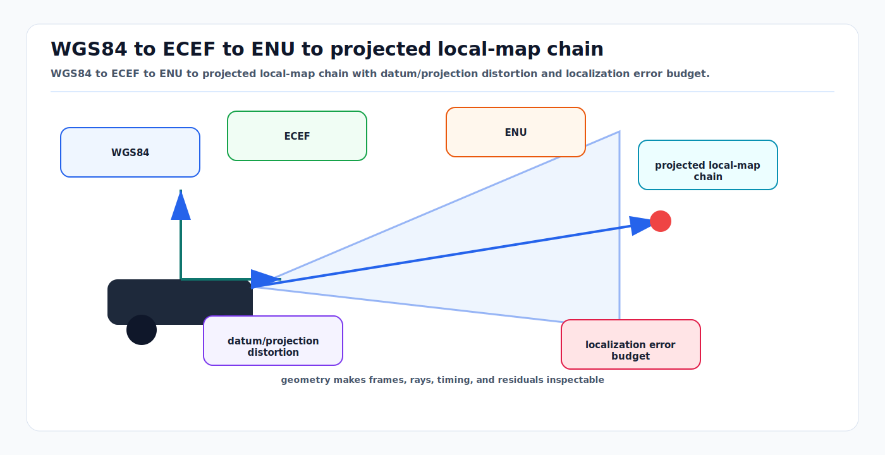

# Geodesy, Map Projections, Datums, and Map Frames

<!-- kb-visual:start -->


*Visual: WGS84 to ECEF to ENU to projected local-map chain with datum/projection distortion and localization error budget.*
<!-- kb-visual:end -->

Autonomy systems need local metric coordinates, but GNSS, surveyed assets, road
maps, and aviation data are tied to Earth. Geodesy supplies the chain from
latitude, longitude, and height to ECEF, ENU, NED, UTM, local map frames, and
road-network coordinates. The first-principles problem is not just conversion;
it is preserving the coordinate reference system, datum realization, epoch,
axis order, units, and frame authority at every interface.

---

## 1. Related Docs

- [Coordinate Frames, Projections, and SE(3)](coordinate-frames-projections-se3.md)
- [RTK GPS and IMU Localization](../state-estimation/rtk-gps-imu-localization.md)
- [GNSS RTK Error Models](../state-estimation/gnss-rtk-error-models.md)
- [Occupancy Bayes, Evidential, and Dynamic Grids](../mapping/occupancy-bayes-evidential-dynamic-grids.md)
- [Lanelet2 Maps](../robotics/lanelet2-maps.md)

---

## 2. Why It Matters for AV, Perception, SLAM, and Mapping

| Workflow | Geodesy role | Risk if wrong |
|---|---|---|
| GNSS/INS localization | Converts WGS84/ITRF-like positions into map frame. | Meter-scale shifts from datum, geoid, or lever-arm mistakes. |
| HD map production | Stores surveyed lanes, signs, poles, and boundaries. | Map tiles do not join or align with live localization. |
| Simulation and OpenDRIVE | Defines projection and offset for road geometry. | Scenario appears correct locally but wrong globally. |
| Fleet map updates | Merges local changes into global map tiles. | Different vehicles update different frames under the same tile name. |
| Airside and industrial autonomy | Uses surveyed site control and local tangent planes. | Safety zones and stand geometry shift relative to vehicles. |

---

## 3. Core Math and Coordinate Systems

### 3.1 WGS84 Geodetic

WGS84 geodetic coordinates are:

```text
latitude  phi: angle north of equator
longitude lambda: angle east of Greenwich meridian
height h: ellipsoidal height above the WGS84 ellipsoid
```

Ellipsoidal height is not mean sea level height. If a system uses orthometric
height, it needs a geoid model and the metadata must say so.

### 3.2 ECEF

Earth-Centered, Earth-Fixed coordinates are Cartesian meters fixed to the
rotating Earth. For ellipsoid semi-major axis `a`, first eccentricity squared
`e2`, and:

```text
N(phi) = a / sqrt(1 - e2 * sin(phi)^2)
```

geodetic to ECEF is:

```text
X = (N + h) * cos(phi) * cos(lambda)
Y = (N + h) * cos(phi) * sin(lambda)
Z = (N * (1 - e2) + h) * sin(phi)
```

ECEF is useful for global composition, long baselines, and avoiding projection
zone discontinuities. It is not convenient for local planning because axes are
not aligned with local east, north, and up.

### 3.3 ENU and NED

A local tangent plane is anchored at a geodetic origin `(phi0, lambda0, h0)`.
Compute the ECEF difference:

```text
d = ecef(point) - ecef(origin)
```

Then rotate into ENU:

```text
[e]   [-sin(lon0)              cos(lon0)             0] [dX]
[n] = [-sin(lat0)cos(lon0) -sin(lat0)sin(lon0) cos(lat0)] [dY]
[u]   [ cos(lat0)cos(lon0)  cos(lat0)sin(lon0) sin(lat0)] [dZ]
```

NED is:

```text
north = ENU_n
east  = ENU_e
down  = -ENU_u
```

ROS REP-103 prefers ENU for short-range geographic Cartesian frames and uses
separate `_ned` frames when NED is needed.

### 3.4 UTM

Universal Transverse Mercator projects the ellipsoid into metric eastings and
northings in 6-degree longitude zones. UTM is convenient for road-scale and
site-scale maps, but zone boundaries, false eastings, hemisphere conventions,
and datum metadata must be preserved. A coordinate pair without zone and CRS is
not a position.

### 3.5 Datums and Realizations

A datum defines how coordinates attach to Earth. WGS84 has multiple
realizations over time. Regional datums such as NAD83 or ETRS89 can differ from
WGS84 by centimeters to meters depending on location and epoch. For production
mapping, store:

```text
CRS name and EPSG code
datum and realization
coordinate epoch if relevant
height reference: ellipsoid or geoid
axis order and units
projection parameters
local origin and orientation
```

---

## 4. Map Frame Chains

### 4.1 ROS-Style Mobile Robot Frames

REP-105 defines the common chain:

```text
earth -> map -> odom -> base_link
```

`earth` is globally meaningful, often ECEF. `map` is a locally useful world
frame that may jump when global localization corrects drift. `odom` is smooth
but drifting. `base_link` moves with the vehicle.

Controllers should not receive discontinuous global localization jumps as
physical motion. Keep the jump in `map -> odom` or an equivalent localization
boundary.

### 4.2 OpenDRIVE and Road-Network Coordinates

ASAM OpenDRIVE stores road geometry in its own coordinate system and can define
georeferencing with a `<geoReference>` element using PROJ-style CRS metadata.
It can also use an `<offset>` element to shift coordinates. The offset is not a
datum transform; it is a local numerical convenience and must be included when
moving between OpenDRIVE coordinates and georeferenced coordinates.

### 4.3 Local Site Frames

Industrial sites, ports, airports, and campuses often use a surveyed local
frame. The frame is valid only with its control points and transformation to a
recognized CRS. Treat a local site frame as a first-class CRS:

```text
site_map = projection_or_tangent_plane + origin + yaw + scale + height model
```

---

## 5. Algorithm Steps

### 5.1 GNSS Measurement to Local Map Pose

1. Parse latitude, longitude, ellipsoidal height, covariance, timestamp, and
   datum metadata from the receiver or INS.
2. Convert geodetic position to ECEF using the declared ellipsoid.
3. Apply antenna lever arm and attitude in the correct frame if the receiver
   reports antenna position rather than vehicle reference point.
4. Convert ECEF to ENU at the map anchor or project to the declared UTM/local
   CRS.
5. Rotate and translate into `map` if the map frame has an additional local
   origin or yaw.
6. Propagate covariance through the conversion Jacobian or use receiver-provided
   local covariance with verified frame convention.
7. Publish global corrections through the localization frame boundary, not as
   jumps in the smooth odometry frame.

### 5.2 Map Asset Ingestion

1. Reject assets without CRS, units, axis order, and height reference.
2. Convert source geometry to a common internal CRS using a geodesy library such
   as PROJ or GeographicLib.
3. Apply OpenDRIVE, Lanelet2, or site-specific offsets exactly once.
4. Validate by checking surveyed control points and known landmarks.
5. Store both original CRS metadata and internal map-frame metadata.
6. Build local tiles with explicit frame IDs and versioned origins.

---

## 6. Implementation Notes

- Use established libraries for CRS work: PROJ, GeographicLib, GDAL/OGR, or
  vendor INS libraries with documented conventions.
- Do not implement UTM or datum transforms ad hoc for production mapping.
- Use double precision for global coordinates. ECEF values are millions of
  meters; float precision is not enough for centimeter map features.
- Keep global coordinates and local coordinates separate in types or schemas.
- Record whether latitude-longitude order or longitude-latitude order is used.
- Store height reference explicitly. Ellipsoid height and geoid height are not
  interchangeable.
- Avoid UTM for routes that cross zone boundaries unless the tiling strategy
  handles the discontinuity.
- In map files, distinguish CRS transforms from simple local offsets.

---

## 7. Failure Modes and Diagnostics

| Symptom | Likely cause | Diagnostic |
|---|---|---|
| Entire map is shifted by 1 to 2 m. | Datum realization or local survey transform mismatch. | Compare against surveyed control points in both CRSs. |
| Height is wrong by tens of meters. | Ellipsoidal height confused with geoid or mean sea level height. | Check geoid separation at the site. |
| East and north are swapped. | Axis order or ENU/NED convention mismatch. | Move a test point due east and verify only the east coordinate changes. |
| Map tears at tile boundary. | Different UTM zones, origins, or offsets per tile. | Convert a shared boundary point through both tile transforms. |
| Localization jumps during GNSS correction. | Global correction applied directly to control frame. | Inspect `map -> odom` and `odom -> base_link` continuity. |
| OpenDRIVE aligns in simulator but not in vehicle map. | `<geoReference>` or `<offset>` applied inconsistently. | Round-trip a known road point from OpenDRIVE to geodetic and back. |

---

## 8. Sources

- NGA WGS84 information and standardization documents: https://earth-info.nga.mil/GandG/wgs84/index.html
- EPSG method 9602, geographic/geocentric conversions: https://epsg.io/9602-method
- IOGP/EPSG Guidance Note 7-2, coordinate conversions and transformations: https://docslib.org/doc/3972254/guidance-note-7-part-2
- GeographicLib documentation: https://geographiclib.sourceforge.io/
- ROS REP-103, coordinate conventions: https://www.ros.org/reps/rep-0103.html
- ROS REP-105, mobile platform frames: https://www.ros.org/reps/rep-0105.html
- ASAM OpenDRIVE 1.8.1 georeferencing: https://publications.pages.asam.net/standards/ASAM_OpenDRIVE/ASAM_OpenDRIVE_Specification/v1.8.1/specification/08_coordinate_systems/08_05_geo_referencing.html
