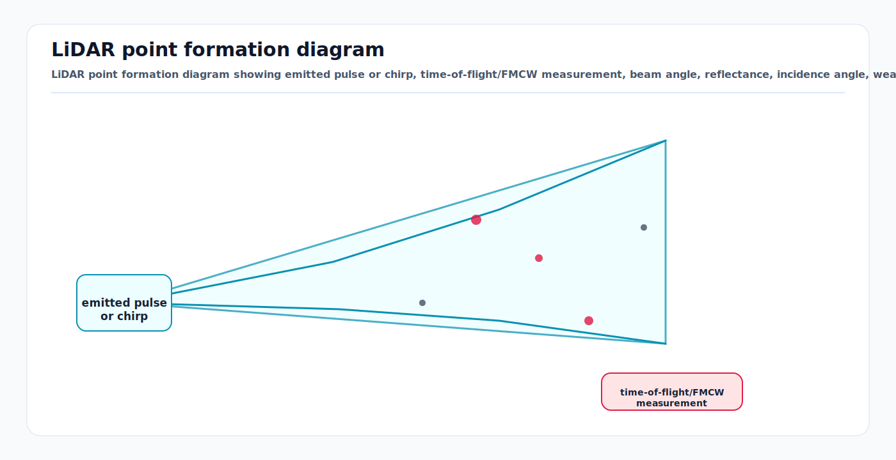

# LiDAR Working Principles and Noise Models

<!-- kb-visual:start -->


*Visual: LiDAR point formation diagram showing emitted pulse or chirp, time-of-flight/FMCW measurement, beam angle, reflectance, incidence angle, weather dropout, and range noise.*
<!-- kb-visual:end -->

LiDAR turns emitted light into range, bearing, and sometimes reflectance or
velocity measurements. For perception it is a geometric sensor. For SLAM and
mapping it is a source of dense surface constraints. The useful model is not
"a point cloud is truth"; it is "each returned point is a range-bearing
measurement whose uncertainty depends on beam geometry, target material,
incidence angle, atmosphere, timing, and calibration."

---

## 1. What a LiDAR Point Measures

A scanning LiDAR point is usually stored as:

```
p_lidar = [x, y, z]
intensity = returned signal metric, vendor-specific
ring = laser channel or scan line
time = per-point or per-column acquisition time
return_type = strongest, first, last, dual, or vendor-specific
```

The spherical measurement model is:

```
z = [r, theta, phi, I]

x = r * cos(phi) * cos(theta)
y = r * cos(phi) * sin(theta)
z = r * sin(phi)
```

where `r` is range, `theta` is azimuth, `phi` is elevation, and `I` is an
intensity-like return strength. Most AV LiDARs do not directly observe a
perfect point on a surface; they observe a finite beam footprint and report a
range extracted from the return waveform.

### Sensor Model Impact

| Task | Why the model matters |
|---|---|
| Perception | Object size, freespace, curb height, and small obstacle detections inherit range and angular noise. Ray drops can look like free space unless explicitly modeled. |
| SLAM | ICP/GICP residuals assume a point covariance. Wrong covariances over-weight grazing-angle, low-return, or weather-corrupted points. |
| Mapping | Static maps accumulate systematic beam and timing errors into blurred walls, doubled poles, and biased ground planes. |
| Validation | A detector should be tested against range, incidence angle, intensity, weather, and motion bins, not only aggregate precision/recall. |

---

## 2. Time-of-Flight LiDAR

Pulsed time-of-flight (ToF) LiDAR estimates range from round-trip travel time:

```
r = c * delta_t / 2
```

where `c` is the speed of light and `delta_t` is the time between pulse
emission and return detection.

Phase-shift ToF uses a modulated continuous signal and estimates phase delay:

```
r = (c / (4 * pi * f_mod)) * delta_phase
```

Phase systems can be ambiguous beyond a modulation-dependent range and often
use multiple modulation frequencies. Pulsed automotive spinning and solid-state
LiDARs usually hide waveform details behind point-cloud outputs, but the
underlying physics still appears as range quantization, multi-return behavior,
minimum range, maximum range, and intensity dependence.

### Range Noise Sources

Range noise combines random timing jitter, finite pulse width, detector noise,
range quantization, surface effects, and atmospheric scatter:

```
r_meas = r_true + b_r(channel, temperature, range, intensity) + n_r
n_r ~ N(0, sigma_r^2)
```

Practical modeling:

- Start with datasheet range accuracy as a lower bound, not a deployment
  covariance.
- Increase `sigma_r` for low intensity, long range, high incidence angle,
  transparent/black/specular materials, rain, fog, and partial beam hits.
- Model per-channel range bias separately from random noise for high-accuracy
  mapping.
- Keep return type. First and last returns have different obstacle and surface
  semantics in vegetation, spray, snow, and fence-like objects.

---

## 3. FMCW and Coherent LiDAR

Frequency-modulated continuous-wave (FMCW) LiDAR transmits a chirped optical
signal and mixes the received light with a local copy. The beat frequency
encodes range. Because the receiver is coherent, Doppler can also be measured.

For an ideal linear chirp:

```
f_b = (2 * S * r) / c
r = c * f_b / (2 * S)

S = B / T_chirp
range_resolution = c / (2 * B)
```

For radial velocity:

```
f_d = 2 * v_r / lambda
```

FMCW LiDAR can reject incoherent sunlight and some interference better than
direct-detection ToF, and it can provide line-of-sight velocity. Its practical
noise model must include chirp nonlinearity, coherence length, phase noise,
speckle, range-velocity coupling, and scan pattern timing.

### AV Relevance

Velocity-bearing LiDAR points can help distinguish moving aircraft equipment,
ground crew, rain/spray returns, and static map structure. The fusion stack
should still treat FMCW velocity as line-of-sight, not full 3D velocity.

---

## 4. Angular Noise and Beam Geometry

Angular uncertainty often dominates lateral error at long range:

```
sigma_lateral ~= r * sigma_angle
```

For example:

```
r = 80 m
sigma_angle = 0.05 deg = 0.000873 rad
sigma_lateral ~= 0.07 m
```

A point covariance in the LiDAR frame can be approximated by propagating
spherical noise through the Cartesian projection:

```
Sigma_xyz = J_spherical_to_xyz *
            diag(sigma_r^2, sigma_theta^2, sigma_phi^2) *
            J_spherical_to_xyz^T
```

Practical notes:

- Spinning multi-beam LiDARs have channel-specific vertical angles and
  azimuth/time offsets.
- MEMS, flash, OPA, and oscillating mirror sensors have scan-pattern-dependent
  angular noise and rolling acquisition.
- Beam divergence creates a footprint that grows with range. Thin poles, wires,
  cones, and FOD can be partial hits rather than clean surface samples.

---

## 5. Intensity and Reflectance

LiDAR intensity is not a universal reflectance value. It depends on emitted
power, receiver gain, range, incidence angle, target material, wavelength,
surface roughness, atmospheric transmission, and vendor signal processing.

A simplified radiometric relationship is:

```
I_meas proportional_to
  P_tx * rho_target * cos(alpha) * A_receiver * eta /
  (r^2 * beam_spreading * atmospheric_loss)
```

where `alpha` is incidence angle and `rho_target` is target reflectance at the
LiDAR wavelength. Some workflows correct intensity using range and incidence
angle before using it for lane markings, retroreflective signs, calibration
targets, or map layers.

Noise-model guidance:

- Do not compare raw intensity across sensors without calibration.
- Low intensity is a warning for higher range variance and higher drop
  probability.
- Retroreflectors can saturate receivers and bias range extraction.
- Wet markings and metallic aircraft surfaces can produce specular returns,
  missing returns, or multipath-like artifacts.

---

## 6. Incidence Angle and Surface Effects

Incidence angle affects both return probability and range accuracy. At grazing
angles, the beam footprint stretches across a surface, the return waveform
widens, and the reported range may come from an edge, mixed pixel, or leading
part of the footprint.

```
cos_incidence = abs(n_surface dot (-ray_direction))
grazing when cos_incidence -> 0
```

Practical weighting:

```
sigma_r_eff = sigma_r_base / max(cos_incidence, epsilon)
drop_prob increases as cos_incidence decreases
```

This is especially important for:

- ground-plane extraction at long range
- aircraft fuselage and service vehicles with curved or shiny panels
- glass, wet concrete, paint, puddles, and black rubber
- ICP scan matching against walls seen nearly parallel to the ray

---

## 7. Weather, Aerosols, and Ray Drop

Rain, fog, snow, dust, and de-icing spray affect LiDAR through attenuation,
backscatter, and false near-field returns.

```
P_return = P_surface * exp(-2 * beta * r) + P_backscatter
```

where `beta` is an extinction coefficient. The two-way exponential term matters
because light travels to the target and back.

Operational effects:

- Rain and spray create sparse false points near the sensor and reduce useful
  range.
- Fog reduces contrast and produces distributed backscatter that can erase
  weak far objects.
- Snow can create high-reflectance particles and partial occlusion.
- Dirty windows and water films add fixed-angle artifacts and global intensity
  loss.

For perception validation, report performance by weather intensity and range,
not just by scenario. For mapping, do not accept weather-corrupted scans into
the long-lived map without filtering and traceability.

---

## 8. Motion Distortion and Deskew

A spinning LiDAR frame is not captured at one instant. Points are acquired over
the scan period:

```
p_map(t_i) = T_map_lidar(t_i) * p_lidar_i
```

If the vehicle turns or accelerates during a scan, treating the whole cloud as
captured at `t_frame` bends walls, tilts poles, and biases scan matching.

Deskewing needs:

- per-point or per-column time
- sensor-to-IMU/body extrinsic calibration
- high-rate ego-motion from IMU, wheel odometry, or fused odometry
- correct clock synchronization

For low-speed airside vehicles, motion distortion can still matter near an
aircraft during tight turns because angular motion produces centimeter-scale
projection errors at docking distances.

---

## 9. Calibration Hooks for SLAM and Mapping

LiDAR calibration spans intrinsics, extrinsics, timing, and intensity.

| Calibration | Parameters | Failure symptom |
|---|---|---|
| Intrinsic beam calibration | vertical angles, azimuth offsets, range offsets, channel timing | wavy walls, ring seams, blurred poles |
| Extrinsic to base/IMU/camera/radar | `T_base_lidar`, `T_imu_lidar`, `T_camera_lidar` | colored point clouds misalign, deskew residuals grow |
| Time offset | LiDAR clock to IMU/PTP/GNSS clock | residuals grow during turns but not static scenes |
| Intensity/radiometric | range and channel response correction | lane markings and reflectors inconsistent across passes |

Mapping pipelines should preserve:

- raw point time, ring, intensity, and return type
- calibration artifact ID
- weather and sensor health diagnostics
- pose covariance and scan-matching residuals

Without these fields, a map cannot be audited when a wall is doubled or a
clearance envelope near an aircraft stand is wrong.

---

## 10. Noise Models for Estimation

### Point-Level Model

Use anisotropic covariance. A simple point residual covariance is:

```
Sigma_point =
  R_ray * diag(sigma_r^2, sigma_tangent1^2, sigma_tangent2^2) * R_ray^T

sigma_tangent ~= r * sigma_angle
```

Inflate for:

- `range > reliable_range`
- low intensity or saturation
- high incidence angle
- weather and window contamination
- dynamic object probability
- mixed pixels near depth discontinuities

### Scan Matching Model

For ICP/GICP/NDT factors, the pose covariance should reflect geometry:

| Scene | Constraint quality |
|---|---|
| two perpendicular walls, poles, curbs | strong 6-DoF or strong planar constraint |
| long featureless wall | weak along-wall translation |
| flat apron or open runway | weak yaw and horizontal translation without distant structure |
| mostly dynamic objects | high outlier risk |

Monitor the Hessian or information matrix from scan matching. Small eigenvalues
indicate directions the scan does not constrain.

### Practical Starting Point

```
clear weather point range sigma: 0.02 to 0.05 m
angular sigma: datasheet beam/encoder precision, often 0.02 to 0.1 deg
rain/fog/de-icing spray: inflate range and outlier probability by 2x to 10x
grazing incidence: inflate by 1 / max(cos_incidence, 0.2)
```

These are starting values. Validate with residual histograms and NIS-like
consistency checks against surveyed structures and repeated mapping passes.

---

## 11. Failure Modes

| Failure mode | Cause | Mitigation |
|---|---|---|
| Ray drop interpreted as free space | dark material, rain, fog, glass, specular angle | track unknown space separately from observed free space |
| Doubled map structure | time offset, motion distortion, bad extrinsic, moving objects | deskew, calibrate, dynamic filtering, map QA by pass |
| ICP converges to wrong pose | repetitive geometry, open apron, poor initialization | IMU/GNSS prior, robust kernels, degeneracy detection |
| Overconfident scan factor | fixed covariance in weak geometry | derive covariance from registration Hessian and scene quality |
| Ghost or mixed returns | glass, wet ground, metallic aircraft panels | multi-return logic, intensity/range gating, temporal confirmation |
| Weather false obstacles | rain, snow, spray, dust | particle filters, near-field weather classifier, radar cross-check |
| Channel seam artifacts | intrinsic beam error or thermal drift | channel calibration and residual monitoring |

---

## 12. Sources

- Glennie and Lichti, "Static Calibration and Analysis of the Velodyne HDL-64E S2 for High Accuracy Mobile Scanning." Remote Sensing, 2010. https://www.mdpi.com/2072-4292/2/6/1610
- Atanacio-Jimenez et al., "LIDAR Velodyne HDL-64E Calibration Using Pattern Planes." International Journal of Advanced Robotic Systems, 2011. https://journals.sagepub.com/doi/10.5772/50900
- Glennie et al., "Temporal Stability of the Velodyne HDL-64E S2 Scanner for High Accuracy Scanning Applications." Remote Sensing, 2011. https://www.mdpi.com/2072-4292/3/3/539
- Royo and Ballesta-Garcia, "An Overview of Lidar Imaging Systems for Autonomous Vehicles." Applied Sciences, 2019. https://www.mdpi.com/2076-3417/9/19/4093
- NASA NTRS, "Coherent Doppler Lidar for Measuring Velocity and Altitude of Space and Aerial Vehicles." https://ntrs.nasa.gov/citations/20160010177
- Kim et al., "Enhanced High-Resolution and Long-Range FMCW LiDAR with Directly Modulated Semiconductor Lasers." https://pmc.ncbi.nlm.nih.gov/articles/PMC12251745/
- Kaasalainen et al., "Radiometric Calibration of Airborne LiDAR Intensity Data for Land Cover Classification." ISPRS. https://www.isprs.org/proceedings/XXXVIII/part1/03/03_01_Paper_153.pdf
- Roriz et al., "Empirical Analysis of AV LiDAR Detection Performance Degradation in Rain and Fog." Sensors, 2023. https://pmc.ncbi.nlm.nih.gov/articles/PMC10051412/
