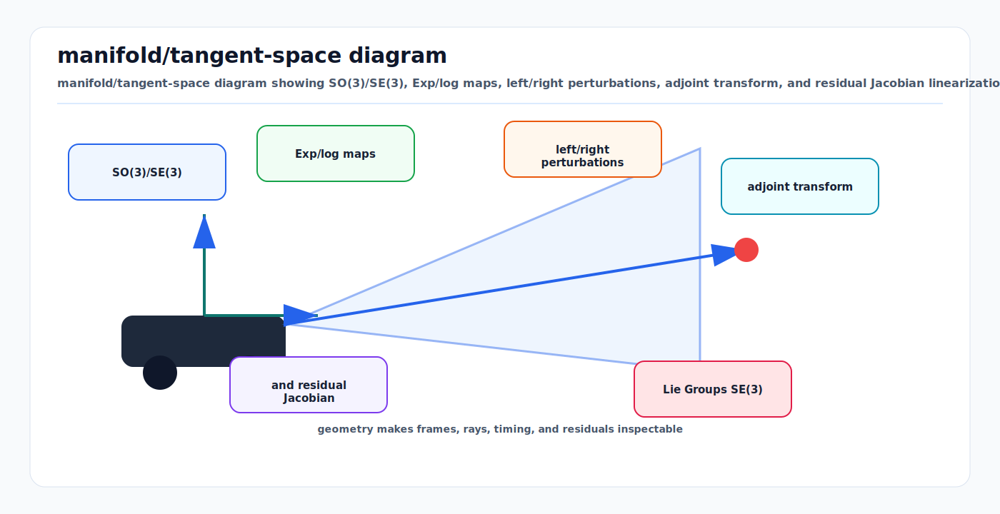

# Lie Groups SE(3), SO(3), Adjoints, and Jacobians

<!-- kb-visual:start -->


*Visual: manifold/tangent-space diagram showing SO(3)/SE(3), Exp/log maps, left/right perturbations, adjoint transform, and residual Jacobian linearization.*
<!-- kb-visual:end -->

Rigid body state is not a vector space. Rotations live on SO(3), poses live on
SE(3), and the local 3-vector or 6-vector used by an optimizer is only a
tangent-space perturbation. Treating pose parameters as ordinary Euclidean
variables is a common way to create inconsistent residuals, invalid covariance
propagation, and sign errors that only appear during aggressive turns or loop
closure.

---

## 1. Related Docs

- [Coordinate Frames, Projections, and SE(3)](coordinate-frames-projections-se3.md)
- [Multi-Sensor Calibration Observability](multi-sensor-calibration-observability.md)
- [GTSAM Factor Graphs](../state-estimation/gtsam-factor-graphs.md)
- [IMU Error Models and Preintegration](../state-estimation/imu-error-models-preintegration.md)

---

## 2. Why It Matters for AV, Perception, SLAM, and Mapping

AV stacks repeatedly estimate and compose poses:

| System | SE(3)/SO(3) role | Failure avoided |
|---|---|---|
| Visual odometry | Camera pose increments and reprojection Jacobians. | Optimizer diverges because rotation updates are applied in the wrong tangent frame. |
| LiDAR odometry | Scan-to-map residuals optimized over SE(3). | Point-to-plane Jacobian signs flip under frame inversion. |
| Sensor calibration | Extrinsics, time offsets, and covariance live in pose manifolds. | Calibration covariance is rotated incorrectly before fusion. |
| Factor graph SLAM | Between factors use Log of relative pose error. | Loop closures add false corrections because the residual convention differs by factor. |
| Mapping | Map tiles, submaps, and local frames are chained through transforms. | Submaps look aligned locally but drift or jump when composed globally. |

The first-principles rule is simple: store a pose as a group element, optimize a
small perturbation in the tangent space, and state whether the perturbation is
left-applied or right-applied.

---

## 3. Core Math

### 3.1 SO(3)

SO(3) is the group of valid 3D rotation matrices:

```text
SO(3) = { R in R^(3x3) | R^T R = I, det(R) = 1 }
```

The Lie algebra so(3) is represented by a 3-vector `w` and its skew matrix:

```text
hat(w) = [  0  -wz   wy ]
         [ wz    0  -wx ]
         [-wy   wx    0 ]
```

The exponential map converts a tangent vector to a rotation:

```text
R = Exp_SO3(w)
theta = norm(w)

Exp_SO3(w) = I + A * hat(w) + B * hat(w)^2
A = sin(theta) / theta
B = (1 - cos(theta)) / theta^2
```

Use Taylor expansions near zero:

```text
A ~= 1 - theta^2/6 + theta^4/120
B ~= 1/2 - theta^2/24 + theta^4/720
```

The logarithm map converts a rotation back to the principal tangent vector:

```text
w = Log_SO3(R)
theta = acos((trace(R) - 1) / 2)
hat(w) = theta / (2 sin(theta)) * (R - R^T)
```

The log map is numerically delicate near `theta = 0` and ambiguous near
`theta = pi`.

### 3.2 SE(3)

SE(3) represents a rigid transform:

```text
T = [ R  t ]
    [ 0  1 ]

p_a = T_a_b * p_b = R_a_b * p_b + t_a_b
```

Composition and inverse:

```text
T_a_c = T_a_b * T_b_c
R_a_c = R_a_b * R_b_c
t_a_c = R_a_b * t_b_c + t_a_b

inv(T_a_b) = [ R_a_b^T  -R_a_b^T * t_a_b ]
             [   0                1        ]
```

A 6-vector perturbation is commonly ordered as either `[w, v]` or `[v, w]`.
Pick one convention and encode it in API names and tests. This note uses
`xi = [w, v]`, angular first.

The SE(3) exponential for `xi = [w, v]` is:

```text
Exp_SE3(xi) = [ Exp_SO3(w)  J_l_SO3(w) * v ]
              [     0              1        ]
```

where `J_l_SO3(w)` is the SO(3) left Jacobian:

```text
J_l(w) = I + B * hat(w) + C * hat(w)^2
C = (theta - sin(theta)) / theta^3
```

The SE(3) logarithm inverts this:

```text
w = Log_SO3(R)
v = inv(J_l_SO3(w)) * t
xi = [w, v]
```

### 3.3 Left and Right Perturbations

There are two common update conventions:

```text
Left perturbation:  T_new = Exp(delta) * T
Right perturbation: T_new = T * Exp(delta)
```

They are not interchangeable. A left perturbation is expressed in the parent or
world-side tangent frame. A right perturbation is expressed in the body or
local-side tangent frame. GTSAM commonly uses right-sided retractions for pose
optimization, while many derivations in robotics texts use either convention
explicitly.

For a relative-pose residual:

```text
e_ij = Log( inv(Z_ij) * inv(T_i) * T_j )
```

the Jacobians depend on both the residual definition and the perturbation side.
Changing only the residual order can invert the correction direction.

### 3.4 Adjoint

The adjoint maps tangent perturbations between frames:

```text
Ad_T = [ R  hat(t) * R ]
       [ 0       R      ]     for xi = [w, v]

xi_a = Ad_T_a_b * xi_b
Sigma_a = Ad_T_a_b * Sigma_b * Ad_T_a_b^T
```

If a perturbation order `[v, w]` is used, the block layout changes. This is why
adjoint tests should use finite differences rather than only checking matrix
dimensions.

---

## 4. Algorithm Steps

### 4.1 Pose Optimization Step

1. Store state as `T`, not as six unconstrained scalars.
2. Compute residuals using group operations, for example `Log(T_meas^-1 * T_pred)`.
3. Compute analytic or autodiff Jacobians with respect to a documented tangent
   perturbation convention.
4. Solve the normal equations or damped least squares system for `delta`.
5. Retract using the same convention used by the Jacobians.
6. Normalize rotation if the implementation stores matrices directly.
7. Stop using tangent norm, residual change, and robust cost change.

### 4.2 Covariance Propagation Through a Transform Chain

For `T_a_c = T_a_b * T_b_c`, a first-order approximation is:

```text
Sigma_a_c ~= J_ab * Sigma_a_b * J_ab^T + J_bc * Sigma_b_c * J_bc^T
```

When the only operation is changing the tangent frame:

```text
Sigma_a = Ad_T_a_b * Sigma_b * Ad_T_a_b^T
```

Do not rotate a mean transform and leave its covariance in the old tangent
frame.

---

## 5. Implementation Notes

- Use library Lie operations when available: GTSAM `Pose3`, Sophus, manif, or
  Ceres local parameterizations are safer than hand-coded Euler angles.
- Clamp `acos` input to `[-1, 1]` before SO(3) log.
- Use series expansions for Jacobian coefficients when `theta` is small.
- Keep quaternion storage normalized, but do not optimize four quaternion
  components as four independent degrees of freedom.
- Name transforms by direction: `T_map_base`, not `base_pose` or
  `camera_to_lidar` without a convention.
- Include a projection or point-transform sanity test for every extrinsic:
  transform a known basis point and verify the expected frame direction.
- In code reviews, check perturbation side, tangent vector order, and whether
  residuals are invariant under global frame changes.

---

## 6. Failure Modes and Diagnostics

| Symptom | Likely cause | Diagnostic |
|---|---|---|
| Optimizer converges for small rotations but fails on U-turns. | Euler-angle or small-angle approximation used outside its domain. | Compare analytic residuals with finite differences at 90, 170, and 179 degrees. |
| Covariance ellipse points in the wrong direction after a transform. | Missing adjoint or wrong 6-vector order. | Transform sampled perturbations and compare empirical covariance to `Ad_T Sigma Ad_T^T`. |
| Loop closure moves the graph opposite the correction. | Relative-pose residual is inverted. | Evaluate a one-edge graph with a known 1 m error and inspect the first Gauss-Newton step. |
| Camera-LiDAR projection improves translation but worsens yaw. | Left/right perturbation mismatch in Jacobian. | Run finite-difference Jacobian checks using the same retraction as the solver. |
| Pose jumps when crossing `pi` rotation. | SO(3) log branch cut. | Plot `norm(Log(R_ref^T R))` across the sequence and inspect discontinuities near pi. |

---

## 7. Sources

- Joan Sola, Jeremie Deray, and Dinesh Atchuthan, "A micro Lie theory for state estimation in robotics": https://artivis.github.io/publication/sola-18-lie/
- GTSAM Pose3 documentation: https://borglab.github.io/gtsam/pose3/
- GTSAM SO3 documentation: https://borglab.github.io/gtsam/so3/
- Timothy D. Barfoot, "State Estimation for Robotics", Cambridge University Press: https://www.cambridge.org/core/books/state-estimation-for-robotics/AC3E9876A8B65F0377F857E63E5D50F3
- ROS REP-103 coordinate conventions: https://www.ros.org/reps/rep-0103.html
