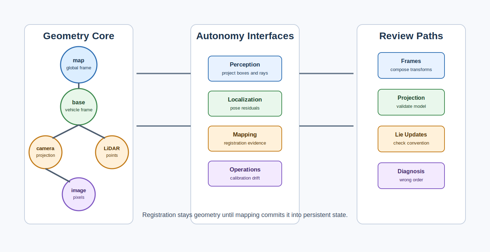

# 3D Geometry Foundations for Autonomy

<!-- kb-visual:start -->

*Visual: section-level autonomy-role diagram showing 3D geometry foundations, autonomy problem classes, stack interfaces, reading paths, and failure diagnosis.*
<!-- kb-visual:end -->

## Why This Foundation Exists

3D geometry gives autonomy a shared language for where things are. Cameras, LiDAR, IMUs, maps, vehicle bodies, and image planes all report measurements in different coordinate systems; autonomy only works when those measurements are transformed, projected, calibrated, and compared under explicit frame conventions.

This foundation exists so reviews can separate perception quality from geometric bookkeeping. A detector, localizer, or calibration pipeline can look wrong because the model failed, but it can also look wrong because a transform was inverted, a projection model was used outside its assumptions, or a registration result was treated as map truth too early.

## What This Field Studies From First Principles

3D geometry studies coordinate frames, rigid transforms, projective cameras, Lie groups, sensor geometry, calibration observability, correspondence search, and point-cloud registration. It explains how physical measurements become rays, points, poses, residuals, and constraints.

The first-principles questions are concrete: what frame is each quantity expressed in, what transform composes the chain, what projection or measurement model is valid, what perturbation convention is used, and what motions make calibration or registration observable.

## Autonomy Problem Map

Geometry connects perception, localization, mapping, calibration operations, and runtime diagnostics. It consumes sensor measurements, timestamps, intrinsics, extrinsics, poses, map frames, and correspondences. It produces projected boxes, reprojection residuals, transform trees, registration corrections, calibration reports, and frame-contract evidence.

The autonomy risk is spatial inconsistency. When map, base, sensor, and image frames disagree, downstream modules may debug the wrong subsystem because every output is plausible in its own frame but wrong in the shared one.

## Core Mental Model

Think in transform chains. Every measurement should have a source frame, a target frame, a timestamp, a projection or lifting model, and a residual definition that makes the comparison meaningful.

The practical model is: `frame convention -> timestamped transform -> sensor model -> projection or registration -> residual -> consuming interface`. Failures usually enter through an implicit convention, stale transform, invalid projection assumption, unobservable calibration motion, or registration result promoted beyond what the data supports.

## What This Foundation Lets You Review

- Are map, odom, base, sensor, and image frames named and composed in the intended order?
- Is the projection or lifting model valid for the camera, LiDAR, rolling-shutter, thermal, or event sensor regime?
- Are Lie updates, Jacobians, and perturbation conventions consistent across optimization and estimation code?
- Does the calibration or registration dataset contain motions that make the target parameters observable?
- Is a registration correction still geometry, or has it been committed into persistent map state with the right ownership?

## Problem-Class Coverage

| Problem Class | Role Of This Foundation | Representative Applied Pages |
|---|---|---|
| Perception and scene understanding | primary - geometry owns projection, lifting, ray construction, box pose conventions, and sensor-to-image alignment used to interpret detections. | [Geometric Sensor Fusion](../../30-autonomy-stack/perception/overview/fusion-geometric.md) - debug projected boxes, masks, or point associations that fail because frame contracts differ. |
| Localization, SLAM, and state estimation | supporting - estimators own the evolving state, but geometry defines transforms, reprojection residuals, and pose perturbations they optimize. | [VINS-Mono and VINS-Fusion](../../30-autonomy-stack/localization-mapping/slam-methods/vins-mono-vins-fusion.md) - review visual-inertial residuals when pose updates are plausible but frame composition is wrong. |
| Mapping and spatial memory | supporting - registration geometry aligns measurements before mapping decides what becomes persistent spatial memory. | [VINS-Mono and VINS-Fusion](../../30-autonomy-stack/localization-mapping/slam-methods/vins-mono-vins-fusion.md) - debug map-aligned trajectories where registration evidence has been overtrusted. |
| Prediction and world modeling | supporting - prediction consumes geometry-normalized actors and scene coordinates, but does not own transform math. | [Geometric Sensor Fusion](../../30-autonomy-stack/perception/overview/fusion-geometric.md) - review whether actor histories are expressed in stable frames before forecasting. |
| Planning and decision making | supporting - planners depend on consistent map and vehicle frames for drivable corridors, obstacle locations, and maneuver constraints. | [VINS-Mono and VINS-Fusion](../../30-autonomy-stack/localization-mapping/slam-methods/vins-mono-vins-fusion.md) - debug planning offsets that trace back to localization-frame drift. |
| Control and actuation | supporting - control consumes pose and trajectory references after geometry has made frames and projections consistent. | [Sensor Calibration Fleet Operations](../../40-runtime-systems/software-operations/sensor-calibration-fleet-ops.md) - review whether calibration drift creates control-facing reference offsets. |
| Safety, validation, and assurance | primary - safety evidence needs reproducible frame, projection, calibration, and registration assumptions. | [Sensor Calibration Fleet Operations](../../40-runtime-systems/software-operations/sensor-calibration-fleet-ops.md) - debug release blockers caused by calibration observability gaps or frame-contract regressions. |
| Runtime systems and operations | supporting - operations monitors transforms, timestamps, calibration freshness, and projection residuals in fleet logs. | [Sensor Calibration Fleet Operations](../../40-runtime-systems/software-operations/sensor-calibration-fleet-ops.md) - review fleet incidents where a correct detector appears spatially misaligned. |

## Reading Paths By Task

For frame and pose debugging, start with [Coordinate Frames, Projections, and SE(3)](coordinate-frames-projections-se3.md), then read [Lie Groups, SE(3), SO(3), and Jacobians](lie-groups-se3-so3-jacobians.md), then connect the result to [Geodesy, Map Projections, and Datums](geodesy-map-projections-datums.md).

For camera and projection issues, read [Camera Projective Geometry, PnP, and Triangulation](camera-projective-geometry-pnp-triangulation.md), then [Camera Imaging, Noise, and Calibration](camera-imaging-noise-calibration.md).

For calibration and registration reviews, read [Multi-Sensor Calibration Observability](multi-sensor-calibration-observability.md), [Sensor Calibration and Time Synchronization](sensor-calibration-time-synchronization.md), and [Point Cloud Registration Math: ICP, NDT, and GICP](point-cloud-registration-math-icp-ndt-gicp.md). For the operational handoff before algorithms consume calibrated data, use [Sensor-to-Algorithm Readiness Contract](../../20-av-platform/sensors/sensor-to-algorithm-readiness-contract.md).

For GLIM/GTSAM pipeline work, use the [GLIM and GTSAM Pipeline Hub](../../30-autonomy-stack/localization-mapping/slam-methods/glim-gtsam-pipeline-hub.md) to connect SE(3), scan registration geometry, IMU preintegration, Hessian diagnostics, and GTSAM factor construction.

For learned 3D perception and reconstruction geometry, read [PointPillars](pointpillars.md), [3D Object Detection Losses and Assignment](3d-object-detection-losses-assignment-first-principles.md), [Point Cloud Segmentation Losses and Metrics](point-cloud-segmentation-losses-metrics-first-principles.md), [Volume Rendering, Radiance Fields, and Gaussian Splatting](volume-rendering-radiance-fields-gaussian-splatting.md), and [Feed-Forward 3D Reconstruction and Splatting](feed-forward-3d-reconstruction-and-splatting.md).

## Dependency Map

Geometry depends on sensors for measurement formation, signal processing for timing and filtering assumptions, probability for residual and noise semantics, optimization for solving calibration and registration objectives, and numerical linear algebra for rank and conditioning.

Downstream, it feeds perception, state estimation, mapping, planning, calibration operations, and safety review. The dependency review should ask where a geometric result changes ownership: a registration correction remains geometry until mapping commits it into persistent state, while a pose estimate becomes state estimation once it is fused into a time-evolving latent state.

## Interfaces, Artifacts, and Failure Modes

Core artifacts include transform trees, frame convention documents, camera intrinsics, sensor extrinsics, projection models, point clouds, correspondences, reprojection residuals, calibration covariance, registration residuals, and timestamp alignment logs.

Diagnostic case: A correct detector appears misaligned because map, base, sensor, and image-frame transforms are composed in the wrong order.

Common failure modes include inverted transforms, left/right perturbation mismatches, stale extrinsics, invalid projection assumptions, weak calibration excitation, point-cloud registration local minima, geodetic datum mismatch, rolling-shutter distortion, and treating a geometric alignment as a validated map update.

## Boundaries With Neighboring Foundations

- Owns: frames, transforms, projection, Lie geometry, sensor geometry, calibration geometry, and registration geometry.
- Hands off to: mapping for persistent representation, state estimation for time-evolving latent state, and optimization for nonlinear step policy.
- Does not own: persistent map state or estimator state management after geometric evidence has been committed or fused.
- Diagnostic logic: if the failure is caused by transform order, projection validity, calibration observability, or registration residual geometry, debug here; if the aligned result has already become map state, continue in mapping, and if it is fused through prediction/update over time, continue in state estimation.

## Pages In This Section

Coordinate systems, projection, and pose:

- [Coordinate Frames, Projections, and SE(3)](coordinate-frames-projections-se3.md)
- [Lie Groups, SE(3), SO(3), and Jacobians](lie-groups-se3-so3-jacobians.md)
- [Geodesy, Map Projections, and Datums](geodesy-map-projections-datums.md)

Sensor measurement geometry:

- [Camera Imaging, Noise, and Calibration](camera-imaging-noise-calibration.md)
- [Camera Projective Geometry, PnP, and Triangulation](camera-projective-geometry-pnp-triangulation.md)
- [LiDAR Working Principles and Noise Models](lidar-working-principles-noise-models.md)
- [Event and Thermal Camera Models](event-thermal-camera-models.md)
- [Rolling Shutter, LiDAR Deskew, and Motion Distortion](rolling-shutter-lidar-deskew-motion-distortion.md)

Calibration, timing, correspondence, and registration:

- [Sensor Calibration and Time Synchronization](sensor-calibration-time-synchronization.md)
- [Multi-Sensor Calibration Observability](multi-sensor-calibration-observability.md)
- [Correspondence Search and Data Structures](correspondence-search-data-structures.md)
- [Point Cloud Registration Math: ICP, NDT, and GICP](point-cloud-registration-math-icp-ndt-gicp.md)

Point-cloud perception and learned 3D representations:

- [3D Object Detection Losses and Assignment](3d-object-detection-losses-assignment-first-principles.md)
- [Point Cloud Segmentation Losses and Metrics](point-cloud-segmentation-losses-metrics-first-principles.md)
- [PointPillars](pointpillars.md)
- [Volume Rendering, Radiance Fields, and Gaussian Splatting](volume-rendering-radiance-fields-gaussian-splatting.md)
- [Feed-Forward 3D Reconstruction and Splatting](feed-forward-3d-reconstruction-and-splatting.md)

## Core Sources

This overview synthesizes the section pages listed above; no additional external sources were used.
