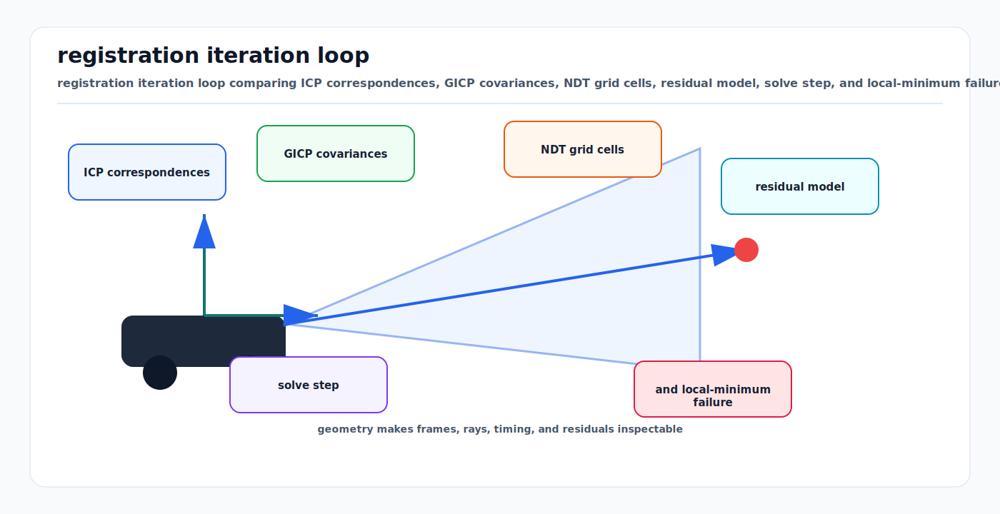

# Point Cloud Registration Math: ICP, GICP, VGICP, and NDT

<!-- kb-visual:start -->


*Visual: registration iteration loop comparing ICP correspondences, GICP covariances, NDT grid cells, residual model, solve step, and local-minimum failure.*
<!-- kb-visual:end -->

Point cloud registration estimates the rigid transform that aligns one scan or
submap to another. The core problem is geometric maximum likelihood under
uncertain correspondences. ICP assigns nearest-neighbor correspondences and
optimizes a distance metric. GICP adds local surface covariance. VGICP
voxelizes GICP-style distributions for speed. NDT represents space as voxel
Gaussians and optimizes the probability of transformed points under those
distributions.

---

## 1. Related Docs

- [LiDAR Working Principles and Noise Models](lidar-working-principles-noise-models.md)
- [Correspondence Search Data Structures](correspondence-search-data-structures.md)
- [Lie Groups SE(3), SO(3), Adjoints, and Jacobians](lie-groups-se3-so3-jacobians.md)
- [Coordinate Frames, Projections, and SE(3)](coordinate-frames-projections-se3.md)

---

## 2. Why It Matters for AV, Perception, SLAM, and Mapping

| Workflow | Registration role | Risk if wrong |
|---|---|---|
| LiDAR odometry | Register current scan to previous scan or local map. | Drift grows in corridors, flat roads, rain, or dynamic traffic. |
| Localization | Match live LiDAR to prior map. | Vehicle localizes to a nearby but incorrect lane or structure. |
| HD mapping | Align passes into consistent submaps. | Ghost curbs, duplicated poles, and blurred lane boundaries. |
| Multi-sensor calibration | Align overlapping LiDARs or depth sensors. | Extrinsic bias propagates into fusion and labeling. |
| Change detection | Compare live scan to map. | Registration residual is mistaken for scene change. |

---

## 3. Core Math

### 3.1 Rigid Registration Objective

Given source points `p_i` and target geometry, estimate:

```text
T = [R t] in SE(3)
q_i = R * p_i + t
```

The generic robust objective is:

```text
minimize_T sum_i rho( r_i(T)^T W_i r_i(T) )
```

where `r_i` is a point residual and `W_i` is an information matrix. The
optimization is performed by perturbing `T` on SE(3), usually:

```text
T_new = Exp(delta) * T
```

or:

```text
T_new = T * Exp(delta)
```

The Jacobian must match the chosen update convention.

### 3.2 Point-to-Point ICP

ICP alternates between correspondence assignment and pose optimization:

```text
c(i) = nearest_target(R * p_i + t)
minimize_T sum_i || R * p_i + t - q_c(i) ||^2
```

With fixed correspondences, the point-to-point least-squares solution can be
computed by centroids and SVD:

```text
p_bar = mean(p_i)
q_bar = mean(q_i)
H = sum_i (p_i - p_bar) (q_i - q_bar)^T
U S V^T = svd(H)
R = V U^T
t = q_bar - R p_bar
```

If `det(R) < 0`, the SVD solution must be corrected to avoid a reflection.

### 3.3 Point-to-Plane ICP

Point-to-plane ICP uses target normals:

```text
r_i = n_i^T (R * p_i + t - q_i)
minimize_T sum_i r_i^2
```

It converges faster on locally planar surfaces because it does not penalize
sliding along the plane as strongly as point-to-point ICP. It requires reliable
normal estimation.

### 3.4 GICP

Generalized ICP models each matched point as a local Gaussian distribution. The
residual is:

```text
d_i = q_i - T * p_i
C_i = C_target_i + R * C_source_i * R^T
cost_i = d_i^T inv(C_i) d_i
```

Planar neighborhoods receive anisotropic covariance: low variance normal to the
surface and high variance along the surface. This unifies point-to-point and
point-to-plane behavior under a probabilistic form.

### 3.5 VGICP

Voxelized GICP keeps the GICP cost form but replaces expensive point-wise
nearest-neighbor association with voxelized distribution association. Target
voxels aggregate means and covariances, and source distributions are evaluated
against nearby target voxel distributions. This reduces search cost and maps
well to parallel CPU and GPU implementations.

### 3.6 NDT

NDT partitions the target cloud into voxels. Each voxel stores:

```text
mu_v = mean(points in voxel)
Sigma_v = covariance(points in voxel)
```

For a transformed source point `q_i = T * p_i`, the cost is based on the
Gaussian likelihood of the voxel containing `q_i`:

```text
r_i = q_i - mu_v
cost_i = r_i^T inv(Sigma_v) r_i
```

NDT avoids explicit nearest-neighbor point correspondences, but it depends
strongly on voxel resolution and sufficient points per voxel.

---

## 4. Algorithm Steps

### 4.1 ICP Family

1. Remove invalid returns and crop to the region that can overlap.
2. Deskew the source scan using ego-motion and timestamps.
3. Downsample with voxel grids while preserving edges or high-curvature points
   if the pipeline depends on them.
4. Estimate normals and covariances at an appropriate radius.
5. Initialize from odometry, IMU preintegration, GNSS/INS, or a global
   registration method.
6. Assign correspondences using nearest neighbor, projective association, or
   voxel association.
7. Reject outliers by distance, normal angle, range, semantic class, or robust
   loss.
8. Solve the SE(3) update and apply it consistently.
9. Repeat until update norm, cost change, or iteration budget stops.
10. Report fitness, inlier RMSE, overlap, Hessian condition, and final update
    norm.

### 4.2 NDT

1. Build a voxel grid over the target map.
2. Keep voxels with enough points to estimate stable covariance.
3. Regularize covariances to avoid singular matrices.
4. Transform source points into the target frame.
5. Look up the containing voxel or neighboring voxels.
6. Accumulate likelihood, gradient, and Hessian.
7. Optimize with Newton, Gauss-Newton, or line search.
8. Validate convergence with score, step length, and pose plausibility.

---

## 5. Implementation Notes

- Registration is local. A poor initial guess can converge to a geometrically
  plausible but wrong alignment.
- Use multi-resolution matching: coarse voxels or downsampled clouds first,
  then fine alignment.
- Deskew spinning LiDAR scans before registration; otherwise the optimizer
  explains motion distortion as pose error.
- Remove dynamic objects or reduce their weight using semantics, tracking, or
  temporal persistence.
- Use robust losses and maximum correspondence distance tied to range noise and
  expected initialization error.
- Monitor Hessian eigenvalues. Flat roads, walls, tunnels, and open spaces can
  leave some degrees of freedom weakly constrained.
- Store final transform direction explicitly, for example `T_map_lidar`.
- For map localization, separate continuous odometry from global map correction
  so controllers do not receive discontinuous jumps.

---

## 6. Failure Modes and Diagnostics

| Symptom | Likely cause | Diagnostic |
|---|---|---|
| Converges to the wrong lane or wall. | Initialization outside basin of attraction or repeated geometry. | Run multiple seeds and compare score, overlap, and semantic consistency. |
| Strong yaw drift on flat roads. | Geometry weakly constrains yaw or normals are noisy. | Inspect Hessian eigenvalues and residuals by surface class. |
| Alignment looks good visually but map is blurred over time. | Small systematic extrinsic or deskew error. | Compare residual direction versus azimuth, range, and scan time. |
| NDT jumps between poses. | Voxel resolution too coarse or too fine. | Sweep resolution and plot score landscape around the estimate. |
| ICP slows or diverges in traffic. | Dynamic objects dominate correspondences. | Segment moving actors and compare registration with and without them. |
| Point-to-plane residual is biased near edges. | Normals estimated across discontinuities. | Visualize normals and reject high-curvature or mixed-neighborhood points. |

---

## 7. Sources

- P. J. Besl and N. D. McKay, "A Method for Registration of 3-D Shapes": https://doi.org/10.1117/12.57955
- Szymon Rusinkiewicz and Marc Levoy, "Efficient Variants of the ICP Algorithm": https://www.cs.princeton.edu/~smr/papers/fasticp/fasticp_paper.pdf
- Aleksandr Segal, Dirk Haehnel, and Sebastian Thrun, "Generalized-ICP": https://www.robots.ox.ac.uk/~avsegal/resources/papers/Generalized_ICP.pdf
- Kenji Koide et al., "Voxelized GICP for Fast and Accurate 3D Point Cloud Registration": https://staff.aist.go.jp/k.koide/assets/pdf/icra2021_02.pdf
- Peter Biber and Wolfgang Strasser, "The Normal Distributions Transform: A New Approach to Laser Scan Matching": https://www.researchgate.net/publication/4045903_The_Normal_Distributions_Transform_A_New_Approach_to_Laser_Scan_Matching
- PCL Normal Distributions Transform tutorial: https://pcl-docs.readthedocs.io/en/latest/pcl/doc/tutorials/content/normal_distributions_transform.html
- PCL GeneralizedIterativeClosestPoint documentation: https://pointclouds.org/documentation/classpcl_1_1_generalized_iterative_closest_point.html
- Open3D ICP registration tutorial: https://www.open3d.org/docs/release/tutorial/pipelines/icp_registration.html
