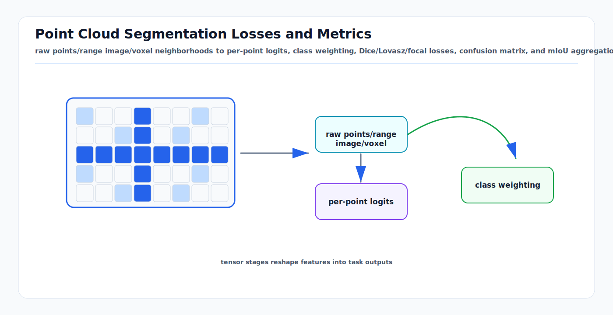

# Point Cloud Segmentation Losses and Metrics: First Principles

<!-- kb-visual:start -->


*Visual: raw points/range image/voxel neighborhoods to per-point logits, class weighting, Dice/Lovasz/focal losses, confusion matrix, and mIoU aggregation.*
<!-- kb-visual:end -->

Point cloud segmentation assigns a class label to each point, voxel, range-image
pixel, or fused map element. The core difficulty is not just 3D geometry. It is
the mismatch between training tensors, irregular sensor sampling, severe class
imbalance, ignored labels, and metrics such as mean intersection over union
that care about rare classes as much as common ones.

---

## Related Docs

- [PointPillars: First Principles](pointpillars.md)
- [Sparse Attention for 3D Perception](../machine-learning/sparse-attention-3d-perception.md)
- [Logistic, Softmax, and Cross Entropy](../machine-learning/logistic-softmax-cross-entropy.md)
- [Detection Theory: ROC, PR, and Operating Points](../probability-statistics/detection-theory-roc-pr-operating-points.md)

---

## Why It Matters

| Choice | Effect | Risk if wrong |
|---|---|---|
| Representation | Raw points, range image, voxels, pillars, or BEV. | Metric hides projection holes or voxel aliasing. |
| Sampling | Selects neighborhoods and batch points. | Rare classes disappear from gradients. |
| Loss | Defines per-point learning pressure. | Background dominates or small objects fragment. |
| Ignore policy | Excludes unlabeled or ambiguous points. | Model is punished for label uncertainty. |
| Metric | Summarizes confusion matrix. | High pixel/point accuracy with unsafe rare-class misses. |

---

## Tensor Pipeline

The model does not usually operate on a pure unordered set for the whole scene.
It first converts raw measurements into a computational structure:

```text
raw points (x, y, z, intensity, time)
  -> range image, voxel grid, pillar grid, sparse tensor, or point neighborhoods
  -> local feature aggregation
  -> per-point or per-cell logits
  -> projection back to original points if needed
```

Loss and metrics should be computed in the same label space. If the network
predicts on voxels but the benchmark evaluates original points, the projection
back to points is part of the model behavior and must be validated.

---

## Per-Point Classification

For point `i` and class `c`, logits `s_ic` become probabilities:

```text
p_ic = exp(s_ic) / sum_k exp(s_ik)
```

Weighted cross entropy is:

```text
L_ce = - sum_i w_yi log p_i,yi
```

Class weights compensate for imbalance, but they can also over-amplify noisy
rare labels. Weights should be computed from the training distribution and then
checked against gradient magnitudes.

Focal loss is useful when easy background points dominate:

```text
L_focal = - alpha_y (1 - p_i,yi)^gamma log p_i,yi
```

It changes which examples matter most; it does not replace a correct ignore
mask or balanced sampling strategy.

---

## Overlap Losses

Segmentation metrics are overlap based, so many systems add Dice or Lovasz
losses.

For one class:

```text
Dice = (2 TP + eps) / (2 TP + FP + FN + eps)
L_dice = 1 - Dice
```

Generalized Dice changes class weights to reduce domination by large classes.
Lovasz-Softmax is a convex surrogate built around sorted per-class errors and
is designed to optimize intersection-over-union more directly than pointwise
cross entropy.

Practical rule:

```text
L = L_ce_or_focal + lambda_overlap L_dice_or_lovasz
```

Use the overlap term to align training with mIoU, but keep cross entropy or
focal loss for stable per-point calibration.

---

## Confusion Matrix and mIoU

For `K` classes, build a confusion matrix over non-ignored points:

```text
C_ab = number of points with ground truth class a and predicted class b
```

For class `k`:

```text
TP_k = C_kk
FN_k = sum_b C_kb - C_kk
FP_k = sum_a C_ak - C_kk

IoU_k = TP_k / (TP_k + FP_k + FN_k)
mIoU = mean_k IoU_k
```

Overall accuracy can be high when road or building points dominate. mIoU makes
small classes visible, but it is noisy for extremely rare classes. Report both
mIoU and classwise IoU, and always show the confusion matrix for safety review.

---

## Implementation Notes

- Apply ignore masks before both loss and metrics. Do not let unlabeled points
  become background.
- Preserve original point indices through voxelization or range projection so
  metrics can be computed on the benchmark point set.
- Track class frequency before and after augmentation, sampling, and cropping.
- Evaluate range bands separately. Far points are sparse and often dominate
  missed-object risk.
- Separate static labels from moving labels if the dataset uses both.
- Calibrate logits if segmentation probabilities feed mapping or planning.
- Keep a "void/unknown" policy explicit at the map boundary.

---

## Failure Modes

| Symptom | Likely cause | Diagnostic |
|---|---|---|
| High accuracy, low mIoU. | Background or road dominates. | Inspect classwise IoU and confusion matrix. |
| Small objects vanish. | Sampling or loss ignores rare points. | Count rare-class points per batch. |
| Boundary shimmer. | Voxel/range projection loses detail. | Compare raw point labels with projected predictions. |
| Moving classes confused with static classes. | Temporal labels or aggregation policy mismatched. | Evaluate moving/static classes separately. |
| Map fusion becomes overconfident. | Softmax scores are uncalibrated. | Reliability diagram per class and range. |
| Lovasz improves mIoU but hurts safety. | Rare class tradeoff hidden in mean. | Review per-class precision and recall, not only mIoU. |

---

## Sources

- Qi et al., "PointNet: Deep Learning on Point Sets for 3D Classification and Segmentation": https://arxiv.org/abs/1612.00593
- Qi et al., "PointNet++: Deep Hierarchical Feature Learning on Point Sets in a Metric Space": https://arxiv.org/abs/1706.02413
- Behley et al., "SemanticKITTI: A Dataset for Semantic Scene Understanding of LiDAR Sequences": https://arxiv.org/abs/1904.01416
- Berman, Triki, and Blaschko, "The Lovasz-Softmax loss": https://arxiv.org/abs/1705.08790
- Sudre et al., "Generalised Dice overlap as a deep learning loss function for highly unbalanced segmentations": https://arxiv.org/abs/1707.03237
- Lin et al., "Focal Loss for Dense Object Detection": https://arxiv.org/abs/1708.02002
- Hu et al., "RandLA-Net: Efficient Semantic Segmentation of Large-Scale Point Clouds": https://arxiv.org/abs/1911.11236
- Cortinhal, Tzelepi, and Aksoy, "SalsaNext": https://arxiv.org/abs/2003.03653
