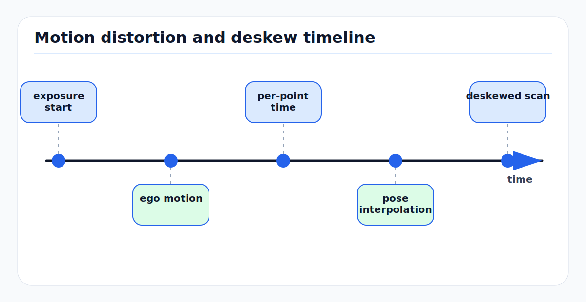

# Rolling Shutter, LiDAR Deskew, and Motion Distortion

Motion distortion happens when a sensor frame is treated as instantaneous even
though its samples were acquired over time. A rolling-shutter image is not one
camera pose; each row has a different exposure time. A spinning or scanning
LiDAR cloud is not one LiDAR pose; each point has a different firing time.

Deskewing is the act of transforming each sample from its acquisition pose into
a common reference time. It is simple in concept and easy to get subtly wrong:
the output quality depends on timestamp truth, motion interpolation, frame
conventions, extrinsics, and the difference between ego-motion and independently
moving objects.

---

<!-- kb-figure:start -->


*Figure: how rolling cameras and spinning LiDARs require per-row or per-point pose correction during vehicle motion.*
<!-- kb-figure:end -->

## 1. Related Docs

- [Continuous-Time Trajectory Splines and Gaussian Process Priors](../state-estimation/continuous-time-trajectory-splines-gp-priors.md)
- [Sensor Calibration and Time Synchronization Fundamentals](sensor-calibration-time-synchronization.md)
- [LiDAR Working Principles and Noise Models](lidar-working-principles-noise-models.md)
- [Point Cloud Registration Math: ICP, NDT, and GICP](point-cloud-registration-math-icp-ndt-gicp.md)
- [Coordinate Frames, Projections, and SE(3)](coordinate-frames-projections-se3.md)
- [IMU Error Models and Preintegration](../state-estimation/imu-error-models-preintegration.md)
- [Time Synchronization Error Budgets](../systems-engineering/time-synchronization-error-budgets.md)

---

## 2. One Principle

Every measurement belongs at its acquisition time:

```text
z_i was measured at t_i
```

If the platform pose is `T_WB(t)` and the sensor extrinsic is `T_BS`, a point
measured in sensor coordinates at time `t_i` is:

```text
p_W(t_i) = T_WB(t_i) * T_BS * p_Si
```

To express the point in a reference sensor frame at time `t_ref`:

```text
p_Sref = T_SB * T_BW(t_ref) * T_WB(t_i) * T_BS * p_Si
```

That is deskewing. Everything else is how to estimate `T_WB(t_i)` accurately
enough.

---

## 3. Rolling-Shutter Cameras

A global-shutter camera exposes all pixels at one time. A rolling-shutter camera
exposes rows sequentially. If row `v` is read at time:

```text
t(v) = t_frame + (v - v0) * t_row
```

then projection should use:

```text
u = pi( T_CW(t(v)) * P_W )
```

not a single frame pose. During yaw, a vertical pole can appear slanted. During
translation, nearby and far objects distort differently because parallax changes
across rows.

Rolling-shutter effects scale with:

```text
image_error ~= angular_rate * readout_time * focal_length
```

and with translation-induced parallax for close structure.

### Practical Rolling-Shutter Models

| Model | Assumption | Use |
|---|---|---|
| constant velocity during frame | short exposure, smooth motion | visual odometry and bundle adjustment |
| IMU-integrated pose per row | reliable IMU timing/extrinsics | visual-inertial systems |
| continuous-time spline/GP | batch calibration or offline SLAM | rolling-shutter calibration and high accuracy |
| learned correction | model absorbs residual distortion | perception-only pipelines, weaker geometry guarantees |

---

## 4. LiDAR Motion Distortion

Many 3D LiDARs assemble a "scan" over tens to hundreds of milliseconds. A
vehicle moving during the scan bends the point cloud. The issue is visible when:

- walls curve during turns,
- poles become duplicated,
- road edges smear,
- scan-to-map registration needs different corrections at different azimuths,
- high-speed actors appear stretched because object motion is mixed with ego
  motion.

For a rotating LiDAR with scan period `T_scan`, a simple relative time from
azimuth may be:

```text
alpha_i = unwrap(azimuth_i - azimuth_start) / (2*pi)
t_i = t_scan_start + alpha_i * T_scan
```

Modern sensors may provide per-point timestamps, firing offsets, channel timing,
or packet timing. Prefer those over reconstructing time from angle.

---

## 5. Deskew From Ego-Motion

Given a reference time `t_ref`, often scan start, scan end, or scan midpoint:

```text
Delta_T_i_ref = T_SW(t_ref) * T_WS(t_i)
p_ref_i = Delta_T_i_ref * p_i
```

If the state is available at discrete times, interpolate on `SE(3)`:

```text
T(t_i) = T_a * Exp( alpha * Log(T_a^-1 T_b) )
alpha = (t_i - t_a) / (t_b - t_a)
```

For small scan intervals, constant body velocity is also common:

```text
T(t_i) = T(t_ref) * Exp( xi_hat * (t_i - t_ref) )
```

where `xi_hat` is body-frame twist. This is only valid when angular velocity and
linear velocity are approximately constant during the scan.

### Deskew Reference Time

| Reference | Advantage | Risk |
|---|---|---|
| scan start | simple for packet order | latest points move most |
| scan end | convenient for odometry update | earliest points move most |
| scan midpoint | minimizes max interpolation distance | may not match driver timestamp |
| measurement time per residual | best for continuous-time optimization | more expensive |

The reference choice must be documented because downstream transforms and
registration residuals depend on it.

---

## 6. Ego-Motion vs Object Motion

Deskewing with ego-motion assumes the world is static:

```text
p_W for a static surface is constant
```

For a moving vehicle or pedestrian:

```text
p_W(t_i) = p_W(t_ref) + v_object * (t_i - t_ref)
```

Ego deskew can make static background sharper while stretching moving objects.
That is not a bug in ego deskew; it is a missing object-motion model. Perception
systems may need:

- dynamic object masking before mapping,
- per-object velocity compensation,
- track-aware accumulation,
- short temporal windows for moving classes,
- different deskew policy for detection input versus static mapping input.

---

## 7. How It Appears in SLAM and Mapping

| Pipeline stage | Distortion impact |
|---|---|
| feature extraction | edges and planes are selected from bent geometry |
| scan-to-scan odometry | one rigid transform cannot align a distorted scan |
| scan-to-map matching | residuals become structured with azimuth/time |
| loop closure | historical maps contain scan-shape artifacts |
| TSDF/occupancy mapping | surfaces thicken and dynamic actors leave ghosts |
| camera-LiDAR fusion | projected points shift by row/point timestamp |
| radar fusion | ego velocity compensation uses wrong acquisition time |

LOAM-style systems explicitly handle the fact that LiDAR points in one scan are
received at different times. LIO systems such as LIO-SAM use IMU propagation to
deskew point clouds before feature extraction and registration.

---

## 8. Common Failure Modes

| Symptom | Likely cause | Check |
|---|---|---|
| walls bend during turns | no deskew or wrong angular velocity | color points by relative time |
| scan is sharp when driving straight but bad in turns | rotation deskew missing or sign wrong | replay turn-in-place data |
| distortion grows with speed | timestamp offset or translation not modeled | plot residual vs speed |
| cloud jumps at packet boundary | packet timestamp interpreted as point timestamp | inspect per-ring time continuity |
| vertical poles split into two | wrong reference time or yaw interpolation | compare start/mid/end reference outputs |
| deskew worsens the cloud | wrong extrinsic, frame direction, or time base | test static scene with controlled motion |
| moving cars become smeared | ego-only deskew applied to dynamic objects | mask or track dynamic classes |
| rolling-shutter calibration unstable | low excitation or wrong readout time | use sequences with rotations and known target |

---

## 9. Implementation Checklist

- Record sensor acquisition timestamps, not only host receipt timestamps.
- Preserve per-point relative time in point cloud fields when available.
- Verify LiDAR firing order, ring/channel order, return mode, and scan boundary.
- Define whether the published cloud is expressed at scan start, midpoint, end,
  or another time.
- Use hardware time synchronization where possible; software arrival timestamps
  are usually insufficient for high-speed motion.
- Interpolate poses on `SE(3)` and keep left/right multiplication conventions
  explicit.
- Include LiDAR/camera-to-IMU extrinsics in the deskew transform chain.
- Deskew before estimating geometric features that assume rigid structure.
- Plot point residuals by relative scan time after scan-to-map alignment.
- Test with a static scene, a turn-in-place, hard braking, and a moving object.
- Keep raw clouds for debugging; irreversible deskew hides timing mistakes.
- Do not insert dynamic-object deskewed points into a long-term static map
  without filtering.

---

## 10. Minimal Pseudocode

```text
for point in scan:
    t_i = scan_start_time + point.relative_time
    T_WS_i = query_pose_sensor(t_i)
    T_WS_ref = query_pose_sensor(t_ref)
    point_ref = inverse(T_WS_ref) * T_WS_i * point.sensor_xyz
    output.add(point_ref)
```

If `query_pose_sensor(t)` silently extrapolates far beyond its support interval,
the deskewer will produce plausible but wrong clouds. Treat extrapolation as a
fault unless the estimator explicitly supports it.

---

## 11. Sources

- Paul Furgale, Timothy D. Barfoot, and Gabe Sibley, "Continuous-Time Batch Estimation using Temporal Basis Functions": https://furgalep.github.io/bib/furgale_icra12.pdf
- Christian Kerl et al., "Dense Continuous-Time Tracking and Mapping": https://www.cv-foundation.org/openaccess/content_iccv_2015/papers/Kerl_Dense_Continuous-Time_Tracking_ICCV_2015_paper.pdf
- Ji Zhang and Sanjiv Singh, "LOAM: Lidar Odometry and Mapping in Real-time": https://publications.ri.cmu.edu/storage/publications/pub_files/2014/7/Ji_LidarMapping_RSS2014_v8.pdf
- Tixiao Shan et al., "LIO-SAM: Tightly-coupled Lidar Inertial Odometry via Smoothing and Mapping": https://arxiv.org/abs/2007.00258
- Autoware Universe `distortion_corrector` documentation: https://autowarefoundation.github.io/autoware_universe/pr-9482/sensing/autoware_pointcloud_preprocessor/docs/distortion-corrector/
- ETH ASL LiDAR undistortion package: https://github.com/ethz-asl/lidar_undistortion
