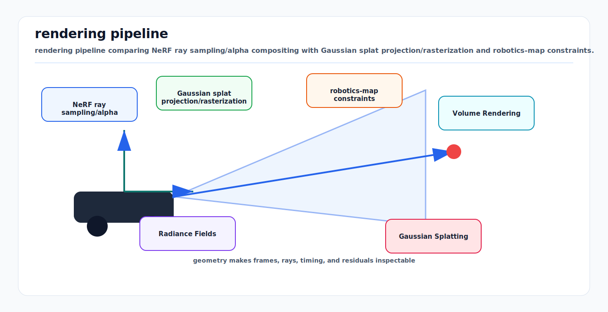

# Volume Rendering, Radiance Fields, and Gaussian Splatting

<!-- kb-visual:start -->


*Visual: rendering pipeline comparing NeRF ray sampling/alpha compositing with Gaussian splat projection/rasterization and robotics-map constraints.*
<!-- kb-visual:end -->

Classical mapping often asks for surfaces: points, planes, meshes, occupancy, or
signed distance. Neural and differentiable rendering methods ask a different
question: what color would a camera ray see if the scene were represented as a
continuous field of density and radiance?

NeRF and 3D Gaussian Splatting are not magic replacements for geometry. They are
image-formation models. Their strength is photorealistic view synthesis and
differentiable optimization from images. Their weakness is that radiance,
density, exposure, camera pose, dynamics, and geometry can explain each other
unless the capture and priors are controlled.

---

## 1. Related Docs

- [Camera Projective Geometry, PnP, and Triangulation](camera-projective-geometry-pnp-triangulation.md)
- [Camera Imaging, Noise, and Calibration](camera-imaging-noise-calibration.md)
- [Coordinate Frames, Projections, and SE(3)](coordinate-frames-projections-se3.md)
- [Volumetric Map Representations: TSDF, ESDF, Octrees, and Surfels](../mapping/volumetric-map-representations-tsdf-esdf-octree-surfels.md)
- [Nonlinear Least Squares from First Principles](../optimization/nonlinear-least-squares-first-principles.md)
- [Backpropagation, Computational Graphs, and Autodiff](../machine-learning/backprop-computational-graphs-autodiff.md)
- [Positional Encodings and Coordinate Tokenization](../machine-learning/positional-encodings-and-coordinate-tokenization-first-principles.md)

---

## 2. Volume Rendering From First Principles

A camera ray is:

```text
r(s) = o + s d
```

where `o` is camera center, `d` is ray direction, and `s` is distance along the
ray. A radiance field predicts:

```text
sigma(x) = volume density
c(x, d)  = emitted/reflected color toward direction d
```

The probability that light reaches distance `s` without being absorbed is
transmittance:

```text
T(s) = exp( - integral_s_near^s sigma(r(u)) du )
```

The rendered color is:

```text
C(r) = integral_s_near^s_far T(s) sigma(r(s)) c(r(s), d) ds
```

Discrete alpha compositing approximates this with samples:

```text
alpha_i = 1 - exp(-sigma_i delta_i)
T_i = product_j<i (1 - alpha_j)
C = sum_i T_i alpha_i c_i
```

This is the core of NeRF-style rendering and also the conceptual bridge to
Gaussian splatting alpha compositing.

---

## 3. NeRF

NeRF represents the field with a neural network:

```text
(sigma, color) = MLP( gamma(x), gamma(d) )
```

where `gamma` is a positional encoding that helps the MLP represent high
frequency detail. Training minimizes photometric reconstruction error over known
camera poses:

```text
min_theta sum_pixels || C_pred(r; theta) - C_image ||^2
```

The original NeRF pipeline depends on:

- calibrated images,
- camera poses, often from structure-from-motion,
- static scenes or explicit dynamic modeling,
- many rays and samples per ray,
- differentiable rendering through the volume integral.

### What NeRF Learns

NeRF does not directly learn a mesh. It learns density and view-dependent color.
Geometry is often inferred from density peaks or converted to a mesh later. This
is why NeRF can render compelling views while still having imperfect metric
geometry, floaters, or density in empty space.

---

## 4. 3D Gaussian Splatting

3D Gaussian Splatting represents a scene as many anisotropic Gaussian primitives:

```text
G_k = { mean mu_k, covariance Sigma_k, opacity alpha_k, color coefficients }
```

The 3D Gaussian density has the shape:

```text
G_k(x) = exp( -0.5 * (x - mu_k)^T Sigma_k^-1 (x - mu_k) )
```

Each Gaussian is projected into the image as an ellipse, sorted or otherwise
handled for visibility, then alpha-composited:

```text
C_pixel = sum_k T_k alpha_k c_k
T_k = product_j<k (1 - alpha_j)
```

The major practical change from NeRF is rendering speed. Instead of sampling an
MLP many times along every ray, 3DGS rasterizes optimized primitives. The
canonical 2023 method initializes from sparse SfM points, optimizes positions,
anisotropic covariances, opacity, and color, and performs density control by
splitting/pruning Gaussians.

---

## 5. Radiance Fields vs Robotics Maps

| Need | Radiance field / 3DGS | TSDF / ESDF / occupancy |
|---|---|---|
| photorealistic view synthesis | strong | weak to moderate |
| metric free-space guarantee | weak | strong if sensor model is correct |
| collision checking | indirect | direct with ESDF/occupancy |
| dynamic obstacle semantics | needs extra model | layered maps and trackers |
| online local planning | currently hard | standard |
| differentiable image supervision | strong | usually indirect |
| long-term map maintenance | active research | mature engineering patterns |

For autonomy, radiance fields are most useful as appearance-rich scene models,
simulation assets, map compression/reconstruction research, sensor simulation,
and perception pretraining context. They should not be treated as certified
collision maps without additional occupancy, uncertainty, and change-detection
machinery.

---

## 6. Pose, Calibration, and Scale

The rendering loss assumes the ray is correct:

```text
r = camera_ray(K, T_WC, pixel)
```

If intrinsics, extrinsics, rolling shutter, exposure, or pose are wrong, the
field can compensate by growing blurry density, duplicate surfaces, or view-
dependent color. Joint pose/radiance optimization is possible, but it changes
the problem into bundle adjustment with a very flexible scene prior.

Important pose failure modes:

- SfM scale ambiguity for monocular captures,
- rolling-shutter images treated as global shutter,
- moving objects baked into the static field,
- exposure/white-balance differences modeled as geometry,
- sparse camera baselines causing depth ambiguity,
- reflective/transparent surfaces violating simple radiance assumptions.

---

## 7. Practical Intuition

### NeRF

NeRF asks: "Along this ray, where is opacity and what color is emitted toward
this camera?" It is powerful because the renderer is differentiable and the
field is continuous. It is slow because many samples and network evaluations are
needed.

### 3D Gaussian Splatting

3DGS asks: "Which learned ellipsoids project into this pixel, and how do their
opacities and colors composite?" It is fast because rasterization handles many
primitives efficiently. It is less implicit than NeRF but still not a clean
surface map by default.

---

## 8. Implementation Checklist

- Start with calibrated images and reliable camera poses; inspect reprojection
  errors before training.
- Normalize scene scale and coordinate frames; document `T_world_camera`
  convention.
- Mask dynamic objects, mirrors, sky, and saturated regions when they would
  corrupt static geometry.
- Split train/test views by viewpoint, not adjacent frames only.
- Track photometric metrics and geometric diagnostics separately.
- For NeRF, tune near/far bounds and sampling so rays do not waste most samples
  in empty space.
- For 3DGS, monitor Gaussian count, opacity collapse, oversized covariances, and
  floaters.
- Use held-out camera paths to find overfitting to training views.
- Do not use a radiance field as a planner map unless occupancy/free-space
  semantics are explicitly derived and validated.
- Preserve original images, poses, masks, and training config for replayability.

---

## 9. Common Failure Modes

| Symptom | Likely cause |
|---|---|
| floaters in empty space | pose noise, insufficient views, weak density prior |
| blurry surfaces | pose/exposure mismatch or under-capacity field |
| duplicated geometry | dynamic objects, loop/pose error, rolling shutter |
| good novel views but bad mesh | radiance fits images without clean density zero crossing |
| transparent objects look wrong | simple volume model does not capture refraction/reflection |
| scale wrong | monocular pose source without metric scale |
| 3DGS splats explode in size | covariance optimization unconstrained or sparse views |
| simulator collisions wrong | appearance field used as geometry without occupancy validation |

---

## 10. How It Connects to Perception and Mapping

- View synthesis can create realistic validation views from captured sites.
- Differentiable rendering can supervise geometry or semantics from images.
- Radiance fields can enrich HD maps with appearance for localization research.
- Gaussian splats can provide fast, inspectable scene playback.
- Neural LiDAR/radiance mapping methods borrow volume-rendering ideas but still
  need range, occupancy, and uncertainty models for autonomy-grade planning.

The first-principles bridge is the measurement model. Classical SLAM predicts
features or ranges; radiance-field SLAM predicts pixels. Both optimize a state
so predicted measurements match observed measurements.

---

## 11. Sources

- Ben Mildenhall et al., "NeRF: Representing Scenes as Neural Radiance Fields for View Synthesis": https://arxiv.org/abs/2003.08934
- NeRF project page: https://www.matthewtancik.com/nerf
- Bernhard Kerbl et al., "3D Gaussian Splatting for Real-Time Radiance Field Rendering": https://repo-sam.inria.fr/fungraph/3d-gaussian-splatting/
- 3D Gaussian Splatting paper on arXiv: https://arxiv.org/abs/2308.04079
- Jonathan T. Barron et al., "Mip-NeRF: A Multiscale Representation for Anti-Aliasing Neural Radiance Fields": https://arxiv.org/abs/2103.13415
- Ricardo Martin-Brualla et al., "NeRF in the Wild": https://arxiv.org/abs/2008.02268
- Lee Westover, "Footprint Evaluation for Volume Rendering": https://dl.acm.org/doi/10.1145/97879.97901
