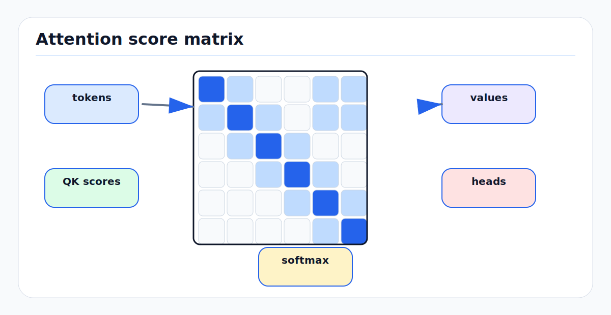

# Attention and Transformers: First Principles

<!-- kb-figure:start -->


*Figure: how token-to-token scores become normalized attention weights and multi-head feature mixing.*
<!-- kb-figure:end -->

## Scope

This note explains attention and transformer blocks from first principles for readers building AV perception, SLAM, mapping, and world-model systems. It is intentionally a foundation layer. For driving world-model transformer recipes, see [transformer-world-models.md](transformer-world-models.md). For point-cloud sparse attention, PTv3, BEVFormer, and Orin deployment detail, see [sparse-attention-3d-perception.md](sparse-attention-3d-perception.md). For sequence alternatives, see [sequence-models-rnn-ssm-attention-first-principles.md](sequence-models-rnn-ssm-attention-first-principles.md) and [mamba-ssm-for-driving.md](mamba-ssm-for-driving.md).

## 1. The Problem Attention Solves

Classical neural layers mix information with a fixed pattern:

- A convolution mixes nearby pixels or voxels through a fixed kernel.
- An RNN mixes a sequence through a fixed recurrence.
- A graph neural network mixes along pre-defined edges.

Attention instead lets each element choose which other elements matter for the current computation. A token can be a word, image patch, LiDAR point, BEV cell, map lane segment, object query, or pose-graph node. The attention layer computes a learned weighted average of other tokens, where the weights depend on content.

The core question is:

```text
For token i, which tokens j contain useful information for updating token i?
```

This is why attention is powerful for autonomy. A BEV cell can gather evidence from multiple cameras. A map element can attend to nearby curb observations. A track query can attend to detections from several frames. A loop-closure descriptor can compare against a memory bank of places.

## 2. Scaled Dot-Product Attention

Given input tokens `X` with shape `[n, d_model]`, learned linear projections produce:

```text
Q = X W_Q    queries, shape [n, d_k]
K = X W_K    keys,    shape [n, d_k]
V = X W_V    values,  shape [n, d_v]
```

The output is:

```text
Attention(Q, K, V) = softmax(Q K^T / sqrt(d_k)) V
```

Step by step:

1. `Q K^T` computes all pairwise query-key similarities.
2. Division by `sqrt(d_k)` keeps dot-product variance controlled.
3. Row-wise softmax turns similarities into weights that sum to 1.
4. Multiplication by `V` returns a weighted mixture of values.

For an AV reader, the query is "what am I looking for?", the key is "what do I contain?", and the value is "what information should I pass onward if selected?"

## 3. Why the `sqrt(d_k)` Scale Matters

If query and key components are roughly independent with unit variance, their dot product has variance proportional to `d_k`. As `d_k` grows, logits become large, softmax saturates, and gradients become small. Scaling by `sqrt(d_k)` keeps logits in a useful range.

This is not a cosmetic constant. Without it, larger heads are harder to train. With it, attention scores remain comparable as head dimensions change.

## 4. Multi-Head Attention

One attention head produces one relation pattern. Multi-head attention runs several heads in parallel:

```text
head_h = Attention(X W_Q_h, X W_K_h, X W_V_h)
MHA(X) = concat(head_1, ..., head_H) W_O
```

Heads can specialize:

- Local geometry: nearby image patches, nearby LiDAR points, adjacent BEV cells.
- Long-range context: a pedestrian near a crosswalk, an aircraft wing far from the fuselage origin.
- Temporal association: the same object across frames.
- Modality fusion: a LiDAR cluster attending to projected camera features.

In practice, head specialization is not guaranteed. It emerges when the architecture, positional encoding, loss, and data make the relations useful.

## 5. The Transformer Block

A modern pre-norm transformer block is:

```text
x = x + Attention(LayerNorm(x))
x = x + MLP(LayerNorm(x))
```

The attention layer mixes tokens. The MLP updates each token independently. Residual connections preserve gradient flow and let the block learn corrections instead of full transformations.

The MLP is often the largest compute block after attention. In modern large models, a gated MLP such as SwiGLU is common:

```text
MLP(x) = W_out( SiLU(W_gate x) * (W_value x) )
```

The split between token mixing and per-token transformation is central. Attention decides where information comes from; the MLP decides how to transform the gathered information.

## 6. Masks and Attention Types

Attention becomes different tools depending on its mask and source tokens.

| Type | Query tokens | Key/value tokens | Mask | AV use |
|---|---|---|---|---|
| Self-attention | Same sequence | Same sequence | None or structured | Image, BEV, point, map tokens |
| Causal self-attention | Same sequence | Same sequence | No future tokens | Forecasting, token world models |
| Cross-attention | Target queries | Source features | Usually none | BEV queries to camera features, object queries to backbone |
| Local/window attention | Same sequence | Local neighborhoods | Spatial window | Swin, PTv3, sparse 3D perception |
| Deformable attention | Learned reference queries | Sampled features | Sparse learned samples | Detection, BEV lifting, small objects |

Causal attention is essential for prediction: a future token must not see the target it is asked to predict. In AV forecasting, leakage can happen through time alignment, map updates, or labels derived from future frames. Masking the neural layer is necessary but not sufficient; the dataset pipeline must also be causal.

## 7. Positional Information

Attention by itself is permutation equivariant. If you shuffle tokens and shuffle them back after the layer, the result is unchanged. For language, vision, LiDAR, and maps, order and geometry matter, so the model needs position.

Common options:

- Absolute learned positions: a table indexed by token location.
- Sinusoidal positions: deterministic functions of location.
- Relative position bias: scores depend on offset between tokens.
- Rotary position embedding: rotates query/key channels as a function of position, making dot products encode relative position.
- Coordinate MLPs: encode continuous `x, y, z, t` coordinates.
- Pose-aware positions: encode ego-frame coordinates after motion compensation.

For AV systems, positional encoding is not a detail. It defines the coordinate frame in which the model reasons. A BEV transformer should know whether a cell is ego-centric, map-aligned, lane-aligned, or sensor-aligned. A SLAM model should not learn false invariance to global pose when loop closure depends on place identity.

## 8. Attention Cost Model

Full attention materializes or computes an `n x n` score matrix:

```text
Time:   O(n^2 d)
Memory: O(n^2)
```

This is manageable for 196 ViT patches, expensive for 4096 BEV cells, and impossible for 100000 LiDAR points without sparsity.

Examples:

```text
224x224 image with 16x16 patches: 14 * 14 = 196 tokens
128x128 BEV grid: 16384 tokens
120000 LiDAR points: 120000 tokens
```

This quadratic wall explains most efficient attention research in perception.

## 9. FlashAttention Is Exact, Not Approximate

FlashAttention keeps the same mathematical result as standard attention but changes how it is computed. Instead of writing the full attention matrix to high-bandwidth memory, it tiles Q, K, and V through on-chip SRAM and recomputes normalization statistics online.

The important lesson is hardware-aware:

```text
Wall-clock attention cost is often dominated by memory reads and writes,
not only floating-point operations.
```

For AV workloads, this matters because BEV and point-cloud token counts are high, and embedded GPUs are memory-bandwidth constrained. FlashAttention helps most when the attention pattern can be expressed as dense attention over well-shaped chunks. That is one reason PTv3 serialization is valuable: it converts local 3D neighborhoods into standard 1D windows compatible with optimized attention kernels.

## 10. Sparse and Structured Attention

Sparse attention replaces all-pairs comparison with a useful subset.

| Pattern | How tokens are selected | Strength | Risk |
|---|---|---|---|
| Fixed local window | Grid or sequence windows | Fast and simple | Misses long-range evidence |
| Shifted window | Alternating window offsets | Cross-window mixing | Still grid-biased |
| Deformable sampling | Learned offsets around references | Efficient dense prediction | Can miss evidence if references fail |
| Serialized 3D windows | Space-filling curve order | Efficient point-cloud locality | Order design matters |
| Top-k routing | Learned sparse routing | Adaptive compute | Harder to stabilize |
| Axial attention | Separate dimensions | Good for video/BEV | Factorization may miss interactions |

Sparse attention should match the physical structure. A local window works for texture. It is not enough for lane topology, aircraft clearance, or map-wide route context. A practical AV design often combines local geometric attention with a smaller set of global or semantic tokens.

## 11. Attention in SLAM and Mapping

Attention is useful when correspondence is ambiguous or context-dependent:

- Feature matching: image or point descriptors attend across candidate matches.
- Loop closure: a place token attends over map memory to find revisited locations.
- Map update: new observations attend to existing map elements before fusion.
- Dynamic-object filtering: scene tokens attend over time to separate static structure from movers.
- Cross-sensor calibration: LiDAR points attend to camera features or radar returns projected into shared coordinates.

But attention does not replace geometric constraints. Pose graphs, bundle adjustment, ICP, epipolar geometry, and map priors still provide hard structure. A robust stack uses attention to propose, score, or embed correspondences, then uses geometry to verify and optimize them.

## 12. Practical Design Rules for AV Use

1. Start from the token budget.
   If the sequence has more than a few thousand tokens, decide on sparsity before scaling the model.

2. Preserve coordinate meaning.
   Document whether tokens live in sensor, ego, global, map, or object coordinates.

3. Use cross-attention for set-to-grid lifting.
   BEV queries attending to camera features are usually cleaner than flattening all camera pixels into one huge sequence.

4. Keep a geometric safety path.
   Attention features can fail silently under distribution shift. Pair them with occupancy, tracking, or classical geometry checks.

5. Profile memory traffic.
   A theoretically cheaper pattern can be slower if it uses scattered gathers that defeat GPU kernels.

6. For streaming, plan the cache.
   Causal transformers need KV cache memory that grows with context. State-space models such as Mamba keep fixed-size recurrent state but trade off exact content lookup.

## 13. Failure Modes

Common attention failure modes in autonomy:

- Attention to artifacts: reflections, shadows, rain streaks, rolling-shutter distortions.
- Poor long-tail behavior: rare airside equipment gets grouped with visually similar road objects.
- Calibration leakage: the model learns dataset-specific camera rigs instead of geometry.
- Future leakage: temporal datasets accidentally expose future map or label information.
- Overconfident fusion: one corrupted sensor dominates because attention weights are sharp.
- Token explosion: dense BEV, multi-camera, and multi-frame inputs exceed latency budgets.

Mitigations include causal data construction, sensor dropout, calibration augmentation, uncertainty heads, hard geometric checks, and fallback baselines.

## 14. Relationship to Other Local Docs

- [transformer-world-models.md](transformer-world-models.md): GPT-style scene token prediction and transformer world-model details.
- [sparse-attention-3d-perception.md](sparse-attention-3d-perception.md): PTv3, sparse attention, BEV transformers, and Orin deployment.
- [vision-transformers-first-principles.md](vision-transformers-first-principles.md): ViT, Swin, BEVFormer, and vision-specific design.
- [sequence-models-rnn-ssm-attention-first-principles.md](sequence-models-rnn-ssm-attention-first-principles.md): RNN/SSM/attention tradeoffs.
- [mamba-ssm-for-driving.md](mamba-ssm-for-driving.md): Driving-specific Mamba and hybrid SSM-transformer systems.

## Sources

- Vaswani et al., "Attention Is All You Need." arXiv:1706.03762. https://arxiv.org/abs/1706.03762
- Dao et al., "FlashAttention: Fast and Memory-Efficient Exact Attention with IO-Awareness." arXiv:2205.14135. https://arxiv.org/abs/2205.14135
- Zhu et al., "Deformable DETR: Deformable Transformers for End-to-End Object Detection." arXiv:2010.04159. https://arxiv.org/abs/2010.04159
- Li et al., "BEVFormer: Learning Bird's-Eye-View Representation from Multi-Camera Images via Spatiotemporal Transformers." arXiv:2203.17270. https://arxiv.org/abs/2203.17270
- Wu et al., "Point Transformer V3: Simpler, Faster, Stronger." arXiv:2312.10035. https://arxiv.org/abs/2312.10035
