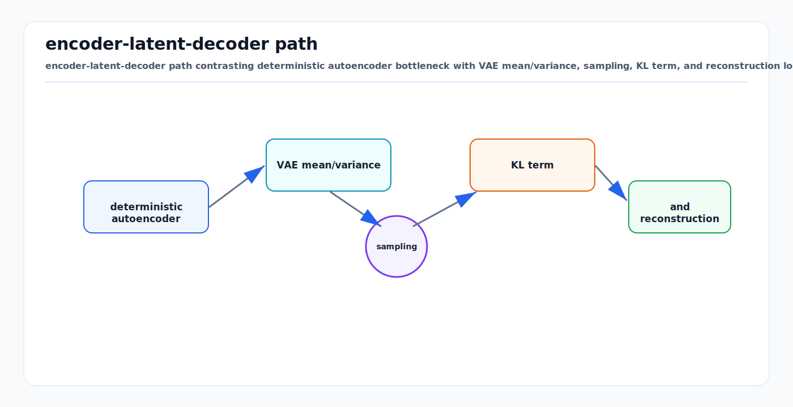

# Autoencoders, VAE, and Latent Variable Models: First Principles

<!-- kb-visual:start -->


*Visual: encoder-latent-decoder path contrasting deterministic autoencoder bottleneck with VAE mean/variance, sampling, KL term, and reconstruction loss.*
<!-- kb-visual:end -->

## Scope

Autoencoders learn compressed representations by reconstructing inputs.
Variational autoencoders (VAEs) turn this idea into a probabilistic latent
variable model. Latent variable models are the foundation for compression,
generation, uncertainty, world models, and representation learning in AV
perception and planning. This note covers first-principles math, implementation
interfaces, failure modes, and AV research relevance.

Related local notes:

- [vqvae-tokenization.md](vqvae-tokenization.md)
- [diffusion-models.md](diffusion-models.md)
- [world-models-first-principles.md](world-models-first-principles.md)
- [masked-modeling-first-principles.md](masked-modeling-first-principles.md)

## 1. Plain Autoencoder

An autoencoder has an encoder and decoder:

```text
z = encoder_phi(x)
x_hat = decoder_theta(z)
```

Training minimizes reconstruction loss:

```text
L = d(x, x_hat)
```

Examples:

```text
image:      d = pixel MSE, perceptual loss, or BCE
LiDAR:      d = point distance, range loss, occupancy CE
BEV:        d = feature MSE or occupancy CE
map tile:   d = semantic CE and boundary loss
```

The bottleneck `z` forces compression. If `z` is too large and the decoder is
too powerful, the model can copy the input without learning useful structure.

## 2. First-Principles Compression View

An autoencoder trades off:

```text
rate:        how much information z carries
distortion:  how much reconstruction error remains
```

A useful latent should preserve information needed downstream while discarding
nuisance detail.

For AV perception:

- preserve geometry, occupancy, motion, and hazards
- discard sensor noise, redundant texture, and transient nuisance variation

For sensor simulation:

- preserve visual or range fidelity
- preserve temporal consistency
- preserve rare but important artifacts

The right bottleneck depends on the task.

## 3. Denoising Autoencoder

A denoising autoencoder corrupts the input and reconstructs the clean version:

```text
x_tilde ~ corruption(x)
z = encoder(x_tilde)
x_hat = decoder(z)
L = d(x_hat, x)
```

This teaches the representation to capture stable structure rather than noise.

AV corruptions:

- image noise, blur, glare, exposure changes
- LiDAR dropout, range noise, weather returns
- radar ghost detections
- masked BEV cells
- calibration jitter for robustness testing
- timestamp jitter in temporal models

Denoising is a bridge to modern masked modeling and diffusion. All three train
models to recover structure from corrupted observations, but they differ in
noise process, target, and sampling procedure.

## 4. Latent Variable Model

A latent variable model assumes observed data `x` is generated from hidden
variables `z`:

```text
z ~ p(z)
x ~ p_theta(x | z)
```

The marginal likelihood is:

```text
p_theta(x) = integral p_theta(x | z) p(z) dz
```

This integral is usually intractable for neural decoders, so we introduce an
approximate posterior:

```text
q_phi(z | x)
```

The encoder is no longer just a deterministic compression function. It
represents a distribution over latent explanations.

## 5. VAE Objective: ELBO

Start with log likelihood:

```text
log p_theta(x) = log integral p_theta(x, z) dz
```

Introduce `q_phi(z | x)`:

```text
log p_theta(x)
= log integral q_phi(z | x) * p_theta(x, z) / q_phi(z | x) dz
>= E_{q_phi(z | x)} [log p_theta(x, z) - log q_phi(z | x)]
```

This lower bound is the ELBO:

```text
ELBO =
  E_{q_phi(z | x)} [log p_theta(x | z)]
  - KL(q_phi(z | x) || p(z))
```

Training usually minimizes negative ELBO:

```text
L =
  reconstruction_loss
  + KL(q_phi(z | x) || p(z))
```

Interpretation:

- reconstruction term makes `z` useful for explaining `x`
- KL term keeps `q(z | x)` close to the prior so sampling works

## 6. Reparameterization Trick

For a Gaussian encoder:

```text
q_phi(z | x) = N(mu_phi(x), diag(sigma_phi(x)^2))
```

Sample with:

```text
epsilon ~ N(0, I)
z = mu + sigma * epsilon
```

This makes sampling differentiable with respect to `mu` and `sigma`.

Implementation:

```python
class VAE(nn.Module):
    def encode(self, x):
        h = self.encoder(x)
        mu = self.mu_head(h)
        logvar = self.logvar_head(h)
        return mu, logvar

    def reparameterize(self, mu, logvar):
        std = torch.exp(0.5 * logvar)
        eps = torch.randn_like(std)
        return mu + std * eps

    def decode(self, z):
        return self.decoder(z)

    def forward(self, x):
        mu, logvar = self.encode(x)
        z = self.reparameterize(mu, logvar)
        x_hat = self.decode(z)
        return x_hat, mu, logvar, z
```

Loss:

```python
recon = reconstruction_loss(x_hat, x)
kl = -0.5 * torch.sum(1 + logvar - mu.pow(2) - logvar.exp(), dim=-1)
loss = recon + beta * kl.mean()
```

## 7. Beta-VAE and Bottleneck Control

Beta-VAE changes the KL weight:

```text
L = reconstruction_loss + beta * KL
```

Larger `beta` enforces a stronger bottleneck. This can encourage disentangled or
more compact latents, but may harm reconstruction.

For AV:

- low beta may preserve detail but create a messy latent space
- high beta may smooth away small hazards
- schedule beta during training to avoid posterior collapse

The correct beta is empirical and task-dependent. Evaluate with downstream
probes, not only reconstruction loss.

## 8. Posterior Collapse

Posterior collapse occurs when the decoder ignores `z`:

```text
q_phi(z | x) ~= p(z)
KL ~= 0
x_hat generated mostly from decoder bias/context
```

Common causes:

- decoder too powerful
- KL weight too high too early
- autoregressive decoder can model `x` without latent
- weak bottleneck pressure from target

Mitigations:

- KL warmup
- free bits
- weaker decoder
- skip connections controlled carefully
- richer latent hierarchy
- auxiliary predictive losses
- evaluate mutual information between `x` and `z`

For AV world models, posterior collapse is dangerous because the latent may look
well-regularized while ignoring rare objects or future-relevant details.

## 9. Latent Choices for AV Data

| Latent type | Example | Strength | Risk |
|---|---|---|---|
| deterministic continuous | plain AE BEV feature | simple, fast | hard to sample |
| Gaussian continuous | VAE image/BEV latent | probabilistic sampling | blurry reconstructions |
| discrete codebook | VQ-VAE token | transformer-friendly | codebook collapse |
| finite scalar | FSQ token | stable quantization | less flexible than learned codebook |
| hierarchical latent | multi-scale VAE | captures global/local structure | more complex training |
| temporal latent | recurrent state | world modeling | compounding error |

See [vqvae-tokenization.md](vqvae-tokenization.md) for discrete tokenization.

## 10. Latent Variable World Models

A latent world model learns:

```text
encoder:        z_t = E(o_t)
dynamics:       z_{t+1} ~ p(z_{t+1} | z_t, a_t)
decoder/head:   o_hat_t or task_head(z_t)
```

For AVs:

```text
observation o_t:
  camera, LiDAR, radar, BEV, occupancy, map patch

action a_t:
  ego trajectory, speed, steering, planned route

latent z_t:
  compact scene state for prediction and planning
```

The latent may feed:

- occupancy decoder
- detection head
- map completion head
- risk/cost head
- trajectory planner
- simulator decoder

The key question is whether the latent preserves the variables needed for safe
decisions, not whether it reconstructs pretty samples.

## 11. Implementation Interface

A practical latent model should expose:

```text
encode(x, metadata) -> latent distribution or latent code
sample(latent_distribution) -> z
decode(z, target_type) -> reconstruction or prediction
loss(batch) -> named loss terms
probe(z) -> downstream task outputs
```

Example interface:

```python
class LatentModel(nn.Module):
    def encode(self, batch):
        """Return latent object with sample(), mode(), kl(), and metadata."""
        ...

    def decode(self, z, target="occupancy"):
        ...

    def loss(self, batch):
        latent = self.encode(batch)
        z = latent.sample()
        recon = self.decode(z, target=batch.target_type)
        losses = {
            "recon": recon_loss(recon, batch.target),
            "kl": latent.kl().mean(),
        }
        losses["total"] = losses["recon"] + self.beta * losses["kl"]
        return losses
```

For AV data, pass metadata explicitly:

```text
calibration ID
sensor rig
timestamp
ego motion
map version
weather/time tags
route/site split
```

This supports leakage audits, cross-domain evaluation, and sensor-specific
diagnostics.

## 12. Evaluation

Evaluate at three levels:

### Reconstruction

```text
pixel/range/BEV error
occupancy IoU
boundary F1
rare-class recall
temporal consistency
```

### Latent Quality

```text
linear probe
few-shot transfer
retrieval
latent interpolation sanity
KL and active dimensions
mutual information proxy
OOD separability
```

### Downstream AV Utility

```text
detection/segmentation
occupancy prediction
tracking association
map change detection
future prediction
planner collision/comfort/progress metrics
latency on target hardware
```

Good reconstruction does not guarantee good downstream performance. A latent can
spend capacity on pavement texture while underrepresenting a small obstacle.

## 13. Failure Modes

| Failure mode | Symptom | Mitigation |
|---|---|---|
| identity copy | excellent reconstruction, poor abstraction | stronger bottleneck and probes |
| blurry VAE outputs | averages over modes | richer decoder, perceptual losses, discrete latents, diffusion decoder |
| posterior collapse | KL near zero, latent ignored | KL warmup, free bits, weaker decoder |
| overcompression | small hazards disappear | rare-object weighted losses and probes |
| latent holes | samples from prior decode poorly | stronger prior matching or learned prior |
| domain-specific latent | poor transfer to new site/weather | domain splits and adaptation |
| calibration shortcut | latent encodes sensor rig artifacts | metadata audits and rig holdouts |
| codebook collapse | few VQ codes used | EMA updates, dead-code reset, FSQ |
| unsafe reconstruction metric | loss rewards visual fidelity over risk | planning-aligned occupancy/risk heads |

## 14. AV and Research Relevance

Autoencoders and VAEs are relevant to AV stacks in several roles:

- compress multi-sensor data into BEV latents
- tokenize occupancy for transformer world models
- denoise degraded sensors
- learn low-label representations
- generate synthetic scenarios
- model uncertainty over future states
- build latent dynamics models for planning
- monitor OOD through reconstruction or latent likelihood
- adapt foundation features to airside domains

For airside AVs, a good latent should preserve:

- drivable apron geometry
- aircraft and stand boundaries
- small obstacles and FOD-like objects
- GSE shape and motion
- pedestrian proximity
- map-change cues
- weather and sensor degradation signals relevant to safety

It can discard:

- irrelevant texture
- sensor noise not tied to hazards
- redundant background appearance
- transient visual details that do not affect planning

## 15. Relationship to Diffusion, Masking, and EBMs

Latent diffusion uses an autoencoder first:

```text
x -> z
diffusion model generates z
decoder maps z -> x
```

Masked modeling often uses an autoencoding objective:

```text
visible patches -> latent -> masked reconstruction
```

Energy-based models can score latents:

```text
E(context, z_future)
```

A practical AV world-model stack may combine all of them:

```text
autoencoder compresses sensor/BEV data
masked or contrastive pretraining shapes representation
latent dynamics predicts future
energy/risk head scores candidates
decoder/probes expose occupancy and audit views
```

## 16. Practical Checklist

Before training:

1. Decide what the latent must preserve for downstream decisions.
2. Pick latent type: deterministic, Gaussian, discrete, FSQ, or hierarchy.
3. Choose reconstruction targets aligned with AV utility.
4. Define route/date/site splits before representation learning.
5. Add rare-object and boundary metrics.
6. Plan probes before tuning bottleneck size.

During training:

```text
monitor:
  reconstruction loss by class/range
  KL and active latent dimensions
  posterior collapse indicators
  rare-object recall
  latent retrieval quality
  downstream probe performance
  latency and memory
```

## Sources

- Kingma and Welling, "Auto-Encoding Variational Bayes." arXiv:1312.6114. https://arxiv.org/abs/1312.6114
- Vincent et al., "Stacked Denoising Autoencoders: Learning Useful Representations in a Deep Network with a Local Denoising Criterion." JMLR, 2010. https://jmlr.csail.mit.edu/papers/v11/vincent10a.html
- Goodfellow, Bengio, and Courville, "Deep Learning." MIT Press, 2016. https://www.deeplearningbook.org/
- van den Oord et al., "Neural Discrete Representation Learning." NeurIPS, 2017. https://arxiv.org/abs/1711.00937
- He et al., "Masked Autoencoders Are Scalable Vision Learners." arXiv:2111.06377. https://arxiv.org/abs/2111.06377
- Rombach et al., "High-Resolution Image Synthesis with Latent Diffusion Models." CVPR, 2022. https://arxiv.org/abs/2112.10752
