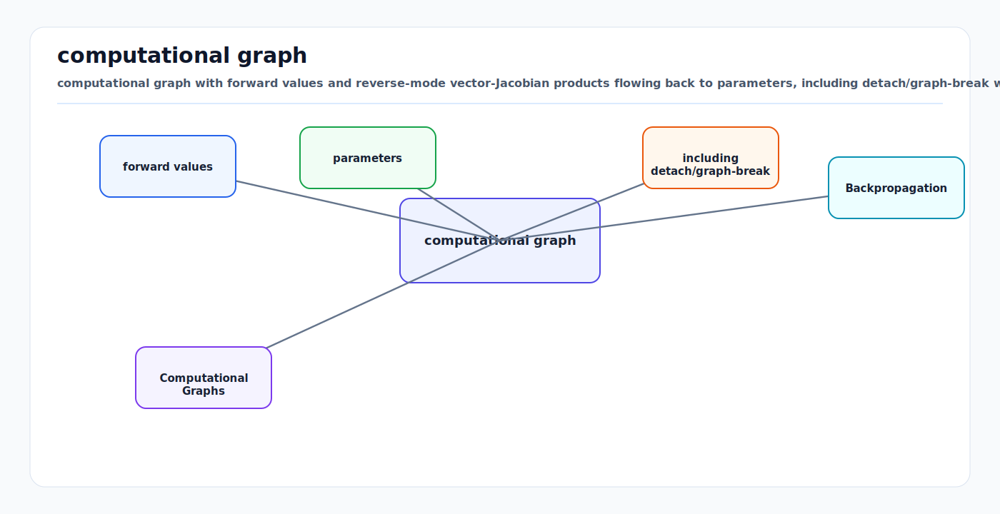

# Backpropagation, Computational Graphs, and Autodiff: First Principles

<!-- kb-visual:start -->


*Visual: computational graph with forward values and reverse-mode vector-Jacobian products flowing back to parameters, including detach/graph-break warning points.*
<!-- kb-visual:end -->

## The Accounting System Behind Deep Learning

Backpropagation is not a neural-network trick. It is reverse-mode automatic
differentiation applied to a scalar objective built from many tensor
operations. The algorithm answers:

```text
If the final loss changes, how much should each intermediate value and parameter
be blamed for that change?
```

Every modern AV perception stack depends on this accounting: camera backbones,
LiDAR voxel encoders, BEV fusion, detection heads, occupancy decoders,
trajectory scorers, and world models. When gradients are wrong, missing, scaled
badly, or routed through unintended paths, the model may train for days while
learning the wrong function.

---

## 1. Chain Rule From Scalars

Suppose:

```text
y = f(x)
z = g(y)
L = h(z)
```

Then:

```text
dL/dx = dL/dz * dz/dy * dy/dx
```

Backpropagation applies this rule repeatedly from the loss back to the inputs
and parameters.

For a simple affine layer:

```text
z = W x + b
L = loss(z)
```

Let `g = dL/dz`, same shape as `z`. Then:

```text
dL/dW = g x^T
dL/db = g
dL/dx = W^T g
```

For a batch with `X` shape `(B, D_in)`, `W` shape `(D_out, D_in)`, and
`Z = X W^T + b`:

```text
G      = dL/dZ                 # (B, D_out)
dL/dW  = G^T X                 # (D_out, D_in)
dL/db  = sum_rows(G)           # (D_out,)
dL/dX  = G W                   # (B, D_in)
```

This is why matrix dimensions are not bookkeeping trivia. A wrong transpose can
silently send a plausible-looking gradient into the wrong axis.

---

## 2. Local Jacobians And Vector-Jacobian Products

A computation graph is a directed acyclic graph of operations:

```text
x ----\
       matmul -> z -> relu -> h -> loss -> L
W ----/
b -----------/
```

Each operation knows how to propagate an upstream gradient through its local
derivative. In reverse mode, the primitive operation does not need to materialize
the full Jacobian. It computes a vector-Jacobian product:

```text
upstream:  v = dL/doutput
local:     output = op(input)
backward:  dL/dinput = v * doutput/dinput
```

For high-dimensional tensors, avoiding explicit Jacobians is essential. A dense
Jacobian for an image feature map would be enormous. Reverse-mode autodiff is
efficient because it propagates exactly the products needed for one scalar loss.

---

## 3. Why Reverse Mode Fits Neural Networks

Neural networks usually have many parameters and one scalar loss:

```text
theta in R^millions
L(theta) in R
```

Forward-mode autodiff would be efficient for few inputs and many outputs.
Reverse mode is efficient for many inputs and one output because one backward
pass computes:

```text
gradient = dL/dtheta
```

That is the object needed by SGD, Adam, AdamW, and most other optimizers.

When training uses multiple losses:

```text
L_total = lambda_cls * L_cls
        + lambda_box * L_box
        + lambda_occ * L_occ
        + lambda_vel * L_vel
```

reverse mode still differentiates the scalar `L_total`. The loss weights are
not cosmetic. They directly scale gradients from each task.

---

## 4. Backprop Through Common Operations

### ReLU

```text
h = max(0, z)
dL/dz = dL/dh if z > 0 else 0
```

Inactive ReLUs stop gradients. A layer with many permanently negative
preactivations is not just sparse; it is partially disconnected from learning.

### Softmax Cross-Entropy

For logits `s`, target class `y`, and probabilities `p = softmax(s)`:

```text
dL/ds_k = p_k - 1[k = y]
```

This compact derivative is one reason the softmax cross-entropy pairing is so
common.

### Addition Branches

If:

```text
z = a + b
```

then both branches receive the upstream gradient:

```text
dL/da += dL/dz
dL/db += dL/dz
```

Residual connections work partly because they create direct additive gradient
paths around deeper transformations.

### Multiplication Gates

If:

```text
z = a * b
```

then:

```text
dL/da = dL/dz * b
dL/db = dL/dz * a
```

Gates can modulate gradient flow. In LSTMs, GRUs, attention gates, and
confidence-weighted fusion, a saturated or near-zero gate can block learning in
the branch it controls.

---

## 5. PyTorch Autograd Mental Model

PyTorch records tensor operations into a dynamic computation graph when tensors
have `requires_grad=True`. A scalar loss triggers reverse traversal:

```python
logits = model(batch)
loss = loss_fn(logits, target)
loss.backward()
optimizer.step()
optimizer.zero_grad(set_to_none=True)
```

Important concepts:

- Leaf tensors are usually parameters created by `nn.Module`.
- Gradients accumulate into `param.grad`.
- Calling `backward()` twice on the same graph requires `retain_graph=True`,
  but retaining graphs increases memory.
- `torch.no_grad()` prevents graph construction and is appropriate for
  evaluation, target-network updates, and frozen computations.
- `tensor.detach()` creates a tensor that shares data but is disconnected from
  the current gradient graph.
- In-place operations can break backward if they overwrite values needed by a
  saved gradient function.

### Gradient Accumulation

PyTorch accumulates gradients by default:

```python
loss1.backward()
loss2.backward()
optimizer.step()
```

This can be intentional for gradient accumulation across microbatches. It can
also be a bug if `zero_grad()` is forgotten. In multi-sensor AV models with
large memory footprints, intentional accumulation is common, so training code
should make the accumulation boundary explicit.

---

## 6. Autodiff Is Exact For The Program You Ran

Autograd differentiates the executed tensor program, not the concept in the
engineer's head. This distinction catches many AV bugs:

- A branch under `torch.no_grad()` will not train.
- A `.detach()` inserted for logging or memory can cut off a loss.
- A post-processing step with `argmax`, thresholding, or NMS is not
  differentiable unless replaced by a differentiable surrogate.
- Losses computed after coordinate transforms train through those transforms
  only if the transform is written with differentiable tensor operations.
- Converting to NumPy or Python scalars breaks the graph.

Differentiability should be reviewed at module boundaries, especially around
geometry, projection, voxelization, association, and temporal state updates.

---

## 7. Numerical Gradient Checks

For a scalar function `L(theta)`, a finite-difference check estimates:

```text
dL/dtheta_i ~= [L(theta_i + eps) - L(theta_i - eps)] / (2 * eps)
```

Use gradient checks for custom operations, geometry kernels, CUDA extensions,
or unusual losses. They are too expensive for full models but invaluable on
small inputs.

Practical advice:

- Use double precision for checks.
- Disable dropout and stochastic augmentation.
- Test away from non-differentiable kinks when possible.
- Compare relative error, not only absolute error.
- Check gradients with representative edge cases: empty boxes, zero points,
  far-range coordinates, and invalid masks.

---

## 8. Memory And Compute Tradeoffs

Reverse-mode autodiff stores intermediate values needed for backward. Memory can
dominate AV training because inputs are high resolution and multi-sensor:

- Multi-camera images.
- LiDAR sweeps or point clouds.
- BEV feature maps.
- Temporal queues.
- Dense occupancy tensors.

Common techniques:

- Activation checkpointing: recompute part of forward during backward.
- Mixed precision: reduce activation memory, with loss scaling for stability.
- Gradient accumulation: simulate larger batches with smaller microbatches.
- Freezing modules: stop gradients through stable backbones or teachers.
- Detaching temporal state: truncate backpropagation through time.

Each technique changes the actual gradient computation. For example, detaching
temporal state may be necessary for memory but prevents credit assignment across
the detach boundary.

---

## 9. Failure Modes In AV Systems

### Detached Loss Path

A loss decreases only if it is connected to parameters. If an occupancy loss is
computed after a detached BEV tensor, the occupancy head may train while the
backbone receives no occupancy signal. Inspect `requires_grad`, `grad_fn`, and
per-parameter gradient norms.

### Non-Differentiable Geometry

Projection, rasterization, voxel indexing, and matching often contain discrete
steps. That can be correct, but then do not assume gradients optimize upstream
geometry. If a calibration refinement module needs learning signal through a
projection, use differentiable sampling or a surrogate loss.

### Gradient Scale Imbalance

Classification, box regression, depth, occupancy, and trajectory losses can
produce gradients with very different magnitudes. The total scalar loss may look
reasonable while one task dominates shared layers. Track gradient norms per
loss component.

### Temporal Leakage

Backprop through time can accidentally train on future context if sequence
construction includes labels or features beyond the intended prediction time.
Autograd will faithfully differentiate the leakage path.

### Train/Eval Mode Mismatch

BatchNorm and dropout change behavior between train and eval modes. Autograd may
be disabled correctly during validation, but module mode can still be wrong.

---

## 10. AV Review Checklist

```text
Which tensors require gradients?
Where are detach/no_grad boundaries?
Are custom ops gradient-checked?
Do losses connect to the intended modules?
Are task-gradient magnitudes monitored?
Are non-differentiable steps intentional?
Is BPTT truncated deliberately?
Are train/eval modes correct during validation and export?
```

Backpropagation is the mechanism that connects metric intent to parameter
updates. In a large AV stack, the most expensive bug is often not a bad model
family; it is a broken or unintended gradient path.

---

## 11. Sources

- Rumelhart, Hinton, and Williams, [Learning representations by back-propagating errors](https://www.nature.com/articles/323533a0), 1986.
- PyTorch, [Automatic Differentiation with torch.autograd](https://docs.pytorch.org/tutorials/beginner/basics/autogradqs_tutorial.html).
- Stanford CS231n, [Neural Networks Part 3](https://cs231n.github.io/neural-networks-3/).
- Goodfellow, Bengio, and Courville, [Deep Learning](https://www.deeplearningbook.org/), especially backpropagation and numerical computation.
