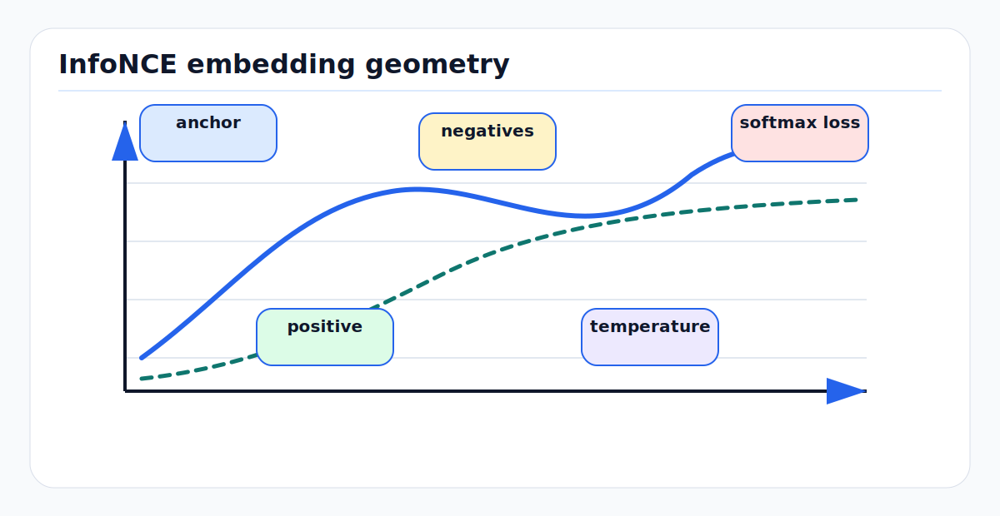

# Contrastive Learning and InfoNCE: First Principles

<!-- kb-figure:start -->


*Figure: how contrastive learning pulls paired views together while pushing competing negatives apart.*
<!-- kb-figure:end -->

## Scope

Contrastive learning trains representations by making related views close and
unrelated views far apart. InfoNCE is the standard loss behind Contrastive
Predictive Coding (CPC), SimCLR, MoCo, CLIP, and many cross-modal AV pretraining
systems. This note explains the math, intuition, implementation interface,
failure modes, and AV research relevance.

Related local notes:

- [self-supervised-learning-first-principles.md](self-supervised-learning-first-principles.md)
- [foundation-model-training-first-principles.md](foundation-model-training-first-principles.md)
- [jepa-latent-predictive-learning.md](jepa-latent-predictive-learning.md)
- [vision-transformers-first-principles.md](vision-transformers-first-principles.md)

## 1. The Core Question

Given a query `q`, identify its matching key `k+` among many candidate keys:

```text
query:       q_i
positive:    k_i
negatives:   k_j for j != i
```

The model succeeds if:

```text
sim(q_i, k_i) > sim(q_i, k_j)
```

where `sim` is usually a dot product or cosine similarity.

This is not just a classification trick. It is a way to define invariances:

```text
Two views that should describe the same underlying world state are pulled
together. Views that should describe different states are pushed apart.
```

For AVs, the choice of views is the real modeling decision.

## 2. InfoNCE Loss

For one query and one positive among `N` candidates:

```text
L_i = -log exp(sim(q_i, k_i) / tau)
          / sum_{j=1..N} exp(sim(q_i, k_j) / tau)
```

Where:

- `tau` is the temperature.
- smaller `tau` sharpens the distribution and emphasizes hard negatives.
- larger `tau` smooths the distribution.

In matrix form for a batch:

```python
q = normalize(q, dim=-1)            # [B, D]
k = normalize(k, dim=-1)            # [B, D]
logits = q @ k.T / temperature      # [B, B]
labels = torch.arange(B)
loss = cross_entropy(logits, labels)
```

The positive for row `i` is column `i`. Other columns are in-batch negatives.

## 3. First-Principles Gradient Intuition

Let:

```text
p_ij = softmax_j(sim(q_i, k_j) / tau)
```

The gradient pushes `q_i` toward the positive and away from the probability
weighted average of all keys:

```text
dL_i / dq_i proportional to
  (sum_j p_ij * k_j) - k_i
```

This has two consequences:

1. Hard negatives matter more because they receive larger `p_ij`.
2. False negatives are harmful because the loss pushes away samples that may
   actually represent the same place, object, or scene.

For map and route data, false negatives are common. Two different frames may
show the same aircraft stand, road segment, or building facade.

## 4. CPC: Predictive Contrast

CPC learns by predicting future latent observations from a context:

```text
past observations -> context c_t
future observation x_{t+k} -> key z_{t+k}
loss: identify true future key among negatives
```

The objective encourages the context vector to preserve information useful for
future prediction. For temporal AV data, this maps naturally to:

- predicting future camera frame embeddings
- predicting future LiDAR sweep embeddings
- predicting future BEV or occupancy features
- learning place descriptors from traversal sequences

The important point is that CPC is not reconstructing pixels. It is learning a
representation that makes true futures distinguishable from other candidates.

## 5. SimCLR: Augmentation-Defined Invariance

SimCLR takes two augmented views of the same image and treats them as positives:

```text
image -> augmentation A -> view 1
image -> augmentation B -> view 2
view 1 and view 2 are positives
other images in the batch are negatives
```

SimCLR showed that strong augmentation composition, a nonlinear projection head,
large batches, and long training are central to good visual representations.

The first-principles lesson:

```text
The augmentation policy tells the model what information should be ignored.
```

For AV data, careless augmentation can destroy geometry. Random crops may help
image classification while hurting lane, curb, sign, or stand alignment. Color
jitter may help day/night robustness but can damage signal if color carries
operational meaning, such as painted markings or warning lights.

## 6. MoCo: Queue and Momentum Encoder

MoCo addresses the need for many negatives without requiring huge batches.

Architecture:

```text
query encoder:       updated by backprop
key encoder:         exponential moving average of query encoder
negative dictionary: FIFO queue of previous key embeddings
```

The queue provides many negatives. The momentum encoder keeps keys consistent
as the query encoder changes.

For AV training, this is useful when batches are memory-limited by multi-camera
video, LiDAR sweeps, or BEV grids. But queue staleness matters: if the model or
data distribution changes quickly, old negatives may be inconsistent.

## 7. CLIP: Cross-Modal Contrast

CLIP trains image and text encoders by matching image-text pairs:

```text
image encoder(image_i) close to text encoder(text_i)
image encoder(image_i) far from text encoder(text_j), j != i
```

The same loss works for AV modalities:

```text
camera crop <-> text phrase
LiDAR object cluster <-> class prompt
BEV region <-> map element
camera feature <-> projected LiDAR feature
radar track <-> LiDAR track
route instruction <-> scene state
```

CLIP-style alignment is attractive for airside AVs because object taxonomies are
open-ended: baggage tugs, belt loaders, dollies, cones, aircraft parts, service
vehicles, and FOD-like objects may not fit standard road-driving labels.

## 8. Positive Pair Design for AVs

Good positive pairs share the same underlying state while differing in nuisance
variables:

| Positive pair | Invariance learned | Risk |
|---|---|---|
| two camera crops of same image | appearance invariance | may lose metric context |
| same place on different days | lighting/weather invariance | dynamic scene may differ |
| LiDAR point and projected image patch | cross-modal semantics | bad calibration poisons labels |
| radar track and LiDAR track | weather-robust association | timestamp error creates wrong pairs |
| BEV patch before/after ego compensation | motion invariance | ego-motion leakage |
| map element and observed sensor evidence | map-grounding | stale maps create false positives |

For AV perception, positive mining should preserve geometry. If the task needs
centimeter-level localization, do not train the representation to ignore
viewpoint, scale, or position indiscriminately.

## 9. Negative Pair Design

Negatives should be genuinely different for the intended task.

Bad negatives:

- adjacent frames showing the same object
- same location from another traversal
- two sensors observing the same actor
- two map patches containing the same repeated pattern
- same aircraft stand under different weather

Useful hard negatives:

- nearby but distinct lane segments
- visually similar but different GSE classes
- safe versus near-collision trajectory candidates
- correct versus shifted camera-LiDAR projections
- current map patch versus stale map patch

For large fleet logs, split by route, date, and site before using in-batch
negatives. Random frame mixing can create both leakage and false negatives.

## 10. Implementation Interface

A reusable contrastive module should separate encoders, projection heads, pair
construction, and loss:

```python
class ContrastiveBatch(NamedTuple):
    view_a: Tensor
    view_b: Tensor
    positive_index: Tensor
    sample_id: list[str]
    route_id: list[str]
    timestamp_ns: Tensor
    calibration_id: list[str]

class ContrastiveModel(nn.Module):
    def encode_a(self, view_a): ...
    def encode_b(self, view_b): ...
    def project_a(self, h_a): ...
    def project_b(self, h_b): ...

def info_nce(q, k, temperature=0.07, mask=None):
    q = F.normalize(q, dim=-1)
    k = F.normalize(k, dim=-1)
    logits = q @ k.T / temperature
    if mask is not None:
        logits = logits.masked_fill(~mask, -1e9)
    labels = torch.arange(q.shape[0], device=q.device)
    return F.cross_entropy(logits, labels)
```

The `mask` is important for AV data. It should remove known false negatives:

```text
same sequence
same physical place
same object track
same route segment
same synchronized multimodal observation
```

## 11. Evaluation Interface

Do not evaluate contrastive learning only by pretraining loss.

Use:

- linear probe on frozen features
- few-label fine-tuning curves
- retrieval recall for place/object matching
- cross-domain transfer by site, route, weather, and time of day
- detection, segmentation, tracking, and occupancy downstream tasks
- calibration and OOD metrics
- latency and memory on target hardware

For airside perception:

```text
Probe 1: known GSE detection with few labels.
Probe 2: open-vocabulary retrieval for rare GSE.
Probe 3: same-stand retrieval across day/night/rain.
Probe 4: camera-LiDAR alignment robustness under calibration perturbation.
Probe 5: false-negative mining audit on repeated locations.
```

## 12. Failure Modes

| Failure mode | Symptom | Mitigation |
|---|---|---|
| Representation collapse | embeddings become constant | use negatives, stop-gradient asymmetry, variance regularization, monitor covariance |
| False negatives | same place/object pushed apart | sequence-aware masks and metadata-aware sampling |
| Shortcut learning | model matches sensor ID, route ID, or timestamp | remove metadata leakage and split by route/site/date |
| Bad augmentations | downstream geometry gets worse | task-aware augmentation policy |
| Batch-size dependence | loss weak with few negatives | queue, memory bank, distributed negatives, hard-negative mining |
| Queue staleness | unstable or stale negatives | momentum tuning, shorter queue, refresh policies |
| Modality imbalance | text/camera dominates LiDAR or radar | balanced sampling and per-modality temperatures |
| Calibration poisoning | projected positives are wrong | calibration quality gates and perturbation tests |
| Over-invariance | features ignore details needed downstream | probe for metric localization and small-object recall |

## 13. AV and Research Relevance

Contrastive learning is one of the most practical SSL tools for AV data because
fleet logs naturally contain multiple views:

- same scene across time
- same object across sensors
- same place across traversals
- same map element across vehicles
- same route under different weather
- image-text or LiDAR-text descriptions from auto-labeling pipelines

Research directions that matter for autonomy:

- cross-modal LiDAR-camera-radar alignment
- language-aligned 3D features for open-vocabulary perception
- place recognition under appearance change
- calibration-aware positive mining
- representation learning from near misses and safety interventions
- contrastive pretraining followed by masked or JEPA objectives

The critical AV distinction is that invariance must not erase geometry. The best
contrastive setup for ImageNet classification is rarely the best setup for BEV
mapping, calibration-sensitive fusion, or planning.

## 14. Practical Checklist

Before training:

1. Define what should be invariant and what must remain distinguishable.
2. Build positive pairs from trusted metadata and calibration.
3. Mask false negatives using sequence, route, place, and track IDs.
4. Choose augmentations that preserve downstream geometry.
5. Log temperature, batch size, queue size, and positive-pair source.
6. Evaluate by downstream AV probes, not only contrastive loss.

During training:

```text
monitor:
  loss
  embedding norm
  covariance spectrum
  positive similarity
  hard negative similarity
  false-negative audit samples
  per-domain retrieval
```

## Sources

- van den Oord et al., "Representation Learning with Contrastive Predictive Coding." arXiv:1807.03748. https://arxiv.org/abs/1807.03748
- Chen et al., "A Simple Framework for Contrastive Learning of Visual Representations" (SimCLR). arXiv:2002.05709. https://arxiv.org/abs/2002.05709
- He et al., "Momentum Contrast for Unsupervised Visual Representation Learning" (MoCo). arXiv:1911.05722. https://arxiv.org/abs/1911.05722
- Radford et al., "Learning Transferable Visual Models From Natural Language Supervision" (CLIP). arXiv:2103.00020. https://arxiv.org/abs/2103.00020
- LeCun et al., "A Tutorial on Energy-Based Learning." MIT Press, 2006. https://yann.lecun.org/exdb/publis/pdf/lecun-06.pdf
- Goodfellow, Bengio, and Courville, "Deep Learning." MIT Press, 2016. https://www.deeplearningbook.org/
