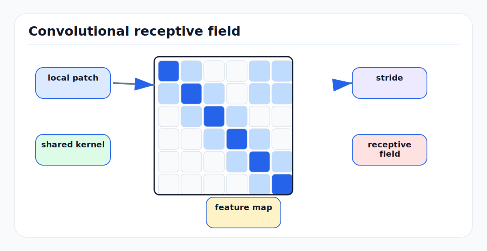

# Convolutional Neural Networks: First Principles

<!-- kb-figure:start -->


*Figure: how locality and weight sharing turn image or BEV grids into increasingly abstract feature maps.*
<!-- kb-figure:end -->

## Locality, Weight Sharing, and Translation Structure

A fully connected layer treats every input position as unrelated:

```text
flatten image -> W x + b
```

For images and BEV grids, that ignores two facts:

1. Nearby pixels or cells are strongly related.
2. The same visual pattern can appear at many locations.

A convolutional neural network encodes those assumptions by applying a small
learned kernel across spatial positions with shared weights. This makes the
model more parameter-efficient and gives it translation equivariance:

```text
shift input -> shift feature map
```

Equivariance is not invariance. A CNN preserves where evidence appears. Later
pooling, striding, global aggregation, or detection heads decide how much
position sensitivity to keep.

---

## 1. Cross-Correlation In Deep Learning

Most deep-learning libraries implement cross-correlation, even when the layer is
called convolution. For input `x` and kernel `w`:

```text
y[i, j] = sum_{u, v, c} w[c, u, v] * x[c, i + u, j + v] + b
```

The kernel is not flipped as in mathematical convolution. Because weights are
learned, the distinction usually does not matter for modeling, but it matters
when comparing formulas or porting weights.

For a 2D convolution layer:

```text
input:  (B, C_in, H_in, W_in)
weight: (C_out, C_in, K_h, K_w)
bias:   (C_out)
output: (B, C_out, H_out, W_out)
```

Each output channel has its own bank of kernels over all input channels.

---

## 2. Output Shape Arithmetic

For one spatial dimension:

```text
out = floor((in + 2 * padding - dilation * (kernel - 1) - 1) / stride + 1)
```

For height and width, apply the formula separately.

Common cases:

```text
kernel=3, stride=1, padding=1, dilation=1 -> same spatial size
kernel=3, stride=2, padding=1             -> roughly half spatial size
kernel=1, stride=1, padding=0             -> channel mixing only
```

Shape arithmetic is safety-critical in AV because spatial tensors often align
to camera intrinsics, feature pyramids, BEV cells, voxel grids, anchors, or map
coordinates. An off-by-one padding error can shift detections or occupancy
evidence relative to the world frame.

---

## 3. Receptive Field

The receptive field of an output unit is the input region that can influence it.
Stacking small kernels grows receptive field:

```text
two 3x3 stride-1 convs -> effective 5x5 receptive field
three 3x3 stride-1 convs -> effective 7x7 receptive field
```

Striding and pooling grow receptive field faster but reduce resolution.

Important distinction:

- The theoretical receptive field is the maximum possible influence region.
- The effective receptive field is where gradients and learned influence
  actually concentrate.

AV examples:

- A lane boundary head needs long spatial context but also precise localization.
- A small-object detector needs high-resolution features.
- A traffic-light classifier needs local appearance plus map/crop context.
- BEV occupancy needs enough receptive field to infer occluded areas from
  visible geometry.

---

## 4. Padding And Boundary Effects

Zero padding lets features near borders use the same kernel size as interior
features, but it injects artificial values. Boundary artifacts matter when:

- Crops truncate objects.
- Wide-angle camera images have strong distortion near edges.
- BEV grids have physical boundaries.
- Map raster layers use special unknown or out-of-range values.

Padding choices:

```text
zero       simple, common, but creates artificial border
reflect    useful for natural images, less obvious for semantic rasters
replicate  repeats edge values
circular   appropriate only for periodic domains
valid      no padding, shrinks spatial size
same       pads to preserve output size
```

Do not choose padding only to make tensor shapes convenient. Choose it based on
what the boundary means.

---

## 5. Stride, Pooling, and Aliasing

Stride reduces resolution:

```text
stride=2 -> sample every second location
```

Pooling aggregates local regions:

```text
max_pool -> presence of strong feature
avg_pool -> local average evidence
```

Downsampling without low-pass filtering can alias high-frequency patterns.
In perception, aliasing can affect lane markings, traffic signs, small objects,
and thin occupancy structures. Anti-aliased downsampling or careful feature
pyramid design can improve stability.

The detection tradeoff:

```text
more downsampling -> more context, lower compute, worse localization
less downsampling -> better small objects, higher memory and latency
```

Feature pyramid networks exist because no single stride is ideal for all object
scales.

---

## 6. Dilation

Dilated convolution spaces kernel samples apart:

```text
effective_kernel = dilation * (kernel - 1) + 1
```

A `3x3` kernel with dilation 2 covers a `5x5` region using 9 sampled points.
This increases receptive field without reducing spatial resolution.

Use cases:

- Semantic segmentation.
- BEV occupancy.
- Road topology context.
- Long-range spatial context in dense grids.

Failure modes:

- Gridding artifacts when repeated dilation samples disconnected positions.
- Poor local detail if dilation replaces too many standard convolutions.
- Hardware inefficiency depending on accelerator kernels.

---

## 7. Grouped And Depthwise Convolution

Grouped convolution splits channels into groups:

```text
groups = 1       normal convolution
groups = C_in    depthwise convolution
```

Depthwise separable convolution:

```text
depthwise KxK conv: per-channel spatial filtering
pointwise 1x1 conv: channel mixing
```

This reduces parameters and compute:

```text
standard:  K*K*C_in*C_out
depthwise + pointwise: K*K*C_in + C_in*C_out
```

It is useful for efficient deployment, but channel mixing is delayed until the
pointwise stage. In early fusion layers, overly aggressive grouping can reduce
cross-channel interaction that might be needed for color, intensity, or
multi-sensor cues.

---

## 8. CNN Building Blocks

### Conv-BN-ReLU

Classic block:

```text
conv -> batch norm -> ReLU
```

BatchNorm stabilizes training and ReLU provides nonlinearity. During export,
conv and BatchNorm can often be fused:

```text
y = gamma * (conv(x) - mean) / sqrt(var + eps) + beta
```

The fused layer has adjusted weights and bias.

### Residual Blocks

Residual block:

```text
y = x + F(x)
```

The identity path improves gradient flow and lets blocks learn refinements. For
perception, residual designs are common in image backbones, BEV encoders, and
occupancy decoders.

### 1x1 Convolution

A `1x1` convolution mixes channels independently at each spatial location. It is
used for:

- Reducing channel count.
- Expanding channel count before cheap spatial operations.
- Per-cell classification or regression heads.
- Feature fusion after concatenation.

---

## 9. LeNet To Modern Perception

LeNet demonstrated that learned convolutional features, pooling, and gradient
training could solve visual recognition tasks end to end. Modern AV CNNs are
larger and often hybridized with attention or state-space models, but the same
core assumptions remain:

```text
local evidence matters
patterns repeat across space
hierarchies compose simple features into complex features
spatial resolution is traded for context and compute
```

In AV, CNNs remain strong for:

- Camera image backbones.
- Feature pyramid networks.
- BEV raster encoders.
- Occupancy and segmentation decoders.
- Efficient local refinement after sparse attention.
- Learned image or BEV preprocessing before transformer blocks.

---

## 10. Implementation Notes

### PyTorch `Conv2d`

```python
conv = torch.nn.Conv2d(
    in_channels=64,
    out_channels=128,
    kernel_size=3,
    stride=2,
    padding=1,
    dilation=1,
    groups=1,
    bias=False,
)
```

Input layout is usually `(N, C, H, W)`. Some accelerators prefer channels-last
memory format, but APIs may still present tensors in NCHW shape. Performance
debugging should distinguish semantic shape from memory layout.

### Dense Prediction Loss Shapes

For segmentation:

```python
# logits: (B, C, H, W)
# target: (B, H, W)
loss = torch.nn.functional.cross_entropy(logits, target, ignore_index=255)
```

Do not flatten away the class dimension accidentally.

### Coordinate Alignment

Every resize, crop, pad, stride, and deconvolution changes coordinate mapping.
Keep an explicit record of:

```text
input pixel center convention
feature stride
BEV cell size
origin and axis direction
padding offsets
camera projection scale
```

Many AV "model" bugs are coordinate convention bugs.

---

## 11. Failure Modes

### Small Object Loss

Aggressive stride can erase pedestrians, cones, debris, or distant traffic
lights. Feature pyramids, higher-resolution branches, and task-specific crops
can help.

### Border Artifacts

Padding can create false evidence near image or BEV edges. Inspect predictions
near crop boundaries and camera seams.

### Shortcut Texture Bias

CNNs can rely on texture instead of shape. For AV, this can fail under weather,
lighting, construction zones, or new pavement. Shape-biased augmentation and
cross-domain validation help reveal the issue.

### Misaligned Upsampling

Decoder outputs can shift by half a pixel or one cell due to interpolation
settings. This matters for lane boundaries, occupancy, and freespace edges.

### BatchNorm Deployment Drift

CNN backbones often include BatchNorm. If deployment batch size or domain differs
from training, running statistics can hurt reliability.

### Inefficient Kernel Choices

Dilated, grouped, or unusual kernel shapes may be mathematically elegant but
slow on the target accelerator. Measure latency on the deployment stack, not
only FLOPs.

---

## 12. AV Review Checklist

```text
What is the feature stride at every head?
What receptive field does each output need?
Are padding and coordinate conventions explicit?
How are small objects preserved?
Are BatchNorm statistics deployment-safe?
Are upsampling operations aligned to labels and world coordinates?
Are grouped/depthwise/dilated convolutions efficient on target hardware?
Do augmentations preserve convolutional assumptions?
```

CNNs are not just older backbones. They are the standard tool for encoding local
spatial structure, and the mistakes they prevent or introduce are still central
to AV perception.

---

## 13. Sources

- LeCun et al., [Gradient-Based Learning Applied to Document Recognition](https://bottou.org/papers/lecun-98h), 1998.
- Stanford CS231n, [Convolutional Networks](https://cs231n.github.io/convolutional-networks/).
- PyTorch, [Conv2d](https://docs.pytorch.org/docs/stable/generated/torch.nn.modules.conv.Conv2d.html).
- Dumoulin and Visin, [A guide to convolution arithmetic for deep learning](https://arxiv.org/abs/1603.07285), 2016.
- Goodfellow, Bengio, and Courville, [Deep Learning](https://www.deeplearningbook.org/), especially convolutional networks.
