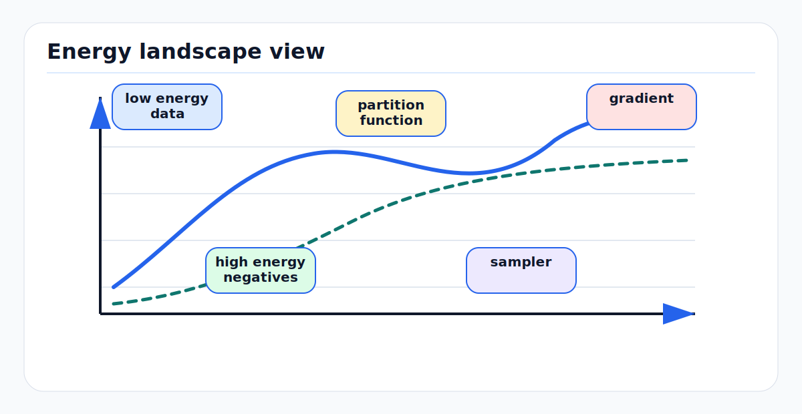

# Energy-Based Models: First Principles

<!-- kb-figure:start -->


*Figure: how energy-based models represent compatibility through an energy surface rather than a direct normalized predictor.*
<!-- kb-figure:end -->

## Scope

Energy-based models (EBMs) assign a scalar energy to a candidate state, label,
trajectory, image, point cloud, or latent representation. Low energy means the
configuration is compatible with the data and constraints. High energy means it
is implausible. This note covers EBMs from first principles, with emphasis on AV
perception, occupancy, planning, anomaly detection, and calibration-aware
research workflows.

Related local notes:

- [diffusion-models.md](diffusion-models.md)
- [world-models-first-principles.md](world-models-first-principles.md)
- [jepa-latent-predictive-learning.md](jepa-latent-predictive-learning.md)
- [optimization-training-dynamics.md](optimization-training-dynamics.md)

## 1. The Basic Object

An EBM defines an energy function:

```text
E_theta(x, y) -> scalar
```

Where:

- `x` is observed context: sensor history, map, route, ego state, weather, or
  text instruction.
- `y` is a candidate output: class label, segmentation, future trajectory,
  occupancy grid, latent state, or full scene.
- `theta` are learned parameters.

The first-principles rule is:

```text
Good pair:  E_theta(x, y_good) is low
Bad pair:   E_theta(x, y_bad) is high
Inference:  y_hat = argmin_y E_theta(x, y)
```

This differs from a classifier that directly outputs `p(y | x)`. An EBM can
score any candidate `y`, even when the set of candidates is structured,
continuous, constrained, or generated by another module.

For an AV planner, `y` can be a whole ego trajectory. For an occupancy world
model, `y` can be a future BEV occupancy tensor. For open-set perception, `y`
can be "known class explanation" versus "none of the known explanations fit."

## 2. From Energy to Probability

If we want a probabilistic model, energy can define an unnormalized density:

```text
p_theta(y | x) = exp(-E_theta(x, y)) / Z_theta(x)

Z_theta(x) = integral exp(-E_theta(x, y)) dy
```

`Z_theta(x)` is the partition function. It makes probabilities sum or integrate
to one. The main difficulty is that `Z_theta(x)` is usually intractable for high
dimensional outputs such as images, point clouds, trajectories, or occupancy
fields.

The important implication:

```text
Scoring candidates is easy.
Normalizing scores over all candidates is hard.
```

Many EBM training methods are different ways to avoid, approximate, or
differentiate through the partition function.

## 3. Energy as Compatibility, Not Just Likelihood

Energy can represent several things:

| Energy meaning | Example | AV use |
|---|---|---|
| Negative log probability | `E = -log p(y | x) + const` | calibrated prediction when normalization is possible |
| Constraint violation | high energy for collision or lane departure | trajectory scoring |
| Reconstruction inconsistency | high energy for inputs not explained by a model | anomaly and OOD detection |
| Cross-modal disagreement | camera and LiDAR features do not align | calibration and fusion monitoring |
| Learned cost | neural cost volume over BEV | planner ranking |

This flexibility is the reason EBMs are useful in autonomy. A planner often
does not need a perfect generative model of the world. It needs a reliable
ranking over candidate futures under physical and operational constraints.

## 4. Three Learning Views

### Maximum Likelihood

For data samples `y_data`, maximum likelihood minimizes:

```text
L(theta) = -log p_theta(y_data | x)
         = E_theta(x, y_data) + log Z_theta(x)
```

The gradient has two parts:

```text
grad_theta L =
  grad_theta E_theta(x, y_data)
  - E_{y ~ p_theta(. | x)} [grad_theta E_theta(x, y)]
```

Interpretation:

- Lower energy on data.
- Raise energy on samples from the current model.

This is the "positive phase" and "negative phase" view used in Boltzmann
machines and related EBMs.

The hard part is the negative phase: sampling from the model.

### Margin or Ranking Losses

If normalized probability is not needed, train with positive and negative
candidates:

```text
L = max(0, margin + E_theta(x, y_pos) - E_theta(x, y_neg))
```

or a softmax over candidate energies:

```text
L = -log exp(-E_pos / tau) / sum_j exp(-E_j / tau)
```

This is common in contrastive learning, retrieval, trajectory ranking, and
candidate-based planning.

### Score Matching

Score matching avoids the partition function by matching derivatives of log
density rather than normalized probabilities. For an unconditional EBM:

```text
log p_theta(x) = -E_theta(x) - log Z_theta
score_theta(x) = grad_x log p_theta(x) = -grad_x E_theta(x)
```

Hyvarinen's score matching minimizes the distance between the model score and
data score. After integration by parts, the data score disappears and the
objective can be written using derivatives of the model energy:

```text
J(theta) =
  E_data [ 0.5 * ||grad_x E_theta(x)||^2 - trace(H_x E_theta(x)) ]
```

This is one bridge from classical EBMs to modern score-based diffusion models:
learn the direction that points toward higher data density.

## 5. Contrastive Divergence

Contrastive divergence trains an EBM by starting a Markov chain at a data sample
and running only a few sampling steps:

```text
y_0 = y_data
for k steps:
  y_k ~ MCMC_step(y_{k-1}; E_theta)

update theta to:
  lower E_theta(y_data)
  raise E_theta(y_k)
```

This is biased compared with full maximum likelihood because the negative
sample is not from the true model distribution. It can still work because the
model learns to push away nearby corruptions of the data manifold.

For AV research, this is a useful intuition even when not using classical
Boltzmann machines:

```text
Train against near misses, not only random negatives.
```

Hard negatives such as slightly shifted boxes, plausible but unsafe
trajectories, or camera-LiDAR misprojections usually teach more than random
noise.

## 6. Conditional EBMs for AV Outputs

Most autonomy uses are conditional:

```text
E_theta(context, candidate)
```

Examples:

### Trajectory Energy

```text
context =
  BEV features, map lanes, traffic agents, ego state, route

candidate =
  ego trajectory over 3-8 seconds

energy terms =
  learned collision risk
  lane compatibility
  comfort
  progress
  rule compliance
  uncertainty penalty
```

The planner samples or optimizes candidate trajectories and selects low energy
ones.

### Occupancy Energy

```text
context =
  past occupancy or sensor features

candidate =
  future occupancy grid

energy =
  mismatch with learned dynamics, geometry, and map priors
```

This can score outputs from a transformer, diffusion model, or hand-designed
motion model.

### Cross-Modal Fusion Energy

```text
context =
  camera image, LiDAR point cloud, calibration, time sync

candidate =
  fused object or BEV representation

energy =
  image evidence mismatch + LiDAR evidence mismatch + geometry mismatch
```

High energy can indicate object uncertainty, sensor degradation, calibration
drift, or a true out-of-distribution object.

## 7. Inference Patterns

EBM inference solves:

```text
y_hat = argmin_y E_theta(x, y)
```

Common patterns:

| Pattern | How it works | Fit |
|---|---|---|
| Enumerate candidates | score a finite set | detection classes, retrieved map patches |
| Sample and rank | generate candidates, score each | multimodal futures and trajectory sets |
| Gradient descent in `y` | optimize continuous candidate | trajectory refinement, latent planning |
| Langevin sampling | gradient descent plus noise | generative sampling and uncertainty |
| Beam search | keep low-energy partial candidates | tokenized world models |
| Cross-entropy method | iteratively sample around low-energy candidates | MPC-style planning |

The interface must expose both value and derivative when optimization is used:

```python
class EnergyModel(nn.Module):
    def forward(self, context, candidate):
        """Return energy per candidate.

        context: structured sensor/map batch
        candidate: trajectory, occupancy, label, latent, or token batch
        returns: energy tensor with shape [batch, num_candidates]
        """
        ...
```

For trajectory optimization:

```python
candidate.requires_grad_(True)
energy = model(context, candidate).sum()
energy.backward()
candidate = project_to_vehicle_limits(candidate - step_size * candidate.grad)
```

Projection is not optional in AV systems. Candidate updates must obey vehicle
dynamics, actuator limits, map boundaries, and safety envelopes.

## 8. Implementation Interface

A production-friendly EBM module should define:

```text
Inputs:
  context tensors
  candidate tensors
  masks for valid candidates or valid BEV cells
  calibration and ego-motion metadata when cross-modal

Outputs:
  total_energy
  named energy terms when interpretable
  optional gradient wrt candidate
  optional uncertainty or temperature

Training batch:
  positives
  negatives
  hard-negative metadata
  scenario IDs and split provenance
```

Suggested metrics:

```text
ranking_accuracy
positive_energy_mean
negative_energy_mean
energy_gap = negative_energy_mean - positive_energy_mean
OOD_AUROC from energy
trajectory_collision_rate after energy ranking
ECE or reliability of energy-derived probabilities
latency per candidate batch
```

If energy is converted to probability over candidates:

```text
p_i = softmax(-E_i / tau)
```

then `tau` must be calibrated on a held-out validation set. Raw energy values
are not probabilities.

## 9. Failure Modes

| Failure mode | Symptom | Mitigation |
|---|---|---|
| Low energy everywhere | model cannot separate good and bad candidates | add contrastive negatives, regularize scale, monitor energy gap |
| High energy everywhere | inference has no usable candidate | include easy positives and calibration sets |
| Bad negative sampling | model learns trivial artifacts | mine realistic negatives and remove leakage |
| Partition-function approximation bias | likelihood training unstable | use score matching, NCE, CD, or bounded candidate ranking |
| Sampling too slow | MCMC cannot meet runtime | use generator plus EBM reranker, CEM, or latent energies |
| Energy scale drift | thresholds break after retraining | temperature scaling and fixed validation suites |
| Spurious shortcut | low energy tied to route, timestamp, or sensor ID | split by route/date/site and audit metadata |
| Unsafe low-energy candidate | learned score ignores physical risk | hard safety constraints outside the learned model |
| OOD overconfidence | unknown object receives low known-class energy | include OOD validation, energy margin tests, abstention |

The central AV safety rule:

```text
A learned energy may rank candidates, but it should not be the only safety
constraint.
```

Use hard collision checks, kinematic feasibility, map constraints, and runtime
assurance as independent gates.

## 10. Energy for OOD and Runtime Monitoring

Classifier softmax confidence can be high on unfamiliar inputs. An energy score
can provide a different OOD signal:

```text
E(x) = -T * log sum_y exp(f_y(x) / T)
```

Low energy means at least one class logit strongly explains the input. High
energy means no class explains it well. This is useful for:

- novel airside objects
- sensor contamination
- glare, fog, night, or rain shifts
- calibration drift
- changed map geometry

But energy-based OOD is not magic. A model can assign low energy to unknowns if
training has taught a shortcut. Evaluate OOD by scenario, not only by aggregate
AUROC.

## 11. Relationship to Diffusion and JEPA

Diffusion models can be interpreted through score learning:

```text
score(x_t, t) = grad_x log p_t(x_t)
```

An EBM parameterizes an energy whose gradient gives a score:

```text
score_theta(x) = -grad_x E_theta(x)
```

JEPA models predict embeddings rather than explicit samples. An energy can score
whether predicted and target embeddings are compatible:

```text
E(context_embedding, target_embedding)
```

For online AV planning, this suggests a practical split:

```text
generator proposes candidates
EBM scores candidates
hard safety layer rejects invalid candidates
planner selects among remaining low-energy options
```

## 12. AV and Research Relevance

EBMs are most relevant when outputs are structured and there are many plausible
answers:

- trajectory ranking under uncertainty
- occupancy future scoring
- cross-modal consistency checks
- open-set perception and anomaly detection
- learned cost volumes for planning
- map change detection
- offline scenario mining
- safety-case evidence for near-miss ranking

For airside AVs, EBMs are attractive because the domain has rare objects, unusual
traffic patterns, strict operational rules, and limited labels. A candidate
scorer can incorporate learned perception evidence while still respecting
explicit rules around aircraft, stands, service roads, and exclusion zones.

## 13. Practical Starting Point

A conservative EBM experiment:

1. Use an existing BEV encoder.
2. Generate candidate ego trajectories with a classical planner or sampler.
3. Label positives from expert/controller trajectories and negatives from
   perturbed, colliding, uncomfortable, or rule-violating trajectories.
4. Train `E(context, trajectory)` with a pairwise or softmax ranking loss.
5. Report energy gap, collision ranking, comfort ranking, and calibration.
6. Keep hard safety checks outside the EBM.
7. Test on route/date/site splits and rare airside scenarios.

This avoids the hardest problem, global density modeling, while still using the
main benefit of EBMs: scoring structured candidates.

## Sources

- LeCun et al., "A Tutorial on Energy-Based Learning." MIT Press, 2006. https://yann.lecun.org/exdb/publis/pdf/lecun-06.pdf
- Hyvarinen, "Estimation of Non-Normalized Statistical Models by Score Matching." JMLR, 2005. https://jmlr.org/papers/v6/hyvarinen05a.html
- Hinton, "Training Products of Experts by Minimizing Contrastive Divergence." Neural Computation, 2002. https://www.cs.toronto.edu/~hinton/absps/tr00-004.html
- Goodfellow, Bengio, and Courville, "Deep Learning." MIT Press, 2016. https://www.deeplearningbook.org/
- Song and Ermon, "Generative Modeling by Estimating Gradients of the Data Distribution." NeurIPS, 2019. https://arxiv.org/abs/1907.05600
- Liu et al., "Energy-based Out-of-distribution Detection." NeurIPS, 2020. https://arxiv.org/abs/2010.03759
