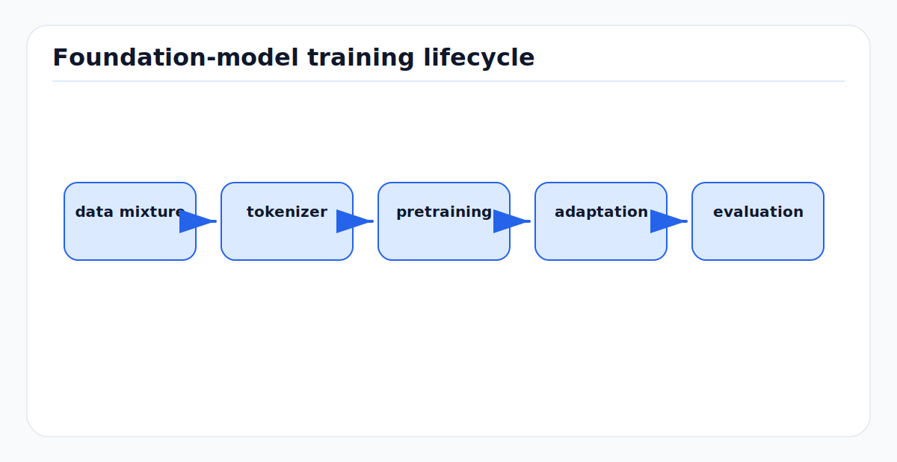

# Foundation Model Training: First Principles

<!-- kb-figure:start -->


*Figure: how large reusable models move from broad data mixtures to task-specific AV evaluation.*
<!-- kb-figure:end -->

## Scope

This note explains the training principles behind modern foundation models and adapts them to AV perception, SLAM, mapping, and world models. It covers data, tokens, scaling laws, optimization, evaluation, and adaptation. It is not a replacement for implementation-specific MLOps docs. It links to [self-supervised-learning-first-principles.md](self-supervised-learning-first-principles.md), [vqvae-tokenization.md](vqvae-tokenization.md), [transformer-world-models.md](transformer-world-models.md), and [world-models-first-principles.md](world-models-first-principles.md).

## 1. What Makes a Model a Foundation Model

A foundation model is not just a large network. It has three properties:

1. It is trained on broad data.
2. It learns reusable representations or generative capabilities.
3. It is adapted to many downstream tasks.

For AVs, a foundation model may be:

- A vision encoder for camera perception.
- A LiDAR or point-cloud encoder.
- A BEV encoder shared by detection, occupancy, mapping, and planning.
- A video or occupancy world model.
- A multimodal model that aligns camera, LiDAR, radar, text, maps, and actions.

The value comes from amortizing representation learning across tasks and domains.

## 2. Data Is the First Architecture

Foundation training performance depends as much on the data mixture as the model.

For AVs, data axes include:

- Geography.
- Weather.
- Time of day.
- Sensor rig.
- Speed regime.
- Road or airside operation type.
- Object taxonomy.
- Rare events.
- Map version.
- Driver or controller behavior.

A model trained mostly on sunny urban roads will not magically understand airport stands, de-icing zones, aircraft wings, or baggage cart trains. Pre-training helps, but the target domain still needs representation in the data mixture.

## 3. Tokens and Training Examples

Language models count text tokens. AV models need a comparable unit:

- Image patches.
- Video patches.
- BEV grid cells.
- VQ-VAE code indices.
- LiDAR points or voxels.
- Object tokens.
- Map elements.
- Action tokens.
- Latent embeddings.

Tokenization affects compute:

```text
tokens per example * examples per batch * sequence length
```

A small change in BEV resolution can dominate training cost. For example:

```text
64 x 64 BEV = 4096 tokens per frame
128 x 128 BEV = 16384 tokens per frame
8 frames at 128 x 128 = 131072 tokens before sparsity
```

This is why AV foundation models usually need token compression, sparse attention, patching, or factorized temporal modeling.

## 4. Scaling Laws

Kaplan-style scaling laws showed that language-model loss follows approximate power laws with model size, data size, and compute over wide ranges. Chinchilla revised the practical compute allocation: for a fixed compute budget, many large models were undertrained on too few tokens; model size and training tokens should scale together.

First-principles lesson:

```text
Do not only increase parameters. Increase high-quality data and training tokens
in proportion, or the model becomes compute-inefficient.
```

For AVs, "more tokens" also means more scenario diversity. Ten million near-duplicate highway frames are less useful than fewer frames covering weather, geography, actors, and operations.

## 5. The Basic Training Loop

Every foundation model training run has the same skeleton:

```text
for batch in data:
    tokens = tokenize(batch)
    predictions = model(tokens, conditioning)
    loss = objective(predictions, targets)
    loss.backward()
    optimizer.step()
    scheduler.step()
```

The hard parts are:

- Building the right target.
- Keeping the data loader saturated.
- Stabilizing large-batch optimization.
- Preventing data leakage.
- Evaluating the model on tasks that matter.

## 6. Objectives

### Next-Token Prediction

Predict the next token in a causal sequence:

```text
loss = cross_entropy(p(token_t | token_<t), token_t)
```

Good for text and discrete token world models. See [transformer-world-models.md](transformer-world-models.md) and [vqvae-tokenization.md](vqvae-tokenization.md).

### Masked Reconstruction

Predict missing patches or tokens:

```text
visible context -> missing pixels/features/tokens
```

Good for image, point cloud, BEV, and occupancy pre-training.

### Contrastive or Distillation

Align related views:

```text
camera feature <-> LiDAR feature
crop A <-> crop B
student feature -> teacher feature
```

Good for robust representations and cross-modal transfer.

### Diffusion or Flow

Predict denoising direction or velocity field from noisy data:

```text
noisy future + context -> clean future direction
```

Good for multimodal video, trajectory, and scene generation. See [diffusion-models.md](diffusion-models.md).

### JEPA

Predict target embeddings from context embeddings:

```text
context embedding -> target embedding
```

Good when semantics matter more than pixel-level reconstruction. See [jepa-latent-predictive-learning.md](jepa-latent-predictive-learning.md).

## 7. Optimizer and Stability

Common large-model choices:

- AdamW optimizer.
- Warmup followed by cosine or linear decay.
- Gradient clipping.
- Weight decay.
- Mixed precision with BF16 or FP16.
- Activation checkpointing.
- Distributed data parallel, tensor parallel, or sequence parallel training.

For SSMs and recurrent models, be careful with numeric precision in state updates. For attention models, memory-efficient kernels such as FlashAttention often determine whether a sequence length is feasible.

## 8. Data Mixture and Sampling

A foundation run should not sample data only by raw volume. Rare scenarios matter.

Possible sampling weights:

- Domain: road, airside, warehouse, simulation.
- Weather/time: rain, night, glare, fog.
- Scenario: crossing, merge, pushback, stand entry, emergency stop.
- Sensor health: clean, degraded, dropout.
- Geography: route, airport, city.
- Task labels: detection, segmentation, occupancy, planning.

For AVs, a useful heuristic is:

```text
Train on natural frequency for representation.
Oversample rare safety cases for robustness and evaluation.
Do not let oversampling destroy calibration of real-world frequencies.
```

## 9. Evaluation During Pre-Training

Training loss is not enough. Maintain a ladder of probes:

Representation probes:

- Linear probe on frozen features.
- Few-shot fine-tune.
- Cross-domain transfer.
- Retrieval or place recognition.

Perception tasks:

- 2D/3D detection.
- Semantic segmentation.
- Occupancy prediction.
- Motion forecasting.
- Online mapping.

World-model tasks:

- One-step and multi-step rollout.
- Action sensitivity.
- Calibration of future occupancy.
- Planning-score correlation.

Deployment tasks:

- Latency.
- Memory.
- TensorRT export.
- INT8 degradation.
- Robustness under sensor dropout.

For safety, closed-loop evaluation matters more than pretty samples.

## 10. Fine-Tuning and Adaptation

Full fine-tuning updates all parameters. It is flexible but expensive and can forget general capabilities.

Parameter-efficient adaptation trains a small number of parameters:

- LoRA: train low-rank matrices injected into linear layers.
- Adapters: small modules inserted between layers.
- Prompt or prefix tuning: learned conditioning tokens.
- Bias-only or norm-only tuning.
- Task heads on frozen encoders.

LoRA freezes base weights and trains low-rank update matrices. The original LoRA paper reports large trainable-parameter and optimizer-memory reductions for language models, with no added inference latency when merged.

For AVs:

- Use LoRA/adapters for airport-specific camera features.
- Use per-site adapters for map and visual domain shifts.
- Use task heads for detection/occupancy over a shared backbone.
- Recalibrate normalization and output heads after sensor changes.

## 11. Continual Learning

AV models face continual domain change:

- New airport.
- New sensor calibration.
- Construction zone.
- Seasonal weather.
- New GSE equipment.
- Map update.

Continual training must avoid catastrophic forgetting. Use:

- Replay buffers from old domains.
- Frozen base plus adapters.
- Evaluation gates for previous domains.
- Dataset versioning.
- Canary tests for safety-critical rare cases.

Do not push a continually trained world model into planning without regression testing its closed-loop behavior.

## 12. Data Leakage Risks

AV datasets are full of leakage traps:

- Adjacent frames in train and validation.
- Same route on same day in both splits.
- Future map labels used as current context.
- Labels generated by a stronger model that saw future frames.
- Scenario IDs encoded in file paths or metadata.
- Simulation seeds shared across splits.

Split by sequence, route, date, geography, and map version when evaluating generalization.

## 13. A Practical AV Foundation Training Stack

A staged approach:

```text
Stage 1: Broad SSL pre-training
  camera, LiDAR, radar, maps, video, occupancy

Stage 2: Domain adaptation
  unlabeled target-domain logs, e.g. airport airside

Stage 3: Supervised multi-task fine-tuning
  detection, segmentation, occupancy, map elements, tracking

Stage 4: World-model training
  future occupancy, token prediction, JEPA, diffusion, or SSM dynamics

Stage 5: Planner integration
  cost heads, uncertainty, closed-loop evaluation

Stage 6: Edge distillation and deployment
  smaller student, quantization, TensorRT, safety fallback
```

## 14. Compute and Systems Tradeoffs

Large model training bottlenecks:

- Data loading and decoding.
- Multi-camera synchronization.
- Point-cloud voxelization.
- Attention memory.
- Cross-node communication.
- Checkpoint storage.

AV-specific tricks:

- Store precomputed calibration and ego-motion transforms.
- Cache expensive teacher features for distillation.
- Use zarr, HDF5, WebDataset, or similar shard formats.
- Keep sequence chunks contiguous.
- Build deterministic validation views.
- Log exact map versions and sensor rig metadata.

## 15. Foundation Models for Airside AVs

Airside use needs both broad pre-training and local adaptation.

Recommended data curriculum:

```text
1. Generic image/video SSL.
2. Road driving multi-sensor SSL.
3. Unlabeled airside camera/LiDAR/radar logs.
4. Small labeled airside set for object, occupancy, and map tasks.
5. Scenario-focused fine-tuning for pushback, stand entry, service-road crossing, FOD.
```

Recommended architecture bias:

- Occupancy and BEV outputs for planning.
- DINOv2 or similar image foundation features with adapters.
- LiDAR/point foundation backbone for geometry.
- Temporal SSM or hybrid attention for long low-speed operations.
- JEPA or world-model objective for predictive scene representations.

## 16. Relationship to Other Local Docs

- [self-supervised-learning-first-principles.md](self-supervised-learning-first-principles.md): SSL objectives and collapse prevention.
- [vqvae-tokenization.md](vqvae-tokenization.md): VQ-VAE and discrete tokenization.
- [attention-transformers-first-principles.md](attention-transformers-first-principles.md): attention and transformer basics.
- [world-models-first-principles.md](world-models-first-principles.md): predictive model integration.
- [jepa-latent-predictive-learning.md](jepa-latent-predictive-learning.md): JEPA as a foundation-model objective.
- [30-autonomy-stack/perception/overview/model-compression-edge-deployment.md](../../30-autonomy-stack/perception/overview/model-compression-edge-deployment.md): deployment and compression.
- [50-cloud-fleet/mlops/transfer-learning.md](../../50-cloud-fleet/mlops/transfer-learning.md): transfer-learning operations.

## Sources

- Kaplan et al., "Scaling Laws for Neural Language Models." arXiv:2001.08361. https://arxiv.org/abs/2001.08361
- Hoffmann et al., "Training Compute-Optimal Large Language Models" (Chinchilla). arXiv:2203.15556. https://arxiv.org/abs/2203.15556
- Hu et al., "LoRA: Low-Rank Adaptation of Large Language Models." arXiv:2106.09685. https://arxiv.org/abs/2106.09685
- He et al., "Masked Autoencoders Are Scalable Vision Learners." arXiv:2111.06377. https://arxiv.org/abs/2111.06377
- Oquab et al., "DINOv2: Learning Robust Visual Features without Supervision." arXiv:2304.07193. https://arxiv.org/abs/2304.07193
- Assran et al., "Self-Supervised Learning from Images with a Joint-Embedding Predictive Architecture." arXiv:2301.08243. https://arxiv.org/abs/2301.08243
