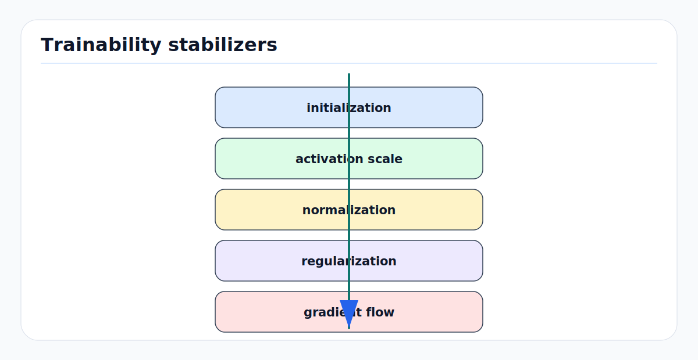

# Initialization, Normalization, and Regularization: First Principles

<!-- kb-figure:start -->


*Figure: how initialization, normalization, and regularization keep deep networks numerically trainable.*
<!-- kb-figure:end -->

## Making Deep Networks Trainable And Less Brittle

Deep networks are compositions of many transformations. If activations or
gradients grow or shrink at every layer, optimization becomes unstable before
the model has learned anything useful. Initialization, normalization, and
regularization are the tools that control this process:

```text
initialization   sets the starting signal scale
normalization    controls intermediate statistics during training/inference
regularization   limits brittle solutions and improves generalization
```

In AV perception, these choices affect more than benchmark accuracy. They shape
robustness under weather, sensor aging, rare objects, different cities, and
deployment batch sizes.

---

## 1. Signal Propagation

Consider a layer:

```text
z_l = W_l h_{l-1}
h_l = phi(z_l)
```

If entries of `W_l` are too large, activation variance can grow with depth. If
they are too small, activations shrink toward zero. Backward gradients have the
same problem in reverse.

The goal of initialization is to keep variance roughly stable:

```text
Var[h_l] ~= Var[h_{l-1}]
Var[dL/dh_l] ~= Var[dL/dh_{l-1}]
```

This is only approximate because real networks include nonlinearities,
normalization, residual paths, attention, convolutions, and data-dependent
distributions. But the principle is the right starting point.

---

## 2. Xavier / Glorot Initialization

For activations such as tanh, Glorot and Bengio proposed choosing weight scale
based on fan-in and fan-out:

```text
fan_in  = number of input units
fan_out = number of output units

uniform: W ~ U[-sqrt(6 / (fan_in + fan_out)),
                sqrt(6 / (fan_in + fan_out))]

normal:  W ~ N(0, 2 / (fan_in + fan_out))
```

The motivation is to keep forward activations and backward gradients from
systematically expanding or contracting. It is especially relevant for sigmoid
or tanh networks, where saturation can kill gradients.

---

## 3. He Initialization For Rectifiers

ReLU zeros roughly half of a zero-centered input. He initialization accounts for
that by using:

```text
normal: W ~ N(0, 2 / fan_in)
```

For ReLU-like networks, this is a better default than Xavier. Many CNNs and MLPs
use variants of Kaiming/He initialization.

Implementation notes:

- Match `fan_in`/`fan_out` mode to the layer and framework convention.
- For residual networks, initialization of residual branches can be adjusted so
  the block starts near identity.
- For newly added heads on a pretrained backbone, head initialization affects
  how aggressively gradients hit the shared representation at the start.

---

## 4. Batch Normalization

BatchNorm normalizes activations using mini-batch statistics:

```text
mu_B  = mean_B(x)
var_B = var_B(x)
x_hat = (x - mu_B) / sqrt(var_B + eps)
y     = gamma * x_hat + beta
```

For convolutional features, statistics are usually computed per channel across
batch and spatial dimensions. During training, BatchNorm uses batch statistics
and updates running estimates. During evaluation, it uses the running estimates.

Benefits:

- More stable activation distributions.
- Higher usable learning rates.
- Reduced sensitivity to initialization.
- Mild regularization from batch noise.

AV risks:

- Tiny per-device batch sizes produce noisy statistics.
- Distribution shift changes feature statistics at deployment.
- Train/eval mode mismatch causes immediate output drift.
- Fine-tuning on a small new domain can corrupt running statistics.
- Multi-camera batches may mix different camera distributions in one channel
  statistic if the architecture is not careful.

Mitigations include SyncBatchNorm, freezing BatchNorm, recalibrating running
statistics, using GroupNorm/LayerNorm, or designing camera-specific
normalization when warranted.

---

## 5. Layer Normalization

LayerNorm normalizes across features within one example:

```text
mu  = mean_features(x)
var = var_features(x)
x_hat = (x - mu) / sqrt(var + eps)
y = gamma * x_hat + beta
```

Unlike BatchNorm, it does not depend on other examples in the batch and usually
uses the same computation during training and inference. This makes it common in
transformers, recurrent networks, and small-batch settings.

Tradeoffs:

- Stable with batch size one.
- Less sensitive to deployment batch shape.
- Does not inject batch-statistic regularization.
- Normalizes feature contrast within each token or sample, which may remove
  useful absolute-scale information if used carelessly.

For AV temporal and transformer models, LayerNorm is often the safer default
than BatchNorm because deployment may process one scene at a time.

---

## 6. Other Normalization Patterns

### GroupNorm

GroupNorm normalizes channels in groups and does not depend on batch size. It is
common in segmentation and detection when batch sizes are small.

### WeightNorm And SpectralNorm

These normalize weights rather than activations. They can help control function
scale, especially in generative models or stability-sensitive modules, but are
less universal in AV perception stacks.

### Input Normalization

Sensor inputs need stable preprocessing:

```text
camera: mean/std or learned image normalization
LiDAR: range, intensity, elongation, timestamp normalization
radar: velocity and power normalization
map: coordinate frame and scale normalization
```

Changing input normalization is a model change. It affects pretrained weights,
calibration, and downstream thresholds.

---

## 7. Dropout

Dropout randomly masks activations during training:

```text
m_i ~ Bernoulli(keep_prob)
h_drop = (m * h) / keep_prob
```

At test time, dropout is disabled when using inverted dropout scaling. The idea
is to prevent units from co-adapting too strongly and to approximate an ensemble
of subnetworks.

Where it helps:

- MLP heads with limited data.
- Large fully connected layers.
- Transformer feed-forward or attention dropout.
- Overfitting-prone auxiliary heads.

Where it can hurt:

- Small models already underfitting.
- Dense geometry regression needing precise continuous signals.
- Temporal models where random masking creates frame-to-frame jitter.
- Deployment if `model.train()` is accidentally left on.

In AV, dropout must be reviewed with temporal consistency in mind. A stochastic
head that is fine for image classification can produce unacceptable jitter in
tracking, occupancy, or planning inputs.

---

## 8. Weight Decay

Weight decay shrinks parameters:

```text
theta <- theta - lr * lambda * theta
```

It discourages large weights and often improves generalization. With Adam-family
optimizers, decoupled AdamW-style weight decay is usually preferred over adding
an L2 penalty to the loss.

Do not decay everything by habit:

- Biases often should not be decayed.
- BatchNorm/LayerNorm scale and shift parameters often should not be decayed.
- Embeddings or positional parameters may need separate treatment.
- Newly initialized heads may need different decay from pretrained backbones.

Weight decay is a regularizer and an optimization choice. It changes update
dynamics, not only the final function class.

---

## 9. Data Augmentation As Regularization

For perception, data augmentation is often the most important regularizer.

Camera:

- Photometric jitter.
- Blur, noise, compression.
- Crop, resize, rotation, perspective.
- Cutout or object-level copy-paste.

LiDAR:

- Point dropout.
- Range noise.
- Intensity jitter.
- Global rotation/translation in BEV.
- Ground-truth database sampling.

Temporal:

- Frame dropping.
- Time jitter.
- Sensor delay simulation.
- Different sweep counts.

Augmentation should preserve labels. That is non-trivial in AV. A crop can
truncate objects, a rotation can invalidate map alignment, and temporal jitter
can change velocity labels. Treat augmentation code as part of the model and
test it visually.

---

## 10. Early Stopping, Ensembling, and EMA

Regularization is not only a layer choice.

- Early stopping prevents over-training on dataset artifacts.
- Exponential moving average of weights can stabilize validation metrics.
- Ensembling improves uncertainty estimates when latency allows.
- Test-time augmentation can help offline evaluation but may be too expensive
  or temporally inconsistent for online driving.

For AV deployment, EMA and ensembles must be evaluated under latency, memory,
and calibration constraints.

---

## 11. Failure Modes

### Bad Initialization Looks Like Bad Architecture

If loss does not move, gradients vanish, or activations saturate, the model may
be numerically unhealthy rather than underpowered. Check activation and gradient
histograms before changing architecture.

### BatchNorm Running-Stat Drift

Fine-tuning with small or biased batches can corrupt running means and variances
for deployment. Symptoms include validation instability when switching to eval
mode, per-camera quality gaps, and sudden confidence shifts.

### Normalization Removes Needed Scale

Some tasks need absolute magnitude: LiDAR intensity, radar power, depth scale,
or occupancy evidence count. A normalization layer can hide that information if
the architecture has no other path to preserve it.

### Dropout Jitter

If dropout remains active during inference, outputs become stochastic. In AV,
this can appear as flickering detections, unstable lane boundaries, or
oscillating occupancy cells.

### Regularization Hides Dataset Leakage

A heavily regularized model can still exploit route, map, or annotation leakage.
Cross-domain validation remains necessary.

---

## 12. AV Review Checklist

```text
Does initialization match activation?
Are pretrained and newly initialized modules treated separately?
Which normalization layers depend on batch statistics?
Are train/eval modes tested after export?
Are normalization stats frozen, synced, or recalibrated?
Which parameters receive weight decay?
Where is dropout used, and is it disabled at inference?
Do augmentations preserve labels and geometry?
Are temporal augmentations consistent with velocity and tracking labels?
```

Initialization makes learning possible, normalization makes it stable, and
regularization makes it less brittle. All three are deployment-relevant in AV
perception.

---

## 13. Sources

- Glorot and Bengio, [Understanding the difficulty of training deep feedforward neural networks](https://proceedings.mlr.press/v9/glorot10a.html), 2010.
- He et al., [Delving Deep into Rectifiers](https://arxiv.org/abs/1502.01852), 2015.
- Ioffe and Szegedy, [Batch Normalization](https://arxiv.org/abs/1502.03167), 2015.
- Ba, Kiros, and Hinton, [Layer Normalization](https://arxiv.org/abs/1607.06450), 2016.
- Srivastava et al., [Dropout: A Simple Way to Prevent Neural Networks from Overfitting](https://www.jmlr.org/papers/v15/srivastava14a.html), 2014.
- Loshchilov and Hutter, [Decoupled Weight Decay Regularization](https://arxiv.org/abs/1711.05101), 2019.
- Stanford CS231n, [Neural Networks Part 2](https://cs231n.github.io/neural-networks-2/).
- Goodfellow, Bengio, and Courville, [Deep Learning](https://www.deeplearningbook.org/).
