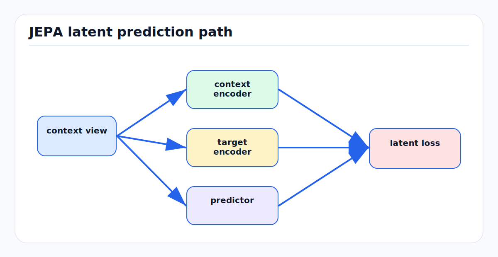

# JEPA and Latent Predictive Learning

<!-- kb-figure:start -->


*Figure: how JEPA predicts target representations from context without reconstructing pixels.*
<!-- kb-figure:end -->

## Scope

JEPA stands for Joint Embedding Predictive Architecture. This note explains JEPA as a first-principles route to world models that predict in representation space rather than pixel or token space. It complements [self-supervised-learning-first-principles.md](self-supervised-learning-first-principles.md), [world-models-first-principles.md](world-models-first-principles.md), and [30-autonomy-stack/world-models/tokenized-and-jepa.md](../../30-autonomy-stack/world-models/tokenized-and-jepa.md).

## 1. The Core Idea

Generative models predict observations:

```text
context -> pixels, tokens, point clouds, occupancy
```

JEPA predicts embeddings:

```text
context -> representation of target
```

The target representation is produced by an encoder, often an EMA teacher or a stop-gradient branch. The predictor does not need to reconstruct every detail. It only needs to match the target in a learned representation space.

This matters because the future contains many details that are either unknowable or irrelevant:

- Exact texture on pavement.
- Cloud shape.
- Minor sensor noise.
- Reflections.
- Clothing texture.

For planning, the important parts are geometry, dynamics, affordances, and hazards.

## 2. Architecture Pattern

A basic JEPA has:

```text
context view -> context encoder -> context embedding
target view  -> target encoder  -> target embedding (stop-gradient)
context embedding + target position -> predictor -> predicted target embedding
loss(predicted target embedding, target embedding)
```

The target encoder may share weights with the context encoder, use EMA weights, or be otherwise constrained. The predictor receives enough positional information to know which target it should predict.

## 3. Why It Does Not Collapse

If both encoders output the same constant vector for every input, the prediction loss can be small. JEPA systems avoid this collapse through design:

- Stop-gradient or EMA teacher asymmetry.
- Predictor bottleneck.
- Masking strategy that forces semantic prediction.
- Variance or covariance regularization.
- Large and diverse targets.
- Target encoders trained through context views across many examples.

Collapse prevention is not an implementation detail. It is the core technical challenge of non-generative representation prediction.

## 4. I-JEPA

I-JEPA predicts target block embeddings from context block embeddings in an image. It differs from MAE in the prediction target:

```text
MAE:   context patches -> missing pixels
I-JEPA: context patches -> embeddings of missing target blocks
```

I-JEPA found that target blocks should be large enough to be semantic, and context should be informative and spatially distributed. If targets are tiny, the task becomes local texture prediction. If context is too small, the target is underdetermined.

First-principles takeaway:

```text
The mask design defines what abstraction level the representation learns.
```

## 5. V-JEPA and Video Prediction

Video JEPA extends the same idea to spatiotemporal targets. The context is a subset of video. The target is a masked future or missing video region represented in embedding space.

Compared with pixel video generation, this can be more efficient because the model does not spend capacity on exact low-level reconstruction. It learns predictive features for motion and semantics.

## 6. V-JEPA 2

Meta's V-JEPA 2 work scales video JEPA and connects it to planning:

- Pre-trains on over 1 million hours of internet video and image data.
- Reports strong motion understanding and action anticipation benchmarks.
- Aligns V-JEPA 2 with a language model for video question answering.
- Post-trains an action-conditioned variant, V-JEPA 2-AC, with less than 62 hours of unlabeled robot videos.
- Demonstrates zero-shot robot planning with image goals in new environments.

The planning loop is:

```text
current image -> encoder -> current embedding
goal image    -> encoder -> goal embedding
candidate actions -> action-conditioned predictor -> predicted embeddings
choose action sequence whose predicted embedding approaches goal embedding
execute first action and replan
```

This is model predictive control in embedding space.

## 7. Why JEPA Is a World Model

A world model predicts future world state under actions. If the state is an embedding, JEPA can be a world model:

```text
z_{t+1} = f(z_t, a_t)
```

The predicted state is not directly human-viewable, but it can be used by:

- A value head.
- A cost head.
- A goal-distance metric.
- A decoder or probe.
- A planner that optimizes latent distance.

For AVs, a JEPA world model might predict:

- Future BEV embeddings.
- Future occupancy embeddings.
- Future map-tile embeddings.
- Future agent-interaction embeddings.
- Future LiDAR scene embeddings.

## 8. JEPA vs Contrastive Learning

Contrastive learning usually compares views and uses negatives or batch structure:

```text
view A close to view B, far from other views
```

JEPA predicts a missing or future target:

```text
context should predict target representation
```

Contrastive learning is strong for invariance. JEPA is stronger as a predictive objective because it models conditional structure. In AV terms, contrastive learning says two traversals are the same place. JEPA says what should be true about the hidden or future scene given the current context.

## 9. JEPA vs MAE

MAE reconstructs low-level content. JEPA predicts high-level embeddings.

| Dimension | MAE | JEPA |
|---|---|---|
| Target | Pixels, points, tokens | Embeddings |
| Strength | Spatial detail | Semantic prediction |
| Risk | Texture bias | Collapse or hard-to-inspect features |
| AV fit | Occupancy and geometry reconstruction | Planning and future representation |

For airside perception, MAE is useful for geometry and occupancy. JEPA is useful for predictive scene semantics and action-conditioned planning.

## 10. JEPA vs Diffusion and Token World Models

Diffusion and token models generate explicit futures. JEPA predicts latent futures.

Explicit generation is useful for:

- Synthetic data.
- Human inspection.
- Simulation.
- Sensor realism.

Latent prediction is useful for:

- Fast planning.
- Representation learning.
- Ignoring irrelevant details.
- Learning from unlabeled data efficiently.

A practical AV system can use both: diffusion for offline scenario generation, JEPA for online predictive representations, and occupancy heads for safety scoring.

See [diffusion-models.md](diffusion-models.md) and [world-models-first-principles.md](world-models-first-principles.md).

## 11. AV and SLAM Applications

### Future BEV Embedding Prediction

```text
history BEV embeddings + ego trajectory -> future BEV embeddings
```

Downstream heads can decode occupancy, flow, or cost volumes.

### Map Completion

```text
partial local map -> embedding of missing map patch
```

Useful for predicting lane continuation, stand markings, curb structure, or drivable apron boundaries.

### Dynamic Filtering

```text
current scene embedding -> predicted static-scene embedding
observed residual -> dynamic objects or map changes
```

This helps SLAM avoid fusing moving objects into the static map.

### Place Recognition

JEPA-style training can learn place descriptors by predicting masked spatial context, making descriptors robust to transient objects.

### Action-Conditioned Planning

```text
candidate trajectory -> predicted future embedding -> cost/goal score
```

This can reduce the need to generate full-resolution future video during each planning cycle.

## 12. Training Recipe for AV JEPA

A conservative starting recipe:

1. Encode synchronized sensor data into BEV or point/voxel features.
2. Choose target regions that are large enough to be semantic.
3. Use context from past and present frames only.
4. Predict target embeddings with a lightweight predictor.
5. Use EMA teacher or stop-gradient target encoder.
6. Add variance regularization or feature normalization.
7. Add action conditioning only after action-free pre-training works.
8. Evaluate with probes: occupancy, detection, map elements, future cost.
9. Validate closed-loop only after uncertainty and safety heads are calibrated.

## 13. Mask and Target Design

Good targets for AVs:

- Occluded BEV regions.
- Future BEV regions.
- Map patches ahead of the ego route.
- Dynamic-agent interaction zones.
- Long thin structures such as lanes or curbs.
- Rare object regions sampled from mining or active learning.

Bad targets:

- Random tiny patches that encourage texture prediction.
- Targets that leak through adjacent frames due to ego-motion misalignment.
- Targets that only include static background and ignore dynamic agents.
- Targets dominated by blank free space.

## 14. Evaluation

JEPA features need task probes.

Use:

- Linear probe for semantic segmentation.
- Occupancy decoder.
- Future occupancy prediction.
- Map change detector.
- Place recognition retrieval.
- Planning cost prediction.
- Closed-loop route completion and collision metrics.

Also inspect failure:

- Does the model ignore small hazards?
- Does latent distance correlate with safety?
- Does action conditioning change predictions in the right direction?
- Are embeddings stable across weather and lighting?
- Does the model know when it is uncertain?

## 15. Failure Modes

- Representation collapse.
- Predicting shortcuts from static background only.
- Ignoring action conditioning.
- Learning ego-motion artifacts from poor compensation.
- Latent features that probe well but plan poorly.
- Underrepresenting rare safety-critical objects.
- No human-inspectable output for debugging.

Mitigations include explicit occupancy probes, uncertainty heads, geometry checks, balanced target sampling, and periodic decoding for audit.

## 16. Relationship to Other Local Docs

- [self-supervised-learning-first-principles.md](self-supervised-learning-first-principles.md): broader SSL taxonomy.
- [world-models-first-principles.md](world-models-first-principles.md): world-model definitions and planning loops.
- [diffusion-models.md](diffusion-models.md): generative alternative for explicit futures.
- [transformer-world-models.md](transformer-world-models.md): token autoregressive world models.
- [vqvae-tokenization.md](vqvae-tokenization.md): discrete tokenizers and their bottlenecks.
- [30-autonomy-stack/world-models/tokenized-and-jepa.md](../../30-autonomy-stack/world-models/tokenized-and-jepa.md): driving JEPA and tokenized world-model survey.
- [30-autonomy-stack/perception/overview/self-supervised-pretraining-driving.md](../../30-autonomy-stack/perception/overview/self-supervised-pretraining-driving.md): driving SSL strategy.

## Sources

- Assran et al., "Self-Supervised Learning from Images with a Joint-Embedding Predictive Architecture" (I-JEPA). arXiv:2301.08243. https://arxiv.org/abs/2301.08243
- Meta AI, "Introducing the V-JEPA 2 world model and new benchmarks for physical reasoning." https://ai.meta.com/blog/v-jepa-2-world-model-benchmarks/
- Assran et al., "V-JEPA 2: Self-Supervised Video Models Enable Understanding, Prediction and Planning." Meta AI publication page. https://ai.meta.com/research/publications/v-jepa-2-self-supervised-video-models-enable-understanding-prediction-and-planning/
- He et al., "Masked Autoencoders Are Scalable Vision Learners." arXiv:2111.06377. https://arxiv.org/abs/2111.06377
- Chen et al., "A Simple Framework for Contrastive Learning of Visual Representations." arXiv:2002.05709. https://arxiv.org/abs/2002.05709
