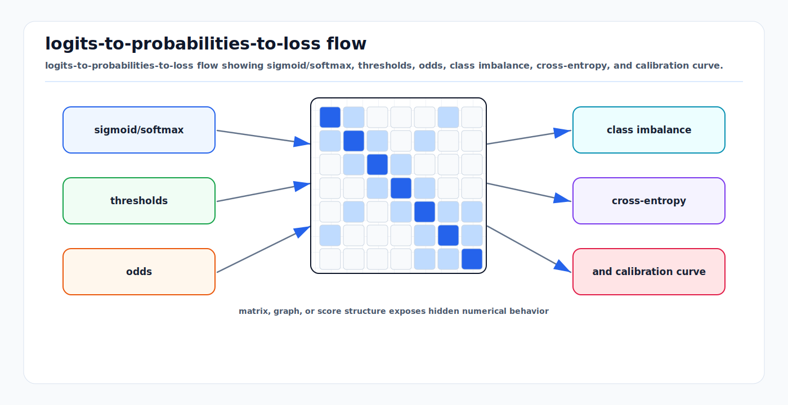

# Logistic, Softmax, and Cross-Entropy: First Principles

<!-- kb-visual:start -->


*Visual: logits-to-probabilities-to-loss flow showing sigmoid/softmax, thresholds, odds, class imbalance, cross-entropy, and calibration curve.*
<!-- kb-visual:end -->

## From Scores To Probabilities

A linear classifier produces scores:

```text
s = W x + b
```

Scores are not probabilities. They can be any real values, can be shifted by a
constant without changing the predicted class, and are only meaningful relative
to other scores for the same example. Logistic regression and softmax
classification add a probabilistic interpretation:

```text
binary:      p(y = 1 | x) = sigmoid(z)
multiclass: p(y = k | x) = softmax(s)_k
```

Cross-entropy then trains the model by maximizing the probability assigned to
the observed label. This is the default loss family for AV object
classification, semantic segmentation, occupancy classification, traffic-light
state prediction, and many auxiliary heads.

---

## 1. Binary Logistic Regression

For binary labels `y in {0, 1}`, use a scalar logit:

```text
z = w^T x + b
sigmoid(z) = 1 / (1 + exp(-z))
p = p(y = 1 | x) = sigmoid(z)
```

The Bernoulli likelihood is:

```text
p(y | x) = p^y * (1 - p)^(1 - y)
```

Negative log-likelihood gives binary cross-entropy:

```text
L = -[y * log(p) + (1 - y) * log(1 - p)]
```

The useful derivative is simple:

```text
dL/dz = p - y
```

This is why logistic regression fits so naturally into backpropagation. The
error signal at the logit is the predicted probability minus the target.

### Stable Binary Cross-Entropy With Logits

Never implement binary cross-entropy as `sigmoid` followed by logs in production
training code. Extreme logits can overflow or underflow. Use a fused
logit-space formula:

```text
L(z, y) = max(z, 0) - z * y + log(1 + exp(-abs(z)))
```

PyTorch exposes this as `BCEWithLogitsLoss`. The same principle applies to
multiclass softmax: losses should consume logits, not already-normalized
probabilities, unless the API explicitly says otherwise.

---

## 2. Odds, Log-Odds, and Thresholds

The logistic logit is a log-odds:

```text
odds = p / (1 - p)
log(odds) = z
```

This matters for thresholding. A default threshold of `p >= 0.5` is equivalent
to `z >= 0`, but AV systems often use thresholds chosen for operating points:

- High recall for vulnerable road users.
- Low false positive rate for hard braking triggers.
- Different thresholds by object class, distance, speed, or uncertainty.
- Post-processing thresholds after non-maximum suppression or tracking.

Training with cross-entropy does not choose the deployment threshold. It trains
scores that can be thresholded later. Threshold choice is an evaluation and risk
policy decision.

---

## 3. Multiclass Softmax

For mutually exclusive classes `k = 1..K`, softmax maps logits to probabilities:

```text
p_k = exp(s_k) / sum_j exp(s_j)
```

Softmax is invariant to adding the same constant to all logits:

```text
softmax(s) = softmax(s + c)
```

Use the stable form:

```text
m = max_j s_j
p_k = exp(s_k - m) / sum_j exp(s_j - m)
```

The cross-entropy for one hard label `y` is:

```text
L = -log p_y
  = -s_y + log sum_j exp(s_j)
```

The gradient with respect to each logit is:

```text
dL/ds_k = p_k - 1[k = y]
```

This result is central. The correct class logit receives a negative gradient
unless its probability is already near one. Every other class logit receives a
positive gradient proportional to its current probability. The model therefore
learns by redistributing probability mass, not by independently fitting each
class.

---

## 4. Cross-Entropy As Coding Cost

For a target distribution `q` and model distribution `p`, cross-entropy is:

```text
H(q, p) = -sum_k q_k log p_k
```

For a hard label, `q_y = 1` and all other entries are zero, so:

```text
H(q, p) = -log p_y
```

Cross-entropy can also train soft targets:

```text
L = -sum_k q_k log p_k
```

Soft targets appear in:

- Label smoothing.
- Distillation from a teacher model.
- Ambiguous labels, such as partially occluded objects.
- Multi-annotator disagreement modeling.

Do not confuse multiclass softmax with multi-label classification. Softmax
assumes exactly one class consumes all probability mass. If a BEV cell can be
both "occupied" and "moving", or an object can have multiple attributes, use
independent sigmoid heads or a structured output.

---

## 5. PyTorch Interface Notes

`torch.nn.CrossEntropyLoss` expects unnormalized logits and integer class
indices by default:

```python
loss_fn = torch.nn.CrossEntropyLoss()

# Image-level classification:
# logits: (B, C)
# target: (B,), dtype torch.long, values in [0, C)
loss = loss_fn(logits, target)

# Segmentation or BEV classification:
# logits: (B, C, H, W)
# target: (B, H, W)
loss = loss_fn(logits, target)
```

Important details:

- Do not apply `softmax` before `CrossEntropyLoss`.
- Class dimension is `C`, usually dimension 1 for dense tensors.
- Targets for hard labels are class indices, not one-hot vectors.
- `ignore_index` is useful for unlabeled pixels, masked BEV cells, invalid
  LiDAR regions, or uncertain annotation zones.
- Weighted cross-entropy can counter class imbalance, but large class weights
  change gradient scale and may destabilize multi-task training.

For soft labels, PyTorch also supports class-probability targets in modern
versions, but the target distribution must be valid. It is the practitioner's
responsibility to ensure non-negative entries that sum to one.

---

## 6. Class Imbalance and Rare Events

AV perception has extreme imbalance. Most pixels are background. Most anchors
are not objects. Most BEV cells are free space. Most frames contain no emergency
vehicles, animals, debris, or unusual construction signs.

Plain cross-entropy estimates the training distribution. If rare classes are
safety-critical, the training objective and evaluation distribution may diverge.
Common interventions:

- Class weights: multiply loss by `alpha_y`.
- Focal loss: down-weight easy examples with a factor like `(1 - p_y)^gamma`.
- Hard example mining: sample or weight high-loss negatives.
- Two-stage heads: objectness first, class distribution second.
- Dataset curation: oversample rare scenarios without duplicating near-identical
  frames into train and validation splits.

Each intervention changes the meaning of confidence. A model trained with heavy
class weights may improve recall but become poorly calibrated. That is often an
acceptable tradeoff only if downstream thresholds and calibration are retuned.

---

## 7. Calibration

Accuracy asks whether the top class is correct. Calibration asks whether the
probability means what it says. If a detector outputs confidence 0.9 on 1000
objects, roughly 900 should be correct for the model to be calibrated at that
confidence level.

Softmax probabilities are not guaranteed to be calibrated. Overconfidence is
common in deep networks, especially under distribution shift:

- Night, rain, snow, fog, glare.
- Different camera exposure or lens contamination.
- New city geometry or lane-marking conventions.
- Sensor dropout or degraded synchronization.
- Rare object shapes not represented in training.

Common tools:

- Reliability diagrams and expected calibration error.
- Temperature scaling on validation logits.
- Per-class threshold sweeps.
- Open-set or out-of-distribution scores.
- Ensembles or Bayesian approximations when latency allows.

Calibration must be measured on the deployment-like distribution. A confidence
score tuned on sunny daytime highway data may be misleading in dense urban rain.

---

## 8. Failure Modes

### Double Softmax

Applying `softmax` before `CrossEntropyLoss` compresses gradients and can cause
slow or unstable training. The loss expects logits because it performs a stable
log-softmax internally.

### Wrong Target Encoding

Passing one-hot labels to a hard-label API, or integer labels to a binary
sigmoid head, can silently train the wrong objective. Shape checks should be
part of every dense prediction training loop.

### Probability Competition Where Classes Are Not Exclusive

Softmax forces classes to compete. This is correct for mutually exclusive
semantic classes but wrong for independent attributes. For example, "occluded",
"moving", and "emergency vehicle" should usually not be three mutually exclusive
states.

### Ignored Regions Treated As Background

Unlabeled or uncertain pixels should often use `ignore_index`. Treating them as
background teaches the model that annotation gaps are negative evidence. This is
especially harmful near object boundaries, far range, and heavily occluded
regions.

### Base-Rate Overconfidence

With class imbalance, a model can achieve low average loss by learning strong
background priors. Inspect per-class recall, per-distance recall, and rare-class
logit distributions rather than only mean loss.

---

## 9. AV Relevance

Cross-entropy losses sit at the interfaces where perception becomes a decision:

- Detector class logits.
- Objectness and foreground/background heads.
- Semantic segmentation over camera or BEV grids.
- Occupancy classification for free/occupied/unknown cells.
- Traffic-light color and arrow-state classification.
- Lane topology node and edge classification.
- Actor intent classes such as parked, yielding, crossing, or turning.

For AV reviews, ask:

```text
What exactly is a class?
Are classes mutually exclusive?
Which regions are ignored?
How are rare classes weighted?
Are logits calibrated on deployment-like data?
Which threshold maps probabilities to system behavior?
```

The math is small, but the safety implications are large.

---

## 10. Sources

- Stanford CS231n, [Linear Classification](https://cs231n.github.io/linear-classify/).
- Goodfellow, Bengio, and Courville, [Deep Learning](https://www.deeplearningbook.org/), especially maximum likelihood, output units, and cross-entropy.
- PyTorch, [CrossEntropyLoss](https://docs.pytorch.org/docs/stable/generated/torch.nn.CrossEntropyLoss.html).
