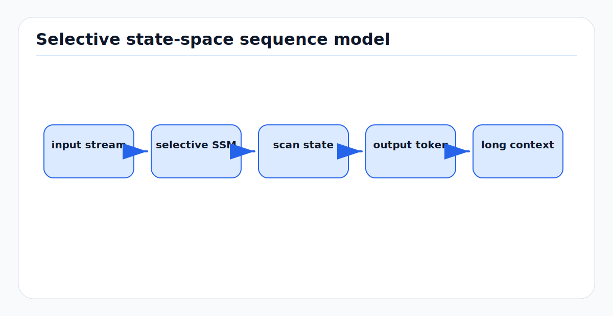

# Mamba & State Space Models for Autonomous Driving

<!-- kb-figure:start -->


*Figure: how Mamba-style selective state spaces process long driving sequences with recurrent state rather than full attention.*
<!-- kb-figure:end -->

## The O(n) Alternative to Transformers for AV World Models

**Last updated:** 2026-03-22

---

## Table of Contents

1. [Foundations: From S4 to Mamba](#1-foundations-from-s4-to-mamba)
2. [Mamba Architecture Deep Dive](#2-mamba-architecture-deep-dive)
3. [Mamba-2: Structured State Space Duality](#3-mamba-2-structured-state-space-duality)
4. [Mamba-3: ICLR 2026](#4-mamba-3-iclr-2026)
5. [Mamba for Autonomous Driving](#5-mamba-for-autonomous-driving)
6. [Other Sub-Quadratic Alternatives](#6-other-sub-quadratic-alternatives)
7. [When Mamba Beats Transformers for Driving](#7-when-mamba-beats-transformers-for-driving)
8. [Practical Implementation Guide](#8-practical-implementation-guide)
9. [Edge Deployment & Inference on Orin](#9-edge-deployment--inference-on-orin)
10. [Hybrid Architectures: The Practical Winner](#10-hybrid-architectures-the-practical-winner)

---

## 1. Foundations: From S4 to Mamba

### 1.1 The HiPPO Framework

The story begins with HiPPO (High-Order Polynomial Projection Operator), which provides a mathematically rigorous approach to preserving long-range dependencies in sequential data. HiPPO was motivated by improving RNNs and introduced the framework of continuous-time memorization -- how to efficiently memorize and reconstruct a continuous signal from its history.

### 1.2 S4: Structured State Spaces for Sequences

S4 (Structured State Spaces for Sequences, ICLR 2022) combined HiPPO-based SSMs with deep learning to model sequences over tens of thousands of steps. The core continuous-time state space is:

```
h'(t) = A h(t) + B x(t)
y(t)  = C h(t) + D x(t)
```

where `A` is the state transition matrix (initialized from HiPPO), `B` is the input projection, `C` is the output projection, and `h(t)` is the hidden state. S4 made this efficient through a diagonal-plus-low-rank (DPLR) parameterization of `A`, enabling FFT-based convolution for parallel training.

**Key limitation:** S4's parameters (A, B, C) are *fixed* -- they don't change based on input content. This prevents content-based reasoning and selection.

### 1.3 The Path to Selection

Between S4 and Mamba, several intermediate architectures emerged:
- **S5**: Simplified S4 using the parallel scan instead of FFT
- **H3**: Combined S4 with linear attention, introducing data-dependent gating
- **Hyena**: Replaced attention with implicitly-parameterized long convolutions

These models showed that data-dependent processing was critical for matching transformer quality.

---

## 2. Mamba Architecture Deep Dive

**Paper:** "Mamba: Linear-Time Sequence Modeling with Selective State Spaces" (Gu & Dao, December 2023)

### 2.1 The Selection Mechanism

Mamba's breakthrough is making the SSM parameters **input-dependent** (selective). Instead of fixed A, B, C matrices:

```
B_t = Linear_B(x_t)     # Input projection becomes function of input
C_t = Linear_C(x_t)     # Output projection becomes function of input
Delta_t = softplus(Linear_Delta(x_t))  # Step size is input-dependent
```

The discretized recurrence becomes:

```
A_bar_t = exp(Delta_t * A)           # Discretized state transition
B_bar_t = Delta_t * B_t              # Discretized input matrix
h_t = A_bar_t * h_{t-1} + B_bar_t * x_t   # State update
y_t = C_t * h_t                      # Output
```

**Why this matters:** The model can now *selectively* propagate or forget information based on the current input. A large Delta effectively resets the state (focus on current input), while a small Delta preserves existing state (maintain context). This is analogous to the gating mechanism in LSTMs, but with a continuous state space.

### 2.2 Hardware-Aware Selective Scan

The data-dependent nature of selective SSMs eliminates fast convolutional algorithms (which require time-invariant parameters). Mamba introduces a custom CUDA kernel with three key optimizations:

1. **Kernel Fusion:** All SSM operations (discretization, scan, output projection) are fused into a single kernel. Parameters are loaded directly from HBM to SRAM, discretization and recurrence are performed in SRAM, and final outputs are written back to HBM. This avoids saving/reading N-times-larger intermediate states.

2. **Parallel Associative Scan:** Because the SSM recurrence uses only multiplication and addition (associative operations), sequential computation can be broken into independent chunks processed in parallel. This parallel prefix-sum approach achieves 20-40x speedups over naive implementations.

3. **Recomputation in Backward Pass:** During backpropagation, intermediate states are recomputed from SRAM rather than stored, matching FlashAttention's memory usage pattern.

### 2.3 The Mamba Block

A single Mamba block replaces both attention AND MLP layers (unlike transformers which alternate attention and MLP):

```
Input x  -->  Linear(expand)  -->  [Branch A]  [Branch B]
                                       |            |
                                   Conv1D(d=4)   Linear
                                       |            |
                                     SiLU       SiLU (gate)
                                       |            |
                                   SSM(selective)    |
                                       |            |
                                       *  <---------+  (element-wise multiply)
                                       |
                                   Linear(contract)
                                       |
                                   Output y
```

**Key parameters:**
- `d_model`: Hidden dimension
- `d_state` (N): SSM state expansion factor (typically 16)
- `d_conv`: Local convolution width (typically 4)
- `expand`: Block expansion factor (typically 2), so inner dimension = expand * d_model

### 2.4 Complexity Analysis

| Operation | Transformers | Mamba |
|-----------|-------------|-------|
| Training FLOPs | O(T^2 * D) | O(T * D * N) |
| Inference (per step) | O(T * D) (KV-cache) | O(D * N) (constant) |
| Memory (inference) | O(T * D) (growing KV-cache) | O(D * N) (fixed state) |
| Throughput (long seq) | Degrades quadratically | Constant per token |

Where T = sequence length, D = model dimension, N = state dimension (typically 16-64).

---

## 3. Mamba-2: Structured State Space Duality

**Paper:** "Transformers are SSMs: Generalized Models and Efficient Algorithms Through Structured State Space Duality" (Dao & Gu, May 2024)

### 3.1 The SSD Framework

Mamba-2 establishes a mathematical duality between SSMs and linear attention through structured matrices. The SSM recurrence:

```
h_t = A_t * h_{t-1} + B_t * x_t
y_t = C_t * h_t
```

maps to a structured lower-triangular matrix form: `M = L . (C * B^T)` where `.` is element-wise multiplication and `L` encodes the recurrence structure. When all diagonal elements of `A` equal 1, this becomes exactly **causal linear attention**.

### 3.2 Key Simplification: Scalar A

Mamba-2 restricts `A` from full diagonal form to **scalar-times-identity** -- all state dimensions share identical recurrence dynamics (one scalar `a_t` per timestep instead of N independent values). This:

- Enables the use of GPU **tensor cores** via batched matrix multiplications
- Allows state expansion from N=16 (Mamba-1) to **N=64-256+**
- Makes implementation dramatically simpler (~30 lines of PyTorch for the core SSD layer)

### 3.3 Chunk-wise Algorithm

The dual algorithm employs block decomposition:
1. Sequences split into fixed-size chunks
2. Quadratic (matmul-based) attention computed **locally within each chunk**
3. SSM states passed linearly **between chunks**

This hybrid approach preserves linear FLOP scaling while leveraging GPU-optimized matrix multiplications.

### 3.4 Speed and Efficiency

| Metric | Attention | SSM (Mamba-1) | SSD (Mamba-2) |
|--------|-----------|---------------|---------------|
| State size | T | N | N |
| Training FLOPs | T^2 * N | T * N^2 | T * N^2 |
| Uses matmuls | Yes | No | **Yes** |
| Tensor core utilization | Full | None | **Full** |

Mamba-2 is **2-8x faster** than Mamba-1 at training while supporting much larger state sizes. Non-matmul FLOPs are up to 16x slower than matmul FLOPs on modern GPUs, so this shift to matmul primitives is critical.

### 3.5 System-Level Benefits

The SSD connection enables porting system optimizations originally developed for transformers:
- **Tensor parallelism** across GPUs
- **Sequence parallelism** for very long sequences
- **Variable-length sequence** support in a single batch

---

## 4. Mamba-3: ICLR 2026

**Paper:** "Mamba-3: Improved Sequence Modeling using State Space Principles" (March 2026)

Mamba-3 introduces three key improvements:

### 4.1 Trapezoidal Discretization

Mamba-2 used Euler's method for discretization (assumes input constant over timestep). Mamba-3 adopts **trapezoidal discretization** -- a more accurate integration scheme that better captures signal dynamics between timesteps.

### 4.2 Complex-Valued State Updates

By viewing the underlying SSM as **complex-valued**, Mamba-3 enables more expressive state updates than Mamba-2, overcoming the lack of state-tracking ability common in many linear models. This is connected theoretically to **Data-Dependent Rotary Embeddings (RoPE)**.

### 4.3 Multi-Input Multi-Output (MIMO)

To improve FLOP efficiency during decoding, Mamba-3 switches to a MIMO SSM formulation that increases arithmetic intensity without increasing decode latency.

### 4.4 Results

- At **1.5B scale**: +1.8 point total accuracy gain over Gated DeltaNet (next-best model)
- Achieves comparable perplexity to Mamba-2 with **half the state size**
- Completes long-sequence tasks **up to 7x faster** than transformers on H100 GPUs
- Together.ai reports it outperforms transformer baselines by ~4% on language benchmarks

---

## 5. Mamba for Autonomous Driving

### 5.1 DriveMamba (ICLR 2026)

**Paper:** "DriveMamba: Task-Centric Scalable State Space Model for Efficient End-to-End Autonomous Driving"

The first major Mamba-based end-to-end driving system accepted at a top venue.

**Architecture:**
- Converts image features and task outputs into **token-level sparse representations** sorted by 3D position
- A **Unified Mamba Decoder** with three B-Mamba layer types operating in parallel:
  1. **View Correspondence Learning:** Task queries extract semantics from raw sensor tokens via 3D position encoding (no expensive BEV construction)
  2. **Task Relation Modeling:** Dynamic inter-task/intra-task dependency via trajectory-guided scanning
  3. **Long-term Temporal Fusion:** FIFO memory queue storing historical task queries across frames

**Trajectory-Guided Local-to-Global Scan:** A bidirectional scan that prioritizes objects near predicted ego waypoints, preserving spatial locality from ego perspective.

**Results (nuScenes):**

| Model | Avg L2 (m) | Collision Rate | FPS |
|-------|-----------|----------------|-----|
| UniAD | 0.76 | 0.17% | ~3.0 |
| VAD | 0.72 | 0.22% | ~4.5 |
| DriveMamba-Tiny | **0.44** | **0.15%** | **17.9** |
| DriveMamba-Large | **0.40** | **0.09%** | 1.7 |

DriveMamba-Tiny reduces L2 error by **42.1%** vs UniAD and **38.9%** vs VAD.

**Bench2Drive (Closed-loop):**

| Variant | Params | Driving Score | Success Rate | Latency |
|---------|--------|---------------|--------------|---------|
| Tiny | 40.2M | 53.54 | 27.27% | 55.8ms |
| Base | 172.2M | 65.50 | -- | -- |
| Large | 607.5M | 66.82 | 37.73% | 599.1ms |

**Efficiency:** 3.2x faster processing, **68.8% less GPU memory** vs transformer baselines at scaled resolutions.

### 5.2 DRAMA (August 2024)

**Paper:** "DRAMA: An Efficient End-to-end Motion Planner for Autonomous Driving with Mamba"

The first Mamba-based end-to-end motion planner.

**Architecture:**
- **Mamba Fusion Module:** Concatenates camera and LiDAR BEV features, processes through Mamba-2, then splits/reshapes. Training complexity is O(T*D^2) vs transformer's O(T^2*D), achieving ~20x cost reduction.
- **Mamba-Transformer Decoder:** Hybrid design combining Mamba self-attention on learnable queries with transformer cross-attention for key/value extraction.
- **Feature State Dropout (FSD):** Differentiated dropout (0.1 for fusion, 0.5 for state features) improves robustness to flawed sensor inputs.

**NAVSIM Results:**

| Model | PDM Score | Params |
|-------|-----------|--------|
| Transfuser | 0.835 | 56 MB |
| DRAMA | **0.855** | **50.6 MB** |

DRAMA achieves +2.0 PDM score improvement with 10% fewer parameters.

### 5.3 MambaOcc (August 2024)

**Paper:** "MambaOcc: Visual State Space Model for BEV-based Occupancy Prediction with Local Adaptive Reordering"

First Mamba integration into BEV-based occupancy networks.

**Key Innovation -- Local Adaptive Reordering (LAR):**
Mamba is sensitive to token sequence order. LAR addresses this with:
1. Learnable, data-dependent sorting via deformable convolution
2. Anchor-based relative position offsets: `pi(pos(x)) = pos(x) + offset(x)`
3. Relaxed bijection (many-to-one mapping with attention-based fusion)

**Hybrid BEV Encoder:** Alternates SS2D groups (four-directional sequences) with LAR groups plus deformable convolution layers.

**Results (Occ3D-nuScenes):**

| Model | mIoU | Params | FLOPs |
|-------|------|--------|-------|
| FlashOcc | 43.3% | 137.1M | 1467.5G |
| MambaOcc | **43.4%** | **79.5M** | **893.8G** |
| MambaOcc-L | **44.1%** | 119M | 1002G |

**42% fewer parameters, 39% fewer FLOPs** than FlashOcc with superior mIoU.

### 5.4 OccMamba (CVPR 2025)

**Paper:** "OccMamba: Semantic Occupancy Prediction with State Space Models"

First Mamba-based network for **semantic** occupancy prediction (vs BEV-based in MambaOcc).

**Key Innovation -- Height-Prioritized 2D Hilbert Expansion:**
A 3D-to-1D reordering scheme that maximally retains spatial structure of 3D voxels. The Hilbert space-filling curve preserves locality better than raster scanning, and the height-prioritized variant respects the vertical structure of driving scenes.

**Architecture:** Hierarchical Mamba module + local context processor for global/local information aggregation.

**Results (OpenOccupancy):** Outperforms previous SOTA (Co-Occ) by **5.1% IoU** and **4.3% mIoU**.

### 5.5 DriveWorld (CVPR 2024)

**Paper:** "DriveWorld: 4D Pre-trained Scene Understanding via World Models for Autonomous Driving"

Uses a **Memory State-Space Model (MSSM)** for spatio-temporal modeling, though notably different from standard Mamba.

**Architecture -- Dual-Stream Design:**
- **Dynamic Memory Bank:** Learns temporal-aware latent dynamics with motion-aware layer normalization. Velocity and relative time are encoded as affine parameters that modulate the stochastic state. A memory bank of deterministic history enables cross-attention-based refinement.
- **Static Scene Propagation:** Learns spatial-aware latent statics from randomly sampled reference frames, fused channel-wise with dynamic features. No warping required.

**Key Distinction from Mamba:** DriveWorld uses *probabilistic* state spaces (explicit Gaussian distributions) rather than Mamba's deterministic selective recurrence. It separates motion (stochastic) from context (deterministic) streams.

**Results (OpenScene):**

| Task | Improvement |
|------|-------------|
| 3D Detection | +7.5% mAP |
| Online Mapping | +3.0% IoU |
| Multi-Object Tracking | +5.3% AMOTA |
| Motion Forecasting | -0.10m minADE |
| Occupancy Prediction | +5.0% IoU-far |
| Planning | -0.34m L2 error |

### 5.6 Trajectory Mamba (CVPR 2025)

**Paper:** "Trajectory Mamba: Efficient Attention-Mamba Forecasting Model Based on Selective SSM"

Applies SSM to trajectory prediction/forecasting.

**Architecture:** Redesigns self-attention in encoder-decoder with selective SSM for linear complexity. Joint polyline encoding captures static/dynamic context associations. Cross-state space attention allows target agents to share scene context.

**Results (Argoverse 1 & 2):**

| Model | Params | b-minFDE6 (AV1) | FLOPs Reduction |
|-------|--------|-----------------|-----------------|
| QCNet | 7.66M | 1.69 | baseline |
| Trajectory Mamba | **4.54M** | **1.67** | **4x** |

**40% fewer parameters, 4x fewer FLOPs** while outperforming QCNet.

### 5.7 GMF-Drive (August 2025)

**Paper:** "GMF-Drive: Gated Mamba Fusion with Spatial-Aware BEV Representation for End-to-End Autonomous Driving"

**Key Contribution:** Replaces transformer with a spatially-aware SSM (BEV-SSM) using directional sequencing and adaptive fusion. Geometrically-augmented pillar format replaces histogram-based LiDAR representation.

**Result:** New SOTA on NAVSIM benchmark, outperforming DiffusionDrive. Demonstrates that **task-specific SSMs can surpass general-purpose transformers** in both performance and efficiency for driving.

### 5.8 CollaMamba (September 2024)

**Paper:** "CollaMamba: Efficient Collaborative Perception with Cross-Agent Spatial-Temporal State Space Model"

First unified multi-agent collaborative perception framework using Mamba (replacing CNN and transformer architectures).

**Results:**
- **71.9% reduction** in computational overhead
- **1/64 reduction** in communication overhead
- Linear complexity with number of agents

### 5.9 CoMamba (IROS 2025)

**Paper:** "CoMamba: Real-time Cooperative Perception Unlocked with State Space Models"

V2X cooperative 3D detection with bidirectional SSM.

**Results:**
- **37.1 ms** per communication (26.9 FPS)
- **0.64 GB** GPU memory footprint
- 19.4% faster than prior SOTA
- Linear-complexity scaling with agent count

### 5.10 Additional Mamba-Driving Papers

| Paper | Task | Key Contribution |
|-------|------|-----------------|
| **EDVM** | E2E Driving | Vision Mamba with dilated sampling + FSAM module; outperforms baselines on CARLA Longest6 |
| **MamBEV** (ICLR 2025) | BEV Perception | SSM-based cross-attention for BEV queries; XQSSM uses 51 GFLOPs vs 1432.5 GFLOPs for dot-product attention on 200x200 BEV grid |
| **BEVMamba** (IEEE T-ITS 2025) | Temporal BEV | 3D Factorized Scan + Spatial-Temporal Corridor Fusion; outperforms BEVFormer baseline |
| **H-MBA** (AAAI 2025) | Multi-modal Video | Hierarchical C-Mamba + Q-Mamba for driving video understanding; +5.5% mIoU on risk detection |
| **ME3-BEV** (2025) | E2E + DRL | Mamba-BEV for DRL-based driving in CARLA; temporal feature modeling with BEV perception |
| **MambaFusion** | 3D Detection | Interleaves SSMs with windowed transformers; SOTA on nuScenes with linear complexity |
| **MambaPupil** (CVPR-W 2024) | Eye Tracking | Bidirectional GRU + LTV-SSM for event-based eye tracking; captures saccade/fixation variability |

---

## 6. Other Sub-Quadratic Alternatives

### 6.1 Hyena

**Paper:** "Hyena Hierarchy: Towards Larger Convolutional Language Models" (Poli et al., 2023)

A subquadratic drop-in replacement for attention using interleaved **implicitly-parameterized long convolutions** and **data-controlled gating**.

**Properties:**
- Time complexity: O(N * L * log_2(L))
- 2x faster than optimized attention at sequence length 8K
- **100x faster** at sequence length 64K
- Sublinear parameter scaling with sequence length
- Matches transformer quality on WikiText103 and The Pile with 20% less training compute

**Limitations for driving:** No direct applications to autonomous driving have been published. The long-convolution approach is well-suited for 1D sequences but adapting to multi-view 3D spatial data requires significant architectural modifications that SSM-based approaches (Mamba) handle more naturally.

### 6.2 RWKV

**Paper:** "RWKV: Reinventing RNNs for the Transformer Era" (Peng et al., 2023)

An RNN architecture that can be trained like a transformer (parallelizable) but infers like an RNN.

**Properties:**
- Linear time, constant space (no KV-cache)
- Infinite context length support
- 10-100x lower compute vs transformers at large contexts
- **RWKV-7 "Goose"** (March 2025): Dynamic state evolution using Generalized Delta Rule, surpassing TC0 limitations
- **RWKV-8** (experimental as of late 2025): Edge-friendly sparse MoE design (DeepEmbed)

**Relevance for driving:** RWKV's constant-memory inference makes it attractive for streaming sensor processing, but it has seen limited adoption in the driving research community compared to Mamba. Its RNN-like sequential inference pattern is a natural fit for real-time temporal processing.

### 6.3 Gated DeltaNet (ICLR 2025)

Combines gated update rule with delta rule for flexible memory control. Already adopted in production: **Olmo Hybrid, Qwen3.5, Qwen3-Next** use Gated DeltaNet (typically 3:1 ratio of linear DeltaNet to full attention blocks).

Consistently outperforms Mamba2 and DeltaNet on language modeling, commonsense reasoning, in-context retrieval, and length extrapolation.

### 6.4 RetNet

Achieves linear inference scaling with competitive performance using **fixed decays** to forget old information. Introduces "retention" mechanism -- a data-independent exponential decay applied to key-value outer-product hidden states.

### 6.5 Griffin & xLSTM

- **Griffin:** Gated linear RNN with sliding window attention (Google DeepMind)
- **xLSTM:** Extended LSTM with two memory variants -- mLSTM (parallelizable gated variant) and sLSTM (expressive recurrent computation)

### 6.6 Linear Attention Variants

- **LOLCATS:** Learnable linear attention with sliding window, achieving better attention transfer via lower MSE
- **Log-Linear Attention:** Reduces quadratic cost to O(N * log(N)) through sparse attention patterns
- Various kernel approximation methods (Performer, Random Feature Attention)

### 6.7 Comparison Summary

| Architecture | Complexity | Parallel Training | Constant-Memory Inference | Driving Papers |
|-------------|------------|-------------------|--------------------------|----------------|
| Transformer | O(T^2) | Yes | No (KV-cache grows) | Hundreds |
| Mamba | O(T) | Yes (scan) | Yes | 15+ |
| Hyena | O(T log T) | Yes (FFT) | No | 0 |
| RWKV | O(T) | Yes | Yes | ~2 |
| Gated DeltaNet | O(T) | Yes | Yes | ~1 |
| RetNet | O(T) | Yes | Yes | ~1 |
| Linear Attention | O(T) | Yes | Yes | ~3 |

---

## 7. When Mamba Beats Transformers for Driving

### 7.1 Long Temporal Sequences

**Winner: Mamba.** Autonomous driving involves continuous streams of sensor data. Processing 10+ seconds of history at 10-20 Hz produces thousands of frames. Transformers' O(T^2) attention becomes prohibitive, while Mamba's O(T) complexity scales gracefully.

Real example: MamBEV's XQSSM uses 51 GFLOPs for a 200x200 BEV grid vs 1,432.5 GFLOPs for dot-product attention -- a **28x reduction**.

### 7.2 Edge/Embedded Compute

**Winner: Mamba.** The NVIDIA Orin has limited compute budget. Mamba's constant-memory inference and linear scaling make it deployable where transformers require aggressive pruning or distillation.

CoMamba achieves real-time V2X perception at **37.1 ms / 26.9 FPS** with only **0.64 GB** GPU memory -- feasible on Orin's 32-64 GB unified memory.

### 7.3 Streaming Inference

**Winner: Mamba.** Unlike transformers that need the entire sequence to compute attention, Mamba processes inputs as they arrive. Each new sensor frame updates a fixed-size state -- no growing KV-cache, no recomputation of previous frames.

This is critical for real-time driving where latency directly impacts safety. DriveMamba-Tiny achieves **55.8 ms** end-to-end latency including temporal fusion.

### 7.4 Multi-Agent Scaling

**Winner: Mamba.** CollaMamba reduces computational overhead by 71.9% and communication by 1/64x vs transformer baselines. CoMamba scales linearly with agent count in GFLOPs, latency, and memory.

### 7.5 When Transformers Still Win

- **Short sequences with complex reasoning:** For < 2K tokens, transformers' quadratic cost is manageable and their global attention captures richer interactions
- **Cross-modal alignment:** Transformer cross-attention excels at aligning disparate modalities (text-image, query-feature). DRAMA uses Mamba for self-attention but retains transformer cross-attention
- **In-context learning / retrieval:** Transformers maintain superior performance on tasks requiring looking up specific past tokens (though Mamba-3's state tracking improvements narrow this gap)
- **Ecosystem maturity:** Transformers have vastly more optimization tools (FlashAttention, TensorRT, ONNX export, etc.)

### 7.6 The Emerging Consensus

Most competitive 2025-2026 driving systems use **hybrid Mamba-Transformer** designs:
- Mamba for temporal modeling and long-range dependencies
- Transformer attention for short-range cross-modal fusion and reasoning
- Typical ratio: 3:1 or 7:1 (Mamba:Attention layers)

---

## 8. Practical Implementation Guide

### 8.1 Installation

```bash
# Requirements: Linux, NVIDIA GPU, PyTorch >= 1.12, CUDA >= 11.6
pip install mamba-ssm[causal-conv1d] --no-build-isolation

# The --no-build-isolation flag ensures pip uses your existing
# CUDA-enabled PyTorch instead of installing CPU-only torch
```

### 8.2 Mamba-1 Layer

```python
import torch
from mamba_ssm import Mamba

batch, length, dim = 2, 64, 16
x = torch.randn(batch, length, dim).to("cuda")

model = Mamba(
    d_model=dim,      # Model dimension (hidden size)
    d_state=16,       # SSM state expansion factor (N)
    d_conv=4,         # Local convolution width
    expand=2,         # Block expansion factor
    # Inner dimension = expand * d_model = 32
    # Memory scales as ~3 * expand * d_model^2
).to("cuda")

y = model(x)
assert y.shape == x.shape  # (batch, length, dim)
```

### 8.3 Mamba-2 Layer

```python
from mamba_ssm import Mamba2

model = Mamba2(
    d_model=dim,      # Model dimension
    d_state=64,       # Larger state size than Mamba-1 (64-128 typical)
    d_conv=4,         # Convolution width
    expand=2,         # Block expansion
    # Mamba-2 uses tensor cores via matmul primitives
    # Supports d_state up to 256+ (vs 16 in Mamba-1)
).to("cuda")

y = model(x)
```

### 8.4 Building a Mamba-Based Driving Encoder

```python
import torch
import torch.nn as nn
from mamba_ssm import Mamba2

class MambaBEVEncoder(nn.Module):
    """Example: Mamba-based temporal BEV encoder for driving."""

    def __init__(self, bev_dim=256, n_layers=6, d_state=64):
        super().__init__()
        self.layers = nn.ModuleList([
            Mamba2(
                d_model=bev_dim,
                d_state=d_state,
                d_conv=4,
                expand=2,
            )
            for _ in range(n_layers)
        ])
        self.norms = nn.ModuleList([
            nn.LayerNorm(bev_dim) for _ in range(n_layers)
        ])

    def forward(self, bev_features_seq):
        """
        Args:
            bev_features_seq: (B, T, H*W, C) - temporal BEV sequence
                              flattened spatial dims

        Returns:
            Temporally-fused BEV features
        """
        B, T, HW, C = bev_features_seq.shape

        # Reshape: treat each spatial position as independent sequence
        x = bev_features_seq.permute(0, 2, 1, 3)  # (B, HW, T, C)
        x = x.reshape(B * HW, T, C)

        # Process through Mamba layers
        for layer, norm in zip(self.layers, self.norms):
            x = x + layer(norm(x))  # Residual + LayerNorm

        # Reshape back
        x = x.reshape(B, HW, T, C)
        x = x.permute(0, 2, 1, 3)  # (B, T, HW, C)
        return x
```

### 8.5 Pretrained Models

Available on Hugging Face (`state-spaces/`):
- Mamba-1: 130M, 370M, 790M, 1.4B, 2.8B (trained on 300B Pile tokens)
- Mamba-2: 130M through 2.7B variants
- Mamba-2.8B-slimpj (600B SlimPajama tokens)

### 8.6 Precision Considerations

SSMs are sensitive to recurrent dynamics -- numerical errors compound over the recurrence. Best practices:

- Store model parameters in **fp32** even when training with mixed precision (PyTorch AMP)
- Use `torch.cuda.amp.autocast` carefully; the SSM scan should run in fp32 or bf16
- If you experience training instabilities, check if your framework resets bias values after initialization (Mamba uses custom Delta initialization that must be preserved)

### 8.7 Minimal mamba-ssm Dependencies

```
torch >= 1.12
cuda >= 11.6
causal-conv1d >= 1.4.0  (optional but recommended, ~2x speedup)
packaging
ninja  (for JIT CUDA compilation)
```

For AMD GPUs: ROCm 6.0 requires a patch to bf16 headers; ROCm 6.1+ works without patches.

---

## 9. Edge Deployment & Inference on Orin

### 9.1 Inference Latency: Mamba vs Transformer

**On Desktop GPU (A100/H100):**

| Model Size | Transformer Throughput | Mamba Throughput | Speedup |
|-----------|----------------------|-----------------|---------|
| ~370M | ~1x (baseline) | ~3.5x | 3.5x |
| ~1.4B | ~1x | ~4.5x | 4.5x |
| ~2.8B | ~1x | ~5x+ | 5x+ |

Speedup increases with sequence length: at 2K tokens Mamba is ~2x faster; at 8K+ tokens the gap widens to 5x+.

**On NVIDIA Jetson AGX Xavier (proxy for Orin-class):**

From the Mamba-X accelerator study:
- Selective SSM accounts for **up to 60% of total latency** on edge GPUs for images > 512x512
- Edge GPU baseline: 1.38 GHz, 512 CUDA cores
- Mamba-X achieves **11.6x improvement** in selective scan throughput
- **2.3x end-to-end speedup** over baseline GPU implementation

### 9.2 Memory Footprint Comparison

The critical advantage for edge deployment:

| Scenario | Transformer | Mamba |
|----------|------------|-------|
| KV-cache (256K context, fp16) | 32-128 GB | 0 GB (no KV-cache) |
| State memory | 0 | Fixed ~(d_model * d_state * n_layers) |
| Peak inference memory | Grows with context | **Constant** |

**Jamba example:** 52B total params, 12B active -- fits on single 80GB GPU with 128K context. KV-cache for 256K context is only **4 GB** vs 32 GB (Mixtral) or 128 GB (Llama2-7B).

### 9.3 Quantization for Edge

The Hybrid Hardware-friendly (H2) quantization approach for Vision Mamba:

- **INT8 precision** for weights and activations
- **Tensor-granularity** quantization for linear layer weights (uniform distribution)
- **Channel-granularity** quantization for SSM activations (high variance across channels)
- Scaling factors approximated as powers-of-two (shift operations instead of multiplication)
- **< 1% accuracy degradation** across model sizes

### 9.4 Mamba-X Hardware Accelerator

A custom accelerator design (1.34 mm^2 at 12nm) achieves:
- **601x increase in performance/area** vs edge GPU
- **11.5x energy-efficiency improvement** during selective SSM
- **2.5x reduction** in off-chip memory traffic
- Six compute units: DMA, GEMM engine (64x64 PEs), Vector Processing Unit, Special Function Unit, Systolic Scan Array (8 instances), Post-Processing Unit

### 9.5 TensorRT Integration

Mamba models can be deployed via TensorRT, but with caveats:
- The selective scan kernel requires custom TensorRT plugin implementation
- Standard TensorRT optimizations (layer fusion, kernel auto-tuning) apply to linear projections
- FP8/INT8 quantization supported through TensorRT's post-training quantization pipeline
- The HQP (Hybrid Quantization and Pruning) output produces standard sparse INT8 models compatible with TensorRT, OpenVINO, and TFLite

### 9.6 Practical Orin Deployment Estimates

Based on published driving-specific benchmarks:

| System | Platform | Latency | Memory |
|--------|----------|---------|--------|
| DriveMamba-Tiny | Desktop GPU | 55.8 ms | ~2 GB |
| CoMamba | Desktop GPU | 37.1 ms | 0.64 GB |
| DRAMA | Desktop GPU | ~100 ms | ~1.5 GB |

For Orin AGX (275 TOPS INT8, 64 GB unified memory):
- Expect ~2-3x latency increase vs A100 for fp16 models
- INT8 quantized models should approach desktop-GPU latency
- Memory footprint well within Orin's 64 GB budget
- The key bottleneck is the selective scan kernel, which lacks Orin-specific optimization (unlike convolution and matmul which are heavily optimized in TensorRT)

---

## 10. Hybrid Architectures: The Practical Winner

### 10.1 The Convergence

The field is converging on hybrid Mamba-Transformer architectures rather than pure Mamba:

**Jamba (AI21, 2024):** 7:1 Mamba-to-Attention ratio (one transformer layer per eight total). 52B total / 12B active params with MoE. Fits 256K context on single GPU.

**Jamba-1.5 (2024):** Scaled to 398B total / 94B active params. Largest open hybrid model with 256K effective context.

**NVIDIA Nemotron 3 Super:** Open hybrid Mamba-Transformer MoE for agentic reasoning.

**IBM Granite 4.0-H:** Hybrid architecture offering **>70% reduction in RAM** for long inputs and concurrent batches vs pure transformers.

**Qwen3-Next / Kimi Linear:** 3:1 ratio of Gated DeltaNet (linear) to full attention blocks.

### 10.2 Why Hybrid Works for Driving

1. **Temporal backbone (Mamba):** Processes streaming sensor data with constant memory, captures long-range temporal dependencies efficiently
2. **Spatial reasoning (Attention):** Cross-attention for multi-view fusion, query-based object detection, cross-modal alignment
3. **Planning (Mamba or hybrid):** Trajectory generation benefits from Mamba's sequential inductive bias

### 10.3 Recommended Architecture Pattern for AV Stack

```
Input Sensors (Camera, LiDAR)
        |
    Backbone (CNN/ViT -- established, well-optimized)
        |
    BEV Construction (LSS / BEVFormer / SSM-based)
        |
    Temporal Fusion (MAMBA -- key advantage)
        |
    Task Heads:
      - Detection: Transformer cross-attention queries
      - Occupancy: Mamba (OccMamba/MambaOcc pattern)
      - Tracking: Mamba temporal association
      - Prediction: Mamba (Trajectory Mamba pattern)
      - Planning: Hybrid Mamba-Transformer decoder
```

### 10.4 Airside-Specific Considerations

For airport airside autonomous vehicles:
- **Long temporal context** matters: Taxi operations span minutes with slow-moving agents, requiring extended history windows that favor Mamba
- **Limited compute budget** on vehicle: Mamba's constant-memory inference is advantageous for edge GPUs
- **Streaming requirement:** Real-time sensor processing at 10-20 Hz aligns with Mamba's step-by-step processing model
- **Multi-agent coordination:** CollaMamba/CoMamba patterns apply to vehicle-to-vehicle awareness on the tarmac
- **Occupancy prediction:** Critical for airside safety; MambaOcc/OccMamba offer parameter-efficient solutions

---

## Key Takeaways

1. **Mamba is production-ready for driving.** DriveMamba (ICLR 2026) and GMF-Drive demonstrate SOTA performance with significant efficiency gains.

2. **The efficiency gap is real.** 3-5x throughput improvement, 40-70% parameter reduction, and constant memory make Mamba viable on edge hardware where transformers struggle.

3. **Hybrid architectures are the pragmatic choice.** Pure Mamba sacrifices some reasoning capability; hybrid designs (DRAMA, DriveMamba, Jamba) capture the best of both worlds.

4. **Mamba-3 is the current frontier.** With 7x speed over transformers and 4% accuracy improvements, Mamba-3's complex-valued states and MIMO formulation represent the latest evolution.

5. **Edge deployment is the killer app.** Mamba's constant-memory inference and quantization-friendliness (< 1% degradation at INT8) make it the natural choice for automotive-grade embedded systems.

6. **The ecosystem is maturing.** `mamba-ssm` package, NVIDIA NeMo integration, TensorRT compatibility, and growing community of Mamba-for-driving papers create a viable development path.

---

## References & Key Papers

### Core Architecture
- Gu & Dao, "Mamba: Linear-Time Sequence Modeling with Selective State Spaces" (2023) -- [arXiv:2312.00752](https://arxiv.org/abs/2312.00752)
- Dao & Gu, "Transformers are SSMs: Generalized Models and Efficient Algorithms Through Structured State Space Duality" (Mamba-2, 2024) -- [arXiv:2405.21060](https://arxiv.org/abs/2405.21060)
- "Mamba-3: Improved Sequence Modeling using State Space Principles" (ICLR 2026) -- [arXiv:2603.15569](https://arxiv.org/abs/2603.15569)
- Gu et al., "Efficiently Modeling Long Sequences with Structured State Spaces" (S4, ICLR 2022) -- [GitHub](https://github.com/state-spaces/s4)

### Driving Applications
- Su et al., "DriveMamba: Task-Centric Scalable SSM for E2E Autonomous Driving" (ICLR 2026) -- [arXiv:2602.13301](https://arxiv.org/abs/2602.13301)
- Yuan et al., "DRAMA: An Efficient End-to-end Motion Planner with Mamba" (2024) -- [arXiv:2408.03601](https://arxiv.org/abs/2408.03601)
- "MambaOcc: Visual SSM for BEV-based Occupancy Prediction" (2024) -- [arXiv:2408.11464](https://arxiv.org/abs/2408.11464)
- Li et al., "OccMamba: Semantic Occupancy Prediction with SSMs" (CVPR 2025) -- [arXiv:2408.09859](https://arxiv.org/abs/2408.09859)
- Min et al., "DriveWorld: 4D Pre-trained Scene Understanding via World Models" (CVPR 2024) -- [arXiv:2405.04390](https://arxiv.org/abs/2405.04390)
- Huang et al., "Trajectory Mamba: Efficient Attention-Mamba Forecasting" (CVPR 2025) -- [arXiv:2503.10898](https://arxiv.org/abs/2503.10898)
- "GMF-Drive: Gated Mamba Fusion for E2E Autonomous Driving" (2025) -- [arXiv:2508.06113](https://arxiv.org/abs/2508.06113)
- "CollaMamba: Efficient Collaborative Perception with Cross-Agent SSM" (2024) -- [arXiv:2409.07714](https://arxiv.org/abs/2409.07714)
- "CoMamba: Real-time Cooperative Perception with SSMs" (IROS 2025) -- [arXiv:2409.10699](https://arxiv.org/abs/2409.10699)
- "MamBEV: Enabling SSMs to Learn BEV Representations" (ICLR 2025) -- [arXiv:2503.13858](https://arxiv.org/abs/2503.13858)
- "H-MBA: Hierarchical MamBa Adaptation for Multi-Modal Video" (AAAI 2025) -- [arXiv:2501.04302](https://arxiv.org/abs/2501.04302)
- "MambaPupil: Bidirectional Selective Recurrent Model for Eye Tracking" (CVPR-W 2024) -- [arXiv:2404.12083](https://arxiv.org/abs/2404.12083)

### Sub-Quadratic Alternatives
- Poli et al., "Hyena Hierarchy: Towards Larger Convolutional Language Models" (2023) -- [arXiv:2302.10866](https://arxiv.org/abs/2302.10866)
- Peng et al., "RWKV: Reinventing RNNs for the Transformer Era" (2023) -- [arXiv:2305.13048](https://arxiv.org/abs/2305.13048)
- "Gated Delta Networks: Improving Mamba2 with Delta Rule" (ICLR 2025) -- [arXiv:2412.06464](https://arxiv.org/abs/2412.06464)

### Hybrid & Production
- AI21, "Jamba: A Hybrid Transformer-Mamba Language Model" (2024) -- [arXiv:2403.19887](https://arxiv.org/abs/2403.19887)
- NVIDIA, "Nemotron 3 Super" -- [Blog](https://developer.nvidia.com/blog/introducing-nemotron-3-super-an-open-hybrid-mamba-transformer-moe-for-agentic-reasoning/)

### Edge Deployment
- "Mamba-X: An End-to-End Vision Mamba Accelerator for Edge Computing" (2025) -- [arXiv:2508.02977](https://arxiv.org/abs/2508.02977)
- "EdgeNavMamba: Mamba-Optimized Object Detection for Edge Devices" (2025) -- [arXiv:2510.14946](https://arxiv.org/abs/2510.14946)

### Implementation
- Official Mamba repo: [github.com/state-spaces/mamba](https://github.com/state-spaces/mamba)
- PyPI package: [mamba-ssm](https://pypi.org/project/mamba-ssm/)
- Minimal implementation: [github.com/johnma2006/mamba-minimal](https://github.com/johnma2006/mamba-minimal)
- Mamba in HuggingFace: [huggingface.co/docs/transformers/en/model_doc/mamba](https://huggingface.co/docs/transformers/en/model_doc/mamba)
