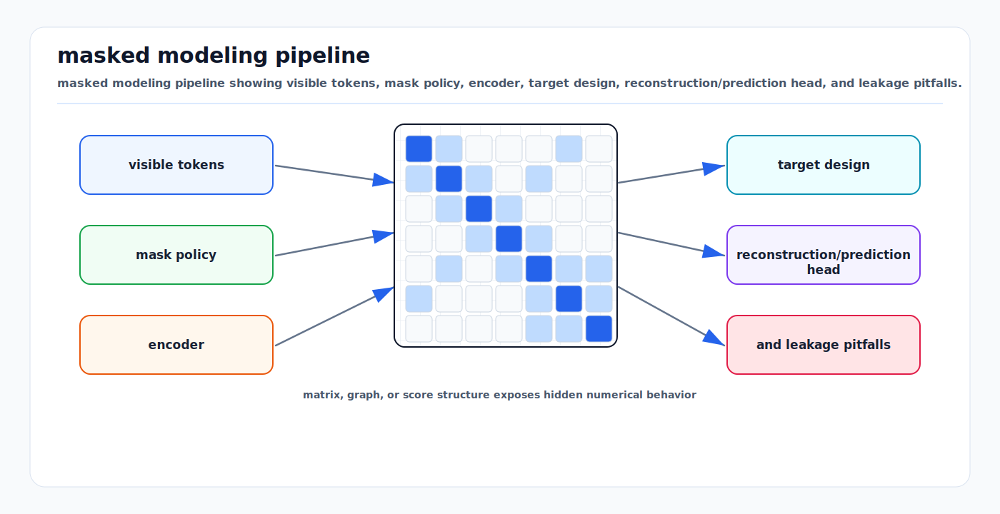

# Masked Modeling: First Principles

<!-- kb-visual:start -->


*Visual: masked modeling pipeline showing visible tokens, mask policy, encoder, target design, reconstruction/prediction head, and leakage pitfalls.*
<!-- kb-visual:end -->

## Scope

Masked modeling trains a model to infer hidden parts of an input from visible
context. It is the core idea behind BERT, BEiT, MAE, VideoMAE, point-cloud MAE,
and many BEV/occupancy pretraining systems. This note explains the math,
intuition, implementation interface, failure modes, and AV research relevance.

Related local notes:

- [self-supervised-learning-first-principles.md](self-supervised-learning-first-principles.md)
- [vision-transformers-first-principles.md](vision-transformers-first-principles.md)
- [vqvae-tokenization.md](vqvae-tokenization.md)
- [jepa-latent-predictive-learning.md](jepa-latent-predictive-learning.md)

## 1. The Core Idea

Given an input `x`, split it into visible and hidden parts:

```text
x = {x_visible, x_masked}
```

Train a model to predict the masked part:

```text
prediction = f_theta(x_visible, mask_pattern)
loss = distance(prediction, x_masked)
```

The representation is useful if predicting missing content requires learning
structure rather than memorizing local texture.

For AV data, the hidden part may be:

- text tokens in instructions or reports
- image patches
- video tubes
- LiDAR points or voxels
- BEV cells
- occupancy blocks
- map patches
- future frames or future occupancy

## 2. BERT: Masked Tokens

BERT masks some text tokens and trains a transformer encoder to recover them:

```text
input:  "the vehicle stopped at [MASK]"
target: "stand"
```

Mathematically:

```text
L = - sum_{i in M} log p_theta(x_i | x_not_M)
```

where `M` is the set of masked token positions.

The key modeling choice is bidirectional context. A masked token can use both
left and right context, unlike a causal language model that only uses the past.

AV use:

- parse airside instructions
- mine incident reports
- classify operator notes
- align route descriptions with scene observations

But BERT-style text masking does not directly solve metric perception. The
visual and geometric versions need different masking, targets, and decoders.

## 3. BEiT: Masked Visual Tokens

BEiT adapts BERT-style pretraining to images. It creates two views:

```text
image patches -> transformer input
image tokenizer -> discrete visual tokens as targets
```

The model sees corrupted image patches and predicts discrete visual token IDs:

```text
L = - sum_{i in M} log p_theta(token_i | visible_patches)
```

This is closer to language modeling because the target is a discrete token, not
raw pixels.

The first-principles tradeoff:

```text
Discrete targets can be semantic if the tokenizer is good.
They inherit tokenizer errors if the tokenizer is weak or domain-mismatched.
```

For AV scenes, a tokenizer trained on generic web images may not represent lane
markings, cones, aircraft equipment, LiDAR range structure, or thermal imagery
well.

## 4. MAE: Masked Autoencoding for Images

MAE masks a high fraction of image patches and reconstructs pixels. It uses an
asymmetric design:

```text
encoder: sees only visible patches
decoder: sees encoded visible patches + mask tokens
target: pixels for masked patches
```

Loss:

```text
L = mean_{i in M} ||x_i - x_hat_i||^2
```

The high mask ratio is important. If too much is visible, the model can solve
the task by local interpolation. With large missing regions, it must learn
object and scene structure.

For AV perception, MAE-style training can be applied to:

- camera images
- range images
- BEV features
- occupancy grids
- map tiles
- multi-camera mosaics

## 5. VideoMAE: Masked Tubes

VideoMAE extends MAE to video. Instead of masking independent image patches, it
often masks spatiotemporal tubes:

```text
video tensor: [time, height, width, channels]
mask unit:    same spatial patch across several frames
```

This makes the model infer motion and temporal consistency, not only spatial
appearance.

AV video relevance:

- motion cues for pedestrians and GSE
- traffic-light or signal temporal state
- object permanence through occlusion
- future occupancy and flow features
- temporal robustness under sensor dropout

The mask design should respect ego motion. A static world point moves in image
coordinates as the vehicle moves. Tube masking in raw image coordinates may not
correspond to a fixed physical location.

## 6. First-Principles View of Mask Design

Masking defines the self-supervised task. The task defines what features the
model learns.

| Mask pattern | Learns | Risk |
|---|---|---|
| random small patches | texture and local continuity | weak semantics |
| high-ratio random patches | object and scene structure | may lose small hazards |
| block masks | spatial completion | can over-smooth boundaries |
| tube masks | temporal motion and persistence | ego-motion mismatch |
| range-aware LiDAR masks | geometry completion | density shortcut |
| BEV region masks | map and occupancy context | blank free space dominates |
| future masks | prediction | future leakage if splits are wrong |

For AVs, mask sampling should overrepresent important but sparse structures:

- lane or stand markings
- curbs and boundaries
- cones and small obstacles
- pedestrians
- aircraft edges
- GSE attachment points
- occlusion boundaries

Otherwise the model can minimize average reconstruction loss by modeling easy
background.

## 7. Target Design

Targets can be:

| Target | Loss | Strength | Risk |
|---|---|---|---|
| pixels | MSE or normalized MSE | simple, detailed | texture bias |
| discrete tokens | cross entropy | semantic compression | tokenizer bias |
| features | L2 or cosine | abstraction | teacher bias |
| depth/range | L1, Huber | geometry | sensor noise |
| occupancy | BCE or CE | planning relevance | class imbalance |
| flow | endpoint error | dynamics | ambiguous futures |
| map elements | CE or set loss | route relevance | stale map leakage |

The target should match the downstream use. If the downstream task is planning,
predicting every pixel is often less useful than predicting occupancy, flow, or
latent state. If the downstream task is sensor simulation, pixel or range
fidelity matters more.

## 8. Implementation Interface

A masked modeling pipeline should make masking and targets explicit:

```python
class MaskedBatch(NamedTuple):
    input: Tensor
    visible_mask: Tensor
    target: Tensor
    target_mask: Tensor
    metadata: dict

class MaskedModel(nn.Module):
    def forward(self, x_visible, visible_mask, target_mask, metadata=None):
        """Predict masked targets from visible inputs."""
        ...
```

For image MAE:

```python
patches = patchify(images)                 # [B, N, P]
visible, target, mask = random_mask(patches, ratio=0.75)
z = encoder(visible, pos_visible)
pred = decoder(z, mask_tokens, pos_all)
loss = mse(pred[mask], target[mask])
```

For BEV occupancy:

```python
bev = make_bev(sensor_batch, calibration, ego_motion)
visible_bev, target_bev, mask = mask_bev_regions(bev)
pred_occ = model(visible_bev, mask)
loss = class_balanced_ce(pred_occ[mask], target_bev[mask])
```

Metadata is part of the interface, not an afterthought. AV masked modeling often
needs calibration ID, route ID, ego motion, timestamp, map version, and sensor
health.

## 9. Data Splits and Leakage

Masked modeling is especially vulnerable to leakage because nearby frames are
highly redundant.

Bad split:

```text
random frames from the same route and day in both train and validation
```

Better split:

```text
hold out by route, date, airport/site, weather condition, map version, and
sensor rig where possible
```

Future prediction requires stricter handling:

- do not let future map labels appear in current context
- do not use labels generated from future frames as "current" targets
- do not mix adjacent clips across train and validation
- keep teacher features generated by models trained on the validation set out of
  training

## 10. Evaluation Interface

Pretraining reconstruction loss is not enough.

Use:

- linear probe on frozen encoder
- few-label fine-tuning curves
- detection/segmentation/occupancy downstream tasks
- route/site/weather transfer
- small-object recall
- calibration perturbation tests
- sensor dropout and corruption tests
- latency and memory on target hardware

For masked BEV or occupancy models:

```text
metrics:
  masked reconstruction IoU
  occupied-cell recall
  rare-class recall
  boundary F1
  free-space false negative rate
  downstream planner collision rate
  uncertainty calibration of occupied probability
```

## 11. Failure Modes

| Failure mode | Symptom | Mitigation |
|---|---|---|
| Local interpolation shortcut | low pretrain loss, weak downstream transfer | higher mask ratio, larger blocks, semantic targets |
| Texture bias | good image reconstruction, poor geometry | depth/range/occupancy targets and BEV probes |
| Blank-space dominance | model predicts empty occupancy | class-balanced loss and rare-region sampling |
| Tokenizer mismatch | BEiT-like target misses domain details | train tokenizer on target sensor/domain data |
| Ego-motion leakage | temporal task solved from misaligned artifacts | compensate motion and audit timestamp alignment |
| Future leakage | validation too optimistic | sequence/date/site splits and label provenance |
| Small hazard erasure | model smooths cones/FOD/pedestrians | hard sampling and small-object probes |
| Decoder overcapacity | decoder solves task without useful encoder | lightweight decoder and frozen-feature probes |
| Uncalibrated confidence | reconstructed probability is overconfident | temperature scaling and reliability checks |

## 12. AV and Research Relevance

Masked modeling is useful in autonomy because unlabeled sensor data is abundant
and labels are expensive.

High-value applications:

- camera backbone pretraining for low-label airside perception
- LiDAR voxel or range-image pretraining
- BEV encoder pretraining for detection and occupancy
- map completion and map change detection
- video pretraining for temporal perception
- radar or thermal representation learning
- test-time adaptation with a bounded auxiliary loss
- world-model token or latent pretraining

For airside AVs, masked modeling is especially attractive because the target
domain is visually and geometrically different from road datasets. Unlabeled
airport logs can adapt features before expensive labeling.

## 13. Relationship to JEPA and Contrastive Learning

Masked modeling reconstructs hidden content:

```text
context -> missing pixels/tokens/occupancy
```

Contrastive learning identifies matching views:

```text
view A close to view B, far from negatives
```

JEPA predicts hidden embeddings:

```text
context -> target representation
```

A practical AV curriculum can combine them:

```text
1. contrastive pretraining for cross-modal and place invariance
2. masked modeling for spatial and geometric completion
3. JEPA or world-model objective for future prediction
4. supervised heads for detection, occupancy, mapping, and planning
```

## 14. Practical Checklist

Before training:

1. Choose the physical unit to mask: image patch, range cell, voxel, BEV cell,
   map patch, or video tube.
2. Choose targets that match downstream use: pixels, tokens, depth, occupancy,
   flow, features, or map elements.
3. Split by sequence, route, date, site, and map version.
4. Add metadata gates for calibration and time sync.
5. Define downstream probes before looking at pretraining results.

During training:

```text
monitor:
  masked loss by class and region
  visible/masked ratio
  rare-object reconstruction
  downstream probe score
  feature covariance
  failure examples by weather/site
```

## Sources

- Devlin et al., "BERT: Pre-training of Deep Bidirectional Transformers for Language Understanding." arXiv:1810.04805. https://arxiv.org/abs/1810.04805
- Bao et al., "BEiT: BERT Pre-Training of Image Transformers." arXiv:2106.08254. https://arxiv.org/abs/2106.08254
- He et al., "Masked Autoencoders Are Scalable Vision Learners." arXiv:2111.06377. https://arxiv.org/abs/2111.06377
- Tong et al., "VideoMAE: Masked Autoencoders are Data-Efficient Learners for Self-Supervised Video Pre-Training." arXiv:2203.12602. https://arxiv.org/abs/2203.12602
- Goodfellow, Bengio, and Courville, "Deep Learning." MIT Press, 2016. https://www.deeplearningbook.org/
- Vincent et al., "Stacked Denoising Autoencoders: Learning Useful Representations in a Deep Network with a Local Denoising Criterion." JMLR, 2010. https://jmlr.csail.mit.edu/papers/v11/vincent10a.html
