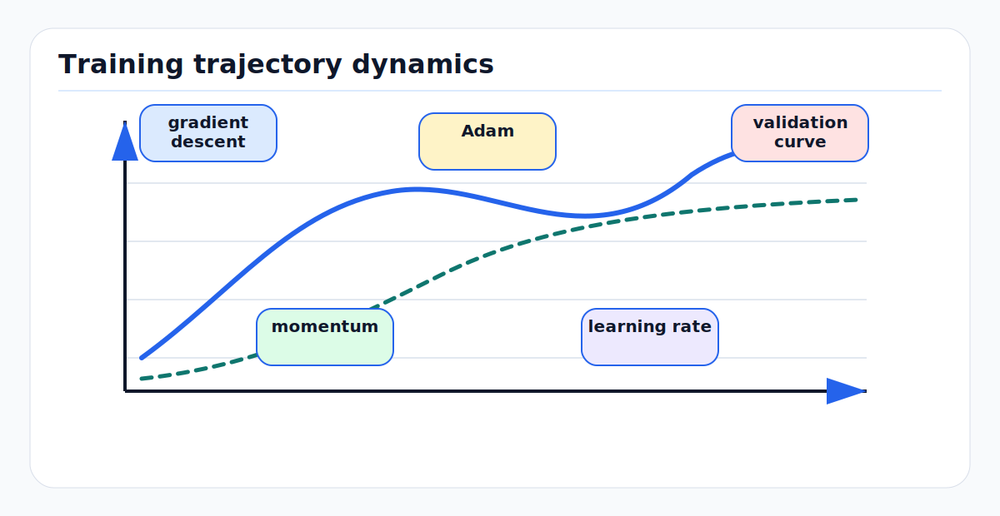

# Optimization and Training Dynamics: First Principles

<!-- kb-figure:start -->


*Figure: how optimizer state, learning rate, and noisy gradients shape the route through the loss landscape.*
<!-- kb-figure:end -->

## Training Is A Noisy Numerical Process

A neural network is trained by choosing parameters `theta` that minimize an
objective:

```text
min_theta E_{(x, y) ~ data} [L(f_theta(x), y)]
```

The expectation is unknown, so training uses mini-batches:

```text
g_t = grad_theta (1/B * sum_i L(f_theta(x_i), y_i))
theta_{t+1} = update(theta_t, g_t)
```

This is not just "fit the model". It is stochastic numerical optimization under
finite precision, noisy labels, non-stationary data curation, correlated video
frames, class imbalance, and multi-task losses. AV model quality often depends
as much on training dynamics as on the architecture diagram.

---

## 1. Gradient Descent

Full-batch gradient descent uses the exact empirical gradient:

```text
theta_{t+1} = theta_t - lr * grad L(theta_t)
```

For modern perception datasets, full-batch gradients are too expensive and often
less useful than noisy mini-batch gradients. Mini-batch SGD estimates the
gradient from a small batch:

```text
g_t = grad L_batch(theta_t)
theta_{t+1} = theta_t - lr * g_t
```

The learning rate `lr` controls step size. Too small wastes compute. Too large
causes divergence, loss spikes, or chaotic motion around useful regions.

### Noise Is Not Only Bad

Mini-batch noise can help escape sharp or narrow regions and acts as an implicit
regularizer. But AV batches are often correlated: adjacent frames, same route,
same weather, same log segment. A "batch size of 64" may contain far less
independent information than expected. Shuffle by scene and scenario, not only
by frame index.

---

## 2. Momentum

Momentum adds a velocity:

```text
v_t = beta * v_{t-1} + g_t
theta_{t+1} = theta_t - lr * v_t
```

It smooths noisy gradients and accelerates movement along consistent directions.
This helps in ravines where curvature is steep in one direction and shallow in
another.

Nesterov momentum evaluates the gradient after a lookahead step. In practice,
SGD with momentum remains strong for vision backbones and can generalize well,
but it often requires more learning-rate tuning than Adam-family methods.

---

## 3. Adam

Adam keeps exponential moving averages of first and second moments:

```text
m_t = beta1 * m_{t-1} + (1 - beta1) * g_t
v_t = beta2 * v_{t-1} + (1 - beta2) * g_t^2

m_hat = m_t / (1 - beta1^t)
v_hat = v_t / (1 - beta2^t)

theta_{t+1} = theta_t - lr * m_hat / (sqrt(v_hat) + eps)
```

Adam adapts step size per parameter. Parameters with consistently large
gradients receive smaller effective steps; sparse or small-gradient parameters
can move more. This is useful for large multi-task models, transformers,
embedding tables, and heads with rare labels.

Failure modes:

- Adam can overfit or generalize worse than SGD on some vision tasks.
- Bad `eps` or mixed precision can create numerical issues.
- Adaptive updates can mask poor loss scaling until late training.
- Optimizer state is large: two extra tensors per parameter.

---

## 4. AdamW And Decoupled Weight Decay

Classical L2 regularization adds `lambda * ||theta||^2` to the loss. For plain
SGD, this is equivalent to weight decay up to learning-rate scaling. For Adam,
it is not equivalent because the adaptive denominator changes the effect of the
L2 gradient.

AdamW decouples decay from the loss gradient:

```text
theta <- theta - lr * weight_decay * theta
theta <- theta - lr * adam_step(g)
```

This makes the decay coefficient easier to tune and is the default for many
transformer and modern perception models.

Implementation notes:

- Do not apply weight decay blindly to biases, BatchNorm parameters, LayerNorm
  parameters, or embeddings without checking conventions.
- Use parameter groups so backbone, heads, normalization, and newly initialized
  modules can have different learning rates or decay.
- When resuming training, optimizer state matters. Loading weights without
  optimizer state changes training dynamics.

---

## 5. Learning-Rate Schedules

The schedule is part of the optimizer. Common choices:

### Step Decay

```text
lr = lr0 * gamma^k
```

Simple and reliable, but discontinuities can cause loss jumps.

### Cosine Decay

```text
lr(t) = lr_min + 0.5 * (lr_max - lr_min) * (1 + cos(pi * t / T))
```

Smooth decay is common for large training runs.

### Warmup

```text
lr(t) = lr_max * t / warmup_steps
```

Warmup prevents early instability when weights, normalization statistics, and
optimizer moments are uncalibrated. It is especially useful for transformers,
large batches, mixed precision, and multi-task AV stacks.

### Restarts And Fine-Tuning

Changing datasets or unfreezing a backbone is a new optimization regime. Reset
or adjust optimizer state deliberately. A stale Adam state can push parameters
in directions appropriate for the old loss distribution.

---

## 6. Batch Size And Gradient Accumulation

Increasing batch size reduces gradient noise but changes the optimization
regime. A common heuristic is linear learning-rate scaling:

```text
lr_new ~= lr_old * batch_new / batch_old
```

This is not a law. It depends on data correlation, optimizer, normalization,
augmentation, and model scale.

AV constraints:

- High-resolution multi-camera input limits per-device batch size.
- BatchNorm statistics can become poor with tiny per-GPU batches.
- Gradient accumulation simulates larger batches for optimizer steps but does
  not change BatchNorm statistics unless synchronized or handled separately.
- Scenario-balanced sampling may be more valuable than raw batch size.

---

## 7. Gradient Clipping

Exploding gradients can occur in recurrent models, deep transformers, unstable
multi-task losses, or early training. Clip by norm:

```python
torch.nn.utils.clip_grad_norm_(model.parameters(), max_norm=1.0)
```

Clipping changes the optimizer step. It should be logged:

```text
if clipping happens every step, the learning rate or loss scale is probably too high
if clipping never happens, it may still be useful as a guardrail
```

For AV, clipping is common in temporal fusion, trajectory prediction, and
sequence models where rare hard examples can produce large losses.

---

## 8. Loss Balancing In Multi-Task Perception

AV networks often optimize:

```text
L_total = a * L_cls
        + b * L_box
        + c * L_velocity
        + d * L_segmentation
        + e * L_occupancy
        + f * L_trajectory
```

The coefficients define which tasks receive training priority. Do not select
them only so printed losses have similar numeric values. What matters is the
gradient each loss sends into shared parameters.

Diagnostics:

- Track each loss before weighting and after weighting.
- Track gradient norm per task on shared layers.
- Track task metrics by scenario slice.
- Check whether one task improves while another regresses after loss changes.
- Watch rare-class recall when adding auxiliary losses.

Multi-task learning can improve shared representation, but it can also create
negative transfer. Splitting heads, delaying some losses, or using task-specific
adapters can be more effective than endlessly tuning scalar weights.

---

## 9. Mixed Precision And Numerical Stability

Mixed precision reduces memory and increases throughput, but it narrows numeric
range for some tensors. Common tools:

- FP16 or BF16 autocast.
- Loss scaling for FP16.
- Keeping optimizer state in FP32.
- Stable fused losses such as cross-entropy with logits.

Failure modes:

- Gradients underflow to zero.
- Loss scaling overflows and skips steps.
- Softmax or exponentials overflow without stable forms.
- Small regression losses vanish relative to classification losses.

For safety-critical models, log skipped optimizer steps, gradient scaler values,
NaN/Inf counts, and dtype-specific divergence.

---

## 10. Training Diagnostics

A training run should be observable. Useful signals:

```text
train loss and validation loss
per-task metrics
per-class metrics
learning rate
gradient norm
parameter norm
update-to-weight ratio
activation histograms
logit histograms
BatchNorm running statistics
optimizer step skips
data loading and augmentation examples
```

CS231n emphasizes "babysitting" the learning process: sanity checks,
gradient checks, loss curves, train/validation gap, parameter-update ratios, and
activation/gradient distributions. That mindset is directly applicable to AV
training, where a broken data transform can look like an optimizer problem.

---

## 11. Failure Modes

### Loss Decreases, Metric Does Not

The loss may optimize class frequency, easy negatives, or proxy targets that do
not match the deployment metric. Inspect per-scenario and per-class metrics.

### Validation Improves, Deployment Regresses

Random validation splits can leak route, time, weather, or vehicle-specific
patterns. Use geographic, temporal, scenario, and sensor-version splits.

### Learning-Rate Spike

Symptoms include NaNs, dead activations, exploding BatchNorm statistics, and
sudden rare-class collapse. Check schedule boundaries, resume logic, and warmup.

### Optimizer State Mismatch

Resuming with different data, loss weights, or frozen modules but old optimizer
state can cause instability. Decide whether to reset moments by parameter group.

### Hidden Data Distribution Change

Optimizer tuning from one dataset version may fail after mining new hard
negatives or adding a new city. Treat dataset changes as optimization changes.

---

## 12. AV Review Checklist

```text
What optimizer and parameter groups are used?
Which parameters receive weight decay?
What is the learning-rate schedule and warmup?
Are optimizer states restored or reset on resume?
How are losses weighted?
Are per-task gradient norms monitored?
Is gradient clipping active and logged?
What is the effective independent batch size?
Are mixed-precision skips and NaNs tracked?
Are validation splits deployment-like?
```

The optimizer is part of the model. In AV systems, it determines which rare
events get learned, which shortcuts get reinforced, and which modules receive
useful credit assignment.

---

## 13. Sources

- Stanford CS231n, [Neural Networks Part 2](https://cs231n.github.io/neural-networks-2/).
- Stanford CS231n, [Neural Networks Part 3](https://cs231n.github.io/neural-networks-3/).
- Kingma and Ba, [Adam: A Method for Stochastic Optimization](https://arxiv.org/abs/1412.6980), 2015.
- Loshchilov and Hutter, [Decoupled Weight Decay Regularization](https://arxiv.org/abs/1711.05101), 2019.
- PyTorch, [AdamW](https://docs.pytorch.org/docs/stable/generated/torch.optim.AdamW).
- Goodfellow, Bengio, and Courville, [Deep Learning](https://www.deeplearningbook.org/), especially optimization for training deep models.
