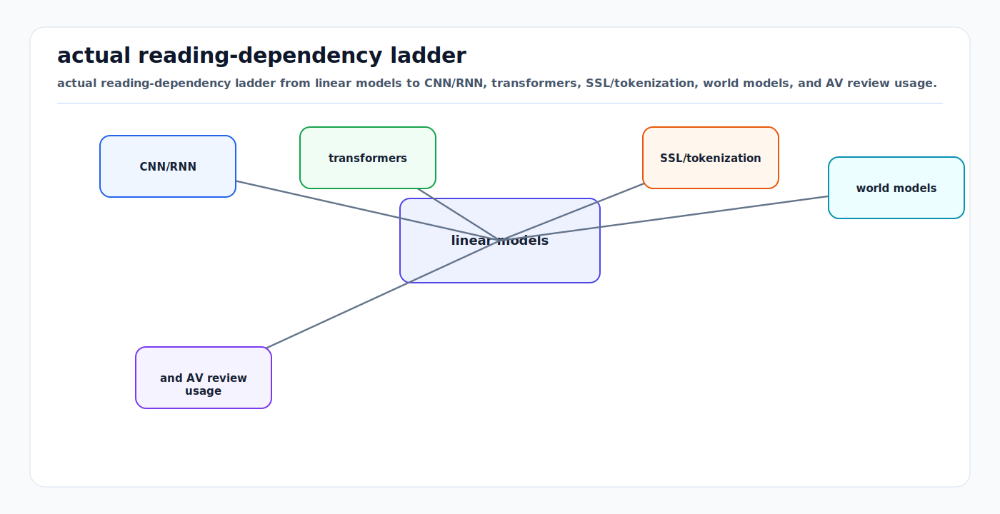

# Machine Learning Foundations for AV Perception

<!-- kb-visual:start -->


*Visual: actual reading-dependency ladder from linear models to CNN/RNN, transformers, SSL/tokenization, world models, and AV review usage.*
<!-- kb-visual:end -->

## Why This Ladder Exists

Autonomous-vehicle perception stacks are often described through the current
model family: BEV encoders, sparse attention, occupancy networks, world models,
diffusion planners, or state-space temporal fusion. Those systems are modern,
but the failure modes that matter in review still reduce to older first
principles:

- Is the classifier learning a decision boundary or memorizing a shortcut?
- Are logits, probabilities, and losses being interpreted correctly?
- Are gradients flowing through the computation that the team thinks they are?
- Are optimization dynamics stable under rare-object imbalance, hard negatives,
  and multi-task losses?
- Are convolutions, recurrence, attention, and state-space layers being used
  for the invariances they actually encode?
- Are representation objectives, tokenization choices, calibration procedures,
  and leakage checks aligned with the downstream safety claim?

This folder is organized as a ladder. The early notes build the classical
machinery: linear decision functions, probabilistic classification, multilayer
perceptrons, backpropagation, optimization, initialization, normalization,
regularization, convolutions, and recurrent networks. The later notes connect
those foundations to tokenization, transformers, diffusion, Mamba-style state
space models, contrastive and masked objectives, energy-based modeling,
world-model evaluation, and sparse 3D perception.

The intended reader is an AV engineer or researcher who needs to debug model
behavior, not just call a library. The notes emphasize math, implementation
interfaces, failure modes, and perception relevance.

---

## Recommended Reading Order

### 1. Linear Decisions

1. [Perceptron and Linear Classifiers](perceptron-linear-classifiers.md)
   - Starts from affine scores `s = W x + b`.
   - Explains perceptron updates, margins, separability, multiclass templates,
     and why linear probes remain useful for AV features.

2. [Logistic, Softmax, and Cross-Entropy](logistic-softmax-cross-entropy.md)
   - Turns raw scores into normalized probabilities.
   - Derives binary logistic loss, softmax likelihood, cross-entropy gradients,
     calibration concerns, and segmentation/detection pitfalls.

### 2. Differentiable Representation Learning

3. [Multilayer Perceptrons and Activations](multilayer-perceptrons-activations.md)
   - Shows why stacked affine maps need nonlinearities.
   - Covers ReLU-family activations, hidden representations, capacity, and
     MLP heads used in modern perception systems.

4. [Backpropagation, Computational Graphs, and Autodiff](backprop-computational-graphs-autodiff.md)
   - Derives reverse-mode differentiation from the chain rule.
   - Connects the 1986 backprop result to PyTorch autograd, tensor graphs,
     detach/no-grad behavior, and gradient debugging.

### 3. Training Dynamics

5. [Optimization and Training Dynamics](optimization-training-dynamics.md)
   - Treats training as stochastic numerical optimization.
   - Covers SGD, momentum, Adam, AdamW, schedules, gradient clipping, loss
     balancing, mixed precision, and diagnostics for unstable AV training.

6. [Initialization, Normalization, and Regularization](initialization-normalization-regularization.md)
   - Explains signal propagation through depth.
   - Covers Xavier/Glorot, He initialization, BatchNorm, LayerNorm, dropout,
     weight decay, data augmentation, and deployment-time normalization risks.

### 4. Structure in Space and Time

7. [Convolutional Neural Networks](convolutional-neural-networks.md)
   - Builds convolutions from local weight sharing and translation equivariance.
   - Covers receptive fields, stride, padding, dilation, grouped/depthwise
     convolution, BEV grids, camera feature pyramids, and deployment tradeoffs.

8. [Recurrent Neural Networks, LSTM, and GRU](recurrent-neural-networks-lstm-gru.md)
   - Builds sequence models from shared state transitions.
   - Covers BPTT, vanishing/exploding gradients, LSTM/GRU gating, temporal
     fusion, tracking, and where recurrence still beats large attention blocks.

### 5. Modern AV Model Families

9. [Attention and Transformers: First Principles](attention-transformers-first-principles.md)
   - Builds attention from query/key/value matching before the
     driving-specific transformer world-model note.

10. [Vision Transformers: First Principles](vision-transformers-first-principles.md)
    - Connects image, BEV, and point-cloud tokenization to transformer
      perception architectures.

11. [Sequence Models: RNNs, SSMs, Attention, and Mamba](sequence-models-rnn-ssm-attention-first-principles.md)
    - Places recurrent models, attention, and state-space sequence models on a
      single temporal-modeling axis.

12. [Self-Supervised Learning: First Principles](self-supervised-learning-first-principles.md)
    - Covers representation learning from unlabeled AV-scale data.

13. [Foundation Model Training: First Principles](foundation-model-training-first-principles.md)
    - Covers data, scaling, optimization, evaluation, and adaptation for modern
      large AV models.

14. [World Models: First Principles](world-models-first-principles.md)
    - Frames learned predictive dynamics models before the specialized token,
      transformer, diffusion, and JEPA notes.

15. [JEPA and Latent Predictive Learning](jepa-latent-predictive-learning.md)
    - Covers predictive learning in representation space as another world-model
      route.

16. [VQ-VAE and Discrete Tokenization](vqvae-tokenization.md)
   - Converts continuous BEV or scene features into discrete tokens for
     autoregressive or generative world models.

17. [Transformer Architecture for World Models](transformer-world-models.md)
    - Covers self-attention, causal masking, KV caches, positional encodings,
      and scene forecasting.

18. [Sparse Attention for 3D Perception](sparse-attention-3d-perception.md)
    - Focuses attention computation on sparse spatial structures such as voxels,
      pillars, queries, and object-centric tokens.

19. [Mamba and State Space Models for Autonomous Driving](mamba-ssm-for-driving.md)
    - Explains selective state-space sequence models as an O(n) alternative or
      complement to temporal transformers.

20. [Diffusion Models](diffusion-models.md)
    - Covers score-based denoising and its role in video generation, trajectory
      sampling, occupancy forecasting, and planning.

### 6. Objective, Tokenization, and Evaluation Companions

21. [Autoencoders, VAEs, and Latent Variable Models](autoencoders-vae-and-latent-variable-models-first-principles.md)
    - Connects reconstruction, latent bottlenecks, amortized inference, and
      generative likelihoods to perception and world-model representations.

22. [Contrastive Learning and InfoNCE](contrastive-learning-infonsce-first-principles.md)
    - Derives pairwise and instance-discrimination objectives, batch negatives,
      temperature, and common shortcut failures in AV self-supervision.

23. [Masked Modeling](masked-modeling-first-principles.md)
    - Covers MAE/BERT-style masking, reconstruction targets, mask ratios, and
      transfer differences across images, voxels, LiDAR, BEV tokens, and motion.

24. [Energy-Based Models](energy-based-models-first-principles.md)
    - Frames scoring, normalization, contrastive divergence, score matching,
      and anomaly/OOD use without treating energy scores as magic confidence.

25. [Tokenization and Discretization](tokenization-and-discretization-first-principles.md)
    - Generalizes beyond VQ-VAE into text tokens, image patches, BEV grids,
      point/voxel tokens, motion tokens, and quantization artifacts.

26. [Positional Encodings and Coordinate Tokenization](positional-encodings-and-coordinate-tokenization-first-principles.md)
    - Explains sinusoidal, learned, relative, rotary, Fourier, and 3D coordinate
      encodings for spatial-temporal driving models.

27. [State-Space Models, S4, and Mamba](state-space-models-s4-mamba-first-principles.md)
    - Gives the mathematical foundation beneath selective state-space sequence
      models before applying Mamba to AV temporal perception.

28. [Diffusion, Score, Flow, and Samplers](diffusion-score-flow-samplers-first-principles.md)
    - Unifies denoising diffusion, score-based SDEs, probability-flow ODEs,
      consistency/flow matching, and sampler tradeoffs.

29. [Multi-Task Losses and Objectives](multi-task-losses-and-objectives-first-principles.md)
    - Covers task weighting, gradient conflict, uncertainty weighting, PCGrad,
      and deployment implications for unified perception stacks.

30. [Evaluation, Calibration, and Data Leakage](evaluation-calibration-and-data-leakage-first-principles.md)
    - Covers train/val/test hygiene, calibration metrics, statistical testing,
      leakage modes, and safety-relevant model comparison.

31. [World-Model Evaluation and Planning Objectives](world-model-evaluation-and-planning-objectives-first-principles.md)
    - Separates prediction loss, latent quality, rollout stability, closed-loop
      planning utility, and safety monitorability.

---

## Dependency Map

```
linear scores
  -> logistic / softmax losses
  -> MLPs and activations
  -> backprop and autodiff
  -> optimization dynamics
  -> init / norm / regularization
  -> CNNs and RNNs
  -> tokenization, attention, SSMs, diffusion
  -> contrastive / masked / energy / latent objectives
  -> calibration, leakage checks, and multi-task objective design
  -> AV perception, prediction, planning, and world modeling
```

The ladder is intentionally cumulative. For example, a diffusion world model
still uses logits or continuous losses, backpropagation, initialization,
normalization, optimizer choices, convolutional inductive bias, sequence
modeling, and calibration checks. A sparse attention perception model still has
linear projections, softmax or sigmoid losses, cross-entropy class heads, and
optimizer state that can silently dominate behavior.

---

## How To Use These Notes In AV Reviews

Use the early notes as a diagnostic checklist:

- For a classifier failure, start with `s = W x + b`, logits, label encoding,
  class imbalance, calibration, and thresholding before blaming the backbone.
- For a training failure, inspect gradient paths, optimizer state, learning-rate
  schedule, initialization, normalization statistics, and multi-task loss scale.
- For a spatial failure, check receptive field, stride, interpolation,
  coordinate transforms, and padding before changing the architecture family.
- For a temporal failure, check state reset policy, sequence length, latency,
  BPTT truncation, hidden-state leakage, and timestamp alignment.
- For a representation failure, check the pretext objective, token definition,
  positional encoding, negative sampling, masking policy, and whether the
  learned invariance deletes safety-relevant evidence.
- For a model-comparison failure, check leakage, calibration, confidence
  intervals, statistical power, and whether the metric matches the operational
  risk being claimed.
- For a deployment failure, check train/inference mode, dtype, normalization,
  deterministic kernels, batching, and memory layout.

The modern notes should be read as extensions, not replacements. Transformers,
Mamba, and diffusion models are different ways to structure computation and
probability, but they inherit the same numerical and statistical constraints as
the classical models.

---

## Core Sources

- Goodfellow, Bengio, and Courville, [Deep Learning](https://www.deeplearningbook.org/).
- Stanford CS231n, [Linear Classification](https://cs231n.github.io/linear-classify/).
- Stanford CS231n, [Neural Networks Part 1](https://cs231n.github.io/neural-networks-1/).
- Stanford CS231n, [Neural Networks Part 2](https://cs231n.github.io/neural-networks-2/).
- Stanford CS231n, [Neural Networks Part 3](https://cs231n.github.io/neural-networks-3/).
- Stanford CS231n, [Convolutional Networks](https://cs231n.github.io/convolutional-networks/).
- PyTorch, [Automatic Differentiation with torch.autograd](https://docs.pytorch.org/tutorials/beginner/basics/autogradqs_tutorial.html).
