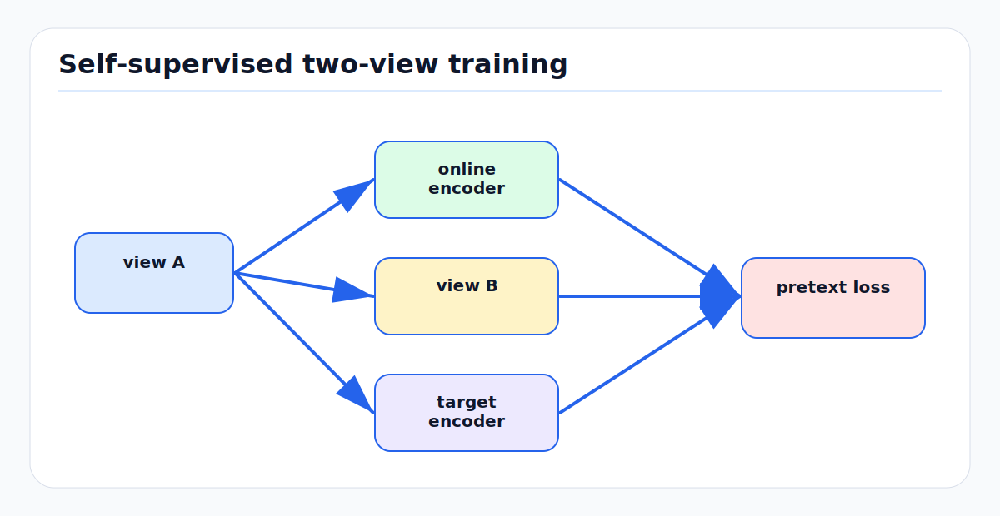

# Self-Supervised Learning: First Principles

<!-- kb-figure:start -->


*Figure: how unlabeled data creates paired prediction or contrastive tasks for representation learning.*
<!-- kb-figure:end -->

## Scope

Self-supervised learning (SSL) trains useful representations from unlabeled data by creating supervision from the data itself. This note covers the main SSL families behind modern vision and AV perception: contrastive learning, bootstrap/Siamese learning, self-distillation, masked autoencoding, and JEPA-style latent prediction. It complements the driving-specific survey in [30-autonomy-stack/perception/overview/self-supervised-pretraining-driving.md](../../30-autonomy-stack/perception/overview/self-supervised-pretraining-driving.md) and the JEPA-focused note [jepa-latent-predictive-learning.md](jepa-latent-predictive-learning.md).

## 1. Why SSL Matters for AVs

AV systems produce enormous unlabeled data streams:

- Camera video.
- LiDAR point clouds.
- Radar returns.
- Ego motion and control logs.
- Map changes.
- Occupancy grids and tracking histories.

Labels are expensive, especially for airside operations where object classes differ from road datasets. SSL turns raw logs into pre-training data. The goal is not to solve the final task directly. The goal is to learn features that make detection, segmentation, tracking, mapping, forecasting, and planning cheaper to train and more robust.

## 2. The General Recipe

Every SSL method defines:

1. Two or more views of the same underlying scene.
2. A prediction or matching task between those views.
3. A collapse-prevention mechanism.
4. A downstream evaluation protocol.

Examples:

```text
Image SSL:
  crop A and crop B of the same image should have related embeddings.

MAE:
  visible patches should reconstruct masked patches.

JEPA:
  visible context should predict target embeddings, not pixels.

LiDAR-camera distillation:
  a 3D point feature should align with the image feature at its projection.

Temporal SSL:
  past scene embeddings should predict future scene embeddings.
```

## 3. Contrastive Learning

Contrastive learning pulls positive pairs together and pushes negative pairs apart. SimCLR is the clean reference framework.

For a batch of views, the InfoNCE loss encourages each query to identify its positive among many negatives:

```text
loss_i = -log exp(sim(q_i, k_i) / tau) /
              sum_j exp(sim(q_i, k_j) / tau)
```

Where:

- `sim` is usually cosine similarity.
- `tau` is a temperature.
- `k_i` is the positive view.
- Other batch items are negatives.

SimCLR showed that augmentation composition, nonlinear projection heads, large batches, and longer training are central to strong contrastive features.

### AV Interpretation

Positive pairs can be:

- Two crops of the same camera image.
- Two augmented LiDAR scans.
- A LiDAR point and its projected camera patch.
- The same map cell observed by different traversals.
- The same place under different weather or lighting.

Negatives must be chosen carefully. In mapping, two different frames may show the same physical place. Treating them as negatives can damage place invariance.

## 4. Bootstrap and Siamese Methods

BYOL removed the need for explicit negatives. It uses:

- An online network.
- A target network updated by exponential moving average.
- A predictor head on the online branch.
- A loss that predicts the target representation of another augmented view.

SimSiam showed that a simpler Siamese system can work without negatives, large batches, or momentum encoders, but stop-gradient is essential to prevent collapse.

The first-principles lesson is:

```text
If the objective only says "make both branches equal", the model can map
everything to the same vector. The architecture or loss must prevent that.
```

Collapse prevention can come from negatives, stop-gradients, EMA teachers, variance regularization, whitening, clustering, reconstruction, or information bottlenecks.

## 5. DINO and DINOv2

DINO is self-distillation with no labels. A student network predicts a teacher network's distribution over prototypes for different crops of the same image. DINO with ViTs produced features with strong emergent object localization and useful k-NN behavior.

DINOv2 scaled this idea with curated diverse data and training stabilizations to produce general visual features that transfer across tasks without supervised labels.

For AV perception:

- DINOv2 features can provide semantic priors for cameras.
- 2D features can be lifted into 3D using calibration.
- LiDAR students can be trained to match camera foundation features.
- Frozen features need adapters or LoRA when the downstream geometry differs strongly from the pre-training domain.

Do not assume a frozen image foundation model is a drop-in BEV model. It sees image appearance, not metric occupancy or multi-view consistency.

## 6. Masked Autoencoders

MAE masks a high fraction of image patches and trains an encoder-decoder to reconstruct the missing pixels. Two design choices matter:

- The encoder processes only visible patches, reducing compute.
- The decoder is lightweight and reconstructs from the latent plus mask tokens.

MAE works because reconstructing missing content requires the model to learn structure. It is especially useful when downstream tasks need spatial detail.

For AVs, masked reconstruction targets can be:

- Pixels.
- Depth.
- Range images.
- BEV occupancy.
- Point tokens.
- Map patches.

Reconstruction can overemphasize texture or sensor-specific detail. For semantic perception, embedding prediction may be more efficient.

## 7. JEPA and Latent Prediction

I-JEPA predicts target-block embeddings from context-block embeddings rather than reconstructing pixels. The target representation is produced by a teacher encoder. The predictor learns abstract relationships between visible and hidden regions.

JEPA is attractive for world models because future pixels include many irrelevant details. For planning, the exact texture of a cloud or pavement patch is less important than the future geometry, affordances, and hazards.

See [jepa-latent-predictive-learning.md](jepa-latent-predictive-learning.md) for the deeper JEPA training and planning view.

## 8. SSL for SLAM and Mapping

SLAM and mapping need invariance and distinctiveness at the same time:

- Invariance: same place under different lighting, weather, viewpoint, and traffic.
- Distinctiveness: different but visually similar corridors, gates, or stands must remain separable.

SSL tasks should be chosen to preserve this balance.

Useful pretexts:

- Temporal cycle consistency: place descriptors should match across revisits.
- Cross-modal alignment: LiDAR geometry and camera semantics should agree.
- Future occupancy prediction: static map evidence should persist while dynamic objects move.
- Masked map reconstruction: infer missing lane, curb, stand, or apron markings from context.
- Ego-motion-aware prediction: predict the next local map after applying odometry.

Bad pretexts can teach the wrong invariances. Heavy random crops may help ImageNet classification but hurt metric map alignment if they erase geometric context.

## 9. SSL for AV Perception

### Camera

Use DINO/DINOv2, MAE, or video SSL for semantic and temporal features. Fine-tune with adapters when moving to BEV or airside domains.

### LiDAR

Use point or voxel MAE, contrastive point alignment, occupancy prediction, or LiDAR JEPA. LiDAR SSL should preserve metric structure and density variation.

### Camera-LiDAR

Cross-modal SSL is often stronger than single-modal SSL. Camera features provide semantics. LiDAR provides metric geometry. Projection through calibration creates positive pairs.

### Radar

Radar SSL can use Doppler consistency, LiDAR/radar spatial alignment, and temporal tracking. It is valuable for adverse weather and airside operations where visual degradation is common.

### Occupancy

Occupancy prediction is a natural self-supervised target because it aligns with planning. See [30-autonomy-stack/world-models/occupancy-world-models.md](../../30-autonomy-stack/world-models/occupancy-world-models.md).

## 10. Evaluation

Good SSL evaluation separates representation quality from downstream head complexity.

Use:

- Linear probe on frozen features.
- Few-label fine-tuning curves.
- Full fine-tuning on target tasks.
- Cross-domain transfer tests.
- Corruption and weather robustness tests.
- Calibration and uncertainty metrics.
- Closed-loop planning impact if the features feed a planner.

For mapping, evaluate:

- Place recognition recall.
- Localization drift after loop closure.
- Map change precision/recall.
- Static/dynamic separation.
- Long-term consistency across days.

For AV perception, evaluate:

- Detection and segmentation.
- Occupancy IoU and RayIoU.
- Tracking association.
- False negatives on unknown or rare objects.
- Latency on target hardware.

## 11. Data Pipeline Rules

1. Split by route, date, airport, or city, not random frames.
   Random frame splits leak scene identity and overstate transfer.

2. Preserve calibration metadata.
   Cross-modal SSL is only as good as time sync and extrinsics.

3. Keep raw and ego-motion-compensated forms.
   Some tasks need sensor realism; others need stable world coordinates.

4. Include negative conditions.
   Rain, night, glare, occlusion, jet blast haze, and sensor degradation should appear in pre-training.

5. Track data provenance.
   SSL can silently memorize private locations, signage, or operational patterns.

## 12. Choosing an SSL Objective

| Goal | Good objective | Caution |
|---|---|---|
| Semantic image features | DINO/DINOv2, contrastive | Needs geometric adaptation for BEV |
| Spatial reconstruction | MAE | May learn texture over semantics |
| LiDAR geometry | Point/voxel MAE, occupancy prediction | Needs density-aware augmentation |
| Cross-modal fusion | LiDAR-camera contrastive/distillation | Calibration quality is critical |
| Future prediction | JEPA, world-model objective | Avoid future leakage |
| Airside low-label adaptation | Road pretrain -> airside SSL -> small supervised set | Validate unknown objects separately |

## 13. Relationship to Other Local Docs

- [jepa-latent-predictive-learning.md](jepa-latent-predictive-learning.md): JEPA, V-JEPA 2, and latent predictive planning.
- [foundation-model-training-first-principles.md](foundation-model-training-first-principles.md): scaling, data mixture, LoRA, and fine-tuning.
- [vision-transformers-first-principles.md](vision-transformers-first-principles.md): ViT, Swin, BEVFormer, and PTv3 context.
- [vqvae-tokenization.md](vqvae-tokenization.md): discrete tokenizers used by some world models and masked token objectives.
- [30-autonomy-stack/perception/overview/self-supervised-pretraining-driving.md](../../30-autonomy-stack/perception/overview/self-supervised-pretraining-driving.md): driving-specific SSL survey.
- [30-autonomy-stack/world-models/tokenized-and-jepa.md](../../30-autonomy-stack/world-models/tokenized-and-jepa.md): tokenized and JEPA-style world models.

## Sources

- Chen et al., "A Simple Framework for Contrastive Learning of Visual Representations" (SimCLR). arXiv:2002.05709. https://arxiv.org/abs/2002.05709
- Grill et al., "Bootstrap your own latent: A new approach to self-supervised Learning" (BYOL). arXiv:2006.07733. https://arxiv.org/abs/2006.07733
- Chen and He, "Exploring Simple Siamese Representation Learning" (SimSiam). arXiv:2011.10566. https://arxiv.org/abs/2011.10566
- Caron et al., "Emerging Properties in Self-Supervised Vision Transformers" (DINO). arXiv:2104.14294. https://arxiv.org/abs/2104.14294
- Oquab et al., "DINOv2: Learning Robust Visual Features without Supervision." arXiv:2304.07193. https://arxiv.org/abs/2304.07193
- He et al., "Masked Autoencoders Are Scalable Vision Learners." arXiv:2111.06377. https://arxiv.org/abs/2111.06377
- Assran et al., "Self-Supervised Learning from Images with a Joint-Embedding Predictive Architecture" (I-JEPA). arXiv:2301.08243. https://arxiv.org/abs/2301.08243
