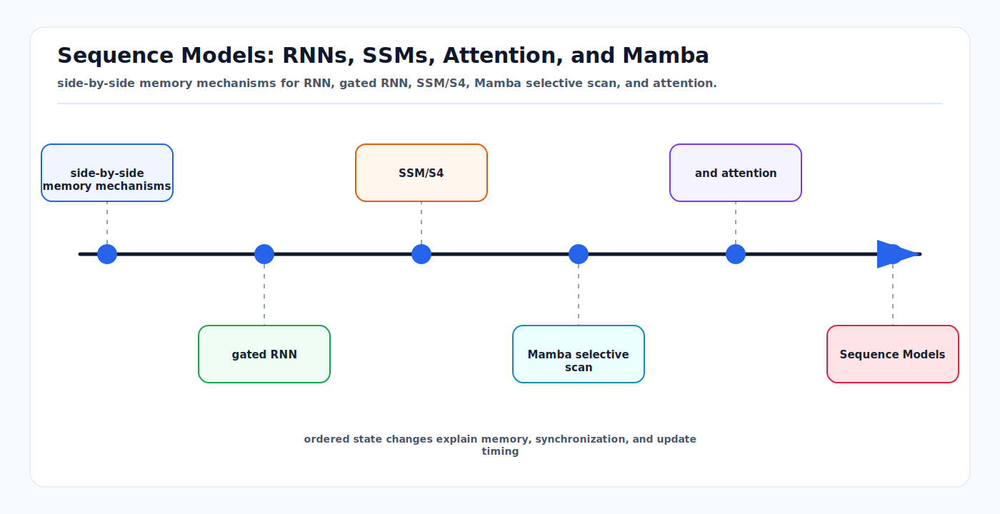

# Sequence Models: RNNs, SSMs, Attention, and Mamba

<!-- kb-visual:start -->


*Visual: side-by-side memory mechanisms for RNN, gated RNN, SSM/S4, Mamba selective scan, and attention.*
<!-- kb-visual:end -->

## Scope

This note explains sequence modeling from first principles, from RNNs through S4, Mamba, Mamba-2, Mamba-3, and attention. It is intended for AV temporal perception, SLAM, mapping, tracking, and world-model readers. For driving-specific Mamba papers and deployment detail, see [mamba-ssm-for-driving.md](mamba-ssm-for-driving.md). For attention math, see [attention-transformers-first-principles.md](attention-transformers-first-principles.md).

## 1. The Sequence Problem

A sequence model consumes ordered data:

```text
x_1, x_2, ..., x_T
```

and predicts outputs:

```text
y_1, y_2, ..., y_T
```

or a future:

```text
x_{T+1:T+H}
```

In AV systems, sequences appear everywhere:

- Camera frames.
- LiDAR sweeps.
- Radar tracks.
- BEV occupancy history.
- Ego states and controls.
- SLAM keyframes.
- Map updates over weeks.
- Agent trajectories.

The central design question is how information from the past influences the present.

## 2. RNNs: Fixed-Size Learned Memory

A recurrent neural network maintains a hidden state:

```text
h_t = f(h_{t-1}, x_t)
y_t = g(h_t)
```

The hidden state is a fixed-size memory of the past. This is efficient:

```text
Inference memory: O(d)
Per-step compute: O(d^2)
```

But simple RNNs struggle with long-range dependencies because gradients vanish or explode through many recurrent steps.

## 3. Gated RNNs: GRU and LSTM

LSTMs and GRUs add gates that decide what to write, keep, and forget.

The high-level idea:

```text
new state = keep_gate * old_state + write_gate * candidate_state
```

Gates make recurrent memory easier to train. They are still useful for small embedded systems, trackers, smoothing, and low-latency fusion.

Limitations:

- Training is less parallel than transformers.
- Fixed-size state can bottleneck detailed long histories.
- Memory content is implicit and hard to query exactly.

For SLAM and mapping, this means an RNN can summarize motion history but is a poor replacement for an explicit map or keyframe memory.

## 4. State Space Models

State space models (SSMs) come from dynamical systems. A continuous-time linear SSM is:

```text
dh(t) / dt = A h(t) + B x(t)
y(t)      = C h(t) + D x(t)
```

After discretization:

```text
h_t = A_bar h_{t-1} + B_bar x_t
y_t = C h_t + D x_t
```

This looks like an RNN, but with structured dynamics. The key advantage is that some SSMs can be computed either as recurrence or as convolution:

```text
y = K * x
```

That gives two modes:

- Parallel convolution for training.
- Recurrent state updates for streaming inference.

## 5. S4

S4 made structured state spaces practical for long sequences. It uses a parameterization that preserves long-range memory while enabling efficient computation.

S4's first-principles contribution:

```text
Use continuous-time state dynamics with structure,
then exploit that structure for efficient long-sequence modeling.
```

S4 was strong on long-range sequence benchmarks, but its parameters were mostly fixed across input content. That limits content-based selection. For language, perception, and world models, the model often needs to decide that this token is important while that token can be forgotten.

## 6. Mamba: Selective State Spaces

Mamba makes SSM parameters input-dependent:

```text
B_t     = Linear_B(x_t)
C_t     = Linear_C(x_t)
Delta_t = softplus(Linear_Delta(x_t))
```

Then:

```text
A_bar_t = exp(Delta_t A)
h_t = A_bar_t h_{t-1} + B_bar_t x_t
y_t = C_t h_t
```

This is "selective" because the current token controls how the state is updated and read. Some inputs preserve memory. Others reset or overwrite it.

Why it matters:

- Linear scaling in sequence length.
- Constant-size inference state.
- Better content sensitivity than fixed SSMs.
- Good fit for streaming sensor processing.

Mamba also introduced a hardware-aware selective scan, because input-dependent parameters prevent the simple convolution trick used by earlier SSMs.

## 7. Mamba-2: SSM and Attention Meet

Mamba-2 introduced structured state space duality (SSD), showing a close mathematical relationship between SSMs and variants of attention through structured semiseparable matrices.

The practical result is a new Mamba-2 layer that is faster than Mamba-1 and easier to map onto GPU matrix multiplications.

First-principles lesson:

```text
The boundary between linear attention and SSM recurrence is not sharp.
Both can be seen as structured ways to move information forward in time.
```

This matters for AV models because it encourages hybrid designs: use attention where exact content lookup is needed, and use SSMs where long streaming memory is needed.

## 8. Mamba-3

Mamba-3, verified as an ICLR 2026 paper, focuses on inference-first linear sequence modeling. It adds:

- More expressive recurrence from SSM discretization.
- Complex-valued state updates for richer state tracking.
- Multi-input multi-output (MIMO) formulation to improve performance without increasing decode latency.

The paper reports improved retrieval, state-tracking, and downstream language modeling, including comparable perplexity to Mamba-2 with half the state size in state-size experiments.

For AV readers, the key implication is not that Mamba-3 should replace every transformer. It suggests that the linear-model frontier is moving toward better state tracking, which is exactly the weakness that matters for streaming autonomy.

## 9. Attention as Externalized Memory

Attention keeps past tokens available and computes content-based lookup:

```text
y_t = sum_i weight(t, i) value_i
```

For causal inference, a transformer often uses a KV cache. The cache stores keys and values for all previous tokens.

```text
Inference memory: O(T d)
Per-step lookup: O(T d)
```

This is expensive, but it supports exact retrieval from past tokens. If a rare event occurred 8 seconds ago, attention can directly attend to that token. A fixed recurrent state must have compressed it.

## 10. Comparison

| Model family | Training | Inference memory | Strength | Weakness |
|---|---|---|---|---|
| RNN/GRU/LSTM | Sequential or limited parallel | Constant | Simple streaming | Long memory bottleneck |
| S4 | Parallel convolution | Constant | Long continuous signals | Limited content selection |
| Mamba | Parallel scan | Constant | Selective streaming memory | Harder exact retrieval |
| Transformer attention | Fully parallel | Grows with context | Content lookup and global mixing | Quadratic training cost |
| Hybrid SSM-attention | Mixed | Mixed | Balance of memory and lookup | More design complexity |

## 11. AV Temporal Design Patterns

### Streaming Perception

Use Mamba or RNN-style state for long, high-rate streams:

```text
radar detections -> temporal SSM -> tracks
BEV features over 10 seconds -> Mamba -> temporal context
map-change observations -> SSM -> persistent evidence score
```

### Local Reasoning

Use attention for short windows where exact interactions matter:

```text
objects in current scene -> self-attention -> interactions
BEV tokens in local region -> window attention -> spatial context
trajectory candidates -> cross-attention -> cost volume
```

### Memory Retrieval

Use explicit memory or attention for retrieval:

```text
current place descriptor -> attention over map memory -> loop closure candidates
current map tile -> cross-attention to historical tile embeddings -> change detection
```

### Hybrid Temporal World Model

Use attention for spatial tokens and SSM for time:

```text
per-frame BEV transformer
    -> temporal Mamba over each BEV cell or object token
    -> future occupancy or trajectory head
```

This avoids full spatiotemporal attention over `T * H * W` tokens.

## 12. SLAM and Mapping Considerations

Sequence models in SLAM must respect geometry:

- Ego motion changes the coordinate frame.
- Sensor timestamps are not simultaneous.
- Loop closure depends on place identity, not just recent sequence state.
- Static map evidence should persist; dynamic object evidence should decay.

A good temporal neural layer usually sits after motion compensation:

```text
sensor frame -> features -> ego-motion warp -> temporal model -> map update
```

Without motion compensation, the model spends capacity learning vehicle motion instead of scene dynamics.

## 13. State Reset and Distribution Shift

Streaming models need reset rules:

- Start of route.
- Localization jump.
- Sensor dropout.
- Large time gap.
- Severe weather transition.
- Vehicle enters a different operational zone.

If the hidden state persists through a discontinuity, predictions can become confidently wrong. Production systems should expose state health and support explicit resets.

## 14. Choosing the Right Sequence Model

| Need | Recommendation |
|---|---|
| Short context, rich interactions | Transformer attention |
| Very long stream, fixed memory | Mamba or SSM |
| Tiny embedded model | GRU/LSTM |
| Precise map/place retrieval | Attention over explicit memory |
| Long video world model | Hybrid attention plus SSM or latent world model |
| Real-time tracking | Kalman/filter baseline plus learned temporal features |
| Safety-critical planning | Learned model plus explicit uncertainty and rule checks |

## 15. Relationship to Other Local Docs

- [mamba-ssm-for-driving.md](mamba-ssm-for-driving.md): driving-specific Mamba, MambaOcc, DriveMamba, and deployment.
- [attention-transformers-first-principles.md](attention-transformers-first-principles.md): attention math and transformer blocks.
- [transformer-world-models.md](transformer-world-models.md): GPT-style world-model transformer details.
- [world-models-first-principles.md](world-models-first-principles.md): model-based prediction and planning context.
- [30-autonomy-stack/perception/overview/streaming-temporal-perception.md](../../30-autonomy-stack/perception/overview/streaming-temporal-perception.md): temporal perception context.
- [30-autonomy-stack/localization-mapping/overview/robust-state-estimation-multi-sensor.md](../../30-autonomy-stack/localization-mapping/overview/robust-state-estimation-multi-sensor.md): classical state-estimation counterpart.

## Sources

- Gu et al., "Efficiently Modeling Long Sequences with Structured State Spaces" (S4). arXiv:2111.00396. https://arxiv.org/abs/2111.00396
- Gu and Dao, "Mamba: Linear-Time Sequence Modeling with Selective State Spaces." arXiv:2312.00752. https://arxiv.org/abs/2312.00752
- Dao and Gu, "Transformers are SSMs: Generalized Models and Efficient Algorithms Through Structured State Space Duality" (Mamba-2). arXiv:2405.21060. https://arxiv.org/abs/2405.21060
- Lahoti et al., "Mamba-3: Improved Sequence Modeling using State Space Principles." arXiv:2603.15569. https://arxiv.org/abs/2603.15569
- Vaswani et al., "Attention Is All You Need." arXiv:1706.03762. https://arxiv.org/abs/1706.03762
