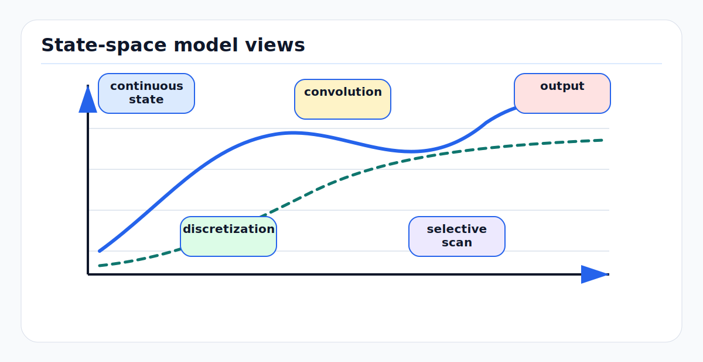

# State Space Models, S4, and Mamba: First Principles

<!-- kb-figure:start -->


*Figure: how continuous dynamics, convolution views, and selective scanning connect S4 and Mamba models.*
<!-- kb-figure:end -->

## Why This Page Exists

State-space models are the bridge between classical dynamical systems and modern long-sequence neural networks. They matter for AV research because autonomy data is naturally streaming: LiDAR sweeps, camera frames, radar detections, tracks, occupancy maps, map-change evidence, and world-model latents arrive over time.

This page focuses on the math layer behind S4, Mamba, Mamba-2, and Mamba-3. For the broader temporal-modeling comparison, see [Sequence Models: RNNs, SSMs, Attention, and Mamba](sequence-models-rnn-ssm-attention-first-principles.md). For driving-specific applied papers, see [Mamba and State Space Models for Autonomous Driving](mamba-ssm-for-driving.md).

## Continuous-Time State Space

A linear state-space model has hidden state `h(t)`, input `x(t)`, and output `y(t)`:

```text
dh(t) / dt = A h(t) + B x(t)
y(t)      = C h(t) + D x(t)
```

`A` controls memory dynamics, `B` writes the input into state, `C` reads state into output, and `D` is a direct skip from input to output.

This is already familiar to robotics engineers: Kalman filters, vehicle models, IMU propagation, and control systems all use state-space equations. Neural SSMs replace hand-designed state dynamics with trainable ones while preserving the idea of a hidden state that evolves through time.

## Discretization

Digital systems process sequences at discrete times:

```text
h_t = A_bar h_{t-1} + B_bar x_t
y_t = C h_t + D x_t
```

For a sampling interval `Delta`, a common zero-order-hold discretization is:

```text
A_bar = exp(Delta A)
B_bar = A^{-1}(A_bar - I) B
```

The sampling interval matters. In AV systems, a model trained on fixed 10 Hz frames can fail when sensors stream at 5 Hz, 12 Hz, or event-driven intervals. Modern SSM layers often learn or condition `Delta` so the model can adapt memory updates to the input.

## Convolution View

Unrolling the recurrence gives:

```text
y_t = C A_bar^0 B_bar x_t
    + C A_bar^1 B_bar x_{t-1}
    + C A_bar^2 B_bar x_{t-2}
    + ...
```

This is a convolution:

```text
y = K * x
K_i = C A_bar^i B_bar
```

That dual view is the key SSM advantage:

- During training, use convolution-like parallelism over the whole sequence.
- During streaming inference, use recurrent state updates with constant memory.

For AV, this means one family of layers can support both offline training on long logs and online execution on a vehicle.

## S4

S4 made long-sequence SSMs practical by using structured state matrices that preserve long memory while allowing efficient computation. Its core contribution was not just "use recurrence"; it was a parameterization and algorithmic path that made long-range state dynamics trainable and fast.

The useful intuition:

```text
S4 learns a bank of stable filters over time.
Each filter has dynamics controlled by A, written by B, and read by C.
```

Strengths:

- Handles very long sequences.
- Trains efficiently with structured convolution.
- Provides a strong alternative to attention when exact token lookup is not required.

Limitations:

- Dynamics are mostly fixed after training.
- The model cannot easily choose different memory rules for different input content.
- Practical tuning can be more complex than a standard transformer block.

## Selective State Spaces

Mamba adds input-dependent selection. Instead of fixed `B`, `C`, and `Delta`, the layer computes them from the current token:

```text
B_t     = f_B(x_t)
C_t     = f_C(x_t)
Delta_t = softplus(f_Delta(x_t))
```

Then:

```text
h_t = A_bar_t h_{t-1} + B_bar_t x_t
y_t = C_t h_t
```

This means the model can decide when to write strongly, when to forget, and when to preserve memory. In a perception stream, a sudden moving object, sensor dropout, or map-change cue can trigger a different state update than a routine static frame.

## Mamba

Mamba combines selective SSMs with a hardware-aware parallel scan. Selection makes the layer more expressive, but it removes the simple fixed convolution trick. The scan algorithm restores efficient sequence processing.

Operational properties:

| Property | Meaning |
|---|---|
| Linear sequence scaling | Compute grows roughly with sequence length rather than with pairwise token interactions. |
| Constant streaming state | Inference does not require a full KV cache. |
| Content-dependent memory | Input controls how state is updated and read. |
| Less exact retrieval | A compressed state is not the same as attention over all past tokens. |

For AV, Mamba is attractive when the model must process long histories at high rate: radar streams, BEV memory, map-change evidence, fleet logs, or long occupancy sequences.

## Mamba-2 and Structured State Space Duality

Mamba-2 reframes SSMs and attention through structured state space duality. The important lesson is that attention and SSMs are not unrelated species; both can be described as structured ways to move information across a sequence.

The Mamba-2 design improves parallelism and matrix-multiplication efficiency. It also makes hybrid designs more natural:

- Use attention for short-range relational reasoning and exact lookup.
- Use SSM blocks for long streaming memory.
- Use both when a model needs high-rate processing and occasional global interaction.

## Mamba-3 Direction

Mamba-3 continues the inference-first direction with richer state dynamics, including more expressive recurrent updates and multi-input/multi-output formulations. The key trend is better state tracking without giving up the linear-time inference profile.

For autonomy, the open question is not "will Mamba replace transformers?" The better question is where compressed streaming state is safer and cheaper than keeping full attention context.

## AV Design Guidance

| Use case | SSM/Mamba fit | Caution |
|---|---|---|
| Online radar or LiDAR temporal filtering | Strong | Verify timestamp handling and sensor-rate changes. |
| Long BEV memory for occupancy | Strong | Check whether rare events survive compression. |
| Dynamic map-change evidence over time | Strong | Preserve explicit evidence logs outside hidden state. |
| Object interaction reasoning | Mixed | Attention may be better for pairwise relation lookup. |
| World-model latent rollout | Promising | Closed-loop error accumulation must be evaluated. |
| Safety-critical state estimation | Auxiliary only | Do not replace calibrated estimators without consistency evidence. |

## Failure Modes

- Hidden state forgets rare but safety-critical events.
- Training sequence length differs from deployment context length.
- Sensor-rate changes alter effective discretization.
- Compressed memory hides why a decision changed.
- Long-context benchmark gains do not translate to closed-loop planning.
- Hybrid Mamba-transformer models become hard to profile on embedded hardware.

## Review Checklist

```text
What is the sequence length during training and deployment?
Is the model causal, bidirectional, or chunked?
How does it handle variable sensor intervals?
What state is retained across planner cycles?
Can rare events be probed from the hidden state?
Is exact retrieval required, or is compressed memory enough?
What happens after dropped frames, time jumps, and sensor resets?
```

## Sources

- Gu et al., "Efficiently Modeling Long Sequences with Structured State Spaces": https://arxiv.org/abs/2111.00396
- Gu and Dao, "Mamba: Linear-Time Sequence Modeling with Selective State Spaces": https://arxiv.org/abs/2312.00752
- Dao and Gu, "Transformers are SSMs: Generalized Models and Efficient Algorithms Through Structured State Space Duality": https://arxiv.org/abs/2405.21060
- "Mamba-3: Enhancing Linear Sequence Modeling with MIMO and Complex-Valued Dynamics": https://arxiv.org/abs/2603.15569
- Local companion: [Sequence Models: RNNs, SSMs, Attention, and Mamba](sequence-models-rnn-ssm-attention-first-principles.md)
