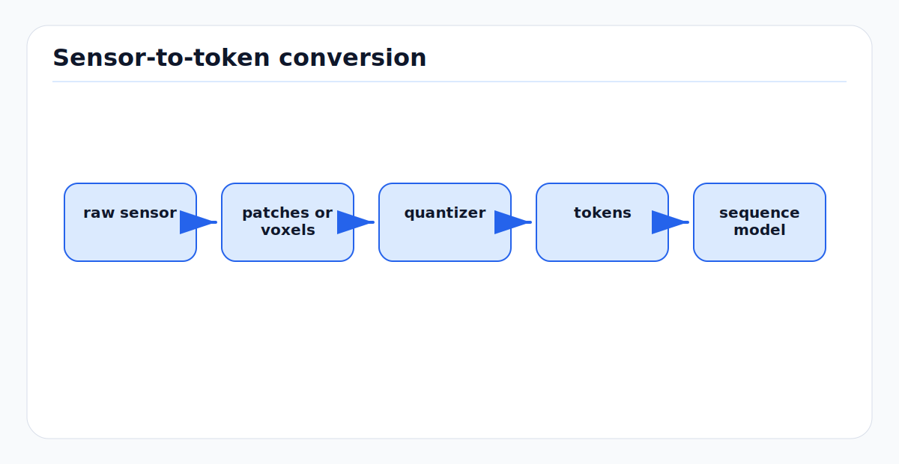

# Tokenization and Discretization: First Principles

<!-- kb-figure:start -->


*Figure: how continuous sensor signals become discrete or structured tokens for foundation and world models.*
<!-- kb-figure:end -->

## Scope

Tokenization turns continuous or structured data into discrete units that a model can index, embed, compress, and predict. In language this means subword tokens. In AV systems it can mean image patches, BEV cells, point tokens, occupancy codes, trajectory tokens, map tokens, or VQ-VAE codebook indices.

This page broadens the narrower [VQ-VAE and Discrete Tokenization](vqvae-tokenization.md) note. It explains the design choices that decide what a transformer, diffusion model, JEPA encoder, or world model can represent.

## Why Tokenization Matters

A model cannot recover information destroyed by its tokenizer. If tokenization erases small debris, thin cones, lane markings, aircraft gear, or low-height obstacles, the downstream model will not reason about them reliably.

Tokenization controls:

- Vocabulary size and memory.
- Spatial or temporal resolution.
- Compression ratio.
- Reconstruction quality.
- Rare-object preservation.
- Whether prediction is discrete classification or continuous regression.

## Text Tokenization

Language models typically use subword tokenization. Byte Pair Encoding starts from characters or bytes and repeatedly merges frequent adjacent symbols. SentencePiece trains subword units directly from raw text without requiring pre-tokenized words.

Why AV engineers should care:

- Prompted perception, VLMs, and VLA models inherit subword quirks.
- Rare airport terms, part numbers, and local procedures can split into awkward tokens.
- Text tokenization affects grounding for rare classes such as "towbarless tug" or "belt loader".

## Image and Video Tokens

Vision transformers often split an image into patches:

```text
image H x W x C -> patches N x (P*P*C) -> linear projection -> tokens
```

Patch size is a safety-relevant parameter. Larger patches reduce compute but can erase small hazards. Video tokenization adds time:

```text
frames x patches -> spatiotemporal tokens
```

For world models, video tokens may be predicted autoregressively, masked, or denoised. Temporal stride controls whether short events such as a pedestrian stepping out, a cone falling, or a tug starting motion remain visible.

## BEV, Voxel, and Point Tokens

AV perception often tokenizes geometry instead of pixels.

| Token type | Example | Strength | Weakness |
|---|---|---|---|
| Pillar token | PointPillars-style vertical column | Efficient BEV | Loses vertical detail. |
| Voxel token | Sparse 3D voxel | Metric geometry | Large memory if dense. |
| Point token | Raw or sampled point | Preserves geometry | Irregular and expensive. |
| Object query | DETR/Sparse4D query | Compact instances | Can miss unknown objects. |
| Occupancy token | Cell/voxel state | Planner-friendly | Resolution tradeoff. |
| Map token | Lanelet, polyline, landmark | Structured prior | Map staleness risk. |

Dynamic/static removal depends on this choice. A voxel tokenizer can preserve occupancy evidence for unknown debris. An object-query tokenizer may ignore objects outside its learned query distribution.

## Quantization

Vector quantization maps a continuous latent vector to the nearest codebook entry:

```text
z_q = e_argmin_k ||z_e - e_k||^2
```

This creates discrete indices that can be modeled like language tokens. But the codebook becomes an information bottleneck.

Common failure modes:

- Codebook collapse: only a few codes are used.
- Rare-object erasure: small hazards share codes with background.
- Domain collapse: road-trained codes poorly represent airside objects.
- Reconstruction bias: visually pleasing reconstructions hide metric errors.

## Finite Scalar Quantization

Finite Scalar Quantization replaces learned vector codebooks with scalar quantization across latent dimensions. It can reduce codebook collapse and simplify training. The tradeoff is that the representation geometry is different from nearest-neighbor vector codebooks.

FSQ is useful to know because world-model tokenizers are moving beyond classic VQ-VAE when stability matters.

## Rate-Distortion View

Tokenization is a rate-distortion problem:

```text
minimize distortion subject to limited bits
```

For AV, distortion should not be measured only by reconstruction loss. It should include downstream task loss:

- Free-space error.
- Small-object recall.
- Localization landmark preservation.
- Motion-state preservation.
- Map-change sensitivity.
- Planner collision cost.

## Tokenizer Evaluation

A tokenizer should be evaluated before the world model built on top of it.

| Test | What it catches |
|---|---|
| Reconstruction by object size | Small hazards disappearing. |
| Occupancy IoU by height/range | Thin or far geometry loss. |
| Motion-state probe | Dynamic/static evidence erased. |
| Map-change probe | Moved-object evidence compressed away. |
| Domain split | Airside or indoor tokens underused. |
| Code usage/perplexity | Collapse or wasteful vocabulary. |

## AV Implementation Guidance

- Preserve raw sensor logs and tokenized outputs for audit.
- Probe token embeddings for safety-relevant attributes.
- Report tokenizer metrics separately from model metrics.
- Tune token resolution by hazard size, not only benchmark throughput.
- Avoid training a planner on tokenized worlds before proving the tokenizer preserves collision-relevant geometry.

## Sources

- Sennrich et al., "Neural Machine Translation of Rare Words with Subword Units": https://arxiv.org/abs/1508.07909
- Kudo and Richardson, "SentencePiece": https://arxiv.org/abs/1808.06226
- van den Oord et al., "Neural Discrete Representation Learning": https://arxiv.org/abs/1711.00937
- Mentzer et al., "Finite Scalar Quantization": https://arxiv.org/abs/2309.15505
- Dosovitskiy et al., "An Image is Worth 16x16 Words": https://arxiv.org/abs/2010.11929
- Local companion: [VQ-VAE and Discrete Tokenization](vqvae-tokenization.md)
