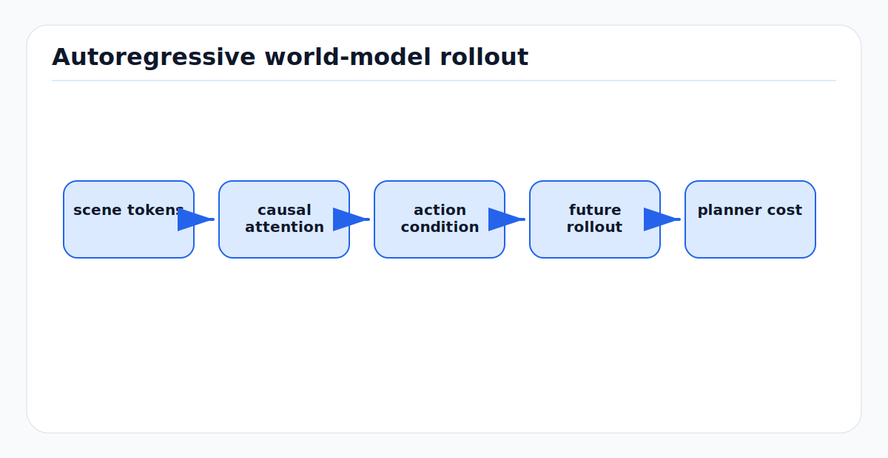

# Transformer Architecture for World Models: First Principles

<!-- kb-figure:start -->


*Figure: how transformer world models condition on past scene tokens and actions to forecast futures for planning.*
<!-- kb-figure:end -->

## The Prediction Engine — From Attention to Autoregressive Scene Forecasting

---

## 1. Self-Attention Mechanism

### 1.1 Single-Head Attention

```
Input: X ∈ R^{n × d}  (n tokens, d dimensions each)

Queries:  Q = X · W_Q  ∈ R^{n × d_k}
Keys:     K = X · W_K  ∈ R^{n × d_k}
Values:   V = X · W_V  ∈ R^{n × d_v}

Attention(Q, K, V) = softmax(Q · K^T / √d_k) · V

Step by step:
  1. Q · K^T ∈ R^{n × n}  — pairwise similarity between all tokens
  2. / √d_k                — scaling prevents softmax saturation
  3. softmax (row-wise)    — normalize to attention weights (sum to 1)
  4. · V                   — weighted combination of values

Output: (n, d_v) — each token is a weighted combination of all value vectors
```

**Why √d_k scaling:** Without scaling, the dot products grow with d_k, pushing softmax into saturation where gradients vanish. Scaling by √d_k keeps the variance of dot products at ~1.

### 1.2 Multi-Head Attention

```
Instead of one (Q, K, V) with d dimensions:
  Use h heads, each with d_k = d/h dimensions

MultiHead(X) = Concat(head_1, ..., head_h) · W_O

  where head_i = Attention(X·W_Q^i, X·W_K^i, X·W_V^i)

Typical: d=256, h=8, d_k=32 per head
Each head learns different attention patterns (spatial, temporal, semantic)
```

---

## 2. Causal (Autoregressive) Attention

### 2.1 Why Masking is Needed

For world model prediction, token at position t should only attend to positions ≤ t (can't see the future during prediction):

```
Causal mask M:
  M[i,j] = 0   if j ≤ i  (can attend)
  M[i,j] = -∞  if j > i  (can't attend)

Attention(Q, K, V) = softmax(Q·K^T/√d_k + M) · V

Example for 4 tokens:
  M = [ 0   -∞  -∞  -∞ ]    Token 1 sees: [1]
      [ 0    0  -∞  -∞ ]    Token 2 sees: [1, 2]
      [ 0    0   0  -∞ ]    Token 3 sees: [1, 2, 3]
      [ 0    0   0   0 ]    Token 4 sees: [1, 2, 3, 4]
```

### 2.2 KV-Cache for Efficient Autoregressive Inference

During generation, each new token only needs attention with all previous tokens:

```python
class CausalAttentionWithCache:
    def __init__(self):
        self.k_cache = []  # grows with each generated token
        self.v_cache = []

    def forward(self, x_new):
        """Process one new token, attending to all cached past tokens."""
        q = x_new @ W_Q  # (1, d_k)
        k = x_new @ W_K  # (1, d_k)
        v = x_new @ W_V  # (1, d_v)

        # Append to cache
        self.k_cache.append(k)
        self.v_cache.append(v)

        # Attend to all cached keys/values
        K = torch.stack(self.k_cache)  # (t, d_k)
        V = torch.stack(self.v_cache)  # (t, d_v)

        attn = softmax(q @ K.T / sqrt(d_k)) @ V  # (1, d_v)
        return attn

# Without cache: generating N tokens costs O(N³) — recompute attention for all tokens each step
# With cache: O(N²) — only compute attention for new token against cache
```

---

## 3. Positional Encoding

### 3.1 Sinusoidal (Original Transformer)

```
PE(pos, 2i) = sin(pos / 10000^{2i/d})
PE(pos, 2i+1) = cos(pos / 10000^{2i/d})

Advantages: Extrapolates to unseen positions, no learned parameters
Limitation: 1D only — needs extension for 2D/3D spatial tokens
```

### 3.2 RoPE (Rotary Position Embedding)

```
Apply rotation in 2D subspaces based on position:
  q_rotated = R(pos) · q
  k_rotated = R(pos) · k

  where R(pos) = block_diag(Rot(pos·θ_1), Rot(pos·θ_2), ..., Rot(pos·θ_{d/2}))

Advantage: Relative position encoded in attention dot product
  (q_m · R(m))^T · (k_n · R(n)) = q_m^T · R(m-n) · k_n
  → attention depends on relative position (m-n), not absolute

Used by: LLaMA, DrivingGPT (frame-wise 1D RoPE)
```

### 3.3 2D/3D Spatial Position for BEV Tokens

```python
def get_2d_positional_encoding(H, W, d):
    """Encode (x, y) position for BEV token grid."""
    y_pos = torch.arange(H).unsqueeze(1).expand(H, W)
    x_pos = torch.arange(W).unsqueeze(0).expand(H, W)

    # Use half dimensions for x, half for y
    pe_x = sinusoidal_encoding(x_pos.flatten(), d // 2)
    pe_y = sinusoidal_encoding(y_pos.flatten(), d // 2)

    pe = torch.cat([pe_x, pe_y], dim=-1)  # (H*W, d)
    return pe

# For spatiotemporal tokens (past frames in sequence):
# Add temporal dimension:
pe_total = pe_spatial + pe_temporal
# pe_spatial: (H*W, d) — same for all frames
# pe_temporal: (T, d) — different for each frame, broadcast across spatial
```

---

## 4. Transformer Block

### 4.1 Pre-LayerNorm (Standard for World Models)

```python
class TransformerBlock(nn.Module):
    def __init__(self, d_model=256, n_heads=8, d_ff=1024):
        self.ln1 = nn.LayerNorm(d_model)
        self.attn = MultiHeadAttention(d_model, n_heads)
        self.ln2 = nn.LayerNorm(d_model)
        self.mlp = nn.Sequential(
            nn.Linear(d_model, d_ff),
            nn.SiLU(),  # or GELU
            nn.Linear(d_ff, d_model),
        )

    def forward(self, x, mask=None):
        # Pre-norm: LayerNorm BEFORE attention/MLP (more stable training)
        x = x + self.attn(self.ln1(x), mask=mask)  # residual connection
        x = x + self.mlp(self.ln2(x))               # residual connection
        return x
```

### 4.2 SwiGLU MLP (Modern Choice)

```python
class SwiGLU(nn.Module):
    """Used in LLaMA, Alpamayo, modern transformers. Better than GELU MLP."""
    def __init__(self, d_model, d_ff):
        self.w1 = nn.Linear(d_model, d_ff, bias=False)
        self.w2 = nn.Linear(d_ff, d_model, bias=False)
        self.w3 = nn.Linear(d_model, d_ff, bias=False)

    def forward(self, x):
        return self.w2(F.silu(self.w1(x)) * self.w3(x))
```

---

## 5. GPT-Style World Model

### 5.1 Architecture

```
Input sequence: [scene_1_tokens, scene_2_tokens, ..., scene_T_tokens]
  Each scene_t: (H×W) VQ-VAE tokens flattened → (H×W, d_model)
  Total sequence length: T × H × W tokens

  Example: T=8 past frames, H=W=32 → 8 × 1024 = 8,192 tokens

GPT Architecture:
  Token embedding: codebook_index → d_model vector (lookup table)
  + Spatial position encoding (2D for x,y in BEV grid)
  + Temporal position encoding (which frame)
  │
  ├── TransformerBlock × N_layers (causal attention)
  │
  └── Linear head → logits over codebook (K classes per token)

Training: Cross-entropy loss on next-token prediction
  L = -Σ log p(token_{t+1} | tokens_{1:t})
```

### 5.2 Teacher Forcing

During training, feed ground truth tokens (not model's own predictions):

```
Input:   [A, B, C, D, E]  ← all ground truth
Target:  [B, C, D, E, F]  ← shifted by 1

The model learns P(next | past) from many parallel examples in one forward pass.
All T×H×W predictions computed simultaneously (not autoregressive during training).
```

### 5.3 Autoregressive Inference

During generation, feed model's own predictions:

```
Given: past frames [scene_1, ..., scene_T]
Generate: future frames [scene_{T+1}, ..., scene_{T+K}]

For each future frame:
  For each token position in the frame:
    logits = model(all_previous_tokens)
    next_token = sample(logits)  # or argmax
    append to sequence

Total: K × H × W sequential generation steps
For K=4, H=W=32: 4,096 steps — this is why it's slow!
```

---

## 6. Spatial-Temporal Attention Patterns

### 6.1 Full Attention (Naive)

Every token attends to every other token. Captures everything but O(n²) with n = T×H×W.

```
n = 8 × 32 × 32 = 8,192
n² = 67 million attention entries — expensive but feasible on GPU
```

### 6.2 Factorized Attention (More Efficient)

Separate spatial and temporal attention:

```
Block A: Spatial attention (within each frame)
  Each token attends to all tokens in the SAME frame
  Cost: T × (H×W)² = 8 × 1024² = 8M

Block B: Temporal attention (across frames)
  Each spatial position attends to same position across ALL frames
  Cost: H×W × T² = 1024 × 64 = 65K

Total: 8M + 65K << 67M (full attention)
But loses cross-frame spatial interactions.
```

### 6.3 Block-Causal (DreamerV4)

```
Spatial: Full attention within each frame (see all spatial tokens)
Temporal: Causal attention across frames (only see past frames)

Each (spatial_x, spatial_y, frame_t) can attend to:
  - All (spatial_*, spatial_*, frame_t) — current frame spatial
  - All (spatial_*, spatial_*, frame_{<t}) — all past frame tokens

This is the best balance for world models:
  - Rich spatial reasoning per frame
  - Causal temporal prediction
  - Cheaper than full attention
```

### 6.4 OccWorld's Architecture

```
OccWorld uses:
  1. Spatial: U-Net style multi-scale aggregation
     - Downsample BEV tokens → attend at low resolution → upsample
     - Captures long-range spatial dependencies efficiently

  2. Temporal: Causal GPT-style attention across frames
     - Frame t can attend to frames 1..t
     - Standard autoregressive prediction

  3. Combined: Alternate spatial and temporal blocks
```

---

## 7. Conditioning Mechanisms

### 7.1 Ego Action Conditioning

For Drive-OccWorld (action-conditioned prediction):

```python
def condition_on_action(transformer, tokens, ego_trajectory):
    """Inject ego trajectory as conditioning for the transformer."""

    # Method 1: Action tokens (append to sequence)
    action_tokens = action_encoder(ego_trajectory)  # (K, d_model)
    conditioned_input = torch.cat([tokens, action_tokens], dim=1)
    output = transformer(conditioned_input)

    # Method 2: Cross-attention (separate stream)
    action_features = action_encoder(ego_trajectory)
    for block in transformer.blocks:
        x = block.self_attention(x)
        x = block.cross_attention(x, action_features)  # attend to action
        x = block.mlp(x)

    # Method 3: AdaLN (like DiT)
    action_embed = action_encoder(ego_trajectory)
    for block in transformer.blocks:
        gamma, beta = block.adaLN_modulation(action_embed)
        x = gamma * block.norm(x) + beta  # condition via normalization
```

### 7.2 Airport Context Conditioning

```python
# Encode airport context (ADS-B, turnaround phase, NOTAM zones) as tokens
context = airport_context_encoder({
    'aircraft_positions': adsb_data,      # (N_aircraft, 4) — x,y,heading,type
    'turnaround_phase': phase_embedding,  # (N_gates, d_model)
    'notam_zones': zone_embeddings,       # (N_zones, d_model)
})

# Prepend as context tokens (like a "system prompt" for the world model)
full_input = torch.cat([context_tokens, scene_tokens], dim=1)
```

---

## 8. Scaling Laws

### 8.1 Kaplan et al. (2020) — LLM Scaling

```
L(N) = (N_c / N)^{α_N}      α_N ≈ 0.076  (model size)
L(D) = (D_c / D)^{α_D}      α_D ≈ 0.095  (dataset size)
L(C) = (C_c / C)^{α_C}      α_C ≈ 0.050  (compute)

L decreases as a power law with N, D, C independently.
```

### 8.2 Application to Driving World Models

**GAIA-1:** Power-law curves on validation cross-entropy across model sizes (1B → 9B).

**Waymo (June 2025):** Validated power-law for motion planning metrics.

**DriveVLA-W0:** World model objective amplifies data scaling:
```
Action-only: saturates at ~20M frames
Action + world model: sustained improvement to 70M+ frames
→ World model pre-training is compute-optimal
```

### 8.3 What This Means for Your Airside Model

```
Model size vs. performance (estimated from LLM scaling, adjusted for driving):

50M params:  Good enough for BEV occupancy prediction at 2s horizon
200M params: Better prediction, 4s horizon, captures complex interactions
500M params: High-quality prediction, suitable for planning
2B params:   Diminishing returns unless you have >> 1000 hours of data

Data scaling (estimated):
  50 hours:   Overfits — use heavy augmentation + pre-training
  200 hours:  Moderate — fine-tune from nuScenes pre-trained
  1000 hours: Good — most scenarios covered
  5000 hours: Excellent — captures rare events

Compute-optimal (Chinchilla-style):
  For 200M model, you want ~10-20M tokens of training data
  At 1,024 tokens/frame × 10 FPS = 10,240 tokens/second
  10-20M tokens ≈ 1,000-2,000 seconds ≈ 17-33 minutes of driving
  BUT you want diverse data → need much more driving hours with variety
```

---

## 9. Efficient Inference Strategies

### 9.1 Parallel Token Generation (MaskGIT-style)

Instead of generating tokens one by one:

```
Step 1: Generate ALL future tokens simultaneously (parallel)
Step 2: Keep high-confidence tokens, mask low-confidence ones
Step 3: Re-generate masked tokens conditioned on kept ones
Step 4: Repeat 4-8 times

Result: N tokens in ~8 steps instead of N sequential steps
For 1,024 tokens: 8 steps vs 1,024 steps → 128x faster
```

### 9.2 Speculative Decoding

Use a small model to draft, large model to verify:

```
Small model (20M params): Generate 8 candidate tokens quickly
Large model (200M params): Verify all 8 in one forward pass
Accept verified tokens, reject and re-generate bad ones

Speedup: 2-3x with well-matched small/large models
```

---

## Sources

- Vaswani et al. "Attention Is All You Need." NeurIPS, 2017
- Radford et al. "Language Models are Unsupervised Multitask Learners." (GPT-2), 2019
- Su et al. "RoFormer: Enhanced Transformer with Rotary Position Embedding." 2021
- Kaplan et al. "Scaling Laws for Neural Language Models." arXiv, 2020
- Hoffmann et al. "Training Compute-Optimal Large Language Models." NeurIPS, 2022
- Chang et al. "MaskGIT: Masked Generative Image Transformer." CVPR, 2022
- Zheng et al. "OccWorld." ECCV, 2024
- Hafner et al. "Dreamer V4." arXiv, 2025
