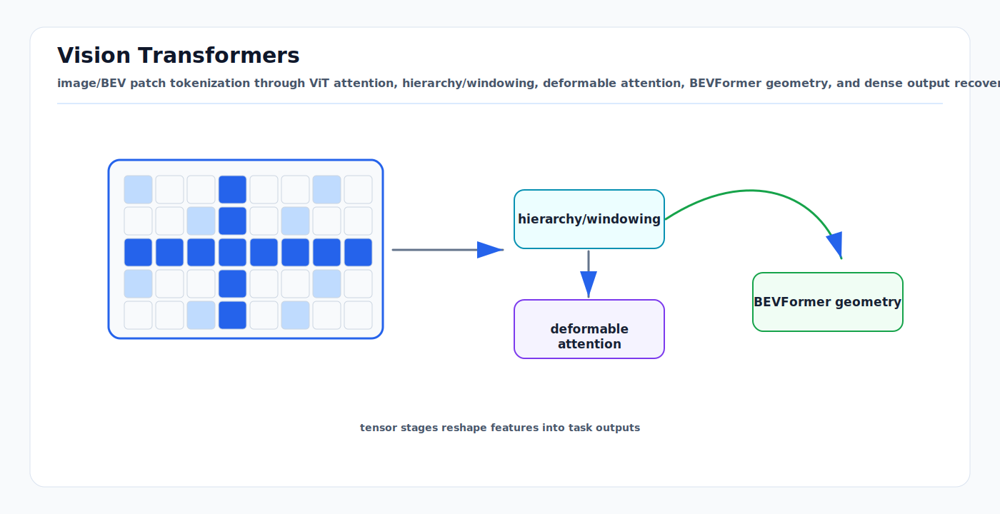

# Vision Transformers: First Principles

<!-- kb-visual:start -->


*Visual: image/BEV patch tokenization through ViT attention, hierarchy/windowing, deformable attention, BEVFormer geometry, and dense output recovery.*
<!-- kb-visual:end -->

## Scope

This note explains why transformers work for images, BEV grids, and point clouds, and how those ideas translate into AV perception, SLAM, and mapping. It avoids duplicating the deeper deployment survey in [sparse-attention-3d-perception.md](sparse-attention-3d-perception.md) and the world-model transformer details in [transformer-world-models.md](transformer-world-models.md).

## 1. From Images to Tokens

A transformer expects a sequence of tokens. A Vision Transformer turns an image into tokens by splitting it into fixed-size patches:

```text
Image:  H x W x C
Patch:  P x P x C
Tokens: (H / P) * (W / P)
```

Each patch is flattened and linearly projected into a `d_model` vector. For a 224x224 image with 16x16 patches:

```text
14 x 14 = 196 tokens
```

The model then applies the same transformer blocks used in language. The key conceptual move is treating an image as a set of visual words.

## 2. What ViT Proved

The original ViT result was not that convolution is obsolete. It showed that a pure transformer over image patches can perform very well when pre-trained at sufficient scale and transferred to downstream tasks.

The first-principles tradeoff:

- A CNN has strong local inductive bias and is data-efficient.
- A ViT has weaker locality bias but scales well with model size and data.
- A ViT can use the same global token-mixing mechanism for classification, detection, segmentation, BEV fusion, and video.

For AV systems with limited domain labels, this is why self-supervised pre-training matters. A ViT trained only from scratch on a small airside dataset will often underperform a more biased CNN. A ViT pre-trained on broad image/video data can become a strong feature extractor for novel domains.

## 3. Patch Size Is a Design Knob

Patch size controls token count and spatial precision.

| Patch size | Tokens for 224x224 | Strength | Weakness |
|---|---:|---|---|
| 32x32 | 49 | Cheap | Loses small objects |
| 16x16 | 196 | Standard balance | Moderate detail |
| 8x8 | 784 | Better small details | Expensive |

Driving scenes contain small but safety-critical objects: cones, chocks, FOD, personnel limbs, lane markings, and far-away vehicles. Large patches can erase these signals. Dense prediction usually needs hierarchical features or smaller effective stride.

## 4. Why Plain ViT Is Awkward for Dense Perception

Plain ViT produces one sequence at one scale. AV perception needs multi-scale outputs:

- Small objects require high-resolution detail.
- Large objects require broad context.
- Map lanes and curbs require thin structure.
- Aircraft and GSE can span a huge range of scales.

CNNs naturally build pyramids through downsampling. Plain ViT does not. This motivated hierarchical vision transformers.

## 5. Swin Transformer: Local Windows Plus Hierarchy

Swin restricts attention to local windows and shifts the windows between layers. This gives:

- Near-linear complexity in image size.
- Hierarchical feature maps like CNN backbones.
- Cross-window communication through shifted windows.

The design maps well to dense tasks such as detection and segmentation. In AV pipelines, the same principle appears in BEV and point-cloud models: local attention is cheap, but the window pattern must let information move across the scene over depth.

## 6. Deformable Attention

Dense feature maps have many locations, but each query often needs only a few relevant samples. Deformable attention learns a small set of sampling offsets around a reference point:

```text
query -> reference point -> K learned offsets -> sample features -> weighted sum
```

This is useful for:

- Small object detection, where full attention over feature maps is wasteful.
- Multi-scale detection, where a query samples from several feature pyramid levels.
- Camera-to-BEV lifting, where each BEV query should gather from a few projected image regions rather than all pixels.

The risk is reference failure. If the initial reference is badly placed or calibration is wrong, sparse sampling can miss the evidence entirely.

## 7. BEVFormer: Vision Transformer for Driving Geometry

BEVFormer introduced a clean mental model for camera-only 3D perception:

```text
Grid-shaped BEV queries
    attend to multi-camera image features for spatial evidence
    attend to previous BEV states for temporal evidence
    output a unified BEV representation
```

The important idea is that BEV is not a camera image. It is a spatial memory surface in ego or world coordinates. BEV queries are fixed locations in that surface. Camera features are sampled through cross-attention.

For mapping and SLAM readers:

- BEV queries resemble map cells or local submap cells.
- Temporal self-attention is a learned map update step.
- Ego-motion compensation is the bridge between frame-local observations and a persistent spatial state.

## 8. Point Transformer V3: Point Clouds as Serialized Local Sequences

Point clouds are unordered and irregular. Full attention over points is infeasible for large LiDAR scans. PTv3 uses space-filling serialization:

```text
3D coordinates -> quantized grid -> space-filling curve index -> sorted sequence
```

Then standard window attention runs on the sorted sequence. Nearby 3D points tend to be nearby in the sequence, so local 1D windows approximate local 3D neighborhoods.

This is important because it avoids expensive neighbor search while using optimized attention kernels. For detailed PTv3 mechanics and benchmarks, see [sparse-attention-3d-perception.md](sparse-attention-3d-perception.md).

## 9. Vision Transformers in a Perception Stack

A practical AV perception stack can use transformers at several levels:

```text
Camera image backbone:
  ViT/Swin extracts image features

Camera-to-BEV:
  BEV queries cross-attend to image features

LiDAR backbone:
  PTv3 or sparse voxel attention extracts point features

Fusion:
  BEV, LiDAR, radar, and map tokens cross-attend

Temporal memory:
  BEV tokens attend to prior BEV tokens after ego-motion compensation

Task heads:
  Detection, segmentation, occupancy, flow, map elements, planning cost
```

Use transformers where adaptive long-range mixing is valuable. Use CNNs, sparse convs, or classical geometry where they are simpler, faster, and more predictable.

## 10. SLAM and Mapping Uses

Vision transformers are useful in learned SLAM and mapping when the task needs robust matching or semantic context:

- Visual place recognition: global tokens summarize scene layout.
- Local feature matching: transformer matchers resolve repeated patterns.
- Dynamic object filtering: temporal attention separates static map evidence from movers.
- Online semantic mapping: BEV tokens accumulate lane, curb, stand, and obstacle evidence.
- Map change detection: current BEV/map tokens attend against stored map tiles.

However, learned features should not be the only source of metric consistency. Bundle adjustment, pose graph optimization, scan matching, and occupancy fusion still provide the checks that make a mapping system stable over long horizons.

## 11. AV-Specific Design Considerations

### Coordinate Frames

For camera image transformers, patch positions are image-plane coordinates. For BEV and map transformers, token positions are metric world coordinates. Mixing them requires known calibration and projection geometry. If calibration drifts, attention can learn wrong associations.

### Temporal Alignment

Multi-camera rigs, spinning LiDAR, radar, and vehicle state often arrive at different times. A temporal transformer can hide synchronization errors by learning average patterns, but mapping quality will suffer. Motion compensation should happen before temporal fusion when geometry matters.

### Small Objects

Patch-based models can miss small hazards. Use high-resolution paths, feature pyramids, deformable sampling, occupancy heads, or LiDAR/radar safety channels for FOD, cones, chocks, and personnel.

### Edge Deployment

On Orin-class hardware, attention layers compete for GPU memory bandwidth. Favor:

- Windowed attention.
- BEV token budgets that match latency targets.
- TensorRT-friendly standard attention patterns.
- INT8 calibration with task-specific validation.
- A fast geometric fallback for safety-critical detection.

## 12. How to Choose a Vision Transformer Pattern

| Need | Prefer | Reason |
|---|---|---|
| Image classification or general features | ViT or DINOv2 backbone | Scales with pre-training |
| Dense 2D detection/segmentation | Swin or hierarchical ViT | Multi-scale features |
| Camera-to-BEV perception | BEVFormer-style queries | Geometry-aware lifting |
| LiDAR segmentation | PTv3 or sparse attention | Irregular 3D tokens |
| Small object detection | Deformable attention plus high-res features | Sparse adaptive sampling |
| Real-time safety path | CNN/sparse conv plus simple head | Predictable latency |
| Long video memory | Hybrid attention plus SSM | Attention cache grows with context |

## 13. Common Failure Modes

- Treating image patches as metric geometry without calibration.
- Using global attention where local sparse attention is enough.
- Using local windows where map-level context is required.
- Forgetting that self-supervised image features may encode appearance, not metric occupancy.
- Overfitting to camera rig layout and failing after sensor replacement.
- Training with future labels or non-causal map updates in temporal perception.

## 14. Relationship to Other Local Docs

- [attention-transformers-first-principles.md](attention-transformers-first-principles.md): attention math and transformer block basics.
- [sparse-attention-3d-perception.md](sparse-attention-3d-perception.md): deep dive on PTv3, BEV transformers, and sparse attention deployment.
- [self-supervised-learning-first-principles.md](self-supervised-learning-first-principles.md): DINO, DINOv2, MAE, and representation learning.
- [mamba-ssm-for-driving.md](mamba-ssm-for-driving.md): sub-quadratic temporal alternatives and hybrids.
- [30-autonomy-stack/perception/overview/vision-foundation-models.md](../../30-autonomy-stack/perception/overview/vision-foundation-models.md): driving foundation-model survey.
- [30-autonomy-stack/localization-mapping/maps/neural-online-mapping-sota.md](../../30-autonomy-stack/localization-mapping/maps/neural-online-mapping-sota.md): online mapping context.

## Sources

- Dosovitskiy et al., "An Image is Worth 16x16 Words: Transformers for Image Recognition at Scale." arXiv:2010.11929. https://arxiv.org/abs/2010.11929
- Liu et al., "Swin Transformer: Hierarchical Vision Transformer using Shifted Windows." arXiv:2103.14030. https://arxiv.org/abs/2103.14030
- Zhu et al., "Deformable DETR: Deformable Transformers for End-to-End Object Detection." arXiv:2010.04159. https://arxiv.org/abs/2010.04159
- Wu et al., "Point Transformer V3: Simpler, Faster, Stronger." arXiv:2312.10035. https://arxiv.org/abs/2312.10035
- Li et al., "BEVFormer: Learning Bird's-Eye-View Representation from Multi-Camera Images via Spatiotemporal Transformers." arXiv:2203.17270. https://arxiv.org/abs/2203.17270
