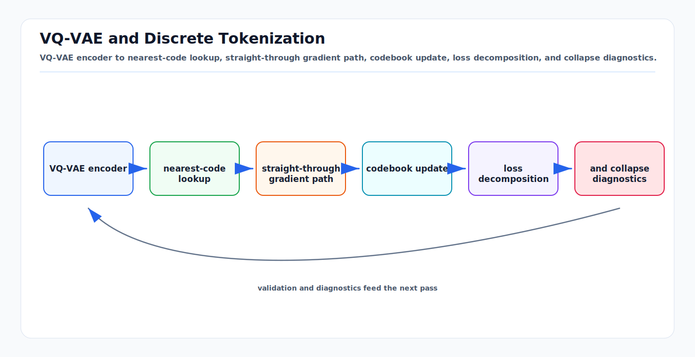

# VQ-VAE and Discrete Tokenization: First Principles

<!-- kb-visual:start -->


*Visual: VQ-VAE encoder to nearest-code lookup, straight-through gradient path, codebook update, loss decomposition, and collapse diagnostics.*
<!-- kb-visual:end -->

## The Foundation for Converting Sensor Data into World Model Tokens

---

## 1. The Quantization Problem

**Goal:** Compress continuous BEV features into discrete tokens so a transformer can predict "next token" — exactly like LLMs predict next words.

```
Continuous BEV features: (256, 128, 128) — 256 channels, 128×128 spatial
  → VQ-VAE encodes to: (128, 128) grid of codebook indices, each ∈ {0, 1, ..., K-1}
  → 16,384 tokens per frame, vocabulary size K (typically 512-4096)
  → Transformer predicts next 16,384 tokens autoregressively or in parallel
  → VQ-VAE decodes predicted tokens back to: (256, 128, 128) continuous features
```

---

## 2. VQ-VAE Architecture (van den Oord et al., NeurIPS 2017)

### 2.1 Encoder

```python
class Encoder(nn.Module):
    """Maps continuous input to continuous latent vectors."""
    def __init__(self, in_channels=256, hidden=128, latent_dim=64):
        self.net = nn.Sequential(
            nn.Conv2d(in_channels, hidden, 4, stride=2, padding=1),  # downsample 2x
            nn.ReLU(),
            nn.Conv2d(hidden, hidden, 4, stride=2, padding=1),       # downsample 2x
            nn.ReLU(),
            nn.Conv2d(hidden, latent_dim, 3, padding=1),              # no downsample
        )

    def forward(self, x):
        # x: (B, 256, 128, 128) — BEV features
        z_e = self.net(x)  # (B, 64, 32, 32) — continuous latent
        return z_e
```

### 2.2 Vector Quantization (The Core)

```python
class VectorQuantizer(nn.Module):
    """Discretize continuous latents using nearest-neighbor codebook lookup."""
    def __init__(self, num_embeddings=512, embedding_dim=64, commitment_cost=0.25):
        self.embedding = nn.Embedding(num_embeddings, embedding_dim)  # codebook: (K, D)
        self.commitment_cost = commitment_cost

    def forward(self, z_e):
        # z_e: (B, D, H, W) — encoder output

        # Reshape for distance computation
        z_e_flat = z_e.permute(0, 2, 3, 1).reshape(-1, D)  # (B*H*W, D)

        # Compute distances to all codebook entries
        # ||z_e - e_k||² = ||z_e||² + ||e_k||² - 2·z_e·e_k^T
        distances = (
            z_e_flat.pow(2).sum(1, keepdim=True)
            + self.embedding.weight.pow(2).sum(1)
            - 2 * z_e_flat @ self.embedding.weight.T
        )  # (B*H*W, K)

        # Nearest neighbor: argmin distance
        indices = distances.argmin(dim=1)  # (B*H*W,)

        # Lookup quantized vectors
        z_q = self.embedding(indices)  # (B*H*W, D)
        z_q = z_q.reshape(B, H, W, D).permute(0, 3, 1, 2)  # (B, D, H, W)

        # Losses
        codebook_loss = F.mse_loss(z_q.detach(), z_e)      # move codebook toward encoder
        commitment_loss = F.mse_loss(z_q, z_e.detach())     # keep encoder close to codebook

        loss = codebook_loss + self.commitment_cost * commitment_loss

        # Straight-through estimator: gradient flows through z_q as if it were z_e
        z_q_st = z_e + (z_q - z_e).detach()

        return z_q_st, loss, indices
```

### 2.3 The Straight-Through Estimator

**The problem:** `argmin` is not differentiable. Gradients can't flow through discrete codebook lookup.

**The solution:** During forward pass, use z_q (quantized). During backward pass, copy gradients from z_q to z_e (as if quantization didn't happen).

```python
# This one line does it:
z_q_st = z_e + (z_q - z_e).detach()

# Forward: z_q_st = z_e + z_q - z_e = z_q  (quantized value)
# Backward: grad(z_q_st) = grad(z_e) + 0    (gradient flows to encoder)
```

**Why it works:** If the encoder and codebook are well-aligned, z_e ≈ z_q, so the gradient approximation is accurate. The commitment loss ensures they stay aligned.

### 2.4 Decoder

```python
class Decoder(nn.Module):
    """Reconstruct continuous features from quantized latents."""
    def __init__(self, latent_dim=64, hidden=128, out_channels=256):
        self.net = nn.Sequential(
            nn.ConvTranspose2d(latent_dim, hidden, 4, stride=2, padding=1),  # upsample 2x
            nn.ReLU(),
            nn.ConvTranspose2d(hidden, hidden, 4, stride=2, padding=1),       # upsample 2x
            nn.ReLU(),
            nn.ConvTranspose2d(hidden, out_channels, 3, padding=1),
        )

    def forward(self, z_q):
        # z_q: (B, 64, 32, 32) — quantized latent
        x_hat = self.net(z_q)  # (B, 256, 128, 128) — reconstructed BEV
        return x_hat
```

---

## 3. The Three Loss Terms

```
L = L_reconstruction + L_codebook + β · L_commitment

L_reconstruction = ||x - x̂||²
  → Decoder must reconstruct input from quantized latent
  → Gradients flow to encoder via straight-through, and to decoder directly

L_codebook = ||sg[z_e] - z_q||²
  → Move codebook entries toward encoder outputs
  → sg[] = stop gradient (don't update encoder from this term)

L_commitment = ||z_e - sg[z_q]||²
  → Keep encoder outputs close to their assigned codebook entries
  → Prevents encoder from "running away" from the codebook

β = 0.25 (typical) — commitment cost weight
```

---

## 4. EMA Codebook Updates (Recommended)

Instead of learning the codebook via gradients, use Exponential Moving Average:

```python
def ema_update(self, z_e_flat, indices):
    """Update codebook entries using EMA of assigned encoder outputs."""
    # Count assignments per codebook entry
    encodings = F.one_hot(indices, self.num_embeddings).float()  # (N, K)
    N_k = encodings.sum(0)  # (K,) — count per entry

    # Sum of assigned encoder outputs per entry
    sum_z = encodings.T @ z_e_flat  # (K, D)

    # EMA update
    self.cluster_size = self.decay * self.cluster_size + (1 - self.decay) * N_k
    self.embed_sum = self.decay * self.embed_sum + (1 - self.decay) * sum_z

    # Laplace smoothing to prevent division by zero
    n = self.cluster_size.sum()
    self.cluster_size = (self.cluster_size + 1e-5) / (n + self.num_embeddings * 1e-5) * n

    # Update codebook
    self.embedding.weight.data = self.embed_sum / self.cluster_size.unsqueeze(1)
```

**Advantages over gradient-based:**
- More stable training (no competition between codebook and commitment gradients)
- Typically faster convergence
- decay = 0.99 works well universally

---

## 5. Codebook Collapse

### 5.1 What It Is

The most common failure mode: most codebook entries are never used. The encoder maps everything to a small subset of entries (e.g., 50 out of 512).

```
Healthy codebook:    █ █ █ █ █ █ █ █ █ █ (all entries used equally)
Collapsed codebook:  █████ ░ ░ ░ ░ ░ ░ ░ (5 entries used, 507 dead)
```

### 5.2 Detection

```python
# Codebook utilization: fraction of entries used per batch
used = len(indices.unique()) / num_embeddings
# Healthy: > 0.8. Collapsed: < 0.3

# Perplexity: exp(entropy of codebook usage distribution)
probs = F.one_hot(indices, K).float().mean(0)  # usage probability per entry
perplexity = torch.exp(-torch.sum(probs * torch.log(probs + 1e-10)))
# Healthy: close to K. Collapsed: << K
```

### 5.3 Prevention

| Method | How It Works | Effectiveness |
|--------|-------------|---------------|
| **EMA updates** | Running average instead of gradients | Moderate |
| **Codebook reset** | Re-initialize dead entries from encoder outputs | High |
| **Entropy regularization** | Add -H(codebook usage) to loss | High |
| **Larger commitment β** | Keep encoder closer to codebook | Moderate |
| **Jitter** | Add small noise to encoder output before quantization | Moderate |
| **FSQ (replace VQ-VAE)** | Eliminate codebook entirely | Eliminates the problem |

**Codebook reset implementation:**
```python
# Every 100 steps, check for dead entries
usage_count = count_usage(indices)  # how many times each entry was used
dead_mask = usage_count < threshold  # entries used less than threshold times

if dead_mask.any():
    # Re-initialize dead entries from random encoder outputs
    alive_indices = torch.where(~dead_mask)[0]
    new_entries = z_e_flat[torch.randint(len(z_e_flat), (dead_mask.sum(),))]
    self.embedding.weight.data[dead_mask] = new_entries
```

---

## 6. FSQ: Finite Scalar Quantization (Google, ICLR 2024)

### 6.1 How It Works

Instead of learning a codebook, simply **round** each dimension to a fixed number of levels:

```python
class FSQ(nn.Module):
    def __init__(self, levels=[8, 5, 5, 5]):
        """
        levels: number of quantization levels per dimension
        Total codes = product(levels) = 8 × 5 × 5 × 5 = 1000
        """
        self.levels = levels
        self.dim = len(levels)

    def forward(self, z):
        # z: (B, D, H, W) where D = len(levels)

        # Bound each dimension to [-1, 1] using tanh
        z_bounded = torch.tanh(z)

        # Scale to [0, L-1] per dimension, round, scale back
        z_quantized = []
        for i, L in enumerate(self.levels):
            half_L = (L - 1) / 2
            z_i = z_bounded[:, i]
            z_q_i = torch.round(z_i * half_L) / half_L  # round to nearest level
            z_quantized.append(z_q_i)

        z_q = torch.stack(z_quantized, dim=1)

        # Straight-through estimator (same as VQ-VAE)
        z_q_st = z_bounded + (z_q - z_bounded).detach()

        return z_q_st

    def codes_to_indices(self, z_q):
        """Convert quantized values to integer indices for transformer prediction."""
        indices = 0
        for i, L in enumerate(self.levels):
            half_L = (L - 1) / 2
            level_idx = (z_q[:, i] * half_L + half_L).long()  # [0, L-1]
            indices = indices * L + level_idx
        return indices  # single integer per spatial position
```

### 6.2 Why FSQ Over VQ-VAE

| Aspect | VQ-VAE | FSQ |
|--------|--------|-----|
| Codebook collapse | Major issue | **Impossible** (no codebook) |
| Training stability | Requires careful tuning | **Stable by default** |
| Hyperparameters | commitment_cost, EMA decay, codebook size | Just `levels` list |
| Codebook utilization | Often < 50% | **100% by construction** |
| Code quality | Can be excellent with tuning | Good, slightly less flexible |
| Implementation complexity | Medium (EMA, reset, monitoring) | **Very simple** |

### 6.3 NVIDIA Cosmos Uses FSQ

Cosmos tokenizer uses FSQ (not VQ-VAE). If you use the Cosmos tokenizer as your world model's front-end, you get FSQ's stability benefits for free.

---

## 7. Codebook Size Selection

### 7.1 Information Theory

```
Each token encodes: log2(K) bits of information
K=256:  8 bits per token
K=512:  9 bits per token
K=1024: 10 bits per token
K=4096: 12 bits per token

For a 32×32 token grid (from 128×128 BEV at 4x downsampling):
  Total information per frame = 32 × 32 × log2(K) bits

K=512:  32 × 32 × 9 = 9,216 bits = 1.15 KB per frame
K=4096: 32 × 32 × 12 = 12,288 bits = 1.54 KB per frame

Compare to raw BEV: 256 × 128 × 128 × 4 bytes = 16.7 MB per frame
Compression ratio: ~10,000-15,000x
```

### 7.2 Practical Guidelines

| Codebook Size | Use Case | Tradeoff |
|---------------|----------|----------|
| 256 | Lightweight, fast training | May lose spatial detail |
| **512** | **OccWorld default, good balance** | **Recommended start** |
| 1024 | More expressive, slight overhead | Better reconstruction |
| 4096 | High fidelity, expensive | For sensor simulation quality |
| 16384 | DrivingGPT | Very high fidelity, large transformer needed |

### 7.3 Embedding Dimension

```
embedding_dim should be much smaller than codebook_size:
  K=512, D=64:  codebook = 512 × 64 = 32K parameters (tiny)
  K=512, D=256: codebook = 512 × 256 = 131K parameters (still small)

Rule of thumb: D = 64-256 works well regardless of K
Larger D = richer per-token representation but harder to learn clean codebook
```

---

## 8. Application to BEV Features for World Models

### 8.1 OccWorld's Approach

```
Input: 3D Occupancy (17, 200, 200, 16) — 17 classes, 200×200 BEV, 16 height bins
  │
  ├── Project to BEV: (17, 200, 200, 16) → class-weighted (C, 200, 200)
  │
  ├── Encode: 2D CNN encoder → (64, 50, 50) — 4x spatial downsampling
  │
  ├── VQ-VAE quantize: codebook K=512, D=64
  │   → (50, 50) grid of indices ∈ {0..511}
  │   → 2,500 tokens per frame
  │
  ├── Transformer predicts next frame's 2,500 tokens
  │
  └── Decode: indices → embeddings → 2D CNN decoder → (17, 200, 200, 16)
```

### 8.2 For Your Airside World Model

```
Input: LiDAR BEV features from PointPillars (256, 128, 128)
  │
  ├── VQ-VAE Encoder: Conv2d layers → (64, 32, 32) — 4x downsample
  │
  ├── FSQ quantize: levels=[8,8,8,8] → 4096 codes
  │   → (32, 32) grid of indices ∈ {0..4095}
  │   → 1,024 tokens per frame
  │
  ├── 8 past frames → 8,192 tokens total
  │   Transformer predicts next 4 frames → 4,096 tokens
  │
  └── FSQ decode → VQ-VAE Decoder → (256, 128, 128) predicted BEV
```

---

## 9. Training Tips

```python
# 1. Train VQ-VAE BEFORE the transformer (two-stage)
# Stage 1: VQ-VAE reconstruction (freeze during stage 2)
# Stage 2: Transformer next-token prediction (VQ-VAE frozen)

# 2. Monitor these metrics during VQ-VAE training:
metrics = {
    'reconstruction_loss': mse(x, x_hat),           # Should decrease
    'codebook_utilization': unique(indices) / K,      # Should be > 0.8
    'perplexity': exp(entropy(usage_probs)),           # Should be close to K
    'commitment_loss': mse(z_e, sg(z_q)),              # Should be small
}

# 3. If codebook collapses:
#    a. Increase commitment β (try 0.5, 1.0)
#    b. Enable codebook reset every 100 steps
#    c. Switch to FSQ
#    d. Reduce learning rate

# 4. Learning rate: 1e-4 works well for VQ-VAE
# 5. Batch size: 8-16 (larger helps codebook diversity)
# 6. Train for 50-100 epochs on small dataset, 20-30 on large
```

---

## Sources

- van den Oord et al. "Neural Discrete Representation Learning." NeurIPS, 2017
- Razavi et al. "Generating Diverse High-Fidelity Images with VQ-VAE-2." NeurIPS, 2019
- Esser et al. "Taming Transformers for High-Resolution Image Synthesis (VQ-GAN)." CVPR, 2021
- Mentzer et al. "Finite Scalar Quantization: VQ-VAE Made Simple." ICLR, 2024
- Lee et al. "Autoregressive Image Generation using Residual Quantization." CVPR, 2022
- Zheng et al. "OccWorld: Learning a 3D Occupancy World Model." ECCV, 2024
