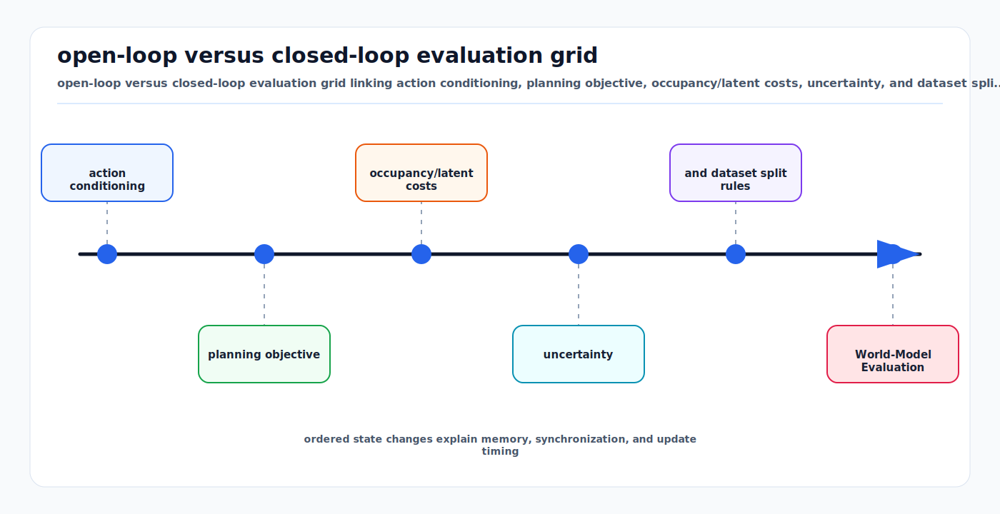

# World-Model Evaluation and Planning Objectives

<!-- kb-visual:start -->


*Visual: open-loop versus closed-loop evaluation grid linking action conditioning, planning objective, occupancy/latent costs, uncertainty, and dataset split rules.*
<!-- kb-visual:end -->

## Why This Page Exists

World models are useful only if their predictions improve decisions. A model can generate plausible videos, accurate short-horizon occupancy, or strong open-loop metrics and still fail when a planner uses it.

This page complements [World Models: First Principles](world-models-first-principles.md), [JEPA and Latent Predictive Learning](jepa-latent-predictive-learning.md), and [Diffusion, Score Models, Flow Matching, and Samplers](diffusion-score-flow-samplers-first-principles.md).

## Open-Loop Evaluation

Open-loop evaluation compares predictions to logged futures:

```text
history -> model prediction
prediction vs logged future
```

Common metrics:

- image/video FVD or FID,
- occupancy IoU,
- flow endpoint error,
- trajectory ADE/FDE,
- negative log likelihood,
- calibration error,
- semantic consistency.

Open-loop metrics are necessary but incomplete. The logged future is only one possible outcome. If the ego vehicle had acted differently, the world would have evolved differently.

## Closed-Loop Evaluation

Closed-loop evaluation puts the model inside a decision loop:

```text
observe -> predict -> plan -> act -> observe new state
```

This catches compounding errors:

- The model predicts slightly wrong occupancy.
- The planner chooses an action based on that occupancy.
- The new state is outside the logged distribution.
- Prediction error grows.

Closed-loop evaluation is expensive but essential for planning claims.

## Action Conditioning

A driving world model should distinguish:

```text
P(future | past)
P(future | past, ego action)
```

The second is the planning-relevant distribution. Without action conditioning, the model predicts what the logged driver probably did, not what would happen if the autonomy stack took a different maneuver.

For airside, action conditioning matters for low-speed interactions: creeping around a parked tug, yielding to a marshaller, stopping near a belt loader, or rerouting around FOD.

## Planning Objective

A model predictive planner scores candidate futures:

```text
J = collision_cost
  + rule_cost
  + progress_cost
  + comfort_cost
  + uncertainty_cost
  + map_consistency_cost
```

The objective is as important as the model. If the objective rewards progress too strongly, a good world model can still select unsafe actions. If the objective penalizes uncertainty too aggressively, the system may freeze.

## Occupancy-Based Costs

Occupancy world models are attractive because collision costs are direct:

```text
collision_cost = sum_t overlap(ego_footprint_t, occupied_cells_t)
```

Important details:

- Use ego footprint with margins, not centerline only.
- Separate known free, known occupied, and unknown.
- Penalize occupancy probability and uncertainty.
- Keep dynamic and static layers separate when possible.

## Latent Planning Costs

JEPA and latent world models may not decode every future. Planning can use latent similarity or learned value heads:

```text
cost = value_head(z_future, goal, rules)
```

This is efficient but harder to inspect. Safety review should require probes, decoders, counterfactual tests, and downstream validation.

## Uncertainty

World-model uncertainty appears in several forms:

- aleatoric: multiple plausible futures,
- epistemic: model does not know this scene,
- observation: sensor input is degraded,
- action: control execution may differ,
- map: prior map may be stale.

A planner should not collapse multimodal futures into one average. The average path of two possible moving objects may be physically meaningless.

## Evaluation Splits

World-model splits should be scenario-aware:

| Split | Why it matters |
|---|---|
| Route/site split | Prevents memorized geometry. |
| Time split | Tests construction and seasonal change. |
| Weather split | Tests sensor and behavior shift. |
| Agent-density split | Tests rare busy scenes. |
| Action-distribution split | Tests off-policy planning. |
| Object taxonomy split | Tests unknown movable objects. |

## Dynamic and Static Object Removal

World models can support removal by predicting what should persist:

- A moving object should not become static map structure.
- A temporary barrier may be static for days but not belong in the long-term map.
- A new construction wall may be a real map change.
- A small FOD object should not be removed as a nuisance.

The evaluation objective must reflect asymmetric costs: deleting a real hazard can be worse than retaining a ghost point.

## Review Checklist

```text
Is the model evaluated open-loop, closed-loop, or both?
Does it condition on ego action?
Are multiple futures represented?
What planning objective consumes the prediction?
Are unknown and uncertain regions penalized correctly?
Are route, time, weather, and object splits separated?
Does improved prediction metric improve planner safety?
Are removal/map-cleaning decisions evaluated for false deletion?
```

## Sources

- Ha and Schmidhuber, "World Models": https://arxiv.org/abs/1803.10122
- Hafner et al., "Learning Latent Dynamics for Planning from Pixels" (PlaNet): https://arxiv.org/abs/1811.04551
- Hafner et al., "Mastering Diverse Domains through World Models" (DreamerV3): https://arxiv.org/abs/2301.04104
- Assran et al., "V-JEPA 2: Self-Supervised Video Models Enable Understanding, Prediction and Planning": https://arxiv.org/abs/2506.09985
- Meta V-JEPA 2 research page: https://ai.meta.com/research/publications/v-jepa-2-self-supervised-video-models-enable-understanding-prediction-and-planning/
- Local companion: [World Models: First Principles](world-models-first-principles.md)
