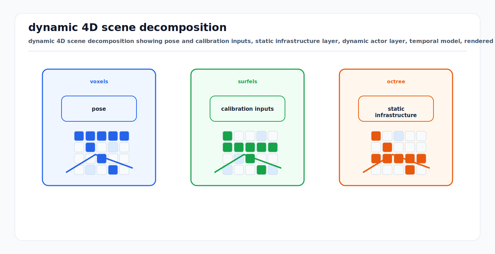

# Dynamic 4D Neural and Gaussian Reconstruction

<!-- kb-visual:start -->


*Visual: dynamic 4D scene decomposition showing pose and calibration inputs, static infrastructure layer, dynamic actor layer, temporal model, rendered outputs, and validation boundary.*
<!-- kb-visual:end -->

Dynamic 4D reconstruction builds a renderable representation of a scene over space and time. In autonomous driving and airside domains, the hard part is not only rendering the background. The hard part is separating persistent infrastructure, parked-but-movable assets, active vehicles, people, shadows, weather artifacts, and dynamic appearance changes.

This page covers the method taxonomy behind photoreal dynamic NeRF and Gaussian reconstruction. It is a mapping and reconstruction foundation page, not a production localization recommendation.

Most methods in this page consume poses, calibrations, object tracks, occupancy priors, or other reconstruction inputs and then optimize a renderable 4D scene. Treat their outputs as simulation, visual QA, map-cleaning, or digital-twin assets. They do not replace pose-graph SLAM, localization state estimation, or certified map evidence unless they include a live tracking-and-mapping loop with validated uncertainty and health behavior.

## Related Docs

- [Photoreal City-Scale 4D Reconstruction](../../30-autonomy-stack/localization-mapping/overview/photoreal-city-scale-4d-reconstruction.md)
- [Volume Rendering, Radiance Fields, and Gaussian Splatting](../geometry-3d/volume-rendering-radiance-fields-gaussian-splatting.md)
- [Neural Implicit SLAM and Differentiable Mapping](neural-implicit-slam-differentiable-mapping-first-principles.md)
- [Feed-Forward 3D Reconstruction and Splatting](../geometry-3d/feed-forward-3d-reconstruction-and-splatting.md)
- [DrivingGaussian](../../30-autonomy-stack/perception/methods/drivinggaussian.md)
- [SplatFlow](../../30-autonomy-stack/perception/methods/splatflow.md)
- [3DGS Digital Twin Pipeline](../../30-autonomy-stack/simulation/3dgs-digital-twin.md)

## Core Representation Problem

Dynamic 4D scenes need at least three concepts:

```text
static layer: infrastructure, road, terminal, poles, markings
dynamic layer: vehicles, aircraft, people, GSE, movable assets
time model: pose, deformation, flow, appearance, illumination, or occupancy change
```

A method can represent these concepts with object-local Gaussians, dynamic neural fields, deformation fields, periodic motion parameters, occupancy-guided point sets, or learned motion-flow fields.

## Method Taxonomy

| Strategy | Methods | Core idea | Main risk |
|---|---|---|---|
| Tracked-object decomposition | Street Gaussians, DrivingGaussian | split static background and tracked foreground actors | depends on object boxes, IDs, and pose quality |
| Full dynamic actor coverage | OmniRe | reconstruct diverse dynamic objects beyond vehicles in a driving log | actor diversity increases segmentation and tracking failure modes |
| Self-supervised decomposition | S3Gaussian, EmerNeRF, SplatFlow | infer static/dynamic split from temporal consistency, fields, flow, or features | can confuse shadows, reflections, ego-motion, and slow movers |
| Unified temporal dynamics | PVG, deformation-field 3DGS | give primitives time-dependent motion instead of hard object splits | motion model can be elegant but physically ambiguous |
| Occupancy-guided reconstruction | OG-Gaussian | use occupancy grids from surround-view cameras to initialize or separate scene elements | inherits occupancy-network errors and camera blind spots |
| LiDAR-supervised simulation reconstruction | SplatAD, GS-LiDAR, LiDAR-GS | render camera/LiDAR/depth from Gaussian scenes | sensor realism still needs calibration, timing, and ray-drop checks |

## Tracked-Object Decomposition

Street Gaussians and DrivingGaussian use an explicit split between static background and dynamic foreground objects.

```text
calibrated cameras + LiDAR/pose + object tracks
  -> static background Gaussians
  -> object-local dynamic Gaussians
  -> compose at timestamp for rendering
```

This is strong for editing and replay because an object can be removed, inserted, or reposed. The cost is reliance on object tracks and IDs. If an aircraft, baggage train, cone cluster, or parked tug is mislabeled, it can end up in the wrong layer.

## OmniRe And Full Dynamic Actor Coverage

OmniRe targets complete dynamic urban reconstruction rather than only vehicle-centric foreground modeling. Its relevance to AV and airside logs is coverage: pedestrians, cyclists, small objects, and non-vehicle actors matter in real scenes.

The implementation question is whether the actor decomposition remains robust when moving objects are numerous, partially observed, slow, stopped, articulated, or visually unusual.

## Self-Supervised Decomposition

S3Gaussian, EmerNeRF, and SplatFlow reduce dependence on explicit 3D boxes or manual dynamic labels.

| Method | Representation | Self-supervised signal |
|---|---|---|
| S3Gaussian | 3D Gaussians plus spatial-temporal field network | 4D consistency separates static and dynamic elements |
| EmerNeRF | static and dynamic neural fields plus induced flow | reconstruction losses and temporal feature aggregation produce emergent decomposition |
| SplatFlow | static 3D Gaussians plus dynamic 4D Gaussians in neural motion flow field | LiDAR motion priors, temporal correspondences, and feature distillation |

Self-supervision is attractive for fleet logs because annotation is expensive. It still needs explicit validation for false-static and false-dynamic errors.

## Unified Temporal Dynamics

PVG, Periodic Vibration Gaussian, models urban dynamics by adding learnable temporal vibration parameters to Gaussian primitives. Static elements can converge toward near-zero motion, while dynamic elements learn time-varying displacement.

This avoids a hard static/dynamic object inventory, but the learned motion may not correspond to physical object state. For simulation and map cleaning, inspect dynamic-only and static-only renderings rather than trusting a single composite render.

## Occupancy-Guided Reconstruction

OG-Gaussian uses occupancy grids generated from surround-view cameras as a substitute or complement for expensive LiDAR and object annotations. The occupancy prior helps separate dynamic vehicles from static street background and initialize reconstruction.

This is relevant when LiDAR coverage is sparse or unavailable. It also couples reconstruction quality to the occupancy network's camera-domain errors, blind spots, and semantic confusion.

## Outputs And Non-Outputs

| Product | Safe interpretation |
|---|---|
| RGB novel views | visual simulation or QA artifact |
| rendered depth | geometry hypothesis requiring depth validation |
| rendered LiDAR | sensor-simulation artifact requiring ray and intensity checks |
| dynamic mask or flow | reconstruction-derived motion evidence, not a certified tracker |
| static-only Gaussian layer | map-cleaning candidate requiring repeated-log validation |
| object-edited scene | counterfactual simulation asset with explicit edit provenance |
| occupancy or freespace | planner-facing only after independent semantic, uncertainty, and safety validation |

## City-Scale And Airside Constraints

- Tile large scenes by route, stand, block, or geographic cell.
- Store source log IDs, calibration IDs, pose source, model version, and edit provenance with every scene.
- Evaluate held-out viewpoints and held-out trajectories separately.
- Check geometry with LiDAR, RTK/INS, survey control, or repeated passes.
- Separate permanent infrastructure, long-parked movable assets, active vehicles, aircraft, personnel, cones, chocks, shadows, weather artifacts, and reflections.
- Never let edited simulation objects contaminate observed-map evidence.

## Sources

- Yan et al., "Street Gaussians: Modeling Dynamic Urban Scenes with Gaussian Splatting." https://arxiv.org/abs/2401.01339
- Zhou et al., "DrivingGaussian: Composite Gaussian Splatting for Surrounding Dynamic Autonomous Driving Scenes." https://openaccess.thecvf.com/content/CVPR2024/html/Zhou_DrivingGaussian_Composite_Gaussian_Splatting_for_Surrounding_Dynamic_Autonomous_Driving_Scenes_CVPR_2024_paper.html
- OmniRe, "Omni Urban Scene Reconstruction." https://arxiv.org/abs/2408.16760
- Huang et al., "S3Gaussian: Self-Supervised Street Gaussians for Autonomous Driving." https://arxiv.org/abs/2405.20323
- Yang et al., "EmerNeRF: Emergent Spatial-Temporal Scene Decomposition via Self-Supervision." https://proceedings.iclr.cc/paper_files/paper/2024/hash/47fc64d05a394955b1ae2487bfef1ab0-Abstract-Conference.html
- Chen et al., "Periodic Vibration Gaussian: Dynamic Urban Scene Reconstruction and Real-time Rendering." https://arxiv.org/abs/2311.18561
- Shen et al., "OG-Gaussian: Occupancy Based Street Gaussians for Autonomous Driving." https://arxiv.org/abs/2502.14235
- Sun et al., "SplatFlow: Self-Supervised Dynamic Gaussian Splatting in Neural Motion Flow Field." https://openaccess.thecvf.com/content/CVPR2025/html/Sun_SplatFlow_Self-Supervised_Dynamic_Gaussian_Splatting_in_Neural_Motion_Flow_Field_CVPR_2025_paper.html
- Hess et al., "SplatAD: Real-Time Lidar and Camera Rendering with 3D Gaussian Splatting for Autonomous Driving." https://openaccess.thecvf.com/content/CVPR2025/html/Hess_SplatAD_Real-Time_Lidar_and_Camera_Rendering_with_3D_Gaussian_Splatting_CVPR_2025_paper.html
- Junzhe Jiang, Chun Gu, Yurui Chen, and Li Zhang, "GS-LiDAR: Generating Realistic LiDAR Point Clouds with Panoramic Gaussian Splatting." https://arxiv.org/abs/2501.13971
- Qifeng Chen, Sheng Yang, Sicong Du, Tao Tang, Rengan Xie, Peng Chen, and Yuchi Huo, "LiDAR-GS: Real-time LiDAR Re-Simulation using Gaussian Splatting." https://arxiv.org/abs/2410.05111
