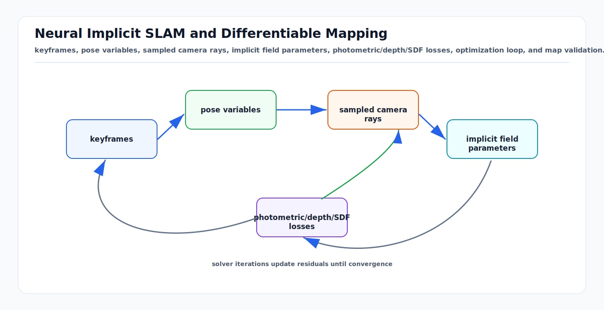

# Neural Implicit SLAM and Differentiable Mapping: First Principles

<!-- kb-visual:start -->


*Visual: keyframes, pose variables, sampled camera rays, implicit field parameters, photometric/depth/SDF losses, optimization loop, and map validation.*
<!-- kb-visual:end -->

Neural implicit SLAM represents a scene with a differentiable function instead
of only a point cloud, voxel grid, or mesh. Camera poses and map parameters are
optimized so rendered color, depth, occupancy, or signed distance predictions
match live observations. The appeal is dense, continuous geometry. The risk is
that the map can look plausible while hiding tracking, scale, dynamic-scene,
and safety failures.

---

## Related Docs

- [Volumetric Map Representations: TSDF, ESDF, Octrees, and Surfels](volumetric-map-representations-tsdf-esdf-octree-surfels.md)
- [Semantic Mapping and Map Fusion](semantic-mapping-and-map-fusion-first-principles.md)
- [Volume Rendering, Radiance Fields, and Gaussian Splatting](../geometry-3d/volume-rendering-radiance-fields-gaussian-splatting.md)
- [Nonlinear Least Squares from First Principles](../optimization/nonlinear-least-squares-first-principles.md)
- [Factor Graph Solver Patterns: Ceres, GTSAM, and g2o](../optimization/factor-graph-solver-patterns-ceres-gtsam-g2o.md)

---

## Representation

An implicit field maps coordinates to geometry and appearance:

```text
f_theta(x) -> SDF, occupancy, density, color, feature, or semantic logits
```

Common parameterizations:

| Representation | Idea | Tradeoff |
|---|---|---|
| Single MLP | Store scene in network weights. | Compact but slow to adapt and prone to forgetting. |
| Feature grids + decoder | Store local features in dense/sparse grids. | Faster and more scalable, but memory grows with space. |
| Voxel/hash encoding | Sparse learned map blocks. | Good local updates; needs allocation policy. |
| SDF field | Surface is zero level set. | Useful for geometry and planning checks. |
| Radiance/density field | Render color along camera rays. | Strong appearance signal but can hide geometry ambiguity. |

---

## Variables and Observations

For keyframes `k`, optimize:

```text
T_k        camera or sensor poses
theta      field parameters
beta       optional exposure, calibration, depth scale, or code variables
```

For a camera ray `r(u)`:

```text
x(s) = o_k + s d_k(u)
```

The field is sampled along the ray. A renderer predicts color and depth:

```text
C_hat(u), D_hat(u) = render(f_theta, T_k, ray u)
```

Losses compare predictions to observations:

```text
L_photo = sum_u ||C_hat(u) - C_obs(u)||
L_depth = sum_u robust(D_hat(u) - D_obs(u))
L_sdf   = sum_samples robust(SDF_theta(x) - SDF_target(x))
L_eik   = sum_x (||grad SDF_theta(x)|| - 1)^2
```

The exact losses depend on whether the system uses RGB-D, monocular RGB,
stereo, LiDAR, or a prior depth estimator.

---

## Tracking and Mapping Loop

```text
1. select incoming frame and candidate keyframes
2. initialize pose from odometry, constant velocity, or previous tracking
3. sample pixels/rays/points
4. render predictions from the current field
5. optimize pose with field fixed
6. choose keyframes for mapping
7. optimize field parameters and selected poses
8. validate residuals, coverage, geometry, and map health
9. publish mesh, SDF, semantic layer, or localization map if accepted
```

This alternation is the dense neural analogue of SLAM front-end tracking plus
back-end map optimization. It still needs initialization, observability,
outlier rejection, and loop-closure policy.

---

## Differentiability Is Not a Safety Case

Differentiable rendering gives gradients, not correctness. The optimizer can
explain errors with the wrong variable:

```text
pose error -> warped map
depth bias -> wrong scale
dynamic object -> baked-in geometry
exposure change -> false color residual
rolling shutter -> deformed field
unobserved surface -> plausible hallucination
```

For robotics, distinguish:

```text
rendering quality: does the novel view look good?
metric quality: is geometry correct in meters?
localization quality: does pose stay consistent?
planning quality: is free/occupied/unknown safe to consume?
```

---

## Validation Checklist

- Compare against TSDF/ESDF or LiDAR map baselines on the same sequence.
- Measure ATE/RPE, depth error, surface accuracy, completeness, and tracking
  failure rate.
- Evaluate unseen viewpoints and not only training keyframes.
- Mark unobserved space as unknown, not confidently free.
- Remove or separately model dynamic actors before static map updates.
- Check pose jumps after keyframe re-optimization or loop closure.
- Bound compute, memory, and optimization latency for online use.
- Export uncertainty or health metrics if the map feeds planning.

---

## Failure Modes

| Symptom | Likely cause | Diagnostic |
|---|---|---|
| Good render, wrong metric scale. | Monocular ambiguity or depth scale bias. | Compare depth and object dimensions to metric truth. |
| Tracking fails in textureless areas. | Photometric residual weak or repeated patterns. | Pose covariance/proxy Hessian and residual map. |
| Moving objects become walls. | Static field absorbs dynamics. | Temporal consistency and dynamic masks. |
| Map forgets old areas. | Online MLP updates overwrite previous geometry. | Replay old keyframes after new mapping. |
| Optimization is too slow. | Too many rays, keyframes, or dense features. | Latency by tracking and mapping stage. |
| Planner trusts hallucinated space. | Unknown/free semantics missing. | Occupancy audit against raw sensor rays. |

---

## Sources

- Sucar et al., "iMAP: Implicit Mapping and Positioning in Real-Time": https://arxiv.org/abs/2103.12352
- Zhu et al., "NICE-SLAM: Neural Implicit Scalable Encoding for SLAM": https://arxiv.org/abs/2112.12130
- Ortiz et al., "iSDF: Real-Time Neural Signed Distance Fields for Robot Perception": https://arxiv.org/abs/2204.02296
- Yang et al., "Vox-Fusion": https://arxiv.org/abs/2210.15858
- Johari, Carta, and Fleuret, "ESLAM": https://arxiv.org/abs/2211.11704
- Wang, Wang, and Agapito, "Co-SLAM": https://arxiv.org/abs/2304.14377
- Lin et al., "BARF: Bundle-Adjusting Neural Radiance Fields": https://arxiv.org/abs/2104.06405
