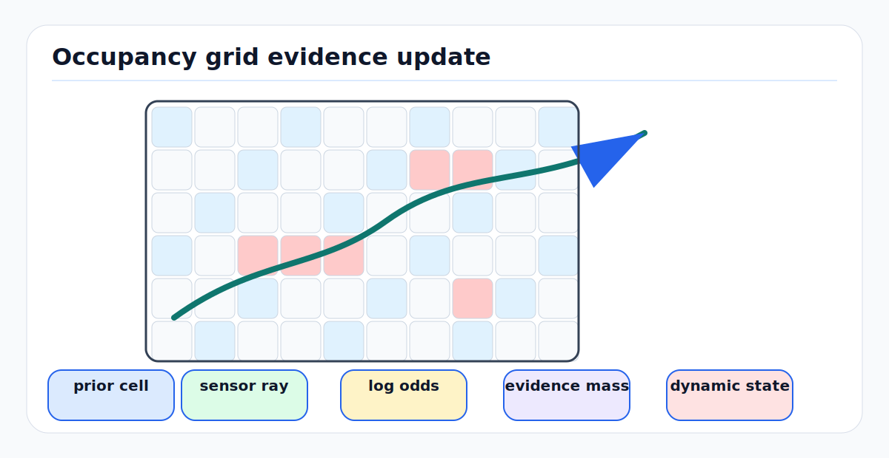

# Occupancy Bayes, Evidential, and Dynamic Grids

Occupancy grids turn noisy range, radar, camera, and map evidence into a spatial
belief about free, occupied, unknown, and sometimes moving space. The key idea
is to estimate the state of small cells instead of explicitly modeling every
object boundary. The model is simple enough for real-time autonomy, but the
assumptions behind it are sharp: cell independence, pose certainty, sensor
inverse models, and static-world priors can all break in traffic.

---

<!-- kb-figure:start -->


*Figure: how grid cells accumulate probabilistic or evidential updates and track dynamic occupancy over time.*
<!-- kb-figure:end -->

## 1. Related Docs

- [Geodesy, Map Projections, and Datums](../geometry-3d/geodesy-map-projections-datums.md)
- [Correspondence Search Data Structures](../geometry-3d/correspondence-search-data-structures.md)
- [LiDAR Working Principles and Noise Models](../geometry-3d/lidar-working-principles-noise-models.md)
- [RTK GPS and IMU Localization](../state-estimation/rtk-gps-imu-localization.md)

---

## 2. Why It Matters for AV, Perception, SLAM, and Mapping

| System | Grid role | Risk if wrong |
|---|---|---|
| Local planning | Provides drivable free space and obstacle inflation. | Planner drives through unknown space or overreacts to stale obstacles. |
| Mapping | Accumulates static structure from many passes. | Dynamic actors become permanent map obstacles. |
| Sensor fusion | Combines LiDAR, radar, camera, and prior map evidence. | Conflicting evidence is hidden by a single probability value. |
| Prediction | Dynamic grids estimate occupancy and velocity per cell. | Moving hazards are treated as static walls or ignored as noise. |
| Validation | Compares live occupancy against prior map. | Localization error is mistaken for construction or blockage. |

---

## 3. Core Math

### 3.1 Binary Bayes Occupancy

For each cell `m_i`, binary occupancy estimates:

```text
p_t = P(m_i = occupied | z_1:t, x_1:t)
```

The common log-odds representation is:

```text
l_t = log(p_t / (1 - p_t))
p_t = 1 / (1 + exp(-l_t))
```

With an inverse sensor model and prior `l_0`, the update is:

```text
l_t = l_(t-1) + logit(P(m_i | z_t, x_t)) - l_0
```

If the prior is `P(m_i) = 0.5`, then `l_0 = 0`.

Typical inverse range-sensor updates:

```text
cells before hit along ray: add l_free
cell at measured endpoint: add l_occ
cells behind hit: unchanged
```

Clamp log odds:

```text
l_min <= l_t <= l_max
```

Clamping prevents a cell from becoming impossible to clear after repeated
observations.

### 3.2 Ray Casting and Cell Independence

Occupancy grids usually assume cells are conditionally independent given pose
and measurements. This makes updates tractable but not physically exact. A
single LiDAR beam couples all cells along the ray because only the first
surface returns. The inverse model is a practical approximation.

### 3.3 Evidential Occupancy

Dempster-Shafer style evidential grids store masses over hypotheses rather than
a single probability. A common frame is:

```text
Omega = {F, O}
mass(F) = evidence for free
mass(O) = evidence for occupied
mass(U) = mass(F union O), unknown or uncommitted
```

Some dynamic formulations also track conflict:

```text
K = mass_a(F) mass_b(O) + mass_a(O) mass_b(F)
```

Conflict is informative: if a cell was occupied and is now observed free, it
may indicate motion, localization error, or map change. A single Bayesian
probability tends to hide this distinction.

### 3.4 Dynamic Occupancy Grids

Dynamic occupancy grids augment cells with motion state:

```text
cell state = {occupancy, velocity_x, velocity_y, velocity_z, age, class}
```

Common implementations use particles per cell, random finite sets, Bayesian
filters, evidential conflict, or learned recurrent networks. The prediction
step moves occupancy according to velocity; the update step fuses new sensor
evidence.

For a simple constant-velocity cell filter:

```text
x_t = A x_(t-1) + process_noise
z_t = H x_t + measurement_noise
```

where `x_t` can include position within cell and velocity. Production systems
often keep a static map layer separate from a local dynamic layer to avoid
polluting the long-term map.

---

## 4. Algorithm Steps

### 4.1 Binary Log-Odds Grid Update

1. Transform each measurement into the grid frame using the measurement time.
2. Raycast from sensor origin to measured endpoint.
3. Add `l_free` to traversed cells before the endpoint.
4. Add `l_occ` to endpoint cells, widened by sensor angular and range noise if
   needed.
5. Clamp log odds to configured bounds.
6. Apply decay or clearing rules for local costmaps if stale obstacles must
   disappear.
7. Convert to probability or discrete cost only at the consumer boundary.

### 4.2 Evidential Fusion Update

1. Convert each sensor measurement into masses over free, occupied, and unknown.
2. Discount unreliable sources using range, incidence angle, weather, class
   confidence, and calibration health.
3. Combine masses using the chosen evidence rule.
4. Preserve conflict as a diagnostic or dynamic-object cue.
5. Export planner costs using explicit policy, for example unknown as costly
   for high-speed driving but traversable for exploration.

### 4.3 Dynamic Grid Update

1. Predict existing dynamic cells forward in time.
2. Compensate for ego-motion so the grid remains in a stable local or map frame.
3. Insert sensor evidence with Doppler, optical flow, track association, or
   temporal occupancy changes.
4. Estimate per-cell velocity and uncertainty.
5. Separate static, dynamic, unknown, and conflicting cells.
6. Age out unsupported dynamic cells and protect static map cells from short
   transient actors.

---

## 5. Implementation Notes

- Store the grid frame, resolution, origin, and timestamp with every grid.
- Use integer cell indices for storage and convert to metric coordinates only at
  interfaces.
- Keep local rolling costmaps separate from globally anchored maps.
- Treat unknown separately from free. Unknown is not empty space.
- Tune `l_occ`, `l_free`, and clamps per sensor. Radar, LiDAR, and stereo have
  different false-positive and false-negative behavior.
- Model pose uncertainty when mapping at long range; a small yaw error can
  smear occupancy across multiple cells.
- Use inflation as a planning policy layer, not as raw measurement evidence.
- For long-term maps, use dynamic-object filtering and temporal consistency
  before committing occupancy.

---

## 6. Failure Modes and Diagnostics

| Symptom | Likely cause | Diagnostic |
|---|---|---|
| Obstacles never clear. | Log odds saturate too high or no freespace rays are inserted. | Plot log-odds histogram and clearing observations per cell. |
| Planner drives into unobserved areas. | Unknown collapsed into free too early. | Audit cost conversion from probability or mass to planner cost. |
| Moving vehicles become permanent map walls. | Static map absorbs dynamic objects. | Track occupancy persistence and conflict over repeated passes. |
| Grid is shifted after localization correction. | Local grid and map grid frame semantics mixed. | Verify `map`, `odom`, and rolling grid origins at correction time. |
| Evidential grid shows high conflict everywhere. | Miscalibration, time offset, or pose uncertainty. | Compare conflict against ego-motion, sensor timestamp, and residual maps. |
| Dynamic grid velocity points sideways on turns. | Ego-motion compensation missing or frame convention wrong. | Replay a static scene during turns and check estimated cell velocities. |

---

## 7. Sources

- Armin Hornung et al., "OctoMap: An Efficient Probabilistic 3D Mapping Framework Based on Octrees": https://link.springer.com/article/10.1007/s10514-012-9321-0
- OctoMap project documentation: https://octomap.github.io/
- Sebastian Thrun, Wolfram Burgard, and Dieter Fox, "Probabilistic Robotics": https://mitpress.mit.edu/9780262201629/probabilistic-robotics/
- MathWorks occupancy grid and log-odds overview: https://www.mathworks.com/help/nav/ug/occupancy-grids.html
- Thao Vu et al., "Controlling Remanence in Evidential Grids Using Geodata for Dynamic Scene Perception": https://doi.org/10.1016/j.ijar.2013.03.007
- Chunlei Yu et al., "Managing Localization Uncertainty to Handle Semantic Lane Information from Geo-Referenced Maps in Evidential Occupancy Grids": https://www.mdpi.com/1424-8220/20/2/352
- Daniel Rapp et al., "Radar-based Dynamic Occupancy Grid Mapping and Object Detection": https://arxiv.org/abs/2008.03696
- Yufan Xia et al., "Dynamic Occupancy Grid Mapping with Recurrent Neural Networks": https://arxiv.org/abs/2011.08659
