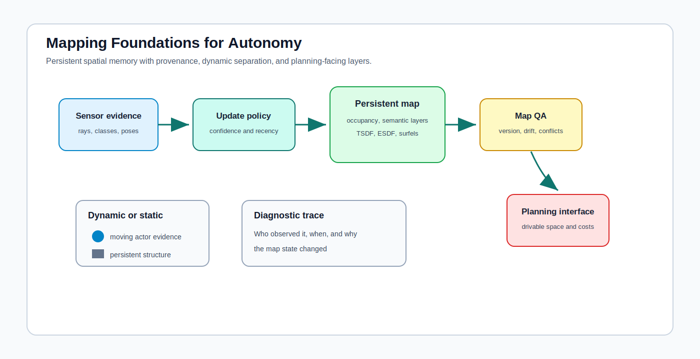

# Mapping Foundations for Autonomy

<!-- kb-visual:start -->

*Visual: section-level autonomy-role diagram showing mapping foundations, autonomy problem classes, stack interfaces, reading paths, and failure diagnosis.*
<!-- kb-visual:end -->

## Why This Foundation Exists

Mapping gives autonomy a persistent representation of the operating environment. Unlike instantaneous perception, a map carries memory: occupied space, free space, semantic layers, surfaces, traversability, versioning, provenance, and update policy.

This foundation exists because persistent environment state can both improve and corrupt autonomy. A map can stabilize planning in sparse sensing conditions, but it can also freeze temporary objects into infrastructure, hide stale assumptions, or present geometry that no longer matches the scene.

## What This Field Studies From First Principles

Mapping studies how sensor evidence becomes persistent spatial state. The section covers occupancy, evidential and dynamic grids, semantic mapping, map fusion, TSDF, ESDF, octrees, surfels, and neural implicit SLAM or differentiable mapping when they define the stored environment.

The central questions are what representation is stored, how evidence updates it, how uncertainty and provenance are retained, how dynamic objects are separated from static structure, and how planners consume the result.

## Autonomy Problem Map

Mapping bridges perception, localization, planning, and operations. It consumes measurements, poses, semantic predictions, and update policies. It produces occupancy layers, semantic layers, volumetric fields, tiles, change sets, QA artifacts, and planning-facing constraints.

The autonomy risk is persistent state drift: if a map is stale, overconfident, misregistered, or semantically wrong, every downstream consumer can inherit the same error as if it were ground truth.

## Core Mental Model

Think of mapping as evidence accumulation with memory and accountability. A mapping system should answer: what was observed, when, from which pose and sensor, with what confidence, and why the current map state replaced or retained the previous state.

The practical model is: `sensor evidence -> pose association -> representation update -> dynamic/static policy -> QA -> planning interface`. When any stage loses uncertainty or provenance, the map becomes harder to debug and easier to overtrust.

## What This Foundation Lets You Review

- Does the map distinguish persistent infrastructure from temporary objects and moving actors?
- Are update policies explicit about recency, confidence, provenance, conflict handling, and rollback?
- Is the representation appropriate for the downstream consumer, such as occupancy, semantic layers, ESDF, surfels, or tiles?
- Can QA detect stale regions, registration drift, semantic conflicts, and unsafe map edits?
- Does the planning interface preserve enough uncertainty to avoid treating the map as perfect?

## Problem-Class Coverage

| Problem Class | Role Of This Foundation | Representative Applied Pages |
|---|---|---|
| Perception and scene understanding | supporting - perception supplies classes and geometry that mapping fuses into persistent layers. | [Semantic Mapping with Learned Priors](../../30-autonomy-stack/localization-mapping/maps/semantic-mapping-learned-priors.md) - review whether perception errors are stored with provenance for debugging. |
| Localization, SLAM, and state estimation | supporting - map updates need poses and uncertainty, while localization may later consume the map. | [Robust State Estimation and Multi-Sensor Fusion](../../30-autonomy-stack/localization-mapping/overview/robust-state-estimation-multi-sensor.md) - debug whether pose uncertainty is contaminating map state. |
| Mapping and spatial memory | primary - this foundation owns occupancy, semantic, volumetric, dynamic, static, and versioned map representations. | [Map Tile Versioning and Distribution](../../30-autonomy-stack/localization-mapping/maps/map-tile-versioning-distribution.md) - review stale tile, rollback, and distribution failure evidence. |
| Prediction and world modeling | supporting - dynamic/static separation informs prediction, but mapping does not own actor forecasting. | [Semantic Mapping with Learned Priors](../../30-autonomy-stack/localization-mapping/maps/semantic-mapping-learned-priors.md) - debug when learned priors overwrite recent dynamic evidence. |
| Planning and decision making | supporting - maps provide drivable space, costs, layers, and constraints for planners. | [Map Tile Versioning and Distribution](../../30-autonomy-stack/localization-mapping/maps/map-tile-versioning-distribution.md) - review whether planners receive the correct map version and safety-relevant changes. |
| Control and actuation | not central - control consumes trajectory constraints, not raw map update mechanics. | [Robust State Estimation and Multi-Sensor Fusion](../../30-autonomy-stack/localization-mapping/overview/robust-state-estimation-multi-sensor.md) - debug whether map-relative localization errors propagate into control references. |
| Safety, validation, and assurance | primary - map QA, provenance, stale-data detection, and update approval are safety-critical map responsibilities. | [Map Tile Versioning and Distribution](../../30-autonomy-stack/localization-mapping/maps/map-tile-versioning-distribution.md) - review audit trails for unsafe map publication or rollback. |
| Runtime systems and operations | supporting - runtime distributes tiles, monitors health, and reports map freshness. | [Map Tile Versioning and Distribution](../../30-autonomy-stack/localization-mapping/maps/map-tile-versioning-distribution.md) - debug operational incidents caused by tile mismatch or delayed deployment. |

## Reading Paths By Task

For persistent occupancy and dynamic grids, start with [Occupancy, Bayes, Evidential, and Dynamic Grids](occupancy-bayes-evidential-dynamic-grids.md), then compare the representation tradeoffs in [Volumetric Map Representations](volumetric-map-representations-tsdf-esdf-octree-surfels.md).

For semantic map fusion, read [Semantic Mapping and Map Fusion](semantic-mapping-and-map-fusion-first-principles.md), then trace how QA, update policy, and provenance affect applied map distribution.

For differentiable or neural map updates, read [Neural Implicit SLAM and Differentiable Mapping](neural-implicit-slam-differentiable-mapping-first-principles.md) after the occupancy and representation notes.

For photoreal dynamic scene reconstruction, digital twins, and Gaussian or NeRF static/dynamic decomposition, read [Dynamic 4D Neural and Gaussian Reconstruction](dynamic-4d-neural-gaussian-reconstruction.md), then use [Photoreal City-Scale 4D Reconstruction](../../30-autonomy-stack/localization-mapping/overview/photoreal-city-scale-4d-reconstruction.md) to connect the foundation to SLAM, simulation, and perception pages.

## Dependency Map

Mapping depends on geometry for coordinate frames and registration, state estimation for poses and covariance, sensors for measurement likelihoods, and perception for semantic observations. It hands persistent representations to localization, planning, runtime distribution, safety review, and operations.

The dependency review should look for where uncertainty is transformed into a hard map state. That is where temporary evidence can become permanent operational risk.

## Interfaces, Artifacts, and Failure Modes

Core artifacts include occupancy grids, semantic layers, TSDF or ESDF fields, surfel sets, map tiles, change logs, provenance records, conflict reports, dynamic-object masks, and map QA dashboards.

Diagnostic case: A moved baggage cart becomes static infrastructure because map update policy lacks provenance and dynamic/static separation.

Common failure modes include stale tiles, overconfident occupancy, semantic label drift, registration offsets, erased temporary hazards, duplicate surfaces, missing provenance, and planners consuming map layers with the wrong freshness or confidence contract.

## Boundaries With Neighboring Foundations

- Owns: persistent environment representation, occupancy, semantic layers, TSDF, ESDF, surfels, map fusion, update policy, dynamic/static separation, and map QA.
- Hands off to: geometry for registration geometry and state estimation for latent-state fusion.
- Does not own: raw registration until it is committed into persistent map state.

## Pages In This Section

- [Dynamic 4D Neural and Gaussian Reconstruction](dynamic-4d-neural-gaussian-reconstruction.md)
- [Neural Implicit SLAM and Differentiable Mapping](neural-implicit-slam-differentiable-mapping-first-principles.md)
- [Occupancy, Bayes, Evidential, and Dynamic Grids](occupancy-bayes-evidential-dynamic-grids.md)
- [Semantic Mapping and Map Fusion](semantic-mapping-and-map-fusion-first-principles.md)
- [Volumetric Map Representations](volumetric-map-representations-tsdf-esdf-octree-surfels.md)

## Core Sources

This overview synthesizes the section pages listed above; no additional external sources were used.
