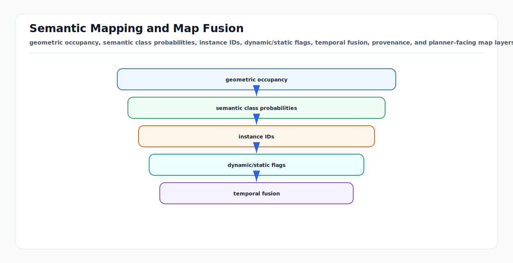

# Semantic Mapping and Map Fusion: First Principles

<!-- kb-visual:start -->


*Visual: geometric occupancy, semantic class probabilities, instance IDs, dynamic/static flags, temporal fusion, provenance, and planner-facing map layers.*
<!-- kb-visual:end -->

Semantic mapping attaches meaning to geometry. A useful robot map should not
only answer "is this space occupied?" It should also answer "what is it, is it
static, who observed it, how certain are we, and what should the planner do with
it?" Map fusion is the process of updating those answers over time, across
sensors, and across submaps without losing uncertainty or provenance.

---

## Related Docs

- [Occupancy Bayes, Evidential, and Dynamic Grids](occupancy-bayes-evidential-dynamic-grids.md)
- [Volumetric Map Representations: TSDF, ESDF, Octrees, and Surfels](volumetric-map-representations-tsdf-esdf-octree-surfels.md)
- [Point Cloud Segmentation Losses and Metrics](../geometry-3d/point-cloud-segmentation-losses-metrics-first-principles.md)
- [Coordinate Frames, Projections, and SE(3)](../geometry-3d/coordinate-frames-projections-se3.md)
- [Fusion with Unknown Correlations and Covariance Intersection](../state-estimation/fusion-unknown-correlations-covariance-intersection.md)

---

## Map State

A semantic map element may be a cell, voxel, surfel, mesh face, object, lanelet,
or scene-graph node. A practical state often includes:

```text
geometry:       occupancy, TSDF/SDF, ESDF, surfel, mesh, or polygon
semantics:      class probability vector or label distribution
instance:       object/landmark/asset ID
motion:         static, dynamic, movable, stale, or unknown
uncertainty:    covariance, weight, entropy, age, or conflict
provenance:     sensor, time, vehicle, map version, pose estimate
consumer layer: planner cost, localization target, inspection layer
```

The first-principles rule is to keep measurement evidence separate from planner
policy. "Unknown" is not the same as "free," and "vehicle" is not automatically
"lethal forever."

---

## Semantic Fusion

For a map element `m` and semantic class `c`, a simple Bayesian update is:

```text
P_t(c | m) proportional P(z_t | c, m) P_(t-1)(c | m)
```

In log space:

```text
log P_t(c) = log P_(t-1)(c) + log P(z_t | c) - normalizer
```

If the input is a neural segmentation probability, treat it as evidence that
needs calibration, not ground truth. Temperature scaling, class priors, sensor
range weighting, and view-angle weighting can all change the map update.

For occupancy and semantics together:

```text
P(occupied, class=c) != P(occupied) * P(class=c) in general
```

For example, a point labeled "road" can be free drivable surface, while a point
labeled "cone" is an obstacle. The map schema should encode how each class
affects occupancy and planning.

---

## Instance and Dynamic Fusion

Instance-aware mapping decides whether two observations refer to the same
object:

```text
same instance if geometry, class, time, and motion are consistent
```

Dynamic filtering prevents moving actors from becoming permanent map structure:

```text
static layer: long-lived geometry and semantics
dynamic layer: actors, temporary equipment, changing obstacles
change layer: conflicts with prior map or expected occupancy
```

Airport and road environments need a "movable but currently static" category
for carts, cones, signs, barriers, and service equipment. Those objects may be
real obstacles now but should not automatically become immutable HD map facts.

---

## Map Fusion Across Time and Submaps

To fuse map elements from submap `a` into map `b`:

```text
1. estimate T_ba and its uncertainty
2. transform geometry and covariance into the target map frame
3. associate overlapping cells, surfels, objects, or graph nodes
4. fuse compatible evidence
5. preserve conflict when evidence disagrees
6. record provenance and map version
```

If two submaps share raw observations or a previous global map, their errors are
correlated. Treating them as independent can make the fused map overconfident.
For map-level products, provenance is a safety feature, not paperwork.

---

## Planner-Facing Layers

Planning rarely consumes raw semantic probabilities directly. It consumes
policy layers:

| Layer | Input evidence | Planner-facing output |
|---|---|---|
| Occupancy | range rays, depth, radar, prior map | free, occupied, unknown, inflated cost |
| Semantics | camera/LiDAR labels, map priors | road, curb, lane, pedestrian zone, stand |
| Instances | tracking and segmentation | object ID, extent, persistence, motion class |
| Dynamics | temporal changes and Doppler/flow | moving, stopped, stale, cleared |
| Provenance | sensor/time/source history | confidence, freshness, audit trail |

Keep the raw map and policy map versioned separately so a planner change does
not silently rewrite mapping evidence.

---

## Implementation Notes

- Define whether map probabilities are per cell, per surface element, per
  object, or per lane/map primitive.
- Store unknown, conflict, and stale states explicitly.
- Calibrate semantic predictions before repeated fusion; repeated overconfident
  softmax outputs can saturate a map.
- Use pose uncertainty when fusing at long range or after loop closure.
- Keep static map updates behind quality gates and human/automated review when
  they affect operational routes.
- Separate map correction from localization correction. A new pose graph
  solution may move the map frame or submaps.
- Export diagnostics: entropy, conflict, age, observation count, and source
  breakdown.

---

## Failure Modes

| Symptom | Likely cause | Diagnostic |
|---|---|---|
| Dynamic actors become permanent obstacles. | Static map accepts short-lived observations. | Observation age and persistence by instance. |
| Planner drives through unknown space. | Unknown collapsed into free in policy layer. | Audit occupancy-to-cost conversion. |
| Semantics saturate after repeated passes. | Correlated predictions fused as independent. | Entropy and calibration by source sequence. |
| Map seams appear at submap boundaries. | Transform or covariance ignored. | Residuals and class conflict near boundaries. |
| Wrong class persists after correction. | No decay, provenance, or relabel policy. | Per-element source history and last-seen time. |
| Localization target disappears. | Mapping and planner layers mixed. | Separate localization geometry from semantic policy. |

---

## Sources

- McCormac et al., "SemanticFusion: Dense 3D Semantic Mapping with Convolutional Neural Networks": https://arxiv.org/abs/1609.05130
- Rosinol et al., "Kimera: an Open-Source Library for Real-Time Metric-Semantic Localization and Mapping": https://arxiv.org/abs/1910.02490
- Rosinol et al., "Kimera-Multi": https://arxiv.org/abs/2011.04087
- Hughes et al., "Hydra: A Real-time Spatial Perception System for 3D Scene Graph Construction and Optimization": https://arxiv.org/abs/2201.13360
- Schmid et al., "Panoptic Multi-TSDFs": https://arxiv.org/abs/2109.10165
- Hornung et al., "OctoMap: An Efficient Probabilistic 3D Mapping Framework Based on Octrees": https://link.springer.com/article/10.1007/s10514-012-9321-0
- Oleynikova et al., "Voxblox": https://arxiv.org/abs/1611.03631
