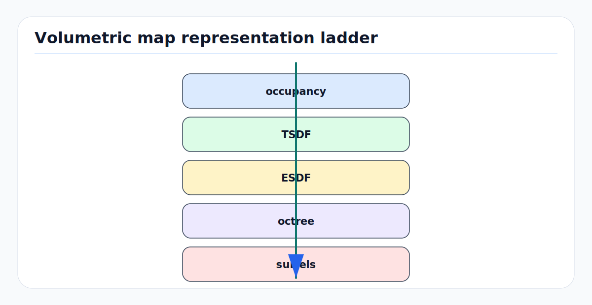

# Volumetric Map Representations: TSDF, ESDF, Octrees, and Surfels

A map is not just storage. It is an answer to a query. Planners ask, "How far
am I from collision?" Localizers ask, "Where should this scan align?" Perception
asks, "Is this space occupied, free, unknown, or changed?" Dense reconstruction
asks, "Where is the surface?" Different volumetric representations optimize for
different queries.

TSDFs, ESDFs, octrees, occupancy grids, and surfels are all ways of compressing
many noisy range observations into a spatial belief. The core trade-off is
between surface accuracy, free-space reasoning, memory, update speed, and
planning usefulness.

---

<!-- kb-figure:start -->


*Figure: how different volumetric maps trade surface accuracy, free-space distance, sparsity, and rendering detail.*
<!-- kb-figure:end -->

## 1. Related Docs

- [Occupancy Bayes, Evidential, and Dynamic Grids](occupancy-bayes-evidential-dynamic-grids.md)
- [LiDAR Working Principles and Noise Models](../geometry-3d/lidar-working-principles-noise-models.md)
- [Point Cloud Registration Math: ICP, NDT, and GICP](../geometry-3d/point-cloud-registration-math-icp-ndt-gicp.md)
- [Coordinate Frames, Projections, and SE(3)](../geometry-3d/coordinate-frames-projections-se3.md)
- [Rolling Shutter, LiDAR Deskew, and Motion Distortion](../geometry-3d/rolling-shutter-lidar-deskew-motion-distortion.md)
- [Geodesy, Map Projections, and Datums](../geometry-3d/geodesy-map-projections-datums.md)

---

## 2. Occupancy: Is Space Filled?

Occupancy maps estimate:

```text
P(m_i = occupied | z_1:t, x_1:t)
```

For log odds:

```text
l_i = log(p_i / (1 - p_i))
l_i <- clamp(l_i + inverse_sensor_update - l_0)
```

Occupancy is good for free/occupied/unknown reasoning. It is less direct for
surface normals, smooth geometry, and distance-to-collision gradients unless
postprocessed.

---

## 3. Signed Distance Fields

A signed distance field (SDF) stores distance to the closest surface:

```text
phi(x) = signed distance from x to nearest surface
```

Convention varies, but robotics often uses:

```text
phi(x) > 0  free space
phi(x) = 0  surface
phi(x) < 0  inside occupied matter
```

The surface is the zero level set:

```text
S = { x | phi(x) = 0 }
```

The gradient points along the local surface normal:

```text
n(x) = grad(phi(x)) / ||grad(phi(x))||
```

This makes SDFs useful for tracking, reconstruction, collision checking, and
trajectory optimization.

---

## 4. TSDF: Truncated Signed Distance Field

### 4.1 First Principle

A TSDF stores signed distance only near observed surfaces:

```text
phi_mu(x) = clamp(phi(x), -mu, +mu)
```

where `mu` is the truncation distance. For a depth/range measurement along a
ray, a voxel center `x` is compared to the measured surface depth:

```text
d = measured_range - range_to_voxel_along_ray
phi = clamp(d / mu, -1, +1)
```

The running weighted average is:

```text
F_new = (W_old F_old + w_obs F_obs) / (W_old + w_obs)
W_new = min(W_old + w_obs, W_max)
```

Curless and Levoy's volumetric fusion showed why this works: many noisy range
images can be integrated into a smooth implicit surface, then meshed by
extracting the zero crossing.

### 4.2 What TSDFs Are Good At

- smooth surface reconstruction,
- dense RGB-D or LiDAR mapping,
- ICP alignment against surface geometry,
- mesh extraction with marching cubes,
- reducing independent depth noise through averaging.

### 4.3 What TSDFs Are Bad At

- preserving unknown versus free far from surfaces,
- representing thin objects smaller than the voxel/truncation scale,
- dynamic scenes unless observations are aged or segmented,
- large outdoor maps unless sparsified or tiled,
- planning distance queries far from surfaces.

KinectFusion made TSDF fusion practical in real time for room-scale RGB-D
tracking and mapping, but fixed dense volumes do not scale by themselves.

---

## 5. ESDF: Euclidean Signed Distance Field

An ESDF stores the actual Euclidean distance to the nearest obstacle over free
space:

```text
D(x) = min_y ||x - y||, where y is occupied surface
```

For planning, the ESDF gives collision cost and gradient:

```text
cost(x) = f(D(x) - robot_radius)
grad cost uses grad D(x)
```

Unlike a TSDF, an ESDF is valuable far from the surface because the planner asks
how much clearance remains everywhere in the local volume.

### TSDF to ESDF

Many robot mapping systems integrate sensor data into a TSDF, then propagate
distances into an ESDF:

```text
range/depth observations -> TSDF near surfaces -> ESDF over free space
```

Voxblox is a canonical robotics implementation: it builds TSDFs and incrementally
updates ESDFs for onboard MAV planning.

### ESDF Failure Modes

| Failure | Effect |
|---|---|
| inflated obstacles inserted as measurements | planner clearance becomes double-counted |
| unknown treated as free | planner enters unobserved space |
| stale dynamic obstacles | planner avoids empty space or follows false gradients |
| disconnected update queues | ESDF lags behind TSDF changes |
| too coarse voxels | gradients are blocky and paths graze obstacles |

---

## 6. Octrees and Sparse Voxel Structures

Dense 3D grids scale poorly:

```text
memory = Nx * Ny * Nz * bytes_per_voxel
```

An octree recursively subdivides space into eight children. Large uniform
regions stay coarse; detailed regions split:

```text
root cube
  -> 8 child cubes
      -> 8 child cubes each
```

OctoMap uses an octree for probabilistic 3D occupancy. It is effective because
many environments contain large regions of free or unknown space. Octrees also
enable multi-resolution queries and compression through pruning equal children.

### Octree Trade-Offs

| Strength | Cost |
|---|---|
| memory efficient for sparse maps | pointer/tree traversal overhead |
| supports unknown space naturally | harder GPU access than dense arrays |
| multi-resolution queries | updates can fragment the tree |
| large outdoor volumes | surface detail depends on leaf resolution |

Modern systems often use hashed voxel blocks or sparse voxel grids instead of
pure pointer octrees when fast local dense access is needed.

---

## 7. Surfels

A surfel is a small oriented surface element:

```text
surfel = { position, normal, radius, color/intensity, confidence, timestamp }
```

Surfels represent surfaces directly rather than storing all surrounding volume.
They are useful for:

- dense visual/LiDAR mapping,
- map rendering and inspection,
- point-to-plane alignment,
- preserving local surface normals and colors,
- incremental map updates.

Surfels are weaker for:

- explicit unknown/free reasoning,
- clearance queries for planning,
- volumetric collision checking,
- topology and watertight mesh extraction without extra processing.

Surfels and TSDFs are often complementary: surfels are compact for observed
surfaces; volumetric maps are better for free/unknown/planning semantics.

---

## 8. Choosing a Representation

| Query | Good representation |
|---|---|
| Is this cell occupied/free/unknown? | occupancy grid or OctoMap |
| Where is the smooth surface? | TSDF |
| How far to collision? | ESDF |
| What is the local plane/normal for registration? | surfels, TSDF gradient, GICP covariance |
| Can a robot arm or drone plan through 3D space? | ESDF plus unknown-space policy |
| Can a long-range outdoor map fit in memory? | octree, hashed blocks, tiled sparse grid |
| Can I render or inspect the observed surface? | surfels, mesh, TSDF extraction |

No representation removes the need for a sensor model. Pose error, calibration
error, rolling-shutter/LiDAR distortion, weather returns, and dynamic objects
enter the map as geometry unless filtered or modeled.

---

## 9. Implementation Checklist

- Define the map frame, voxel size, block size, and origin convention.
- Preserve unknown separately from free and occupied.
- Use raycasting for free-space evidence when the sensor supports it.
- Store weights/confidence and cap them so old geometry can be corrected.
- Keep static long-term maps separate from local dynamic costmaps.
- Compensate ego-motion before integration; do not fuse distorted scans.
- Filter dynamic objects before static map integration or store dynamic layers.
- Pick truncation distance `mu` from range noise, pose error, and voxel size.
- For ESDFs, decide whether unknown space is lethal, costly, or traversable.
- Validate with synthetic primitives: wall, pole, thin object, corner, ramp.
- Track map update latency separately from planner query latency.
- Export diagnostics: voxel weights, observation count, age, unknown/free ratio,
  ESDF gradient norm, and mesh zero-crossing quality.

---

## 10. Common Failure Modes

| Symptom | Likely cause |
|---|---|
| thick walls | pose noise, no deskew, large truncation band |
| missing thin poles | voxel too coarse or TSDF averaging erases them |
| phantom obstacles | dynamic objects fused into static layer |
| planner cuts through unknown | unknown converted to free in ESDF/costmap |
| blocky paths | coarse ESDF or nearest-neighbor distance interpolation |
| map grows without bound | no rolling window, tiling, compression, or pruning |
| ICP aligns to old geometry | weights saturated and map cannot adapt |
| mesh has holes | insufficient viewing angles or unknown/free not observed |

---

## 11. Sources

- Brian Curless and Marc Levoy, "A Volumetric Method for Building Complex Models from Range Images": https://graphics.stanford.edu/papers/volrange/
- Richard A. Newcombe et al., "KinectFusion: Real-Time Dense Surface Mapping and Tracking": https://www.microsoft.com/en-us/research/wp-content/uploads/2016/02/ismar2011.pdf
- Armin Hornung et al., "OctoMap: An Efficient Probabilistic 3D Mapping Framework Based on Octrees": https://link.springer.com/article/10.1007/s10514-012-9321-0
- OctoMap project: https://octomap.github.io/
- Helen Oleynikova et al., "Voxblox: Incremental 3D Euclidean Signed Distance Fields for On-Board MAV Planning": https://arxiv.org/abs/1611.03631
- Thomas Whelan et al., "ElasticFusion: Dense SLAM Without A Pose Graph": https://www.roboticsproceedings.org/rss11/p01.html
- Radu Bogdan Rusu and Steve Cousins, "3D is here: Point Cloud Library (PCL)": https://pointclouds.org/
