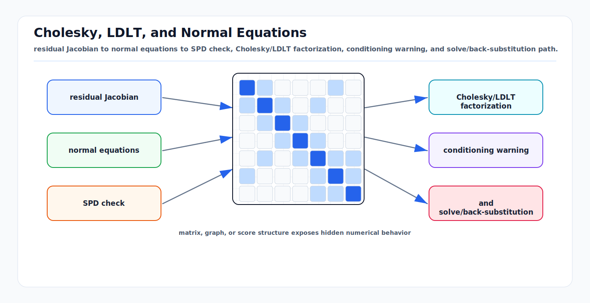

# Cholesky, LDLT, and Normal Equations

<!-- kb-visual:start -->


*Visual: residual Jacobian to normal equations to SPD check, Cholesky/LDLT factorization, conditioning warning, and solve/back-substitution path.*
<!-- kb-visual:end -->

## Related docs

- [QR, SVD, and Rank-Revealing Solvers](qr-svd-rank-revealing-solvers.md)
- [Eigenvalues, Hessian Conditioning, and Observability](eigenvalues-hessian-conditioning-observability.md)
- [Sparse Matrices, Fill-In, and Ordering](sparse-matrices-fill-in-ordering.md)
- [Square-Root Information and Covariance Recovery](square-root-information-and-covariance-recovery.md)
- [Schur Complement, Marginalization, and PCG](schur-complement-marginalization-pcg.md)
- [GTSAM Factor Graph Optimization](../state-estimation/gtsam-factor-graphs.md)

## Why it matters for AV, perception, SLAM, and mapping

Most production SLAM, bundle adjustment, lidar mapping, calibration, and sensor fusion backends repeatedly solve linearized least-squares systems. After linearizing residuals around the current estimate, the computational hot path is often:

```text
min_delta 0.5 ||J delta + r||_2^2
```

The normal equations convert this into a symmetric system:

```text
H delta = -g
H = J^T J
g = J^T r
```

With whitened residuals, `J` already includes the square-root information weighting. With explicit covariance `Sigma`, the same system is:

```text
H = J^T Sigma^-1 J
g = J^T Sigma^-1 r
```

For AV workloads this is attractive because the Hessian is sparse, block structured, and symmetric. Pose graph SLAM, visual-inertial odometry, radar/lidar calibration, and offline HD map optimization all exploit this structure. The danger is that forming `J^T J` squares the condition number, hides rank deficiency, and makes Cholesky fail when the system is underconstrained, badly scaled, or only positive semidefinite because of gauge freedoms.

The practical rule is:

- Use Cholesky or LDLT when the linearized system is well constrained, well scaled, and performance dominates.
- Use QR or SVD when rank detection and numerical robustness matter more than speed.
- Treat Cholesky failure as a model or observability signal, not just as a linear algebra nuisance.

## Core math and algorithm steps

### From residuals to normal equations

For residual block `e_i(x)` with covariance `Sigma_i`, define the whitened residual:

```text
f_i(x) = L_i^-1 e_i(x), where Sigma_i = L_i L_i^T
```

Linearize at `x0`:

```text
f(x0 + delta) = f(x0) + J delta
```

The Gauss-Newton step solves:

```text
min_delta 0.5 ||J delta + f||_2^2
```

Set the gradient to zero:

```text
J^T (J delta + f) = 0
J^T J delta = -J^T f
H delta = b
```

where `H = J^T J` and `b = -J^T f`. If Levenberg-Marquardt damping is active, solve:

```text
(H + lambda D^T D) delta = b
```

where `D` is commonly a diagonal scaling matrix derived from `diag(H)`.

### Cholesky factorization

For symmetric positive definite `H`, Cholesky writes:

```text
H = L L^T
```

or equivalently:

```text
H = R^T R
```

The solve is:

```text
L y = b
L^T delta = y
```

In sparse SLAM systems, the numeric factorization is usually preceded by symbolic analysis:

1. Build the sparsity pattern of `H`.
2. Choose a fill-reducing permutation `P`.
3. Factor the permuted system:

```text
P H P^T = L L^T
```

4. Solve in permuted coordinates, then unpermute the result.

The permutation is not a small implementation detail. It often determines whether the solver is real time or unusable.

### LDLT factorization

LDLT writes a symmetric matrix as:

```text
H = L D L^T
```

where `L` is unit lower triangular and `D` is diagonal or block diagonal depending on the algorithm. In a positive definite problem, LDLT avoids square roots. In semidefinite or indefinite problems, pivoting and block pivots become important. Eigen's dense `LDLT` documentation is useful, but its own decomposition catalogue warns that Eigen's LDLT variant uses diagonal `D` and is not the same as a full indefinite Bunch-Kaufman style factorization.

For SLAM and mapping, LDLT is useful when:

- Damping or priors make the Hessian effectively positive definite.
- You want inertia-like diagnostics from pivots.
- You want to solve symmetric systems without explicitly taking square roots.

It is not a license to ignore gauge freedom. If a pose graph has no prior, the global translation and yaw modes are still null directions.

### Normal equations and conditioning

If `J` has singular values `sigma_i`, then `H = J^T J` has eigenvalues:

```text
lambda_i(H) = sigma_i(J)^2
```

Therefore:

```text
cond(H) = cond(J)^2
```

This is the central tradeoff. Normal equations give a smaller symmetric system, but magnify conditioning problems. A visual SLAM Jacobian with weak parallax may look merely difficult in QR but nearly singular in Cholesky.

## Implementation notes

### Solver selection

Use Cholesky when all of these are true:

- The problem has enough priors or constraints to remove gauge freedoms.
- Residuals are whitened with realistic noise scales.
- Jacobian columns are reasonably scaled.
- Rank deficiency is not expected.
- You need maximum speed on large sparse systems.

Prefer LDLT when:

- The matrix is symmetric and close to semidefinite.
- You need more diagnostic information than plain LLT gives.
- The library implementation supports the definiteness class you need.

Prefer QR or SVD when:

- Calibrating sensors with weak excitation.
- Debugging a new factor, manifold convention, or residual scaling.
- Computing covariance in a potentially rank-deficient system.
- Handling single-camera landmarks, low-baseline triangulation, or missing priors.

### Practical Cholesky workflow

For a nonlinear least-squares backend:

1. Evaluate residuals and Jacobians at the current state.
2. Whiten residuals and Jacobians using the square-root information factors.
3. Assemble sparse block Hessian `H` and gradient `g`, or hand the block structure to a solver that assembles internally.
4. Apply robust loss scaling before forming `H`.
5. Add damping if using LM:

```text
H_damped = H + lambda diag(H)
```

6. Apply fill-reducing ordering.
7. Factorize.
8. If factorization succeeds, solve and evaluate the actual cost decrease.
9. If factorization fails, inspect rank, priors, Jacobian scaling, and negative pivots before simply increasing damping.

### Numerical scaling

Bad unit scaling is common in AV systems:

- Translation in meters, rotation in radians, velocity in m/s, bias in rad/s, and landmark inverse depth can differ by orders of magnitude.
- A GPS sigma of `0.02 m` and a lidar scan-matching sigma of `0.001 m` can dominate all other factors.
- Pixel residuals and metric residuals must not be mixed without whitening.

Useful checks:

```text
max_diag_H / min_positive_diag_H
max_column_norm_J / min_positive_column_norm_J
||H - H^T||_inf
||H delta - b|| / ||b||
actual_cost_drop / predicted_cost_drop
```

### Damping is not a prior

LM damping can make a solve numerically possible, but it should not be interpreted as real information. If the global frame is unanchored, damping may choose a step but the posterior covariance still has gauge directions. For map publication, covariance queries, and loop closure consistency, use explicit priors or explicit gauge handling.

## Failure modes and diagnostics

### Missing prior or gauge freedom

Symptoms:

- Cholesky reports non-positive pivot.
- The reported failing variable is not the true source.
- The trajectory can translate or rotate without changing residuals.
- Marginal covariance is huge or unavailable.

Diagnostics:

- Check that the first pose, map frame, scale, yaw, or gravity direction is anchored as appropriate.
- Inspect small eigenvalues of `H`.
- For visual SfM, check global similarity gauge: rotation, translation, and scale may be unobservable without constraints.

### Degenerate geometry

Examples:

- Monocular landmarks observed from one camera or tiny baseline.
- Vehicle drives straight with no yaw excitation while estimating extrinsics.
- Planar lidar scans try to estimate full 6-DoF pose.
- Radar Doppler factors do not excite lateral or vertical states.

Diagnostics:

- Examine singular values of the relevant Jacobian block.
- Compare information added by each factor type.
- Run excitation-specific tests: turns, stops, vertical motion, nearby/far landmarks.

### Indefinite Hessian

For pure Gauss-Newton with correctly formed residual Jacobians, `J^T J` is positive semidefinite. Indefinite `H` usually means:

- Hand-built Hessian factors are wrong.
- Robust loss second-order terms were applied incorrectly.
- Floating-point accumulation and poor conditioning introduced negative pivots.
- A marginalization prior was built at an inconsistent or stale linearization point.

Diagnostics:

- Rebuild from explicit Jacobian and compare with hand-built Hessian.
- Temporarily disable robust second-order corrections.
- Check symmetry after assembly.
- Try QR on the same linearized problem.

### Squared condition number

If `cond(J)` is around `1e8`, then `cond(J^T J)` is around `1e16`, near double precision limits. Cholesky may return a step, but the step can be dominated by numerical error.

Diagnostics:

- Compare normal-equation step with QR on a smaller representative problem.
- Monitor residual after linear solve.
- Use iterative refinement only if the model is observable.
- Rescale variables and residuals before blaming the sparse solver.

## Sources

- Ceres Solver, "Solving Non-linear Least Squares": https://ceres-solver.readthedocs.io/latest/nnls_solving.html
- Ceres Solver, "Covariance Estimation": https://ceres-solver.readthedocs.io/latest/nnls_covariance.html
- Eigen, "Catalogue of dense decompositions": https://eigen.tuxfamily.org/dox/group__TopicLinearAlgebraDecompositions.html
- Eigen, "LDLT class reference": https://eigen.tuxfamily.org/dox/classEigen_1_1LDLT.html
- SuiteSparse CHOLMOD user guide: https://github.com/DrTimothyAldenDavis/SuiteSparse/blob/dev/CHOLMOD/Doc/CHOLMOD_UserGuide.pdf
- GTSAM, `IndeterminantLinearSystemException`: https://gtsam.org/doxygen/a04411.html
- GTSAM tutorial, "Factor Graphs and GTSAM": https://gtsam.org/tutorials/intro.html
