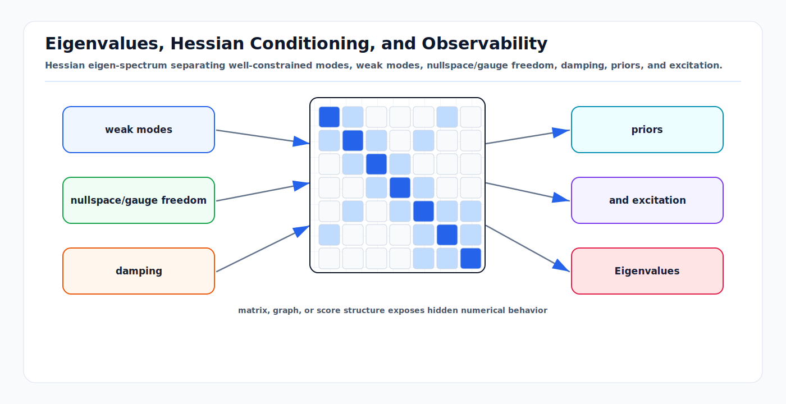

# Eigenvalues, Hessian Conditioning, and Observability

<!-- kb-visual:start -->


*Visual: Hessian eigen-spectrum separating well-constrained modes, weak modes, nullspace/gauge freedom, damping, priors, and excitation.*
<!-- kb-visual:end -->

## Related docs

- [Cholesky, LDLT, and Normal Equations](cholesky-ldlt-normal-equations.md)
- [QR, SVD, and Rank-Revealing Solvers](qr-svd-rank-revealing-solvers.md)
- [Sparse Matrices, Fill-In, and Ordering](sparse-matrices-fill-in-ordering.md)
- [Square-Root Information and Covariance Recovery](square-root-information-and-covariance-recovery.md)
- [Schur Complement, Marginalization, and PCG](schur-complement-marginalization-pcg.md)
- [Sparse Estimation Backend Crosswalk](sparse-estimation-backend-crosswalk.md)
- [Nonlinear Solver Diagnostics Crosswalk](../optimization/nonlinear-solver-diagnostics-crosswalk.md)
- [Bayesian Filtering and ESKF](../state-estimation/bayesian-filtering-and-eskf.md)
- [IMU Error Models and Preintegration](../state-estimation/imu-error-models-preintegration.md)
- [GLIM](../../30-autonomy-stack/localization-mapping/slam-methods/glim.md)
- [GICP and VGICP](../../30-autonomy-stack/localization-mapping/slam-methods/gicp-vgicp.md)

## Why it matters for AV, perception, SLAM, and mapping

The Hessian in a least-squares estimator is not just a matrix to factor. It is a local information model. Its eigenvalues tell you which state directions are constrained, weakly constrained, or unobservable. In AV perception and mapping, this is the difference between a reliable pose estimate and a numerically plausible but physically meaningless solution.

Examples:

- A lidar-only highway sequence can weakly observe lateral position if geometry is repetitive.
- A monocular visual-inertial system may have scale issues during low acceleration.
- A pose graph without a prior has global gauge freedoms.
- A camera-lidar calibration sequence may not excite time offset, pitch, or vertical translation.
- A fixed-lag smoother can become overconfident if marginalization removes states using stale linearization points.

The first-principles view is: observability appears as rank in the Jacobian and positive curvature in the Hessian. If the data cannot distinguish two nearby states, the residual function is flat along that direction, and the Hessian has a small or zero eigenvalue.

## Core math and algorithm steps

### Hessian as local curvature

For whitened residual vector `f(x)`, minimize:

```text
F(x) = 0.5 f(x)^T f(x)
```

Linearize:

```text
f(x + delta) = f(x) + J delta
```

The Gauss-Newton quadratic model is:

```text
m(delta) = 0.5 ||f + J delta||^2
         = 0.5 f^T f + g^T delta + 0.5 delta^T H delta
```

with:

```text
g = J^T f
H = J^T J
```

For any direction `v`:

```text
v^T H v = ||J v||^2
```

This identity is the core observability test. If `J v = 0`, moving in direction `v` does not change the linearized residual, so `v` is a nullspace direction.

### Hessian eigenvalues and Jacobian singular values

If:

```text
J = U S V^T
```

then:

```text
H = J^T J = V S^2 V^T
```

So the Hessian eigenvectors are the right singular vectors of `J`, and the Hessian eigenvalues are squared singular values:

```text
lambda_i(H) = sigma_i(J)^2
```

Interpretation:

- Large `lambda_i`: strong local information.
- Small positive `lambda_i`: weak information and high covariance.
- Zero `lambda_i`: unobservable or exactly redundant direction.
- Negative eigenvalue: impossible for exact `J^T J`, usually caused by an indefinite hand-built Hessian, incorrect robust loss handling, or numerical error.

### Fisher information interpretation

For Gaussian measurement noise, the negative log likelihood is a weighted least-squares objective:

```text
0.5 e(x)^T Sigma^-1 e(x)
```

The local Fisher information matrix is:

```text
I(x) = J_e(x)^T Sigma^-1 J_e(x)
```

This matches the Gauss-Newton Hessian for whitened residuals. The inverse, when it exists, is the local covariance approximation:

```text
Cov(delta) = I^-1
```

When `I` is singular, the full covariance does not exist in unconstrained coordinates. Use gauge fixing, priors, a pseudoinverse, or query only observable marginals with care.

### Gauge freedoms

A gauge freedom is a transformation of the whole state that leaves all measurements unchanged. Common SLAM gauges:

- Pose graph with only relative measurements: global x, y, z, roll, pitch, yaw depending on the sensor model.
- Monocular structure from motion: global similarity transform, including scale.
- VIO without enough inertial excitation: weak scale, gravity, bias, or time offset directions.
- Map alignment without absolute anchor: global transform between map and world.

Gauge freedoms are not numerical bugs. They are symmetries of the model. The bug is pretending they are observed.

### Conditioning

The 2-norm condition number is:

```text
cond(H) = lambda_max(H) / lambda_min(H)
```

For a positive definite Hessian, high condition number means small input or floating-point perturbations can cause large step changes. For normal equations:

```text
cond(J^T J) = cond(J)^2
```

This is why normal-equation Cholesky is fast but fragile when observability is weak.

## Implementation notes

### GLIM scan-matching interpretation

In GLIM, scan-matching and submap-matching factors contribute many point or voxel residuals. After whitening and linearization, those residuals contribute to the local Hessian:

```text
H_scan = J_scan^T J_scan
```

The eigenvectors of `H_scan` explain which pose directions the current geometry can constrain. This is more informative than a single scan-matching score.

Examples:

- Flat ground supplies strong information for height, roll, and pitch, but weak information for horizontal translation and yaw.
- A long wall constrains motion normal to the wall better than motion along the wall.
- Repeated terminal gates or warehouse aisles can create several local minima even when the Hessian near one minimum looks sharp.
- Dynamic objects can add strong but wrong information if they dominate correspondences.

For GLIM map QA, log or approximate weak directions for both fixed-lag odometry windows and global submap solves. If a weak mode aligns with an operationally important direction, such as lateral pose on an apron, the map needs external information: RTK/GNSS, wheel odometry, camera/radar constraints, surveyed control points, or verified loop closures.

### What to log

For each solve window or batch run, log:

```text
number of variables
number of residuals
linear solver type
damping lambda
rank estimate if available
min and max diagonal of H
linear residual ||H delta - b|| / ||b||
cost before and after update
accepted or rejected step
condition estimate if available
nearby variable reported by factorization failure
```

For diagnostics, export:

```text
whitened Jacobian J
gradient g
Hessian H
variable ordering
column-to-variable tangent coordinate map
```

Without the column map, eigenvectors are hard to interpret.

### Reading eigenvectors

For a small eigenvalue direction `v`, group entries by variable:

```text
pose_i: [rot_x rot_y rot_z trans_x trans_y trans_z]
velocity_i: [vx vy vz]
bias_i: [bgx bgy bgz bax bay baz]
landmark_j: [x y z]
```

Then inspect spatial pattern:

- Similar translation entries for all poses: global translation gauge.
- Similar yaw entries for all poses: global yaw gauge.
- Landmark depths moving along viewing rays: low parallax.
- Extrinsic yaw coupled with vehicle yaw: insufficient calibration excitation.
- Time offset coupled with forward translation: constant-velocity ambiguity.

### Priors, constraints, and gauges

There are three different actions that are often confused:

- Add a real prior: injects physical information, such as RTK initial pose or surveyed map anchor.
- Fix a gauge: chooses coordinates for a symmetry without claiming new sensor information.
- Add damping: stabilizes the numerical step but does not define posterior information.

For offline maps, explicit gauge fixing can be appropriate. For online localization, a prior usually has operational meaning and should be modeled with a realistic covariance.

### Observability-aware experiment design

Calibration and mapping runs should excite the states being estimated:

- Estimate camera-lidar yaw and translation: include turns and varied scene depth.
- Estimate IMU biases and gravity: include accelerations, stops, and rotations.
- Estimate time offset: include nonconstant velocity and angular rate.
- Estimate wheel odometry parameters: include left and right turns, speed changes, and low-slip surfaces.
- Estimate vertical lidar extrinsics: include non-flat geometry or pitched motion.

No solver can recover information that the dataset does not contain.

State estimation owns physical observability and integrity interpretation; numerical linear algebra exposes local matrix structure.

## Concept cards

### Rank deficiency

- What it means here: The linearized Jacobian does not have enough independent columns to constrain every tangent coordinate in the current solve.
- Math object: Rank of the whitened Jacobian `J`, equivalently zero or near-zero eigenvalues of `H = J^T J`.
- Effect on the solve: The step is nonunique, Cholesky may fail, and covariance in unconstrained coordinates is not finite.
- What it solves: It names the local algebraic reason a backend cannot determine a unique update.
- What it does not solve: It does not decide whether the missing information is acceptable, physically observable elsewhere, or an integrity hazard.
- Minimal example: A relative pose graph with no prior can translate every pose by the same vector with no residual change.
- Failure symptoms: Non-positive pivots, huge covariance, threshold-sensitive rank, or solution changes when a tiny prior is added.
- Diagnostic artifact: Singular values, rank estimate, and weak eigenvectors grouped by variable key and tangent coordinate.
- Normal vs abnormal artifact: A known gauge produces the expected rank loss; an unexpected missing column, bad whitening, or degenerate dataset produces an abnormal rank loss.
- First debugging move: Export the whitened `J` with the column-to-key map and compare numerical rank against the expected model symmetry.
- Do not confuse with: High but finite condition number, which is weak observability rather than exact rank loss.
- Read next: [QR, SVD, and Rank-Revealing Solvers](qr-svd-rank-revealing-solvers.md).

### Nullspace

- What it means here: A set of tangent directions that leave the linearized residual unchanged.
- Math object: Vectors `v` where `J v = 0`, or approximately null vectors where `||J v||` is near the noise floor.
- Effect on the solve: The solver can move along those directions without changing the linearized objective, so the update and covariance require gauge handling or a pseudoinverse convention.
- What it solves: It turns vague "underconstrained" failures into specific state-motion patterns.
- What it does not solve: It does not prove the nonlinear system is globally unobservable away from the current linearization point.
- Minimal example: In bearing-only landmark observation, moving a landmark along the viewing ray is locally weak or unobservable.
- Failure symptoms: Singular vectors show coherent global translation, yaw, scale, or landmark-depth motion.
- Diagnostic artifact: Nullspace basis visualized as perturbations on variable keys and tangent coordinates.
- Normal vs abnormal artifact: Expected global frame nullspace is normal before anchoring; a nullspace aligned with one sensor factor's missing coordinate is abnormal.
- First debugging move: Animate or print the smallest singular vectors by variable block to identify the physical mode.
- Do not confuse with: Gauge freedom, which is a model symmetry and a common source of nullspace.
- Read next: [Sparse Estimation Backend Crosswalk](sparse-estimation-backend-crosswalk.md).

### Gauge freedom

- What it means here: A coordinate symmetry of the estimator where multiple state assignments represent the same measurements.
- Math object: A structured nullspace induced by transformations such as global pose, yaw, or scale.
- Effect on the solve: The Hessian is positive semidefinite until the gauge is fixed or a physically meaningful prior is added.
- What it solves: It explains why a graph with correct factors can still be singular.
- What it does not solve: It does not provide real external information or improve physical observability.
- Minimal example: A pose graph with only relative measurements has arbitrary global frame coordinates.
- Failure symptoms: Cholesky failure, arbitrary map origin, covariance unavailable, or solution shifts when the anchor changes.
- Diagnostic artifact: Gauge dimension, anchor sensitivity test, and nullspace vectors matching global transformations.
- Normal vs abnormal artifact: A gauge matching the sensor model is normal; extra gauge modes after adding intended anchors are abnormal.
- First debugging move: Add a minimal temporary gauge fix on a representative problem and verify only the expected modes disappear.
- Do not confuse with: A prior, which injects physical information with a covariance.
- Read next: [Cholesky, LDLT, and Normal Equations](cholesky-ldlt-normal-equations.md).

### Condition number

- What it means here: The ratio between the strongest and weakest constrained local directions in the linearized system.
- Math object: `cond(J) = sigma_max / sigma_min` or, for positive definite normal equations, `cond(H) = lambda_max / lambda_min = cond(J)^2`.
- Effect on the solve: Floating-point perturbations, scaling mistakes, and residual noise can dominate the computed step.
- What it solves: It warns that the problem may be technically full rank but numerically fragile.
- What it does not solve: It does not identify which physical direction is weak unless paired with eigenvectors or singular vectors.
- Minimal example: A landmark triangulated from tiny baseline has a very small depth singular value.
- Failure symptoms: Threshold-sensitive updates, large linear residual after solve, unstable covariance, or different steps from Cholesky and QR.
- Diagnostic artifact: Spectrum, condition estimate, weak eigenvectors, whitening status, and normal-equation residual.
- Normal vs abnormal artifact: Wide spectra can be normal across mixed state units after correct whitening; explosive condition growth after forming `J^T J` is abnormal when QR is stable.
- First debugging move: Compare the singular spectrum of whitened `J` with the eigen-spectrum of `H`.
- Do not confuse with: Rank deficiency, where the weakest direction is zero or below the adopted rank threshold.
- Read next: [QR, SVD, and Rank-Revealing Solvers](qr-svd-rank-revealing-solvers.md).

## Failure modes and diagnostics

### Overconfidence from false observability

Linearization can make an unobservable direction appear weakly observable. This is a known consistency issue in filtering and smoothing. If covariance shrinks along a direction where the physical system has no information, the estimator may become inconsistent.

Diagnostics:

- Compare nullspace dimension against the known model symmetry.
- Recompute Jacobians at fixed first estimates for observability-sensitive filters if the architecture requires it.
- Check normalized innovation squared over held-out logs.

### Cholesky failure near the wrong variable

Sparse elimination detects trouble where the factorization encounters it, not necessarily where the modeling error started. A missing first-pose prior might be reported near a later pose or landmark.

Diagnostics:

- Inspect the graph neighborhood but also inspect global gauges.
- Try a different ordering.
- Export dense/sparse Jacobian and compute rank.
- Add one strong temporary prior to each suspected gauge direction and see whether the failure moves.

### Small eigenvalues caused by units

Tiny eigenvalues can reflect bad scaling rather than physical unobservability. For example, mixing radians, meters, seconds, and bias states without whitening can create misleading spectra.

Diagnostics:

- Compare spectra before and after whitening.
- Use column scaling based on expected perturbation units.
- Check whether singular vectors correspond to physical modes or arbitrary unit-heavy columns.

### Negative eigenvalues

For a true Gauss-Newton Hessian, negative eigenvalues should not appear. If they do:

- Check hand-coded Hessian factors.
- Check robust loss second derivative terms.
- Check marginalization prior construction.
- Check symmetric insertion into sparse blocks.
- Recompute `H` as `J^T J` on a small case.

## Sources

- GTSAM tutorial, "Factor Graphs and GTSAM": https://gtsam.org/tutorials/intro.html
- GTSAM, `IndeterminantLinearSystemException`: https://gtsam.org/doxygen/a04411.html
- Ceres Solver, "Solving Non-linear Least Squares": https://ceres-solver.readthedocs.io/latest/nnls_solving.html
- Ceres Solver, "Covariance Estimation": https://ceres-solver.readthedocs.io/latest/nnls_covariance.html
- Huang, Mourikis, and Roumeliotis, "Observability-based Rules for Designing Consistent EKF SLAM Estimators": https://journals.sagepub.com/doi/pdf/10.1177/0278364909353640
- Barfoot, "State Estimation for Robotics" publisher page: https://www.cambridge.org/highereducation/books/state-estimation-for-robotics/AC15A8F9138D95F2DF0D3E8BDF7F4A0A
- Sola et al., "A micro Lie theory for state estimation in robotics": https://arxiv.org/abs/1812.01537
