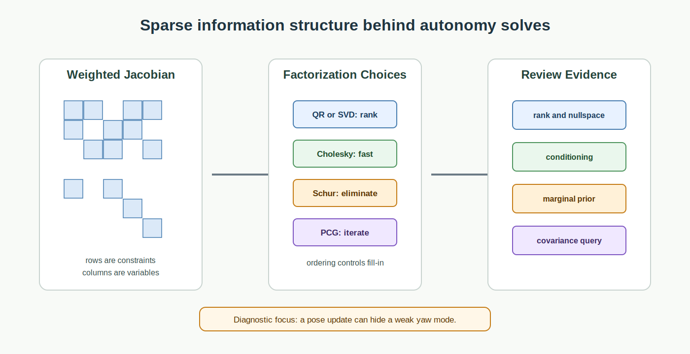

# Numerical Linear Algebra Foundations for Autonomy

<!-- kb-visual:start -->

*Visual: section-level autonomy-role diagram showing numerical linear algebra foundations, autonomy problem classes, stack interfaces, reading paths, and failure diagnosis.*
<!-- kb-visual:end -->

## Why This Foundation Exists

Numerical linear algebra is the machinery that makes large autonomy solves computable and diagnosable. SLAM, bundle adjustment, calibration, smoothing, covariance recovery, and many optimization subproblems all reduce to structured linear systems whose rank, conditioning, sparsity, and factorization choices determine whether the answer can be trusted.

This foundation exists because an optimizer can report convergence while the linear algebra hides weak modes, fill-in explosions, unstable normal equations, or misleading covariance. Reviews need to see the matrix structure behind the result, not only the final pose update or residual decrease.

## What This Field Studies From First Principles

Numerical linear algebra studies factorization, rank, nullspaces, conditioning, sparsity, ordering, Schur complements, marginalization, square-root information forms, covariance recovery, and iterative methods such as PCG.

The first-principles questions are: what matrix is being solved, what information was squared or discarded, what modes are observable, how sparse structure changes under elimination, what variables were marginalized, and whether recovered covariance reflects the same assumptions as the solve.

## Autonomy Problem Map

This foundation sits under optimization and state estimation. It consumes Jacobians, residual weights, graph structure, priors, damping, ordering choices, and marginalization policies. It produces factorizations, increments, rank diagnostics, fill-in reports, covariance blocks, and solver-health evidence.

The autonomy risk is silent numerical confidence. A system can move a vehicle pose, update a map, or pass a calibration test while the matrix says that a yaw, scale, time-offset, or extrinsic mode remains weakly constrained.

## Core Mental Model

Think of every solve as information flow through a matrix. Rows add constraints, columns represent variables, nullspaces expose unobservable directions, and elimination changes what information remains explicit.

The practical model is: `linearized residuals -> weighted Jacobian -> factorization or iterative solve -> increment -> marginalization or covariance query`. Failures usually appear as poor scaling, rank deficiency, squared conditioning from normal equations, bad ordering, dense fill-in, or covariance recovered from a factor that no longer matches the estimator claim.

## What This Foundation Lets You Review

- Does the solve preserve rank information, or did normal equations square the condition number?
- Are weak nullspace modes explained by geometry and observability rather than hidden by damping?
- Does the sparse ordering control fill-in for the actual graph structure?
- Is the Schur complement or marginalization prior consistent with variables that remain active?
- Does covariance recovery answer the safety or debugging question being asked?

## Problem-Class Coverage

| Problem Class | Role Of This Foundation | Representative Applied Pages |
|---|---|---|
| Perception and scene understanding | supporting - perception may rely on least-squares geometry, but this foundation only owns the matrix behavior under those residuals. | [Bundle Adjustment SLAM](../../30-autonomy-stack/localization-mapping/slam-methods/bundle-adjustment-slam.md) - debug feature geometry when rank deficiency is visible before scene interpretation. |
| Localization, SLAM, and state estimation | primary - this foundation owns the factorizations, nullspaces, sparsity, marginalization, and covariance queries used by SLAM backends. | [Factor Graphs, iSAM2, and GTSAM](../../30-autonomy-stack/localization-mapping/slam-methods/factor-graph-isam2-gtsam.md) - review incremental updates for fill-in, ordering, and hidden weak modes. |
| Mapping and spatial memory | supporting - mapping consumes solved poses and covariances, while numerical linear algebra explains solve stability behind map updates. | [GraphSLAM and Pose Graph Optimization](../../30-autonomy-stack/localization-mapping/slam-methods/graphslam-pose-graph-optimization.md) - debug map deformation caused by poorly conditioned pose-graph constraints. |
| Prediction and world modeling | not central - prediction models may use linear algebra internally, but autonomy review usually depends on model semantics rather than sparse solves. | [Bundle Adjustment SLAM](../../30-autonomy-stack/localization-mapping/slam-methods/bundle-adjustment-slam.md) - use only when world-model geometry depends on solved scene structure. |
| Planning and decision making | supporting - planners may solve quadratic subproblems, but planning ownership stays with objectives and constraints. | [GraphSLAM and Pose Graph Optimization](../../30-autonomy-stack/localization-mapping/slam-methods/graphslam-pose-graph-optimization.md) - review whether map-state uncertainty used by planners is numerically defensible. |
| Control and actuation | supporting - control solvers can depend on conditioning and factorization, but controller design owns closed-loop behavior. | [Factor Graphs, iSAM2, and GTSAM](../../30-autonomy-stack/localization-mapping/slam-methods/factor-graph-isam2-gtsam.md) - debug whether delayed backend updates are caused by matrix fill-in rather than control logic. |
| Safety, validation, and assurance | primary - safety review needs evidence that ranks, covariances, weak modes, and marginalization priors support confidence claims. | [Bundle Adjustment SLAM](../../30-autonomy-stack/localization-mapping/slam-methods/bundle-adjustment-slam.md) - review covariance and degeneracy evidence before accepting map or pose accuracy. |
| Runtime systems and operations | supporting - runtime symptoms include solver latency, memory growth, and numerical warnings that trace back to sparse structure. | [Factor Graphs, iSAM2, and GTSAM](../../30-autonomy-stack/localization-mapping/slam-methods/factor-graph-isam2-gtsam.md) - debug fleet logs where solve time jumps after graph structure changes. |

## Reading Paths By Task

For rank and conditioning reviews, read [Eigenvalues, Hessian Conditioning, and Observability](eigenvalues-hessian-conditioning-observability.md), then [QR, SVD, and Rank-Revealing Solvers](qr-svd-rank-revealing-solvers.md), then compare with [Cholesky, LDLT, and Normal Equations](cholesky-ldlt-normal-equations.md).

For sparse backend performance, start with [Sparse Matrices, Fill-In, and Ordering](sparse-matrices-fill-in-ordering.md), then read [Schur Complement, Marginalization, and PCG](schur-complement-marginalization-pcg.md).

For uncertainty queries, read [Square-Root Information and Covariance Recovery](square-root-information-and-covariance-recovery.md) after the factorization and Schur complement notes.

## Dependency Map

Numerical linear algebra depends on geometry and state estimation for the structure of variables and residuals, probability for covariance and information interpretation, and optimization for the nonlinear step policy that creates each linear system.

Downstream, it feeds SLAM backends, calibration solvers, smoothers, bundle adjustment, covariance reporting, runtime solver health, and safety evidence. A dependency review should identify whether a failure is a bad residual, a bad nonlinear policy, or a matrix problem: this foundation owns the matrix problem.

## Interfaces, Artifacts, and Failure Modes

Core artifacts include Jacobian matrices, normal equations, square-root factors, sparse graph orderings, Cholesky or LDLT factors, QR and SVD diagnostics, Schur complements, marginalization priors, PCG residual logs, rank reports, and covariance blocks.

Diagnostic case: A SLAM backend reports a pose update but hides a weak yaw mode because normal equations squared the condition number.

Common failure modes include rank loss hidden by damping, poor scaling, fill-in growth, unstable normal equations, indefinite systems treated as positive definite, stale marginalization priors, iterative solves without meaningful preconditioning, and covariance queries made outside the factor's validity.

## Boundaries With Neighboring Foundations

- Owns: factorization, conditioning, rank, nullspaces, sparsity, ordering, fill-in, Schur complements, marginalization algebra, covariance recovery, and PCG.
- Hands off to: optimization for residual construction and nonlinear step policy, and state estimation for estimator design and observability interpretation.
- Does not own: estimator architecture, nonlinear residual semantics, or solver-library guidance.
- Diagnostic logic: if the issue is matrix rank, conditioning, fill-in, or covariance extraction, debug here; if the issue is which residuals were built or how nonlinear trust was updated, move to optimization; if the issue is what the weak mode means for fusion integrity, move to state estimation.

## Pages In This Section

Rank, conditioning, and factorization:

- [Eigenvalues, Hessian Conditioning, and Observability](eigenvalues-hessian-conditioning-observability.md)
- [QR, SVD, and Rank-Revealing Solvers](qr-svd-rank-revealing-solvers.md)
- [Cholesky, LDLT, and Normal Equations](cholesky-ldlt-normal-equations.md)

Sparsity, elimination, and marginalization:

- [Sparse Matrices, Fill-In, and Ordering](sparse-matrices-fill-in-ordering.md)
- [Schur Complement, Marginalization, and PCG](schur-complement-marginalization-pcg.md)

Information form and uncertainty recovery:

- [Square-Root Information and Covariance Recovery](square-root-information-and-covariance-recovery.md)

## Core Sources

This overview synthesizes the section pages listed above; no additional external sources were used.
