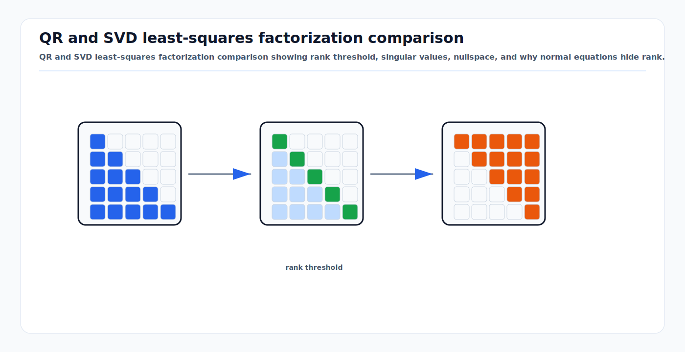

# QR, SVD, and Rank-Revealing Solvers

<!-- kb-visual:start -->


*Visual: QR and SVD least-squares factorization comparison showing rank threshold, singular values, nullspace, and why normal equations hide rank.*
<!-- kb-visual:end -->

## Related docs

- [Cholesky, LDLT, and Normal Equations](cholesky-ldlt-normal-equations.md)
- [Eigenvalues, Hessian Conditioning, and Observability](eigenvalues-hessian-conditioning-observability.md)
- [Sparse Matrices, Fill-In, and Ordering](sparse-matrices-fill-in-ordering.md)
- [Square-Root Information and Covariance Recovery](square-root-information-and-covariance-recovery.md)
- [Schur Complement, Marginalization, and PCG](schur-complement-marginalization-pcg.md)
- [Sparse Estimation Backend Crosswalk](sparse-estimation-backend-crosswalk.md)
- [Nonlinear Solver Diagnostics Crosswalk](../optimization/nonlinear-solver-diagnostics-crosswalk.md)
- [Sensor Calibration and Time Synchronization](../geometry-3d/sensor-calibration-time-synchronization.md)

## Why it matters for AV, perception, SLAM, and mapping

Normal-equation solvers are fast, but they can hide the exact problem an AV perception engineer needs to see: unobservable directions. QR and SVD operate on the Jacobian directly, so they are the main tools for diagnosing weak calibration, poor landmark geometry, map gauge freedoms, and near-singular Hessians.

In AV systems, rank-revealing solvers matter when:

- A camera-lidar extrinsic calibration sequence lacks enough roll, pitch, or translation excitation.
- Monocular SLAM has scale ambiguity.
- Visual landmarks have weak parallax.
- A local map has no absolute yaw or position anchor.
- A new factor implementation produces a Jacobian with missing columns.
- Covariance needs to be computed in the presence of gauge modes.

The point is not that QR or SVD should replace sparse Cholesky everywhere. The point is that every serious SLAM or mapping stack needs a robust path for debugging and rank assessment.

## Core math and algorithm steps

### Linear least squares without normal equations

Given:

```text
min_delta ||J delta - b||_2
```

QR factorization writes:

```text
J = Q R
```

where `Q` has orthonormal columns and `R` is upper triangular. Since orthonormal transforms preserve the 2-norm:

```text
||J delta - b|| = ||Q^T (J delta - b)||
```

For full column rank:

```text
R delta = Q^T b
```

This avoids forming `J^T J`, so it avoids squaring the condition number.

### Column-pivoted QR

Rank-revealing QR uses column pivoting:

```text
J P = Q R
```

The permutation `P` moves stronger, more independent columns earlier. The diagonal of `R` gives a practical rank signal:

```text
rank = number of |R_ii| above threshold
```

A typical threshold is relative to the largest diagonal entry and machine precision:

```text
|R_ii| <= tau |R_11|
```

where `tau` depends on matrix size, scaling, and application tolerance. For a solver library, use the library's default first, then tune only with measured evidence.

### Full-pivot QR

Full-pivot QR can pivot both rows and columns. It is more expensive, but more reliable for small dense diagnostic problems. It is useful when reducing a suspicious calibration or factor block to a small matrix and asking: "What rank does the math actually have?"

### SVD

Singular value decomposition writes:

```text
J = U S V^T
```

where `S` is diagonal with nonnegative singular values. The least-squares solution with minimum norm is:

```text
delta = V S^+ U^T b
```

where `S^+` inverts singular values above a threshold and sets near-zero singular values to zero.

SVD gives the clearest interpretation:

- Large singular value: strongly observed direction.
- Small singular value: weakly observed direction.
- Zero singular value: nullspace direction.
- Right singular vector `v_i`: state direction associated with `sigma_i`.

For SLAM debugging, the right singular vectors are often more valuable than the solution itself.

### Complete orthogonal decomposition

Complete orthogonal decomposition is a rank-revealing method related to QR that can compute least-squares solutions and expose rank. In Eigen, `CompleteOrthogonalDecomposition` is often a better general-purpose dense least-squares choice than plain Householder QR when rank deficiency is possible but full SVD is too expensive.

## Implementation notes

### Dense vs sparse QR

Use dense QR/SVD for:

- Small calibration problems.
- Unit tests for factor Jacobians.
- Per-factor or per-window observability checks.
- Regression tests that compare Cholesky against a robust reference solve.

Use sparse QR for:

- Large but rank-sensitive least-squares systems.
- Covariance recovery when QR factors are already available.
- Problems where normal-equation Cholesky fails and the matrix is still too large for dense SVD.

SuiteSparseQR is designed for multifrontal sparse QR and is often used when sparse rank-revealing behavior is needed. Ceres uses sparse QR as one option for covariance estimation, while warning that sparse QR cannot compute covariance for rank-deficient Jacobians.

### Eigen solver choices

Eigen's decomposition catalogue is a useful practical ranking:

- `HouseholderQR`: fast, not rank-revealing.
- `ColPivHouseholderQR`: good default for many dense least-squares problems.
- `FullPivHouseholderQR`: slower, stronger rank detection.
- `CompleteOrthogonalDecomposition`: rank-revealing least-squares support.
- `JacobiSVD`: slower, strongest diagnostic value, handles rank deficiency.
- `BDCSVD`: useful for larger dense matrices, but still dense.

For production AV code, expose the solver used in logs. A result from `LLT` and a result from `JacobiSVD` have very different diagnostic meaning.

### Rank thresholds are modeling decisions

There is no universal numerical rank. Rank depends on:

- Residual whitening.
- Variable units.
- The expected sensor noise floor.
- Machine precision.
- Whether the nullspace is structural or only weakly excited.

Example: if a vehicle calibration run contains only straight driving, yaw-lateral coupling may have a tiny singular value. Numerically it may be nonzero, but physically the calibration is not trustworthy. Treat "rank" as both a numerical and experimental-design question.

### Recommended diagnostic workflow

1. Linearize the current graph or calibration batch.
2. Export the whitened Jacobian `J` and residual `b`.
3. Scale columns by expected state units if the solver does not already do this.
4. Compute column-pivoted QR and SVD on a representative dense subproblem.
5. Inspect:

```text
singular values
rank estimate
right singular vectors for small singular values
columns selected late by pivoted QR
residual norm after solve
```

6. Map weak singular vectors back to named state variables: pose yaw, global translation, landmark depth, camera-lidar roll, IMU bias, clock offset, and so on.
7. Decide whether to add excitation, priors, constraints, or a different parameterization.

### Unit tests for factors

For a custom residual, add tests that compare analytic and numerical Jacobians. Then add rank tests for expected degeneracies:

- One bearing-only landmark observation should not constrain depth.
- A single relative pose factor should not anchor the global frame.
- A planar point-to-plane ICP factor should weakly constrain motion tangent to the plane.
- A time-offset calibration with constant velocity is less informative than one with acceleration.

These tests catch mistakes that Cholesky may only report later as a vague failure near a different variable.

## Concept cards

### Column-pivoted QR

- What it means here: A QR factorization that permutes Jacobian columns so independent tangent directions are processed before weak or redundant directions.
- Math object: `J P = Q R`, with `R` diagonal magnitudes used as a practical rank signal.
- Effect on the solve: It avoids normal-equation condition-number squaring and exposes which columns are late, weak, or dependent.
- What it solves: It provides a robust dense diagnostic and fallback for least-squares systems that may be rank deficient.
- What it does not solve: It does not explain the physical cause of a weak direction without the variable-key and tangent-coordinate map.
- Minimal example: A calibration Jacobian pivots well-excited yaw and translation columns early while a time-offset column appears late.
- Failure symptoms: Rank estimate changes with threshold, late pivots concentrate in one sensor's extrinsic block, or QR disagrees with Cholesky.
- Diagnostic artifact: Pivot order, `R` diagonal, rank threshold, and each pivot mapped back to variable key plus tangent coordinate.
- Normal vs abnormal artifact: Late columns for known gauge coordinates are normal; late columns for supposedly excited calibration parameters are abnormal.
- First debugging move: Print the last pivoted columns with their variable keys, tangent coordinate names, column norms, and factor provenance.
- Do not confuse with: Fill-reducing ordering, which targets sparse factor memory rather than numerical rank.
- Read next: [Sparse Matrices, Fill-In, and Ordering](sparse-matrices-fill-in-ordering.md).

### SVD singular vector

- What it means here: A right singular vector describes a state perturbation direction associated with one singular value of the Jacobian.
- Math object: In `J = U S V^T`, column `v_i` of `V` satisfies `||J v_i|| = sigma_i`.
- Effect on the solve: Small-singular-value vectors show weakly constrained or null directions that can dominate updates and covariance.
- What it solves: It translates a scalar rank warning into an interpretable state-motion pattern.
- What it does not solve: It does not decide whether the direction is physically acceptable or operationally safe.
- Minimal example: A small singular vector has similar yaw entries across all poses, revealing global yaw gauge.
- Failure symptoms: Singular vectors mix unrelated coordinates, indicate missing Jacobian columns, or align with a calibration parameter that should be excited.
- Diagnostic artifact: Singular value, right singular vector entries grouped by variable key and tangent coordinate, and residual response `J v_i`.
- Normal vs abnormal artifact: Coherent global transform modes are normal for unanchored graphs; isolated spikes in one tangent coordinate often indicate implementation or scaling bugs.
- First debugging move: Sort vector entries by absolute magnitude and inspect the top variable-key/tangent-coordinate contributions.
- Do not confuse with: A variable ordering permutation; a singular vector is a direction in tangent space, not a solver storage order.
- Read next: [Eigenvalues, Hessian Conditioning, and Observability](eigenvalues-hessian-conditioning-observability.md).

### Rank threshold

- What it means here: The cutoff used to decide which singular values or QR diagonal entries count as numerically nonzero.
- Math object: A rule such as `sigma_i > tau sigma_max` or `|R_ii| > tau |R_11|`.
- Effect on the solve: It controls rank, pseudoinverse behavior, and which tangent directions are treated as observable.
- What it solves: It makes rank decisions reproducible and tied to matrix scale, sensor noise, and machine precision.
- What it does not solve: It cannot turn physically weak excitation into trustworthy information.
- Minimal example: A straight-driving calibration run may cross a permissive numerical threshold while still failing a physical excitation threshold.
- Failure symptoms: Rank count flips under small threshold changes, covariance blocks jump, or weak directions disappear after column scaling only.
- Diagnostic artifact: Threshold value, singular spectrum, QR diagonal, whitening status, and below-threshold directions mapped to variable keys and tangent coordinates.
- Normal vs abnormal artifact: A stable gap between kept and rejected values is normal; no spectral gap and threshold-sensitive diagnostics are abnormal.
- First debugging move: Sweep the threshold and plot rank plus top weak variable-key/tangent-coordinate contributions.
- Do not confuse with: Solver convergence tolerance, which controls iteration stopping rather than matrix rank.
- Read next: [Nonlinear Solver Diagnostics Crosswalk](../optimization/nonlinear-solver-diagnostics-crosswalk.md).

### Minimum-norm solution

- What it means here: The least-squares update with the smallest tangent-space norm among all updates that minimize the linear residual.
- Math object: `delta = V S^+ U^T b`, where zeroed singular directions receive no component.
- Effect on the solve: It chooses one representative update in a rank-deficient system without adding physical information.
- What it solves: It gives a deterministic diagnostic solution and can avoid arbitrary motion in nullspace directions.
- What it does not solve: It does not define a physically meaningful gauge, posterior covariance, or integrity claim.
- Minimal example: In an unanchored pose graph, SVD can return a step with no global translation component.
- Failure symptoms: Solution norm depends on state scaling, gauge coordinates look artificially stable, or downstream code treats the chosen gauge as observed.
- Diagnostic artifact: Pseudoinverse threshold, retained singular values, rejected singular vectors, and update components by variable key and tangent coordinate.
- Normal vs abnormal artifact: Zero update along declared nullspace is normal; small-norm behavior caused by arbitrary units or missing tangent scaling is abnormal.
- First debugging move: Verify the tangent-space norm uses meaningful scaling and inspect the rejected singular vectors.
- Do not confuse with: A damped LM step, which changes the linear system and can bias weak directions.
- Read next: [Square-Root Information and Covariance Recovery](square-root-information-and-covariance-recovery.md).

## Failure modes and diagnostics

### QR says full rank but covariance is nonsensical

Likely causes:

- Threshold too permissive.
- Variables are badly scaled.
- Gauge modes are weakly regularized by damping rather than real priors.
- The problem is technically full rank but physically uninformative.

Diagnostics:

- Sweep the rank threshold and plot singular values.
- Inspect singular vectors, not only rank count.
- Compare covariance magnitudes against sensor physics.

### SVD is too slow

SVD is a diagnostic and fallback tool, not the default for massive maps. Use it on:

- Reduced windows.
- Marginal blocks.
- Calibration batches.
- Randomized or sampled subgraphs.
- Smaller matrices extracted from suspicious variable neighborhoods.

For full-scale solve performance, use sparse Cholesky, sparse QR, Schur complement, or PCG after the rank issue is understood.

### Pivoting changes variable order in confusing ways

Column pivoting permutes variables. Always maintain a mapping from matrix columns back to variable keys and tangent coordinates. Without this, rank diagnostics are hard to act on.

### Dense debug results differ from sparse production results

Possible explanations:

- The debug matrix was not whitened the same way.
- Robust loss weights were not applied.
- Manifold local coordinates differ.
- Damping was included in one solve but not the other.
- The sparse solver used a different ordering or pivot policy.

Make the exported matrix path part of the solver code, not a hand-reimplementation.

## Sources

- Eigen, "Catalogue of dense decompositions": https://eigen.tuxfamily.org/dox/group__TopicLinearAlgebraDecompositions.html
- Eigen, `ColPivHouseholderQR`: https://eigen.tuxfamily.org/dox/classEigen_1_1ColPivHouseholderQR.html
- Eigen, `FullPivHouseholderQR`: https://eigen.tuxfamily.org/dox/classEigen_1_1FullPivHouseholderQR.html
- Eigen, `CompleteOrthogonalDecomposition`: https://eigen.tuxfamily.org/dox/classEigen_1_1CompleteOrthogonalDecomposition.html
- Eigen, `JacobiSVD`: https://eigen.tuxfamily.org/dox/classEigen_1_1JacobiSVD.html
- SuiteSparseQR user guide: https://github.com/DrTimothyAldenDavis/SuiteSparse/blob/dev/SPQR/Doc/spqr_user_guide.pdf
- Ceres Solver, "Covariance Estimation": https://ceres-solver.readthedocs.io/latest/nnls_covariance.html
- GTSAM, `IndeterminantLinearSystemException`: https://gtsam.org/doxygen/a04411.html
