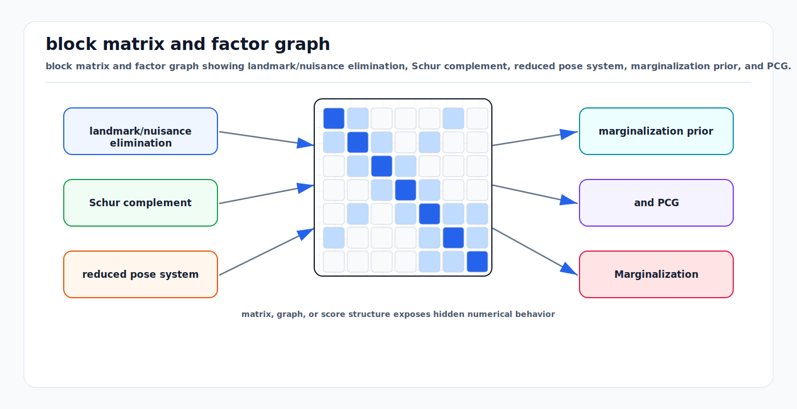

# Schur Complement, Marginalization, and PCG

<!-- kb-visual:start -->


*Visual: block matrix and factor graph showing landmark/nuisance elimination, Schur complement, reduced pose system, marginalization prior, and PCG.*
<!-- kb-visual:end -->

## Related docs

- [Cholesky, LDLT, and Normal Equations](cholesky-ldlt-normal-equations.md)
- [QR, SVD, and Rank-Revealing Solvers](qr-svd-rank-revealing-solvers.md)
- [Eigenvalues, Hessian Conditioning, and Observability](eigenvalues-hessian-conditioning-observability.md)
- [Sparse Matrices, Fill-In, and Ordering](sparse-matrices-fill-in-ordering.md)
- [Square-Root Information and Covariance Recovery](square-root-information-and-covariance-recovery.md)
- [Sparse Estimation Backend Crosswalk](sparse-estimation-backend-crosswalk.md)
- [Nonlinear Solver Diagnostics Crosswalk](../optimization/nonlinear-solver-diagnostics-crosswalk.md)
- [GTSAM Factor Graph Optimization](../state-estimation/gtsam-factor-graphs.md)
- [GLIM](../../30-autonomy-stack/localization-mapping/slam-methods/glim.md)

## Why it matters for AV, perception, SLAM, and mapping

Schur complement is the algebra behind several core estimation operations:

- Eliminating landmarks in bundle adjustment.
- Marginalizing old states in fixed-lag smoothing.
- Building dense priors over remaining variables.
- Reducing a large linear system before sparse Cholesky.
- Running PCG on a smaller reduced system without explicitly forming it.

For AV mapping, the classic example is bundle adjustment: many 3D points and fewer camera poses. Eliminating points creates a reduced camera system. This can turn an impossible full solve into a tractable one. The BAL paper and Ceres documentation both emphasize that Schur complement methods are central to large-scale bundle adjustment.

For online SLAM, the same algebra is double-edged. Marginalization keeps computation bounded, but it also creates dense priors and locks in linearization choices.

## GTSAM and GLIM interpretation

GTSAM exposes marginalization through fixed-lag smoothers, Bayes-tree updates, and marginal covariance/information queries. Algebraically, these operations are Schur complements over variables that are removed from the active solve. The resulting prior preserves information on the remaining separator variables, but it can become dense and is tied to the linearization point at which it was created.

In a GLIM-style pipeline:

| Operation | Schur/marginalization meaning | Risk |
|---|---|---|
| Fixed-lag odometry | remove old poses, velocities, and biases while preserving a prior on the active window boundary | dense boundary prior, stale linearization, or fake gauge constraint |
| Submap summarization | replace many frame-level constraints with submap-level factors | loss of detail or overconfident submap covariance |
| Offline global refinement | eliminate nuisance variables or summarize local sessions | fill-in across sessions and heavy memory use |
| Covariance reporting | recover selected marginal blocks around latest trajectory/submap variables | expensive if treated as full dense inverse |

A marginal prior is information, not truth. If the prior was built from wrong correspondences, bad timing, or a poor linearization point, later optimization inherits that damage unless the system keeps enough raw factors to relinearize or rebuild the prior.

## Core math and algorithm steps

### Block linear system

Partition the linearized normal equations into kept variables `y` and eliminated variables `z`:

```text
[B  E] [dy] = [v]
[E^T C] [dz]   [w]
```

Assume `C` is invertible or suitably regularized. From the second row:

```text
dz = C^-1 (w - E^T dy)
```

Substitute into the first row:

```text
(B - E C^-1 E^T) dy = v - E C^-1 w
```

The reduced matrix:

```text
S = B - E C^-1 E^T
```

is the Schur complement of `C` in the full system.

After solving for `dy`, back-substitute:

```text
dz = C^-1 (w - E^T dy)
```

### Bundle adjustment structure

Bundle adjustment variables:

- Cameras or poses: `y`
- Points or landmarks: `z`

Each image observation touches one camera and one point. If points are independent conditioned on cameras, `C` is block diagonal by point. This makes `C^-1` cheap to apply.

Algorithm:

1. Linearize reprojection residuals.
2. Assemble camera-camera block `B`, camera-point block `E`, point-point block `C`, and right-hand sides.
3. Eliminate points using block diagonal solves with `C`.
4. Solve reduced camera system `S dy = rhs`.
5. Back-substitute point updates.
6. Apply trust-region acceptance logic.

This is why ordering landmarks before poses is usually essential in BA.

### Marginalization

Marginalization eliminates old or unwanted variables while preserving their information over remaining variables. Given old variables `m` and kept variables `k`:

```text
Lambda = [Lambda_mm  Lambda_mk
          Lambda_km  Lambda_kk]
```

The marginalized information over kept variables is:

```text
Lambda_new = Lambda_kk - Lambda_km Lambda_mm^-1 Lambda_mk
```

The new right-hand side is transformed the same way:

```text
eta_new = eta_k - Lambda_km Lambda_mm^-1 eta_m
```

This creates a prior factor over the kept separator variables.

### PCG

Preconditioned conjugate gradients solves:

```text
A x = b
```

for symmetric positive definite `A`, using only matrix-vector products and a preconditioner `M` that approximates `A`.

For Schur complement systems, PCG can solve:

```text
S x = rhs
```

without explicitly forming `S`. Use:

```text
S x = B x - E (C^-1 (E^T x))
```

This is the key operation described in Ceres for `ITERATIVE_SCHUR`. It exploits the reduced system while avoiding the memory cost of materializing it.

### Preconditioning

PCG convergence depends on the condition number of the preconditioned system:

```text
M^-1 A
```

Common preconditioners:

- Identity: cheapest, often too slow.
- Jacobi: inverse diagonal or block diagonal.
- Schur Jacobi: block diagonal of the Schur complement.
- Cluster Jacobi or cluster tridiagonal: group related cameras or poses.
- Subset preconditioner: use a selected subset of residuals.
- Power series expansion: approximate inverse of the Schur complement.

The right preconditioner is problem-dependent and must be benchmarked on representative logs.

## Implementation notes

### Schur complement checklist

Before using Schur complement:

- Confirm eliminated blocks are invertible or damped.
- Ensure the eliminated variables are conditionally independent enough for cheap block solves.
- Choose an ordering that eliminates the intended variables first.
- Preserve variable-to-block mappings for back-substitution.
- Apply robust loss and whitening before building blocks.
- Use the same damping convention for full and reduced systems.

### Explicit vs implicit Schur

Explicit Schur:

- Forms `S`.
- Enables sparse Cholesky or PCG with cheap `S x`.
- Can be faster for small and medium reduced systems.
- Can consume large memory if `S` is dense or fill-heavy.

Implicit Schur:

- Does not form `S`.
- Computes `S x` through block operations.
- Works well with PCG for large systems.
- Needs a good preconditioner and convergence monitoring.

Ceres exposes both patterns for Schur-based solvers.

### Marginalization in fixed-lag smoothing

Fixed-lag smoother flow:

1. Keep variables newer than the lag.
2. Select old variables for marginalization.
3. Linearize factors involving old variables at current estimates.
4. Eliminate old variables.
5. Add the resulting prior on remaining separator variables.
6. Remove old variables and old factors.

Important: the marginal prior is tied to its linearization point. If the kept variables later move far from that point, the prior may become inconsistent.

### PCG stopping criteria

Monitor both the linear residual and nonlinear progress:

```text
||A x_k - b|| / ||b||
number of PCG iterations
preconditioned residual norm
cost decrease predicted by linear model
actual nonlinear cost decrease
trust region ratio
```

Do not oversolve early nonlinear iterations. Inexact Newton methods intentionally use approximate linear solves when far from the optimum.

### Damping and positive definiteness

PCG requires symmetric positive definite systems. If the reduced Schur complement is indefinite or singular:

- Add LM damping.
- Add missing priors or gauge constraints.
- Use a direct solver with diagnostics.
- Fall back to QR/SVD on a smaller debug system.

## Concept cards

### Schur complement for solving

- What it means here: Algebraically eliminating one variable block to solve a smaller reduced linear system over the kept variables.
- Math object: `S = B - E C^-1 E^T` with reduced right-hand side `v - E C^-1 w`.
- Effect on the solve: It can reduce memory and time when eliminated blocks are cheap to invert or apply.
- What it solves: It makes large structured problems such as bundle adjustment tractable by eliminating landmarks or nuisance blocks first.
- What it does not solve: It does not fix singular eliminated blocks, bad ordering, or nonlinear inconsistency.
- Minimal example: Eliminate independent point blocks in BA, solve the reduced camera system, then back-substitute point updates.
- Failure symptoms: Singular `C` blocks, dense reduced system, wrong back-substitution, or mismatch against the full solve.
- Diagnostic artifact: Eliminated-block ranks, `C` damping, Schur nonzeros, reduced residual, full-versus-reduced step comparison, and block-to-variable map.
- Normal vs abnormal artifact: A reduced system matching the full direct solve on a small case is normal; disagreement indicates block assembly, damping, or ordering errors.
- First debugging move: Build a tiny explicit full system and compare full solve, explicit Schur solve, and implicit Schur matvec results.
- Do not confuse with: Marginalization prior, which stores an eliminated-variable effect for future solves rather than only solving the current system.
- Read next: [Sparse Matrices, Fill-In, and Ordering](sparse-matrices-fill-in-ordering.md).

### Marginalization prior

- What it means here: A prior factor over kept variables produced by eliminating variables from the active estimator.
- Math object: Schur-complement information and right-hand side over the separator variables, often stored as a square-root factor.
- Effect on the solve: It bounds active-state size but creates dense coupling and locks in the linearization point.
- What it solves: It preserves local information from removed variables in fixed-lag smoothers and sliding-window estimators.
- What it does not solve: It does not represent future relinearization of removed variables or global batch consistency.
- Minimal example: Marginalize an old IMU state and add a prior over the next pose, velocity, and bias.
- Failure symptoms: Dense prior growth, overconfidence, loop closures fighting the prior, or jumps at the window boundary.
- Diagnostic artifact: Prior residual, square-root prior matrix, separator keys, linearization point, prior nonzeros, and rank threshold.
- Normal vs abnormal artifact: A compact prior over a small separator is normal; a prior spanning many active states with rising memory is abnormal.
- First debugging move: Log separator size and prior residual, then compare against a longer-window batch solve on the same segment.
- Do not confuse with: Gauge fixing, which chooses coordinates for a symmetry rather than summarizing eliminated information.
- Read next: [Square-Root Information and Covariance Recovery](square-root-information-and-covariance-recovery.md).

### Stale linearization

- What it means here: A stored linear factor or prior is being reused after the variables it depends on have moved too far from the point where it was created.
- Math object: A residual model `r(x0) + J(x0) delta` or square-root prior tied to a saved `x0`.
- Effect on the solve: It can bias the update, underestimate uncertainty, and make nonlinear progress disagree with the linear model.
- What it solves: It explains why a mathematically valid prior can become inconsistent during later nonlinear iterations.
- What it does not solve: It does not imply the Schur complement algebra was wrong at the time it was formed.
- Minimal example: A fixed-lag prior created before loop closure continues to pull the active window toward the old linearization frame.
- Failure symptoms: Prior residual dominates, trust-region ratio degrades, covariance shrinks unrealistically, or batch and fixed-lag results diverge.
- Diagnostic artifact: Stored linearization point, current-state displacement in tangent coordinates, prior residual history, and predicted-versus-actual reduction.
- Normal vs abnormal artifact: Small residual growth near the prior point is normal; large prior residual with rejected nonlinear steps is abnormal.
- First debugging move: Measure the tangent displacement from the prior's saved linearization point and run a longer-window comparison.
- Do not confuse with: PCG stagnation, which is a linear iterative-solve issue inside one linearization.
- Read next: [Nonlinear Solver Diagnostics Crosswalk](../optimization/nonlinear-solver-diagnostics-crosswalk.md).

### PCG

- What it means here: Preconditioned conjugate gradients applied to a large symmetric positive definite linear system, often an implicit Schur complement.
- Math object: Iteration on `A x = b` with SPD `A` and preconditioner `M`, using matrix-vector products and inner products.
- Effect on the solve: It avoids materializing or factoring a large matrix, but convergence depends on conditioning, scaling, and the preconditioner.
- What it solves: It handles large reduced systems when direct factorization is too memory-heavy.
- What it does not solve: It does not work reliably for non-SPD, asymmetric, singular, or badly implemented matrix-vector products.
- Minimal example: Solve an `ITERATIVE_SCHUR` camera system using `S x = B x - E (C^-1 (E^T x))` and a Schur-Jacobi preconditioner.
- Failure symptoms: Residual stagnation, iteration limit reached, preconditioned residual falls while nonlinear cost does not improve, or step quality changes erratically.
- Diagnostic artifact: SPD requirement status, preconditioner used, unpreconditioned residual norms, preconditioned residual norms, iteration count, stopping tolerance, nonlinear progress coupling through predicted/actual reduction, symmetry test `x^T A y` versus `y^T A x` for matrix-vector products, stagnation trace, and comparison against explicit Schur or direct solve on a small representative case.
- Normal vs abnormal artifact: Monotone enough residual reduction with accepted nonlinear progress is normal; flat residuals, symmetry-test failure, or direct-solve mismatch is abnormal.
- First debugging move: Run the implicit matvec symmetry test and compare PCG against explicit Schur or a direct solve on a small representative case.
- Do not confuse with: Nonlinear solver convergence, which also depends on linearization quality, trust-region logic, and residual modeling.
- Read next: [Cholesky, LDLT, and Normal Equations](cholesky-ldlt-normal-equations.md).

### Preconditioner

- What it means here: An easily applied approximation to the linear system that reshapes PCG for faster convergence.
- Math object: A matrix or operator `M` approximating `A`, applied through solves with `M` or `M^-1`.
- Effect on the solve: A good preconditioner reduces iteration count; a poor one can waste time or hide scaling problems.
- What it solves: It improves iterative-solver efficiency for large Schur or Hessian systems.
- What it does not solve: It does not make a non-SPD system SPD or repair an incorrect matrix-vector product.
- Minimal example: Block Jacobi uses independent diagonal variable blocks as `M`.
- Failure symptoms: Same iteration count as identity, preconditioned residual oscillates, setup time exceeds saved iterations, or convergence worsens after graph changes.
- Diagnostic artifact: Preconditioner type, setup time, apply time, block structure, preconditioned residual norm, unpreconditioned residual norm, and iteration comparison.
- Normal vs abnormal artifact: Some setup cost with lower total solve time is normal; high setup cost with no iteration reduction is abnormal.
- First debugging move: Compare identity, Jacobi, block Jacobi, and Schur-Jacobi on the same log with identical stopping tolerance.
- Do not confuse with: LM damping, which changes the system to control nonlinear steps rather than approximate the inverse for PCG.
- Read next: [Sparse Estimation Backend Crosswalk](sparse-estimation-backend-crosswalk.md).

## Failure modes and diagnostics

### Eliminated block is singular

Examples:

- A landmark observed once.
- A point with nearly zero triangulation baseline.
- An old pose with insufficient constraints inside the marginalization set.

Diagnostics:

- Check rank of each eliminated block.
- Add damping or delay marginalization.
- Remove or reparameterize poorly constrained landmarks.

### Dense prior explosion

Marginalization creates fill among separator variables. If the separator is large, the prior becomes dense.

Diagnostics:

- Track prior block count and scalar nonzeros.
- Limit lag boundary complexity.
- Marginalize variables in an order that keeps separators small.
- Consider keyframe selection or sparsification if allowed by the estimator design.

### PCG stagnation

Symptoms:

- Many iterations with little residual reduction.
- Step direction changes erratically.
- Nonlinear cost does not improve despite low linear tolerance.

Likely causes:

- Poor preconditioner.
- Bad scaling or whitening.
- Near-nullspace directions.
- Robust weights changing the effective system.
- Implicit `S x` implementation bug.

Diagnostics:

- Compare one iteration against explicit Schur on a small case.
- Try block Jacobi and Schur Jacobi.
- Inspect singular values of a reduced sample.
- Check matrix-vector product symmetry: `x^T A y` should equal `y^T A x`.

### Marginalization inconsistency

Symptoms:

- Estimator becomes overconfident.
- Loop closures fight the marginal prior.
- Re-running batch optimization gives a different answer.

Mitigations:

- Use a longer lag when resources allow.
- Marginalize at stable linearization points.
- Keep key variables active until geometry is strong.
- Monitor prior residual and covariance.

## Sources

- Ceres Solver, "Solving Non-linear Least Squares": https://ceres-solver.readthedocs.io/latest/nnls_solving.html
- Agarwal, Snavely, Seitz, and Szeliski, "Bundle Adjustment in the Large": https://grail.cs.washington.edu/projects/bal/bal.pdf
- BAL project page: https://grail.cs.washington.edu/projects/bal/
- GTSAM tutorial, "Factor Graphs and GTSAM": https://gtsam.org/tutorials/intro.html
- Dellaert, "Factor Graphs and GTSAM: A Hands-on Introduction": https://research.cc.gatech.edu/borg/sites/edu.borg/files/downloads/gtsam.pdf
- Dellaert and Kaess, "Square Root SAM": https://www.cc.gatech.edu/~dellaert/pubs/Dellaert06ijrr.pdf
- Saad, "Iterative Methods for Sparse Linear Systems" homepage: https://www-users.cse.umn.edu/~saad/books.html
