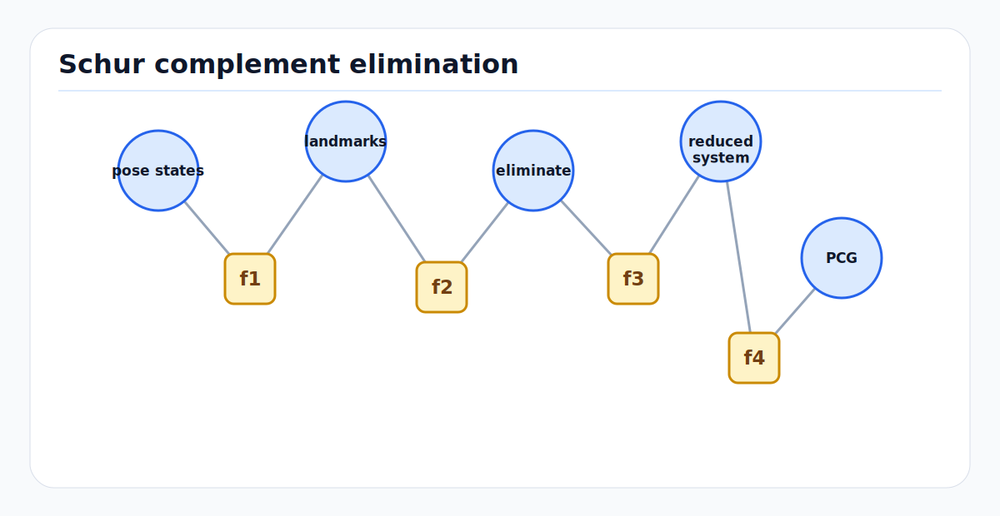

# Schur Complement, Marginalization, and PCG

<!-- kb-figure:start -->


*Figure: The Schur complement removes landmarks or nuisance states to produce a smaller reduced system for pose solving, marginalization, or PCG.*
<!-- kb-figure:end -->

## Related docs

- [Cholesky, LDLT, and Normal Equations](cholesky-ldlt-normal-equations.md)
- [QR, SVD, and Rank-Revealing Solvers](qr-svd-rank-revealing-solvers.md)
- [Eigenvalues, Hessian Conditioning, and Observability](eigenvalues-hessian-conditioning-observability.md)
- [Sparse Matrices, Fill-In, and Ordering](sparse-matrices-fill-in-ordering.md)
- [Square-Root Information and Covariance Recovery](square-root-information-and-covariance-recovery.md)
- [GTSAM Factor Graph Optimization](../state-estimation/gtsam-factor-graphs.md)

## Why it matters for AV, perception, SLAM, and mapping

Schur complement is the algebra behind several core estimation operations:

- Eliminating landmarks in bundle adjustment.
- Marginalizing old states in fixed-lag smoothing.
- Building dense priors over remaining variables.
- Reducing a large linear system before sparse Cholesky.
- Running PCG on a smaller reduced system without explicitly forming it.

For AV mapping, the classic example is bundle adjustment: many 3D points and fewer camera poses. Eliminating points creates a reduced camera system. This can turn an impossible full solve into a tractable one. The BAL paper and Ceres documentation both emphasize that Schur complement methods are central to large-scale bundle adjustment.

For online SLAM, the same algebra is double-edged. Marginalization keeps computation bounded, but it also creates dense priors and locks in linearization choices.

## Core math and algorithm steps

### Block linear system

Partition the linearized normal equations into kept variables `y` and eliminated variables `z`:

```text
[B  E] [dy] = [v]
[E^T C] [dz]   [w]
```

Assume `C` is invertible or suitably regularized. From the second row:

```text
dz = C^-1 (w - E^T dy)
```

Substitute into the first row:

```text
(B - E C^-1 E^T) dy = v - E C^-1 w
```

The reduced matrix:

```text
S = B - E C^-1 E^T
```

is the Schur complement of `C` in the full system.

After solving for `dy`, back-substitute:

```text
dz = C^-1 (w - E^T dy)
```

### Bundle adjustment structure

Bundle adjustment variables:

- Cameras or poses: `y`
- Points or landmarks: `z`

Each image observation touches one camera and one point. If points are independent conditioned on cameras, `C` is block diagonal by point. This makes `C^-1` cheap to apply.

Algorithm:

1. Linearize reprojection residuals.
2. Assemble camera-camera block `B`, camera-point block `E`, point-point block `C`, and right-hand sides.
3. Eliminate points using block diagonal solves with `C`.
4. Solve reduced camera system `S dy = rhs`.
5. Back-substitute point updates.
6. Apply trust-region acceptance logic.

This is why ordering landmarks before poses is usually essential in BA.

### Marginalization

Marginalization eliminates old or unwanted variables while preserving their information over remaining variables. Given old variables `m` and kept variables `k`:

```text
Lambda = [Lambda_mm  Lambda_mk
          Lambda_km  Lambda_kk]
```

The marginalized information over kept variables is:

```text
Lambda_new = Lambda_kk - Lambda_km Lambda_mm^-1 Lambda_mk
```

The new right-hand side is transformed the same way:

```text
eta_new = eta_k - Lambda_km Lambda_mm^-1 eta_m
```

This creates a prior factor over the kept separator variables.

### PCG

Preconditioned conjugate gradients solves:

```text
A x = b
```

for symmetric positive definite `A`, using only matrix-vector products and a preconditioner `M` that approximates `A`.

For Schur complement systems, PCG can solve:

```text
S x = rhs
```

without explicitly forming `S`. Use:

```text
S x = B x - E (C^-1 (E^T x))
```

This is the key operation described in Ceres for `ITERATIVE_SCHUR`. It exploits the reduced system while avoiding the memory cost of materializing it.

### Preconditioning

PCG convergence depends on the condition number of the preconditioned system:

```text
M^-1 A
```

Common preconditioners:

- Identity: cheapest, often too slow.
- Jacobi: inverse diagonal or block diagonal.
- Schur Jacobi: block diagonal of the Schur complement.
- Cluster Jacobi or cluster tridiagonal: group related cameras or poses.
- Subset preconditioner: use a selected subset of residuals.
- Power series expansion: approximate inverse of the Schur complement.

The right preconditioner is problem-dependent and must be benchmarked on representative logs.

## Implementation notes

### Schur complement checklist

Before using Schur complement:

- Confirm eliminated blocks are invertible or damped.
- Ensure the eliminated variables are conditionally independent enough for cheap block solves.
- Choose an ordering that eliminates the intended variables first.
- Preserve variable-to-block mappings for back-substitution.
- Apply robust loss and whitening before building blocks.
- Use the same damping convention for full and reduced systems.

### Explicit vs implicit Schur

Explicit Schur:

- Forms `S`.
- Enables sparse Cholesky or PCG with cheap `S x`.
- Can be faster for small and medium reduced systems.
- Can consume large memory if `S` is dense or fill-heavy.

Implicit Schur:

- Does not form `S`.
- Computes `S x` through block operations.
- Works well with PCG for large systems.
- Needs a good preconditioner and convergence monitoring.

Ceres exposes both patterns for Schur-based solvers.

### Marginalization in fixed-lag smoothing

Fixed-lag smoother flow:

1. Keep variables newer than the lag.
2. Select old variables for marginalization.
3. Linearize factors involving old variables at current estimates.
4. Eliminate old variables.
5. Add the resulting prior on remaining separator variables.
6. Remove old variables and old factors.

Important: the marginal prior is tied to its linearization point. If the kept variables later move far from that point, the prior may become inconsistent.

### PCG stopping criteria

Monitor both the linear residual and nonlinear progress:

```text
||A x_k - b|| / ||b||
number of PCG iterations
preconditioned residual norm
cost decrease predicted by linear model
actual nonlinear cost decrease
trust region ratio
```

Do not oversolve early nonlinear iterations. Inexact Newton methods intentionally use approximate linear solves when far from the optimum.

### Damping and positive definiteness

PCG requires symmetric positive definite systems. If the reduced Schur complement is indefinite or singular:

- Add LM damping.
- Add missing priors or gauge constraints.
- Use a direct solver with diagnostics.
- Fall back to QR/SVD on a smaller debug system.

## Failure modes and diagnostics

### Eliminated block is singular

Examples:

- A landmark observed once.
- A point with nearly zero triangulation baseline.
- An old pose with insufficient constraints inside the marginalization set.

Diagnostics:

- Check rank of each eliminated block.
- Add damping or delay marginalization.
- Remove or reparameterize poorly constrained landmarks.

### Dense prior explosion

Marginalization creates fill among separator variables. If the separator is large, the prior becomes dense.

Diagnostics:

- Track prior block count and scalar nonzeros.
- Limit lag boundary complexity.
- Marginalize variables in an order that keeps separators small.
- Consider keyframe selection or sparsification if allowed by the estimator design.

### PCG stagnation

Symptoms:

- Many iterations with little residual reduction.
- Step direction changes erratically.
- Nonlinear cost does not improve despite low linear tolerance.

Likely causes:

- Poor preconditioner.
- Bad scaling or whitening.
- Near-nullspace directions.
- Robust weights changing the effective system.
- Implicit `S x` implementation bug.

Diagnostics:

- Compare one iteration against explicit Schur on a small case.
- Try block Jacobi and Schur Jacobi.
- Inspect singular values of a reduced sample.
- Check matrix-vector product symmetry: `x^T A y` should equal `y^T A x`.

### Marginalization inconsistency

Symptoms:

- Estimator becomes overconfident.
- Loop closures fight the marginal prior.
- Re-running batch optimization gives a different answer.

Mitigations:

- Use a longer lag when resources allow.
- Marginalize at stable linearization points.
- Keep key variables active until geometry is strong.
- Monitor prior residual and covariance.

## Sources

- Ceres Solver, "Solving Non-linear Least Squares": https://ceres-solver.readthedocs.io/latest/nnls_solving.html
- Agarwal, Snavely, Seitz, and Szeliski, "Bundle Adjustment in the Large": https://grail.cs.washington.edu/projects/bal/bal.pdf
- BAL project page: https://grail.cs.washington.edu/projects/bal/
- GTSAM tutorial, "Factor Graphs and GTSAM": https://gtsam.org/tutorials/intro.html
- Dellaert, "Factor Graphs and GTSAM: A Hands-on Introduction": https://research.cc.gatech.edu/borg/sites/edu.borg/files/downloads/gtsam.pdf
- Dellaert and Kaess, "Square Root SAM": https://www.cc.gatech.edu/~dellaert/pubs/Dellaert06ijrr.pdf
- Saad, "Iterative Methods for Sparse Linear Systems" homepage: https://www-users.cse.umn.edu/~saad/books.html
