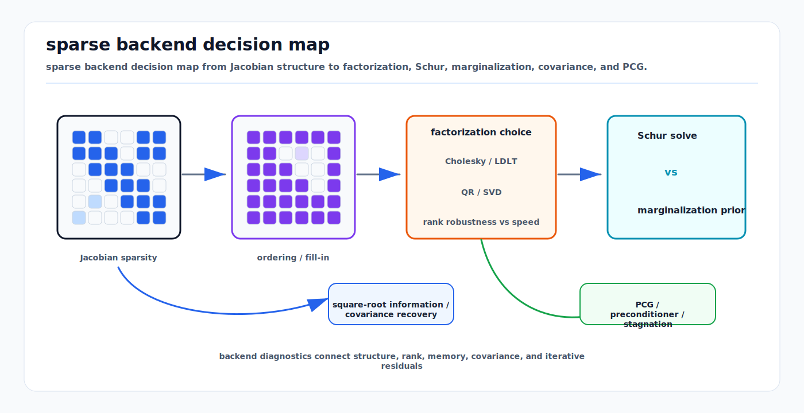

# Sparse Estimation Backend Crosswalk

<!-- kb-visual:start -->

*Visual: sparse backend decision map from Jacobian structure to factorization, Schur, marginalization, covariance, and PCG.*
<!-- kb-visual:end -->

## Related docs

- [Nonlinear Solver Diagnostics Crosswalk](../optimization/nonlinear-solver-diagnostics-crosswalk.md)
- [Solver Selection and Convergence Diagnosis](../optimization/solver-selection-and-convergence-diagnosis.md)
- [Cholesky, LDLT, and Normal Equations](cholesky-ldlt-normal-equations.md)
- [QR, SVD, and Rank-Revealing Solvers](qr-svd-rank-revealing-solvers.md)
- [Eigenvalues, Hessian Conditioning, and Observability](eigenvalues-hessian-conditioning-observability.md)
- [Sparse Matrices, Fill-In, and Ordering](sparse-matrices-fill-in-ordering.md)
- [Schur Complement, Marginalization, and PCG](schur-complement-marginalization-pcg.md)
- [Square-Root Information and Covariance Recovery](square-root-information-and-covariance-recovery.md)
- [GTSAM Factor Graph Optimization](../state-estimation/gtsam-factor-graphs.md)
- [GLIM](../../30-autonomy-stack/localization-mapping/slam-methods/glim.md)

## Backend decision matrix

For GLIM and GTSAM-style SLAM, this page explains what happens below the method names. A fixed-lag odometry graph, a global submap graph, a loop-closure graph, and a map-refinement graph all reduce to sparse linearized systems after residuals are defined and whitened. When GLIM behaves unexpectedly, inspect this backend layer before blaming "the SLAM algorithm" as a whole.

Sparse Estimation Backend Crosswalk is the routing page for rank and nullspaces, sparsity, ordering, and fill-in, factorization, Schur complement for solving, marginalization prior construction, covariance recovery, and PCG stagnates diagnostics.

| Backend | SPD assumptions | Rank robustness | Sparsity/fill behavior | Covariance recovery | Runtime/memory | Diagnostic value |
|---|---|---|---|---|---|---|
| Cholesky | Requires symmetric positive definite normal equations or damped approximation. | Poor when rank deficient; failure is useful. | Very fast when ordering controls fill. | Selected covariance possible from factors if rank valid. | Excellent for well-posed sparse systems. | Factor failure exposes SPD, gauge, and conditioning issues. |
| LDLT | Handles symmetric indefinite systems better than Cholesky depending on pivoting. | More diagnostic for indefiniteness, still not full rank-revealing. | Fill depends on ordering and pivoting. | Useful for debugging signs and pivots. | Slightly higher overhead than Cholesky. | Pivots indicate indefiniteness or weak modes. |
| QR | Does not require normal-equation SPD. | More robust than normal equations. | Can create more fill than Cholesky but avoids squaring condition number. | Square-root covariance paths are natural. | More expensive but safer for debug and some production problems. | Reveals rank and conditioning better than normal equations. |
| SVD | No SPD assumption. | Strongest rank and nullspace diagnostic. | Usually dense or small-case tool. | Direct pseudoinverse and covariance diagnostics under threshold. | Expensive, often for reduced snapshots. | Best for explaining weak modes and threshold sensitivity. |
| Schur | Reduced system should be SPD after valid elimination and damping. | Depends on invertible eliminated blocks. | Can reduce problem size but create dense reduced blocks. | Camera/pose covariance possible, but fill and rank matter. | Excellent for bundle adjustment structure; risky for dense separators. | Separates eliminated-variable issues from kept-variable solve. |
| PCG | Requires symmetric positive definite matrix-vector operator. | Weak for rank diagnosis unless monitored carefully. | Avoids explicit factor fill; preconditioner controls convergence. | Not a covariance recovery method by itself. | Low memory, scalable if preconditioned well. | Residual norms and stagnation expose conditioning or operator bugs. |

## Rank/nullspaces/conditioning

Rank and nullspaces answer whether the local linear system has enough independent information. Gauge freedom is an expected nullspace caused by arbitrary global coordinates such as pose-graph translation and yaw. Rank deficiency outside the expected gauge usually means missing constraints, bad geometry, or invalid elimination.

Conditioning is different. A weak mode can be technically observable while still producing fragile steps and misleading covariance. Rank thresholds, damping, and priors can make a system appear full rank while covariance remains nonsensical. The diagnostic sequence is: expected gauge dimension, singular spectrum, weak-mode vectors, condition estimate, then physical interpretation.

## Sparsity/ordering/fill-in

Sparsity is the reason estimation backends are tractable. Each residual touches a small number of variables, so `J`, `H`, and square-root factors have exploitable block structure. Ordering decides which variables are eliminated first. Fill-in is the new nonzero structure created by elimination. A poor ordering or a dense marginalization prior can turn a sparse SLAM graph into a memory-heavy dense solve.

Inspect symbolic nonzeros, numeric nonzeros, elimination tree depth, separator size, and block structure. If runtime/memory grows suddenly after graph growth, open the fill report before changing nonlinear methods.

## Schur/marginalization/covariance/PCG

Schur complement for solving eliminates variables inside one linear solve and then back-substitutes their updates. Marginalization prior construction removes variables from the active estimator and stores their information as a new prior over remaining separator variables. The algebra can look similar, but the lifecycle is different: solving is temporary, marginalization changes the future problem.

Square-root information stores normalized residual and factor structure without forming a dense covariance inverse. Covariance recovery extracts selected marginal covariance blocks from the local information system or square-root factor. Marginal covariance integrates out other variables; conditional covariance holds them fixed. The inverse of an information diagonal block is not generally a marginal covariance.

PCG requires an SPD operator, a preconditioner, and telemetry: unpreconditioned residual norm, preconditioned residual norm, iteration count, stopping tolerance, symmetry test for matrix-vector products, and nonlinear progress. Stagnation symptoms include residual norms flattening, iteration limits on many nonlinear steps, and accepted nonlinear progress disappearing even though linear work is high.

## Concept cards

### Rank deficiency

| Field | Explanation |
|---|---|
| What it means here | The linearized system lacks independent constraints in one or more directions. |
| Math object | Rank of `J`, `R`, or `H`; zero singular values. |
| Effect on the solve | Makes updates non-unique and covariance undefined without gauge handling. |
| What it solves | Diagnoses missing information and singular backends. |
| What it does not solve | It does not choose the physical anchor policy. |
| Minimal example | Relative pose graph with no fixed world pose. |
| Failure symptoms | Cholesky fails, covariance huge, solution drifts in global frame. |
| Diagnostic artifact | Singular values and nullspace basis. |
| Normal vs abnormal artifact | Normal nullspace matches expected gauge; abnormal nullspace contains constrained states. |
| First debugging move | Count expected gauge freedoms and compare with numeric rank. |
| Do not confuse with | Poor conditioning. |
| Read next | [Eigenvalues, Hessian Conditioning, and Observability](eigenvalues-hessian-conditioning-observability.md). |

### Nullspace

| Field | Explanation |
|---|---|
| What it means here | Directions in state perturbation space that do not change residuals locally. |
| Math object | Vectors `n` such that `J n = 0` or `H n = 0`. |
| Effect on the solve | Allows arbitrary motion unless constrained or projected out. |
| What it solves | Explains gauge freedoms and unobservable directions. |
| What it does not solve | It does not imply every weak mode is exactly unobservable. |
| Minimal example | Global yaw in a planar relative pose graph. |
| Failure symptoms | State changes with no cost change, singular covariance, anchor sensitivity. |
| Diagnostic artifact | Nullspace vectors visualized as state perturbations. |
| Normal vs abnormal artifact | Normal vectors match known symmetries; abnormal vectors reveal missing factors. |
| First debugging move | Apply a small nullspace perturbation and verify residual change. |
| Do not confuse with | Eigenvector of a small but nonzero eigenvalue. |
| Read next | [QR, SVD, and Rank-Revealing Solvers](qr-svd-rank-revealing-solvers.md). |

### Gauge freedom

| Field | Explanation |
|---|---|
| What it means here | Arbitrary coordinates not determined by relative measurements. |
| Math object | Known nullspace basis or anchor constraint. |
| Effect on the solve | Requires fixing, projecting, or respecting gauge in covariance interpretation. |
| What it solves | Separates coordinate arbitrariness from physical uncertainty. |
| What it does not solve | It does not add real sensor information. |
| Minimal example | Fixing the first pose in SLAM. |
| Failure symptoms | Different absolute maps with same relative residual cost. |
| Diagnostic artifact | Gauge dimension and anchor sensitivity test. |
| Normal vs abnormal artifact | Normal gauge affects only arbitrary frame; abnormal anchor changes relative geometry. |
| First debugging move | Remove the anchor and inspect expected singular modes. |
| Do not confuse with | Prior knowledge. |
| Read next | [SLAM/VIO Observability, FEJ, and Nullspace Consistency](../state-estimation/slam-vio-observability-fej-nullspace-consistency.md). |

### Condition number

| Field | Explanation |
|---|---|
| What it means here | Ratio between strongest and weakest constrained directions. |
| Math object | `kappa(A) = sigma_max / sigma_min`. |
| Effect on the solve | Controls numerical sensitivity and PCG convergence. |
| What it solves | Quantifies weak-mode fragility. |
| What it does not solve | It does not identify wrong residual semantics by itself. |
| Minimal example | Low-parallax triangulation with tiny depth information. |
| Failure symptoms | Slow PCG, noisy covariance, unstable small pivots. |
| Diagnostic artifact | Spectrum, condition estimate, weak eigenvectors. |
| Normal vs abnormal artifact | Normal spectrum has expected weak directions; abnormal spectrum spans many orders unexpectedly. |
| First debugging move | Check scaling and whitening before changing factorization. |
| Do not confuse with | Exact rank deficiency. |
| Read next | [Eigenvalues, Hessian Conditioning, and Observability](eigenvalues-hessian-conditioning-observability.md). |

### Sparsity

| Field | Explanation |
|---|---|
| What it means here | Most Jacobian or Hessian blocks are zero because factors touch few variables. |
| Math object | Block sparse `J`, `H`, or factor graph adjacency. |
| Effect on the solve | Enables real-time memory and runtime scaling. |
| What it solves | Avoids dense linear algebra on large estimation problems. |
| What it does not solve | It does not guarantee low fill after elimination. |
| Minimal example | Odometry factor touches only two neighboring poses. |
| Failure symptoms | Unexpected dense rows, memory growth, slow symbolic phase. |
| Diagnostic artifact | Sparsity plot and block adjacency graph. |
| Normal vs abnormal artifact | Normal pattern follows factor topology; abnormal pattern has broad accidental coupling. |
| First debugging move | Print each residual block's parameter dependencies. |
| Do not confuse with | Fill-in. |
| Read next | [Sparse Matrices, Fill-In, and Ordering](sparse-matrices-fill-in-ordering.md). |

### Fill-in

| Field | Explanation |
|---|---|
| What it means here | New nonzeros created during elimination or factorization. |
| Math object | Nonzero pattern of factor `L`, `R`, or reduced system. |
| Effect on the solve | Increases memory, runtime, and covariance recovery cost. |
| What it solves | It is not a solver; it explains factorization growth. |
| What it does not solve | It does not indicate model accuracy. |
| Minimal example | Eliminating a pose connects all neighboring landmarks or poses. |
| Failure symptoms | Runtime/memory explodes after graph growth. |
| Diagnostic artifact | Symbolic fill report and elimination tree. |
| Normal vs abnormal artifact | Normal fill grows predictably; abnormal fill jumps after ordering or marginalization. |
| First debugging move | Compare fill under alternative orderings on the same graph. |
| Do not confuse with | Original sparsity. |
| Read next | [Sparse Matrices, Fill-In, and Ordering](sparse-matrices-fill-in-ordering.md). |

### Ordering

| Field | Explanation |
|---|---|
| What it means here | Variable elimination sequence used by the sparse backend. |
| Math object | Permutation matrix or ordered variable list. |
| Effect on the solve | Controls fill, separator size, and Schur structure. |
| What it solves | Reduces runtime and memory by exploiting graph topology. |
| What it does not solve | It does not repair rank deficiency. |
| Minimal example | Eliminating landmarks before cameras in bundle adjustment. |
| Failure symptoms | Direct solve becomes dense, Schur reduced matrix too large. |
| Diagnostic artifact | Ordering report and fill comparison. |
| Normal vs abnormal artifact | Normal ordering respects block structure; abnormal ordering creates large cliques. |
| First debugging move | Run AMD/COLAMD or domain-specific ordering and compare nonzeros. |
| Do not confuse with | Solver method choice. |
| Read next | [Sparse Matrices, Fill-In, and Ordering](sparse-matrices-fill-in-ordering.md). |

### Cholesky

| Field | Explanation |
|---|---|
| What it means here | Factorization for SPD normal equations or information matrices. |
| Math object | `H = L L^T` or `R^T R`. |
| Effect on the solve | Fast direct solve when assumptions hold. |
| What it solves | Efficient sparse SPD systems. |
| What it does not solve | It does not handle rank deficiency robustly. |
| Minimal example | Damped pose-graph normal equations after gauge anchor. |
| Failure symptoms | Non-positive pivot, factorization abort, huge condition warning. |
| Diagnostic artifact | Pivot log and factor nonzeros. |
| Normal vs abnormal artifact | Normal pivots positive and stable; abnormal pivots vanish or turn negative. |
| First debugging move | Check SPD assumptions, gauge, and whitening. |
| Do not confuse with | QR on the original least-squares system. |
| Read next | [Cholesky, LDLT, and Normal Equations](cholesky-ldlt-normal-equations.md). |

### LDLT

| Field | Explanation |
|---|---|
| What it means here | Symmetric factorization that exposes diagonal or block pivots. |
| Math object | `P^T H P = L D L^T`. |
| Effect on the solve | Can diagnose indefiniteness and handle some symmetric systems better than Cholesky. |
| What it solves | Symmetric systems where pivot information matters. |
| What it does not solve | It is not a full rank-revealing replacement for SVD. |
| Minimal example | Debugging an indefinite Hessian approximation. |
| Failure symptoms | Negative or tiny pivots, pivoting instability. |
| Diagnostic artifact | `D` pivots and permutation. |
| Normal vs abnormal artifact | Normal pivots match expected definiteness; abnormal pivots reveal sign or rank problems. |
| First debugging move | Inspect pivot sequence and compare with damped Cholesky. |
| Do not confuse with | LM damping. |
| Read next | [Cholesky, LDLT, and Normal Equations](cholesky-ldlt-normal-equations.md). |

### QR

| Field | Explanation |
|---|---|
| What it means here | Least-squares factorization that avoids forming normal equations. |
| Math object | `J = Q R`. |
| Effect on the solve | Improves numerical behavior for ill-conditioned least squares. |
| What it solves | More robust linearized least-squares solves. |
| What it does not solve | It does not make a wrong residual correct. |
| Minimal example | Debugging calibration Jacobians without squaring condition number. |
| Failure symptoms | Higher runtime but stable answer compared with Cholesky failure. |
| Diagnostic artifact | `R` diagonal and rank estimate. |
| Normal vs abnormal artifact | Normal `R` has clear rank; abnormal has tiny diagonals in expected constrained modes. |
| First debugging move | Compare QR step with normal-equation step on a small case. |
| Do not confuse with | SVD rank thresholding. |
| Read next | [QR, SVD, and Rank-Revealing Solvers](qr-svd-rank-revealing-solvers.md). |

### SVD

| Field | Explanation |
|---|---|
| What it means here | Factorization that exposes singular values and vectors directly. |
| Math object | `J = U Sigma V^T`. |
| Effect on the solve | Gives best local rank and nullspace diagnosis. |
| What it solves | Small or reduced rank-revealing debug problems. |
| What it does not solve | It is usually too expensive for full production sparse graphs. |
| Minimal example | Explaining weak yaw/scale mode in a calibration snapshot. |
| Failure symptoms | Singular values collapse, threshold changes covariance dramatically. |
| Diagnostic artifact | Singular spectrum and right singular vectors. |
| Normal vs abnormal artifact | Normal tiny singular vectors match known gauge; abnormal vectors reveal missing excitation. |
| First debugging move | Visualize the weakest singular vector as a state perturbation. |
| Do not confuse with | Eigenanalysis of a damped Hessian without interpreting damping. |
| Read next | [QR, SVD, and Rank-Revealing Solvers](qr-svd-rank-revealing-solvers.md). |

### Schur complement

| Field | Explanation |
|---|---|
| What it means here | Algebraic elimination of a variable block to solve a reduced system. |
| Math object | `S = B - E C^-1 E^T`. |
| Effect on the solve | Reduces system size and exploits conditional independence. |
| What it solves | Landmark-heavy bundle adjustment and related block systems. |
| What it does not solve | It does not mean permanent marginalization by itself. |
| Minimal example | Eliminate points, solve camera system, back-substitute point updates. |
| Failure symptoms | Singular eliminated block, dense reduced matrix, wrong back-substitution. |
| Diagnostic artifact | Block ranks, Schur nonzeros, reduced residual. |
| Normal vs abnormal artifact | Normal eliminated blocks are invertible; abnormal blocks need damping or removal. |
| First debugging move | Validate `C^-1` block solves on representative landmarks. |
| Do not confuse with | Marginalization prior. |
| Read next | [Schur Complement, Marginalization, and PCG](schur-complement-marginalization-pcg.md). |

### Marginalization prior

| Field | Explanation |
|---|---|
| What it means here | Prior factor created after removing variables from the active estimator. |
| Math object | Schur-reduced information and right-hand side over separator variables. |
| Effect on the solve | Preserves old information but can introduce dense couplings and stale linearization. |
| What it solves | Keeps fixed-lag smoothing bounded. |
| What it does not solve | It does not remain exact after large future relinearization changes. |
| Minimal example | Marginalize old poses and keep a prior on the newest boundary poses. |
| Failure symptoms | Dense prior explosion, overconfident estimator, loop closure fights prior. |
| Diagnostic artifact | Prior residual, prior matrix sparsity, linearization point. |
| Normal vs abnormal artifact | Normal prior separator is controlled; abnormal prior grows dense and stale. |
| First debugging move | Track separator size and prior nonzeros at every marginalization. |
| Do not confuse with | Schur complement for a temporary solve. |
| Read next | [Out-of-Sequence Measurements and Fixed-Lag Smoothing](../state-estimation/out-of-sequence-measurements-fixed-lag-smoothing.md). |

### Square-root information

| Field | Explanation |
|---|---|
| What it means here | Factor form of information used to whiten residuals or represent solved factors. |
| Math object | `L` where `L^T L = Sigma^-1`, or QR factor `R`. |
| Effect on the solve | Avoids explicit dense inverses and keeps normalized residuals. |
| What it solves | Stable weighting and selected covariance workflows. |
| What it does not solve | It does not avoid rank analysis. |
| Minimal example | Premultiply pose residual by inverse square-root covariance. |
| Failure symptoms | Double whitening, bad scale, covariance mismatch. |
| Diagnostic artifact | `L`, `R`, and whitened residual checks. |
| Normal vs abnormal artifact | Normal factor reconstructs information; abnormal factor has wrong units or order. |
| First debugging move | Verify `L^T L` against intended information. |
| Do not confuse with | Covariance square root. |
| Read next | [Square-Root Information and Covariance Recovery](square-root-information-and-covariance-recovery.md). |

### Covariance recovery

| Field | Explanation |
|---|---|
| What it means here | Extracting selected local uncertainty from information or square-root factors. |
| Math object | Blocks of `H^-1`, marginal covariance, or pseudoinverse under rank handling. |
| Effect on the solve | Used after solving for diagnostics, gating, and integrity checks. |
| What it solves | Provides local uncertainty when gauge and rank assumptions are explicit. |
| What it does not solve | It does not validate global consistency. |
| Minimal example | Recover camera pose marginal covariance after sparse BA. |
| Failure symptoms | Negative variance, overconfident weak mode, dense inverse memory blowup. |
| Diagnostic artifact | Selected covariance block, rank threshold, factor backsolve trace. |
| Normal vs abnormal artifact | Normal block is positive and gauge-aware; abnormal block changes wildly with anchor. |
| First debugging move | Compare selected covariance against SVD on a small snapshot. |
| Do not confuse with | Measurement covariance. |
| Read next | [Square-Root Information and Covariance Recovery](square-root-information-and-covariance-recovery.md). |

### PCG

| Field | Explanation |
|---|---|
| What it means here | Iterative method for large SPD systems using matrix-vector products. |
| Math object | Preconditioned conjugate gradient iterations for `A x = b`. |
| Effect on the solve | Reduces memory but makes convergence depend on conditioning and preconditioning. |
| What it solves | Large sparse or implicit Schur systems where direct factorization is too expensive. |
| What it does not solve | It does not work on indefinite or nonsymmetric operators. |
| Minimal example | Iterative Schur solve for large bundle adjustment. |
| Failure symptoms | PCG stagnates, reaches iteration limit, nonlinear cost stops improving. |
| Diagnostic artifact | Unpreconditioned and preconditioned residual norms, iteration count, tolerance. |
| Normal vs abnormal artifact | Normal residuals decrease with accepted nonlinear progress; abnormal residuals flatten or oscillate. |
| First debugging move | Test symmetry and compare to a direct solve on a small case. |
| Do not confuse with | Schur complement itself. |
| Read next | [Schur Complement, Marginalization, and PCG](schur-complement-marginalization-pcg.md). |

### Preconditioner

| Field | Explanation |
|---|---|
| What it means here | Approximation that improves PCG convergence by reshaping the linear system. |
| Math object | Matrix or operator `M` approximating `A` or `A^-1`. |
| Effect on the solve | Changes iteration count and residual decay. |
| What it solves | Reduces effective condition number for iterative solves. |
| What it does not solve | It does not fix an invalid SPD assumption. |
| Minimal example | Block-Jacobi preconditioner for pose blocks. |
| Failure symptoms | Many PCG iterations, residual plateaus, nonlinear budget wasted. |
| Diagnostic artifact | Preconditioned residual norm and iteration comparison. |
| Normal vs abnormal artifact | Normal preconditioner improves decay; abnormal preconditioner has little effect or breaks symmetry. |
| First debugging move | Compare identity, diagonal, and block preconditioners on the same snapshot. |
| Do not confuse with | Whitening or LM damping. |
| Read next | [Schur Complement, Marginalization, and PCG](schur-complement-marginalization-pcg.md). |

## Sources

- Ceres Solver, "Solving Non-linear Least Squares": https://ceres-solver.readthedocs.io/latest/nnls_solving.html
- Davis, "Direct Methods for Sparse Linear Systems": https://people.engr.tamu.edu/davis/publications.html
- Saad, "Iterative Methods for Sparse Linear Systems" homepage: https://www-users.cse.umn.edu/~saad/books.html
- Dellaert and Kaess, "Square Root SAM": https://www.cc.gatech.edu/~dellaert/pubs/Dellaert06ijrr.pdf
- Triggs, McLauchlan, Hartley, and Fitzgibbon, "Bundle Adjustment - A Modern Synthesis": https://www.cs.jhu.edu/~misha/ReadingSeminar/Papers/Triggs00.pdf
