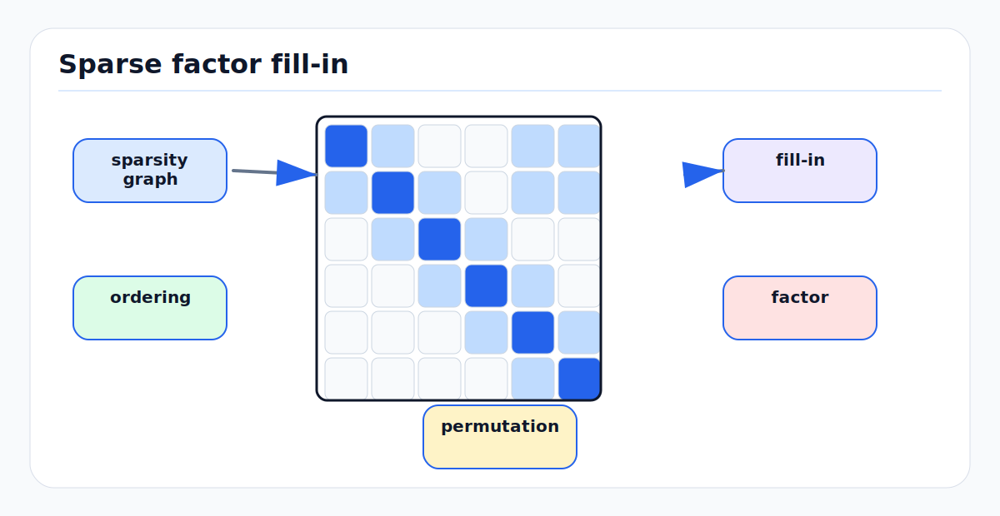

# Sparse Matrices, Fill-In, and Ordering

<!-- kb-figure:start -->


*Figure: Variable ordering changes fill-in during sparse factorization, directly affecting memory, runtime, and whether real-time SLAM remains feasible.*
<!-- kb-figure:end -->

## Related docs

- [Cholesky, LDLT, and Normal Equations](cholesky-ldlt-normal-equations.md)
- [QR, SVD, and Rank-Revealing Solvers](qr-svd-rank-revealing-solvers.md)
- [Eigenvalues, Hessian Conditioning, and Observability](eigenvalues-hessian-conditioning-observability.md)
- [Square-Root Information and Covariance Recovery](square-root-information-and-covariance-recovery.md)
- [Schur Complement, Marginalization, and PCG](schur-complement-marginalization-pcg.md)
- [GTSAM Factor Graph Optimization](../state-estimation/gtsam-factor-graphs.md)

## Why it matters for AV, perception, SLAM, and mapping

SLAM and mapping problems are sparse because each measurement touches only a few variables. A wheel odometry factor touches two poses. A reprojection factor touches one camera and one landmark. An IMU factor touches adjacent poses, velocities, and biases. A loop closure touches two distant poses.

Sparse linear algebra is what makes large-scale mapping possible. But sparsity in the input matrix does not guarantee sparsity in the factor. During elimination, new nonzeros appear. This is fill-in. The variable ordering can change memory use and solve time by orders of magnitude.

For AV systems, fill-in determines:

- Whether local SLAM runs within a real-time budget.
- Whether offline map optimization fits in memory.
- Whether marginalization creates dense priors that slow every future update.
- Whether camera-landmark bundle adjustment scales to city-scale mapping.
- Whether a solver should use direct sparse factorization, Schur complement, or PCG.

## Core math and algorithm steps

### Sparse matrix patterns

A sparse matrix stores only nonzero entries. Common formats:

- COO: triples `(row, col, value)`, convenient for assembly.
- CSR: compressed sparse row, efficient row traversal and matrix-vector products.
- CSC: compressed sparse column, common for sparse Cholesky and QR.
- Block sparse: stores small dense blocks, natural for SLAM variables.

For block SLAM, scalar sparsity and block sparsity are different. A 6-DoF pose-pose factor creates a dense `6 x 6` block, but only between two variable nodes.

### Fill-in from elimination

Eliminating variable `x_i` connects all variables that co-occur with it. In graph terms, the neighbors of `x_i` become a clique. Any new edge in that clique is fill-in.

Example:

```text
x1 -- x2 -- x3 -- x4
```

Eliminating `x2` connects `x1` and `x3`:

```text
x1 -- x3 -- x4
```

That `x1 -- x3` edge may not have existed in the original graph. In matrix factorization, it becomes a new nonzero in the triangular factor.

### Ordering

A permutation `P` reorders variables before factorization:

```text
P H P^T = L L^T
```

The numeric solution is unchanged in exact arithmetic, but the fill pattern of `L` can change dramatically.

Good orderings try to eliminate variables that create little fill early, and highly connected separator variables later.

### Elimination tree

The elimination tree represents dependencies among columns of the Cholesky factor. It is used for:

- Symbolic analysis.
- Parallel scheduling.
- Supernodal factorization.
- Understanding which parts of a factorization change after graph updates.

In factor-graph terms, this is closely related to variable elimination, Bayes nets, and Bayes trees.

## Ordering methods

### Natural ordering

Natural ordering uses variables in insertion or time order. It is easy to understand, but often poor.

When it can be acceptable:

- Chain-like fixed-lag filters.
- Small windows.
- Carefully structured time-only state without loop closures.

When it is dangerous:

- Bundle adjustment with many landmarks.
- Loop-rich pose graphs.
- Dense map priors.
- Problems with many cross-time calibration variables.

### AMD

Approximate minimum degree (AMD) is a symmetric ordering heuristic. It tries to approximate the expensive minimum-degree strategy by repeatedly eliminating low-degree nodes in the graph of a symmetric matrix.

Use AMD for:

- Symmetric positive definite systems.
- Hessians from normal equations.
- Pose graphs and reduced Schur complement systems.

AMD is fast and usually a strong default for sparse Cholesky when the matrix graph is not too irregular.

### COLAMD

COLAMD is a column approximate minimum degree ordering. It is designed for unsymmetric sparse matrices and is also useful before sparse QR or for matrices such as `A^T A`.

Use COLAMD for:

- Sparse QR on Jacobians.
- Least-squares systems before forming normal equations.
- Solver stacks that work from factor Jacobians rather than only Hessians.

GTSAM and SuiteSparse-based workflows commonly use COLAMD-like ordering because factor graphs naturally start from Jacobians.

### METIS and nested dissection

METIS uses graph partitioning and nested dissection ideas to compute fill-reducing orderings. Nested dissection recursively separates a graph into subgraphs with small separators, eliminates interiors first, and separators later.

Use METIS or nested dissection for:

- Large map graphs.
- Grid-like or spatial graphs.
- Problems where separators are geometrically meaningful.
- Very large sparse Cholesky where AMD is not enough.

Tradeoffs:

- Often better fill reduction on large structured graphs.
- More ordering overhead than AMD.
- Depends on the graph structure and library integration.

## Implementation notes

### Separate symbolic and numeric phases

Sparse direct solvers usually separate:

1. Symbolic analysis: use sparsity pattern and ordering to predict the factor structure.
2. Numeric factorization: compute actual numeric factors.
3. Triangular solves: solve for one or more right-hand sides.

If the graph structure is unchanged but values change, reuse symbolic analysis. This is common in nonlinear optimization because the same residual graph is relinearized multiple times.

### Block ordering

In SLAM, reorder variables, not arbitrary scalar coordinates, unless the solver explicitly supports scalar-level ordering safely. Splitting a pose's tangent coordinates across the ordering can destroy block structure and complicate manifold updates.

Typical variable grouping:

```text
landmarks first, poses later       for bundle adjustment Schur
old states first, separator later  for marginalization
local poses first, anchors later   for pose graph elimination
```

### Fill and marginalization

Marginalizing a variable is elimination. If a marginalized state touched many active states, it creates a dense prior over those active states. Fixed-lag smoothers therefore need careful state selection and lag boundaries.

Practical rule:

- Marginalize old chain states when their separator is small.
- Avoid marginalizing variables that connect many long-range loop closures unless you can tolerate dense priors.
- Consider dropping or sparsifying old weak factors if the estimator design allows it.

### Measuring fill

Track:

```text
nnz(H)
nnz(L)
fill_ratio = nnz(L) / nnz(H)
symbolic_analysis_time
numeric_factorization_time
peak_memory
ordering_method
```

For block systems also track block nonzeros and scalar nonzeros. A block pattern can look small while scalar storage is large.

### Choosing an ordering in practice

Start with the solver default, then benchmark:

- AMD for sparse symmetric Hessians.
- COLAMD for sparse QR or Jacobian-driven systems.
- METIS/nested dissection for very large spatial graphs.
- Problem-specific ordering for bundle adjustment and marginalization.

Do not select ordering by name alone. Compare memory, factor nonzeros, and wall time on representative logs.

## Failure modes and diagnostics

### Factorization runs out of memory

Likely causes:

- Bad ordering.
- Marginalization prior became dense.
- Loop closures created high-degree variables.
- Landmarks and poses were ordered poorly in bundle adjustment.

Diagnostics:

- Compare `nnz(L)` under AMD, COLAMD, METIS, and domain-specific orderings.
- Visualize the sparsity pattern before and after ordering.
- Identify high-degree variables.

### Fast ordering but slow factorization

AMD is cheap, but for some large spatial graphs a more expensive nested-dissection ordering may reduce total time. Measure total solve time, not just ordering time.

### Symbolic reuse gives wrong assumptions

If robust losses, dynamic sparsity, variable activation, or data association changes the sparsity pattern, symbolic analysis may need to be rebuilt. Ceres has options for dynamic sparsity because some problems are symbolically dense but numerically sparse at a given state.

### Scalar and block dimensions are mixed up

A pose graph with 10,000 poses is not a 10,000 by 10,000 matrix; with 6-DoF poses it is 60,000 scalar dimensions. Always report both variable counts and scalar dimensions.

## Sources

- SuiteSparse CHOLMOD user guide: https://github.com/DrTimothyAldenDavis/SuiteSparse/blob/dev/CHOLMOD/Doc/CHOLMOD_UserGuide.pdf
- SuiteSparse AMD user guide: https://github.com/DrTimothyAldenDavis/SuiteSparse/blob/dev/AMD/Doc/AMD_UserGuide.pdf
- SuiteSparse COLAMD user guide: https://github.com/DrTimothyAldenDavis/SuiteSparse/blob/dev/COLAMD/Doc/COLAMD_UserGuide.pdf
- Davis, Gilbert, Larimore, and Ng, "Algorithm 836: COLAMD": https://www.ccdc.ucsb.edu/publications/13939
- METIS repository: https://github.com/KarypisLab/METIS
- Ceres Solver, "Solving Non-linear Least Squares": https://ceres-solver.readthedocs.io/latest/nnls_solving.html
- GTSAM tutorial, "Factor Graphs and GTSAM": https://gtsam.org/tutorials/intro.html
